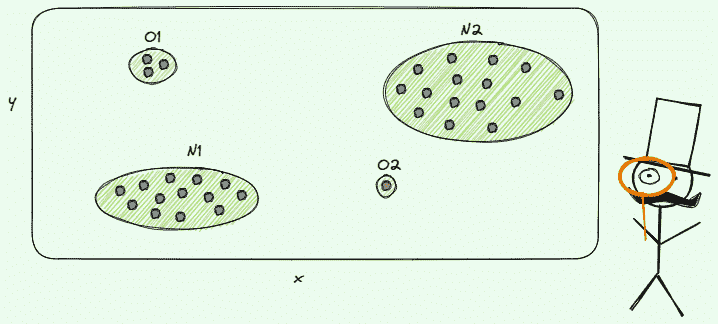
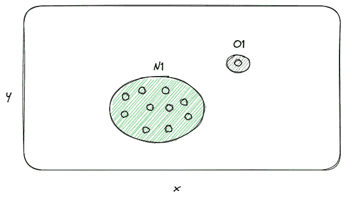
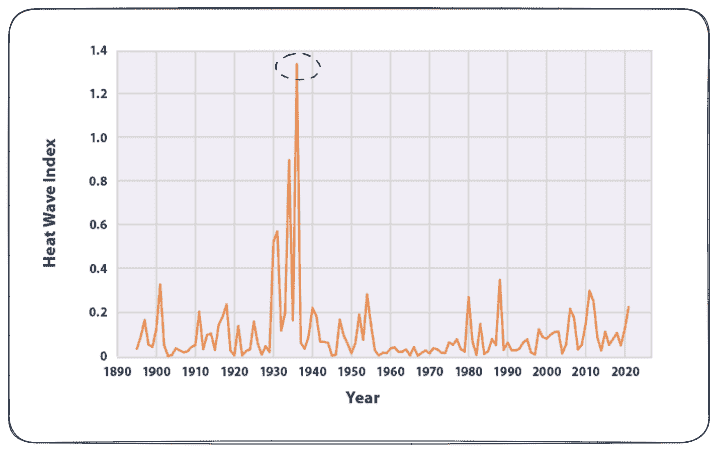
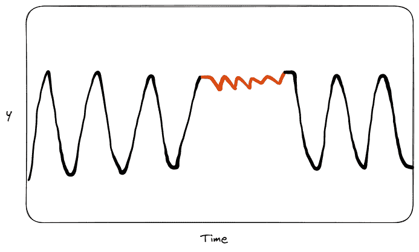

# 数据科学中的异常检测技术初学者指南

> 原文：[`www.kdnuggets.com/2023/05/beginner-guide-anomaly-detection-techniques-data-science.html`](https://www.kdnuggets.com/2023/05/beginner-guide-anomaly-detection-techniques-data-science.html)

作者提供的图片

异常检测是一个非常重要的任务，如果你处理数据，你会遇到或者最终会遇到它。它在许多领域中被广泛应用，如制造业、金融和网络安全。

* * *

## 我们的前三大课程推荐

 1\. [谷歌网络安全证书](https://www.kdnuggets.com/google-cybersecurity) - 快速入门网络安全职业生涯。

 2\. [谷歌数据分析专业证书](https://www.kdnuggets.com/google-data-analytics) - 提升你的数据分析技能

 3\. [谷歌 IT 支持专业证书](https://www.kdnuggets.com/google-itsupport) - 支持你的组织 IT

* * *

第一次开始这个话题可能会很有挑战性，特别是没有逐步指导的情况下。作为数据科学家的第一次经历，我记得我为了掌握这一学科而奋斗了很久。

首先，异常检测涉及识别那些与其他数据点明显偏离的稀有观测值。这些异常，通常称为离群点，是少数，而大多数项目属于正常类别。这意味着我们正在处理一个不平衡的数据集。

另一个挑战是，在行业中大多数时候没有标记数据，解释预测结果没有目标是很困难的。这意味着你不能使用通常用于分类模型的评估指标，需要采取其他方法来解释和信任模型的输出。让我们开始吧！

# 什么是异常检测？

*异常检测指的是发现数据中不符合预期行为的模式的问题。这些不符合模式的情况通常被称为异常、离群点、不一致的观测值、例外、偏差、惊讶、特异性或污染物，具体取决于应用领域。* [*异常检测：综述*](https://dl.acm.org/doi/10.1145/1541880.1541882)

这是对异常检测的一个很好的简要定义。异常通常与数据收集过程中获得的错误相关，然后这些异常会被消除。但也有一些情况是新的数据项与其他数据具有完全不同的变异性，这时需要合适的方法来识别这种观察。识别这些观察对在许多行业（如金融和制造业）运营的公司决策非常有用。

# 异常的类型有哪些？

异常主要有三种类型：点异常、上下文异常和集体异常。

点异常的示例。作者插图。

如你所推测，**点异常**是最简单的情况。当单个观察值与其他数据相比异常时，它会被识别为离群点/异常。例如，假设我们想在银行客户的交易中进行信用卡欺诈检测。在这种情况下，点异常可以被视为客户的欺诈活动。

上下文异常的示例。来源 [EPA](https://www.epa.gov/climate-indicators/climate-change-indicators-heat-waves)。作者修改。

另一种异常情况可能是**上下文异常**。这种异常只有在特定的上下文中才会出现。例如，美国的夏季热浪。你会发现 1930 年有一个巨大峰值，这代表了一个极端事件，称为尘土碗。之所以叫这个名字，是因为这是一个尘暴时期，破坏了美国南中部。

集体异常的示例。作者插图。

第三种也是最后一种异常是**集体异常**。最直观的例子是考虑意大利今年几个月来的降水缺乏。如果我们将数据与过去 50 年进行比较，就会发现没有类似的情况。单个数据点在异常集体中可能不会被识别为离群点，但所有这些数据点一起表明了一个集体异常。在这种情况下，单一天没有降水本身并不异常，而很多天没有降水则相对于前几年的数据可以被认为是异常的。

# 机器学习模型可以用于异常检测吗？

可以应用于异常检测的几种方法：

1.  **孤立森林**是一种无监督且非参数的技术，由 Fey Tony Liu 于 2012 年引入。与随机森林类似，它是一种集成学习方法，通过并行训练决策树。但不同于其他集成方法，它专注于将异常值与其他项隔离开来。这种方法背后的假设构成了其有效性的原因：（1）异常值是与正常数据相比的少数类；（2）异常值倾向于以最短的平均路径迅速找到。

1.  **局部离群因子**是一种基于密度的聚类算法，由 Markus M. Breuning 于 2000 年提出，它通过计算特定项相对于其邻居的局部密度偏差来检测异常。它假设异常值周围的密度应该与邻居周围的密度显著不同。此外，离群点应该具有较低的密度。

1.  **自编码器**是由两个神经网络组成的无监督模型，分别是编码器和解码器。在训练过程中，只有正常数据会被传递给模型。通过这种方式，它学习正常数据的压缩表示，这与异常值的表示应该有所不同。还假设异常数据不会被模型很好地重建，因为它完全不同于正常数据，因此应该具有较高的重建误差。

# 如何在无监督环境下评估异常检测模型？

在无监督设置中，没有评估指标可以帮助你了解正确的正预测率（精度）或实际正例的比率（召回率）。

在无法评估模型性能的情况下，提供模型预测的解释比以往任何时候都重要。这可以通过使用可解释性方法，如 SHAP 和 LIME 来实现。

有两种可能的解释：全局和局部。全局可解释性的目标是提供对模型整体的解释，而局部可解释性则旨在解释单个实例的模型预测。

# 最终想法

希望这个关于异常检测技术的快速概述对你有帮助。正如你所注意到的，这是一项具有挑战性的任务，适用的技术会根据上下文的不同而有所变化。我还应该强调，在应用任何异常检测模型之前，进行一些探索性分析是重要的，比如使用 PCA 将数据可视化到较低的维度空间和箱线图。如果你想深入了解，可以查看下面的资源。感谢阅读！祝你有美好的一天！

## 资源

+   [异常检测：V. Chandola 的综述](https://dl.acm.org/doi/10.1145/1541880.1541882)

+   [孤立森林的论文](https://cs.nju.edu.cn/zhouzh/zhouzh.files/publication/icdm08b.pdf)

+   [论文评论：通过修复重建进行视觉异常检测](https://towardsdatascience.com/paper-review-reconstruction-by-inpainting-for-visual-anomaly-detection-70dcf3063c07)

+   [SHAP 的论文](https://arxiv.org/pdf/1705.07874v2.pdf)

+   [LIME 的论文](https://arxiv.org/abs/1602.04938)

**[尤金尼亚·阿内洛](https://www.linkedin.com/in/eugenia-anello/)** 目前是意大利帕多瓦大学信息工程系的研究员。她的研究项目集中在结合异常检测的持续学习上。

### 更多相关话题

+   [BigQuery 中的异常检测：揭示隐藏的见解并推动行动](https://www.kdnuggets.com/anomaly-detection-in-bigquery-uncover-hidden-insights-and-drive-action)

+   [数据科学简介：初学者指南](https://www.kdnuggets.com/2023/07/introduction-data-science-beginner-guide.html)

+   [NLP 中不同词嵌入技术的终极指南](https://www.kdnuggets.com/2021/11/guide-word-embedding-techniques-nlp.html)

+   [数据工程初学者指南](https://www.kdnuggets.com/2023/07/beginner-guide-data-engineering.html)

+   [使用 Pyjanitor 的数据清理初学者指南](https://www.kdnuggets.com/beginners-guide-to-data-cleaning-with-pyjanitor)

+   [端到端机器学习初学者指南](https://www.kdnuggets.com/2021/12/beginner-guide-end-end-machine-learning.html)
