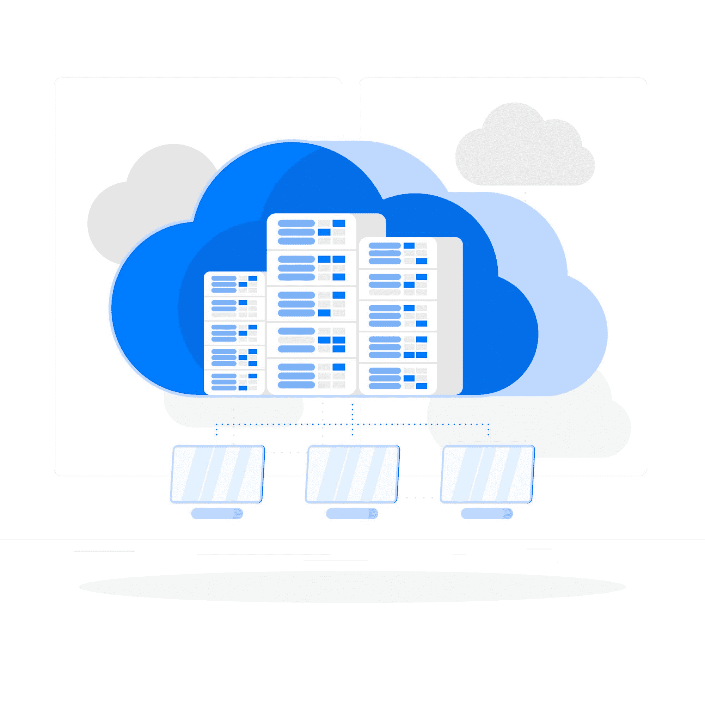
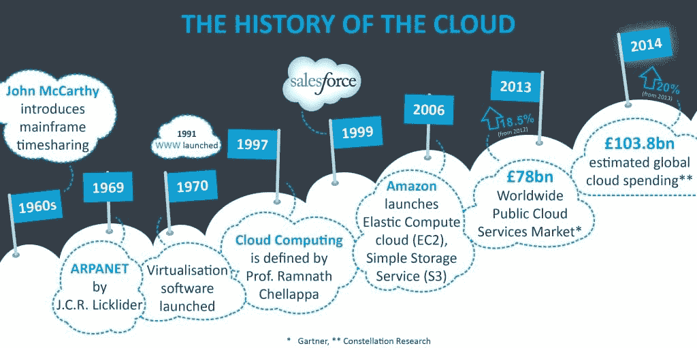
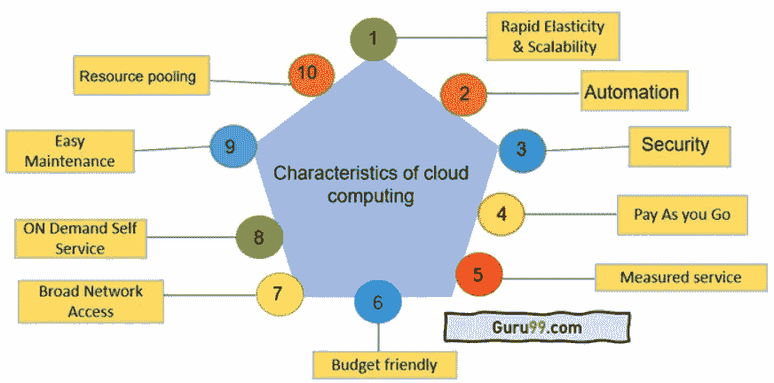
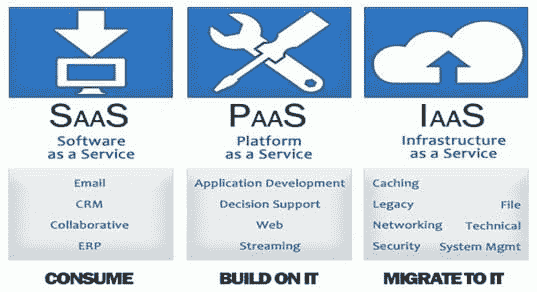
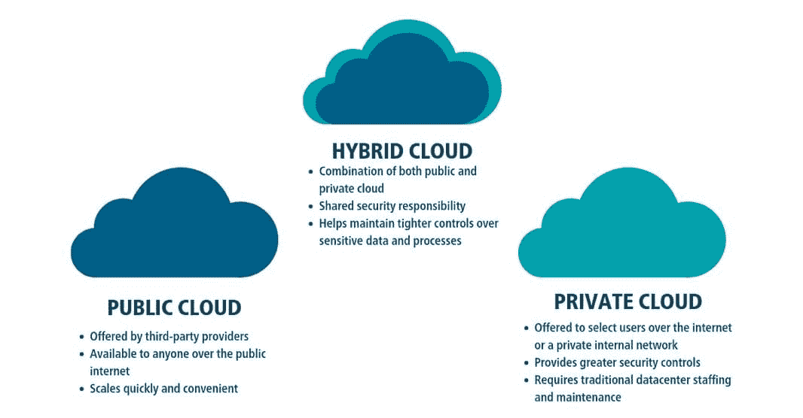
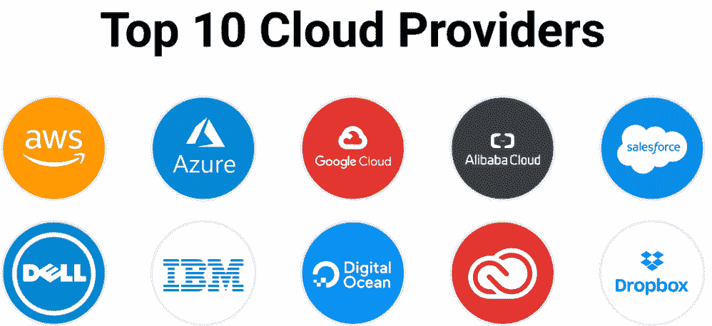
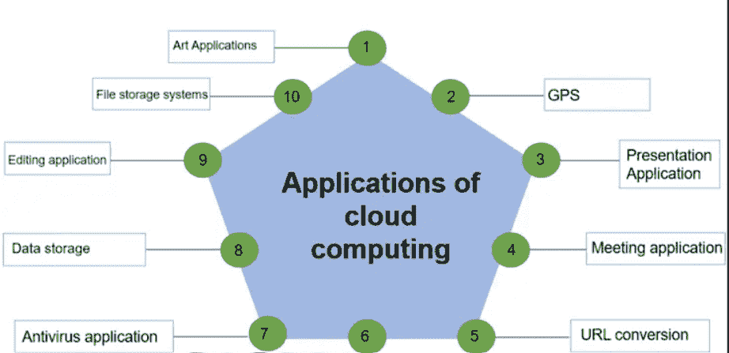

# 云计算初学者指南

> 原文：[`www.kdnuggets.com/2023/01/beginner-guide-cloud-computing.html`](https://www.kdnuggets.com/2023/01/beginner-guide-cloud-computing.html)

# 什么是云计算

* * *

## 我们的前三个课程推荐

 1\. [Google 网络安全证书](https://www.kdnuggets.com/google-cybersecurity) - 快速进入网络安全职业生涯。

 2\. [Google 数据分析专业证书](https://www.kdnuggets.com/google-data-analytics) - 提升您的数据分析能力

 3\. [Google IT 支持专业证书](https://www.kdnuggets.com/google-itsupport) - 支持您的组织的 IT

* * *

云计算通过互联网（“云”）提供计算服务，包括服务器、存储、数据库、网络、软件、分析和智能，以实现更快的创新、灵活的资源和规模经济。通过云计算，组织可以更好地将 IT 资源与业务目标和计划对齐。云服务通常通过按需付费或订阅定价模式提供，使其比传统的本地 IT 解决方案更具成本效益和灵活性。

图片由 [storyset](https://www.freepik.com/free-vector/cloud-hosting-concept-illustration_6183218.htm#query=cloud%20computing&position=2&from_view=search&track=sph) 提供

## 云计算的历史

“云计算”这一术语出现不过几年，但其概念存在的时间更久。利用远程服务器存储和处理数据的想法可以追溯到 1950 年代，当时科学家们在 SAGE 空中防御系统上使用了一种早期形式的云计算来共享数据和资源。在 1980 年代和 1990 年代，像 CompuServe 和 AOL 这样的公司开始为客户提供基本的基于云的服务，如电子邮件和文件存储。

直到 2000 年代初，“云计算”这一术语才被广泛使用。2006 年，亚马逊推出了其 EC2 服务，允许企业在公司的数据中心租用虚拟服务器。这是云计算行业的一个重要转折点，展示了云计算不仅可以用于简单的基于网页的服务。

图片由 [cloudcomputing521](http://cloudcomputing521.wordpress.com) 提供

# 云计算是如何工作的

基于互联网的云计算按需向计算机和其他设备提供数据和共享计算资源。这是一种设计，使任何人、任何地方都可以通过网络（例如网络、服务器、存储、应用程序和服务）轻松随时访问可调整的计算资源。无需大量管理工作或服务提供商联系，这些资源可以迅速提供和释放。类似于公共事业，云计算依赖于资源共享来实现一致性和规模经济。

## 特点

+   **按需自助服务：** 客户可以自动独立地提供必要的计算资源，如服务器时间和网络存储，而无需单独联系每个服务提供商。

+   **广泛的网络访问：** 功能通过网络可用，并通过标准程序访问，以促进各种瘦客户端或厚客户端平台（例如手机、笔记本电脑和个人数字助理）的使用。

+   **资源池化：** 通过多租户方式，将提供商的计算资源组合起来，以服务多个客户。根据客户需求，各种物理和虚拟资源会不断分配和重新分配。

+   **可扩展性：** 这是云计算最显著的优势之一。通过按需资源，企业可以快速根据需要进行扩展或缩减，无需进行任何前期投资。

+   **灵活性：** 云计算在付款选项上非常灵活。采用按需付费模式，企业只需为他们使用的资源付费。这是一种节省成本的好方法，因为公司可以避免为不需要的帮助支付过多费用。

+   **成本效益：** 相比传统 IT 基础设施，你可以通过只支付你使用的资源节省大量资金。此外，许多云服务提供商提供长期合同折扣，使其更加实惠。

图片来源：[guru99](https://www.guru99.com/characteristics-of-cloud-computing.html)

# 云计算服务

云计算服务有各种形式和规模。以下是一些最受欢迎的服务类型：

## 1\. 基础设施即服务（IaaS）

基础设施即服务（IaaS）是一种云计算模型，其中第三方提供商提供计算基础设施——通常是一个平台虚拟化环境——作为服务。IaaS 是云服务的三大主要类别之一，另外两类是软件即服务（SaaS）和平台即服务（PaaS）。

IaaS 提供商为客户提供按需付费模式，用于使用、管理和扩展基础设施资源，包括存储、网络和计算能力。客户可以按需访问这些资源，并仅为他们使用的资源付费。

IaaS 是企业希望获得云的灵活性和可扩展性，而无需管理和维护基础设施的热门选择。IaaS 提供商通常提供广泛的服务，可以根据每个客户的需求进行定制。

## 2\. 平台即服务（PaaS）

在云计算中，平台即服务（PaaS）是一种提供开发、运行和管理应用程序的平台的服务类型。该平台可以用于创建或运行新的应用程序。开发人员通常使用 PaaS 服务来构建和测试应用程序，然后将其部署到生产环境中。

PaaS 解决方案通常以云服务的形式交付，这意味着它们可以通过互联网访问，用户可以从任何地方访问。PaaS 提供商通常为客户管理基础设施和平台，开发人员可以专注于构建和管理应用程序。

PaaS 解决方案可以包括许多功能和服务，从开发工具和框架到应用管理和监控。一些 PaaS 解决方案还提供应用扩展和与其他云服务集成的功能。

PaaS 服务可以用于开发和部署各种应用程序，从简单的网站到复杂的数据驱动应用。

## 3\. 软件即服务（SaaS）

软件即服务（SaaS）是一种通过互联网提供软件的云计算类型。SaaS 使企业可以在云端访问软件，而无需在其计算机上安装和运行它。

SaaS 应用通常通过网页浏览器访问，而软件和数据存储在云服务提供商的服务器上。SaaS 是一种基于订阅的模式，允许企业按月或按年支付他们使用的软件费用。

SaaS 应用通常比传统的本地软件更易于使用，因为它们设计面向广泛的用户，并且不需要广泛的培训。它们也更经济，因为企业只需支付其使用的部分。

SaaS 应用可以用于各种任务，如 CRM、项目管理、开票和会计。

## 4\. 存储即服务（STaaS）

存储即服务（SaaS）是一种云存储模型，提供用户通过互联网访问其数据和文件的功能。SaaS 提供商通常提供各种存储计划和定价选项，使用户能够找到适合其需求的存储解决方案。虽然 STaaS 提供商通常管理和维护存储基础设施，但用户对其数据和文件负责。STaaS 提供商通常提供各种功能和工具，以帮助用户管理其数据和文件，包括访问控制、数据加密和版本控制。

## 5\. 备份即服务（BaaS）

备份即服务（BaaS）是一种基于云的备份解决方案，帮助组织保护数据并确保业务连续性。它提供了一种灵活可扩展的按需付费模型，非常适合各种规模的企业。

BaaS 提供了几个好处，包括：

+   **降低成本：** BaaS 是一种经济高效的解决方案，因为它消除了昂贵的本地备份基础设施的需求。

+   **提高灵活性：** BaaS 使组织能够更加灵活，因为他们可以根据需要快速扩展或缩减备份存储容量。

+   **增强安全性：** BaaS 提供了增强的安全性，因为数据存储在安全的云环境中。

+   **增强可靠性：** BaaS 是一种可靠的解决方案，由领先的云服务提供商如亚马逊网络服务和微软 Azure 提供。

图片由 [includehelp](https://www.includehelp.com/cloud-computing/services.aspx) 提供

# 云计算模型

云计算模型有三种类型：私有、公共和混合。每种都有其优点和缺点，应在实施前进行考虑。

## 公共云

公共云计算是通过互联网按需提供 IT 资源和应用程序，并采用按需付费定价模式。公共云服务由第三方提供商提供，并通过互联网传送。

各种规模的企业都能从公共云计算中受益，因为它可以帮助节省 IT 基础设施和维护成本。此外，公共云计算可以帮助企业提高灵活性和可扩展性。

有几个公共云提供商，例如亚马逊网络服务、微软 Azure 和谷歌云平台。企业可以选择最适合其需求的提供商。

有几个公共云计算的缺点值得提及。

+   公共云通常比私有云安全性差。这是因为公共云在多个用户之间共享，这可能使控制访问和防止数据泄露变得困难。

+   公共云可能比私有云更不可靠，因为它们受制于互联网的波动。如果互联网出现故障，你的公共云也会随之中断。

## 私有云

私有云是一种云计算类型，提供类似于公共云的优势，包括可扩展性和自服务，但通过专有架构实现。私有云可以部署在本地、外部或两者的混合环境中。

### 优势

+   **增加控制和安全：** 由于私有云部署在公司场所，它们比公共云提供更大的控制和安全性。私有云可以根据公司的具体需求进行定制，并与公司的安全基础设施集成。

+   **更大的可扩展性和灵活性：** 私有云可以轻松地根据变化的需求进行扩展或缩减。与公共云相比，它们还可以更具灵活性，因为它们可以根据公司的具体需求进行定制。

+   **较低的成本：** 私有云的成本效益可能优于公共云，因为它们不需要相同程度的基础设施投资。

### 缺点

企业在切换之前应了解私有云计算的一些缺点。最显著的缺点之一是成本。私有云的建立和维护可能非常昂贵，特别是如果需要聘请专家来管理它们。另一个缺点是，私有云的设置和使用可能比较复杂，找到符合具体需求的功能和服务组合可能会很具挑战性。最后，私有云的灵活性可能不如公共云，你可能需要在功能和服务上做出一些妥协，以充分发挥私有云的优势。

## 混合云

计算中的混合云由两个或更多的云（私有、公有或社区）组成，这些云仍然是分开的，但连接在一起以提供各种部署类型的优势。混合云服务超越了供应商和隔离障碍，使其无法锁定在单一云供应商内部。

混合云的基本特征是能够连接不同的云服务，通常通过基于网络的集成，使其作为一个整体进行工作。集成可以通过几种方式完成，但最常见的是通过虚拟私人网络（VPN）或专用网络连接。

混合云的主要好处是结合了两者的优点：公共云的可扩展性和成本效益与私有云的安全性和控制能力。这可以为你的组织提供应对市场变化的敏捷性和灵活性，而不会牺牲最敏感数据的安全性和合规性。

## 缺点

在为你的企业实施这种解决方案之前，需要考虑混合云计算的一些缺点。一个缺点是管理本地和云端资源的复杂性增加。这可能使得解决问题和跟踪环境变化变得更加困难。

另一个潜在的缺点是成本。虽然混合云可以通过利用公共云的规模经济提供一些成本节约，但你可能仍会产生额外的费用来管理和集成本地和云端资源。

最后，混合云可能会带来安全隐患。至关重要的是要仔细考虑如何保护数据和访问本地以及云端资源。

尽管存在这些潜在缺点，混合云对于许多企业来说仍然可能是一个非常有效的解决方案。仔细权衡利弊，以确定混合云是否是你组织的正确解决方案。

图片由[karansinghreen](https://karansinghreen.medium.com)提供

# 知名的云计算平台

虽然有许多知名的云计算平台，但一些最受欢迎的是 Amazon Web Services (AWS)、Google Cloud Platform (GCP) 和 Microsoft Azure。这些平台都提供了各种服务，可用于构建、部署和扩展应用程序。它们还提供不同的定价选项，以选择最适合您需求的服务。

## 1\. Amazon Web Services (AWS)

AWS 提供各种服务，帮助企业更快地发展，降低 IT 成本，并进行扩展。以下是 AWS 提供的一些最受欢迎的服务：

+   **Amazon Elastic Compute Cloud (EC2):** EC2 是一个基于网络的服务，允许企业租用虚拟机（VM），用于运行应用程序和存储数据。

+   **Amazon Simple Storage Service (S3):** S3 是一个对象存储服务，企业可以用来存储和检索互联网上的任何数量的数据。

+   **Amazon Relational Database Service (RDS):** RDS 是一个托管的关系数据库服务，简化了在云中设置、操作和扩展关系数据库的过程。

+   **Amazon CloudFront:** CloudFront 是一个内容分发网络（CDN），加快了静态和动态网页内容在全球用户中的传递速度。

## 2\. Google Cloud Platform (GCP)

Google Cloud Platform 提供了多种服务，帮助企业成功。从计算和存储到大数据和机器学习，应有尽有。但哪些服务适合您的企业？

这是 Google Cloud Platform 提供的一些最受欢迎服务的快速概览：

+   **Compute Engine:** 一个强大且可扩展的云计算平台，可以处理任何工作负载。

+   **Storage:** 一种可靠且具有成本效益的数据存储解决方案，提供块存储和对象存储选项。

+   **BigQuery:** 一个快速、强大且具有成本效益的大数据分析平台。

+   **Cloud SQL:** 一个完全托管的关系数据库服务，用于存储数据。

+   **Cloud Spanner:** 一个全球分布式的数据库服务，用于处理关键任务工作负载。

+   **Machine Learning:** 一套强大的机器学习服务，帮助您训练模型和进行预测。

这些仅仅是 Google Cloud Platform 提供的众多服务中的一部分。

## 3\. Microsoft Azure

Microsoft Azure 提供了多种服务，用于构建、部署和管理应用程序。这些服务包括：

+   **Azure Compute:** 该服务提供了创建和管理虚拟机的能力，并且可以部署和管理容器。

+   **Azure Storage:** 该服务提供了创建和管理存储账户的能力，以及 Blob、队列和表存储。

+   **Azure Networking:** 该服务可以创建和管理虚拟网络、负载均衡器和 DNS。

+   **Azure Security:** 该服务可以创建和管理安全组及访问控制列表。

+   **Azure Monitor**：该服务可以收集和分析诊断数据。

+   **Azure Active Directory**：该服务可以创建和管理 Azure Active Directory 帐户。

图片来源于 [allcode](https://allcode.com/cloud-providers/)

# 云计算的应用

云计算有很多不同的应用，这也是为什么近年来这一技术变得如此受欢迎。以下是一些最常见的云计算应用：

## 1\. 存储

云存储是将数据存储在异地并随时访问的绝佳方式。这对那些希望在灾难发生时保留数据备份的企业或希望安全地在线存储照片和视频的个人来说非常有用。

## 2\. 计算

云计算可以用于从运行网站到驱动复杂应用程序的任何事物。企业通过使用云资源可以节省昂贵的硬件和软件许可证费用。

## 3\. 协作

基于云的应用程序使团队成员可以在全球任何地方协作项目。这对于有远程工作的员工的企业来说，可以节省大量时间和金钱。

## 4\. 电子商务

云计算正在革新电子商务行业。通过使得连接互联网和在云中存储数据成为可能，企业可以更高效地运营并更快速地扩展。

云计算在电子商务中有很多应用方式。其中最受欢迎的之一是使用基于云的平台来构建和托管在线商店。这对那些希望快速启动电子商务商店且不需要大量前期投资的企业来说是一个绝佳的选择。

云计算在电子商务中的另一个应用方式是通过基于云的应用程序。这些应用程序可以简化在线商店的各个方面，例如库存管理、订单处理和客户服务。

最终，云计算还可以存储和管理客户数据。这对于希望更好地了解客户并提供个性化服务的企业来说是一个宝贵的工具。

## 5\. 教育

云计算正在改变教育领域。它为教学、学习和研究提供了新的可能性。它提供了访问大量资源和服务的机会。并且它允许教育工作者和学习者以新的方式连接和合作。

云计算在教育中的应用仍处于初期阶段，但其潜力已经显现。以下是云计算在教育中的一些应用方式：

+   **在线学习**：云计算在在线学习的增长中扮演了重要角色。在线课程和项目现在比以往任何时候都更易于访问。而且，使用基于云的学习管理系统（LMS）使教育工作者更容易创建和提供在线课程。

+   **协作学习**：云计算使学生更容易在项目和作业上进行协作。通过基于云的工具，学生可以实时共同处理文档、演示文稿和其他文件。

## 6. 防病毒

云计算的一个最令人兴奋的应用是防病毒领域。传统上，防病毒软件安装在单个计算机上，每台计算机都需要更新最新的病毒定义才能得到保护。

使用基于云的防病毒软件，病毒定义存储在云端，每台连接到互联网的计算机都可以访问这些定义。这意味着所有计算机都可以得到保护，而无需担心逐一更新。

基于云的防病毒软件在检测和移除病毒方面也更为有效，因为云系统可以分析更多的样本，并能快速识别新的威胁。

## 7. GPS（全球定位系统）

GPS 追踪是一种基于位置的服务，利用卫星导航来追踪资产和人员的位置。它通常被企业用于追踪车辆、车队和其他设备的位置。GPS 追踪也可以用于个人追踪应用，比如监控儿童或年长的家庭成员。

将 GPS 追踪与云计算结合使用是一种强大的组合，可以提供许多好处。基于云的 GPS 追踪系统可以提供实时追踪数据，可通过任何连接互联网的设备访问。这使企业能够实时追踪其资产和人员，无论他们在哪里。

基于云的 GPS 追踪系统还可以提供传统 GPS 追踪系统无法实现的功能。例如，一些基于云的系统允许企业在资产周围设置虚拟围栏。如果资产越过虚拟围墙，公司会立即收到通知。这可以是一个有价值的安全功能，帮助企业保护投资。

图片来自 [guru99](https://www.guru99.com/cloud-computing-applications-examples.html)

# 结论

随着世界日益数字化，对云计算服务的需求只会增加。以下是对未来云计算的一些预测：

+   云将变得更加普及：越来越多的企业和个人将依赖基于云的服务来完成工作。

+   云将变得更智能：借助人工智能，云将更好地满足用户需求。

+   云将变得更加安全：随着安全担忧的增加，云提供商将投入更多的安全功能和技术。

+   云将变得更加实惠：随着对云服务需求的增长，服务提供商将竞相降低价格，使云服务对所有人都更加实惠。

+   云计算将变得更加灵活：随着容器化和无服务器计算的兴起，云计算将变得更加灵活和可扩展。

云计算的未来市场规模预计将会很庞大。根据 Grand View Research 的报告，到 2025 年，全球云计算市场预计将达到 6233 亿美元。这一增长由中小企业对云服务的日益采用、对成本效益高且可扩展计算解决方案的不断需求以及云应用程序的日益普及推动。

## 本文的关键要点

+   首先，我们讨论了云计算及其历史。还讨论了其显著特点，如成本效益、可扩展性等。

+   之后，我们讨论了提供的各种服务，如（PaaS、IaaS、SaaS 等）

+   接着我们讨论了各种云计算模型的优缺点，如私有云、公共云和混合云。

+   最后，我们讨论了像 Google 和 Microsoft 这样的公司，它们提供云计算资源。然后通过讨论云计算的未来来总结文章。

目前就这些了。我相信你喜欢阅读这篇文章。如果你有任何问题或想法，请在下面留言。

**[Aryan Garg](https://www.linkedin.com/in/aryan-garg-1bbb791a3/)** 是一名 B.Tech 电气工程学生，目前处于本科最后一年。他对网页开发和机器学习领域感兴趣。已经追求了这一兴趣，并渴望在这些方向上进一步工作。

### 更多相关内容

+   [云原生超级计算](https://www.kdnuggets.com/2022/03/nvidia-cloud-native-super-computing.html)

+   [如何高效扩展数据科学项目与云计算](https://www.kdnuggets.com/2023/05/efficiently-scale-data-science-projects-cloud-computing.html)

+   [数据科学中的云计算简介](https://www.kdnuggets.com/introduction-to-cloud-computing-for-data-science)

+   [云计算如何提升数据科学工作流程](https://www.kdnuggets.com/2023/08/cloud-computing-enhances-data-science-workflows.html)

+   [11 个最佳实践：云和数据迁移到 AWS 云](https://www.kdnuggets.com/2023/04/11-best-practices-cloud-data-migration-aws-cloud.html)

+   [探索 AI/DL 最新趋势：从元宇宙到量子计算](https://www.kdnuggets.com/2023/07/exploring-latest-trends-aidl-metaverse-quantum-computing.html)
