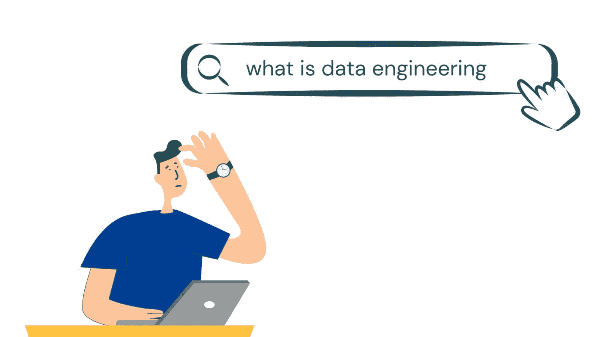
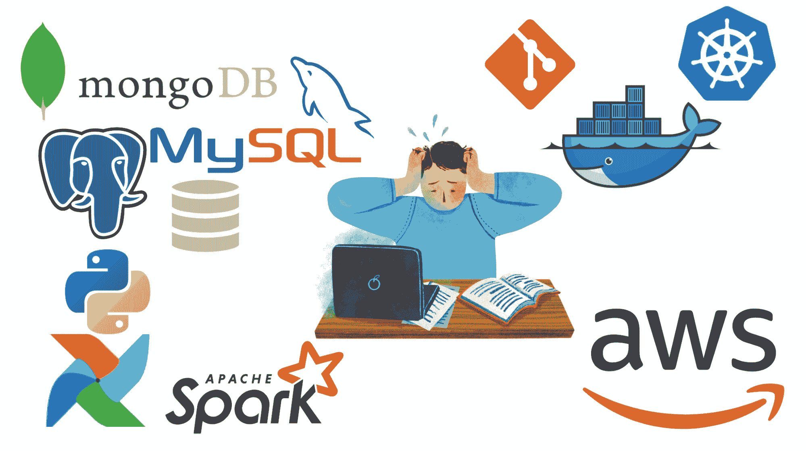

# 数据工程初学者指南

> 原文：[`www.kdnuggets.com/2023/07/beginner-guide-data-engineering.html`](https://www.kdnuggets.com/2023/07/beginner-guide-data-engineering.html)

作者提供的图片

随着来自多种来源的大量数据涌入，数据工程已成为数据生态系统中不可或缺的一部分。组织正在寻求建立和扩展他们的数据工程师团队。

* * *

## 我们的前三大课程推荐

 1\. [Google 网络安全证书](https://www.kdnuggets.com/google-cybersecurity) - 快速进入网络安全职业轨道。

 2\. [Google 数据分析专业证书](https://www.kdnuggets.com/google-data-analytics) - 提升你的数据分析技能

 3\. [Google IT 支持专业证书](https://www.kdnuggets.com/google-itsupport) - 支持你组织的 IT 需求

* * *

一些数据角色，比如分析师，并不一定需要在该领域的先前经验，只要你有强大的 SQL 和编程技能即可。然而，要进入数据工程领域，之前在数据分析或软件工程方面的经验通常是有帮助的。

如果你想在数据工程领域发展职业生涯，本指南适合你：

+   了解更多关于数据工程及数据工程师的角色，并且

+   熟悉数据工程的基本概念。

# 什么是数据工程？

在我们讨论数据工程是什么之前，了解数据工程的需求是有帮助的。如果你在数据领域待了很久，你会熟练于使用 SQL 查询关系数据库以及使用类似 SQL 的语言查询 NoSQL 数据库。

但是数据是如何到达那里——准备好进一步分析和报告的？这就涉及到*数据工程*。

我们知道数据来自各种来源，形式各异：从传统数据库到用户对话和物联网设备。原始数据必须被提取到数据仓库中。进一步扩展：来自各种资源的数据——应当被提取和处理——然后以准备好使用的形式在数据仓库中提供。

数据工程涵盖了所有收集和整合来自各种资源的原始数据的过程——将其整合到一个统一且可访问的数据仓库中——以供分析和其他应用使用。

## 数据工程师做什么？

了解数据工程的定义应该会帮助你猜测数据工程师在日常工作中的职责。数据工程师的职责包括但不限于以下内容：

+   从各种来源提取和整合数据——数据收集。

+   为分析准备数据：通过应用合适的转换来处理数据，以准备分析和其他下游任务。包括数据清理、验证和转换。

+   设计、构建和维护涵盖从源头到目标的数据流的数据管道。

+   设计和维护数据收集、处理和存储的基础设施——基础设施管理。

# 数据工程概念

现在我们了解了数据工程的重要性以及数据工程师在组织中的角色，是时候回顾一些基本概念了。

## 数据源和类型

如前所述，我们从各种资源获得数据：从关系型数据库和网页抓取到新闻源和用户聊天。这些来源的数据可以被分类为三大类之一：

+   结构化数据

+   半结构化数据

+   非结构化数据

下面是概述：

| **类型** | **特征** | **示例** |
| --- | --- | --- |
| **结构化数据** | 具有明确定义的模式。 | 关系型数据库中的数据、电子表格等 |
| **半结构化数据** | 有一定结构但没有严格的模式。通常具有提供附加信息的元数据标签。 | 包括 JSON 和 XML 数据、电子邮件、压缩文件等 |
| **非结构化数据** | 缺乏明确定义的模式。 | 图像、视频及其他多媒体文件、网站数据 |

## 数据存储库：数据仓库、数据湖和数据集市

从各种来源收集的原始数据应存储在一个合适的存储库中。你应该已经对数据库有所了解——包括关系型和非关系型数据库。但也有其他的数据存储库。

在我们讨论之前，了解两个数据处理系统，即 OLTP 和 OLAP 系统，会有所帮助：

+   **OLTP** 或 *在线事务处理* 系统用于存储日常操作数据，例如库存管理。OLTP 系统包括存储数据的关系型数据库，这些数据可以用于分析和得出业务见解。

+   **OLAP** 或 *在线分析处理* 系统用于存储大量的历史数据，以进行复杂的分析。除了数据库，OLAP 系统还包括数据仓库和数据湖（稍后会详细介绍）。

数据存储库的选择通常由数据的来源和类型决定。让我们了解常见的数据存储库：

+   **数据仓库**：数据仓库指的是一个综合性的单一数据存储库。

+   **数据湖**：数据湖允许以原始格式存储所有数据类型——包括半结构化和非结构化数据，而无需处理这些数据。数据湖通常是 ELT 过程的最终目的地（我们稍后会讨论）。

+   **数据集市**：你可以把数据集市看作是数据仓库的一个较小子集——为特定的业务用例量身定制。

+   **数据湖仓**：最近，数据湖仓也变得流行，因为它们既允许数据湖的灵活性，又提供了数据仓库的结构和组织。

## 数据管道：ETL 和 ELT 过程

数据管道涵盖了数据的整个旅程——从源到目标系统——通过 ETL 和 ELT 过程。

**ETL**—提取、转换和加载—过程包括以下步骤：

+   从各种来源提取数据

+   转换数据—清理、验证和标准化数据

+   将数据加载到数据仓库或目标应用程序中

ETL 过程通常以数据仓库作为目标。

**ELT**—提取、加载和转换—是 ETL 过程的一种变体，其中步骤的顺序是：提取、加载和转换，而不是提取、转换和加载。

意思是从源头收集的原始数据被加载到数据仓库中——在应用任何转换之前。这使我们能够应用特定于某一应用程序的转换。ELT 过程的目标是数据湖。

# 数据工程师应了解的工具

数据工程师应了解的工具清单可能会让人感到不知所措。

图片由作者提供

但不用担心，你*不需要*精通所有这些工具才能获得数据工程师的职位。在列出数据工程师应了解的各种工具之前，重要的是要注意数据工程需要广泛的基础技能，包括以下内容：

+   **编程语言**：中级到高级的编程语言能力，最好是 Python、Scala 或 Java 之一

+   **数据库和 SQL**：对数据库设计有良好的理解，并能够处理关系数据库（如 MySQL 和 PostgreSQL）和非关系数据库（如 MongoDB）

+   **命令行基础**：熟悉 Shell 脚本和数据处理及命令行

+   操作系统和网络知识

+   数据仓库基础

+   分布式系统基础

即使在学习基础技能时，也要确保*构建项目*来展示你的熟练程度。没有什么比学习、在项目中应用所学，并在工作中继续学习更有效的了！

此外，数据工程还需要强大的软件工程技能，包括版本控制、日志记录和应用程序监控。你还应了解如何使用容器化工具如 Docker 和容器编排工具如 Kubernetes。

尽管实际使用的工具可能因组织而异，但学习以下内容会有所帮助：

+   [dbt](https://www.getdbt.com/product/what-is-dbt/)（数据构建工具）用于分析工程

+   [Apache Spark](https://spark.apache.org/) 用于大数据分析和分布式数据处理

+   [Airflow](https://airflow.apache.org/) 用于数据管道编排

+   云计算基础及与至少一个云服务提供商如 [AWS](https://aws.amazon.com/) 或 [Microsoft Azure](https://azure.microsoft.com/en-in) 的合作。

了解更多关于工程工具，包括数据仓库和流处理工具，请阅读：10 种现代数据工程工具。

# 总结

希望你觉得这篇数据工程介绍信息丰富！如果你对设计、构建和维护大规模数据系统感到兴奋，绝对可以尝试一下数据工程。

[数据工程速成班](https://github.com/DataTalksClub/data-engineering-zoomcamp)是一个很好的起点——如果你在寻找一个基于项目的课程来学习数据工程的话。你也可以阅读常见的 [数据工程师面试问题](https://www.datacamp.com/blog/top-21-data-engineering-interview-questions-and-answers)列表，以了解你需要掌握的内容。

**[Bala Priya C](https://www.linkedin.com/in/bala-priya/)** 是一位来自印度的开发者和技术作家。她喜欢在数学、编程、数据科学和内容创作的交集处工作。她的兴趣和专长领域包括 DevOps、数据科学和自然语言处理。她喜欢阅读、写作、编程和喝咖啡！目前，她正致力于通过撰写教程、操作指南、意见文章等来学习和分享她的知识。

### 更多相关主题

+   [数据科学中的异常检测技术：初学者指南](https://www.kdnuggets.com/2023/05/beginner-guide-anomaly-detection-techniques-data-science.html)

+   [数据科学入门：初学者指南](https://www.kdnuggets.com/2023/07/introduction-data-science-beginner-guide.html)

+   [使用 Pyjanitor 进行数据清理的初学者指南](https://www.kdnuggets.com/beginners-guide-to-data-cleaning-with-pyjanitor)

+   [端到端机器学习的初学者指南](https://www.kdnuggets.com/2021/12/beginner-guide-end-end-machine-learning.html)

+   [必要的机器学习算法：初学者指南](https://www.kdnuggets.com/2021/05/essential-machine-learning-algorithms-beginners.html)

+   [Q 学习初学者指南](https://www.kdnuggets.com/2022/06/beginner-guide-q-learning.html)
