# 初学者的端到端机器学习指南

> 原文：[`www.kdnuggets.com/2021/12/beginner-guide-end-end-machine-learning.html`](https://www.kdnuggets.com/2021/12/beginner-guide-end-end-machine-learning.html)

评论

**作者 [Rebecca Vickery](https://www.linkedin.com/in/rebecca-vickery/)，数据科学家**


照片由 [Modestas Urbonas](https://unsplash.com/@modestasu?utm_source=unsplash&utm_medium=referral&utm_content=creditCopyText) 贡献，来源于 [Unsplash](https://unsplash.com/s/photos/bridge?utm_source=unsplash&utm_medium=referral&utm_content=creditCopyText)

* * *

## 我们的前三大课程推荐

 1. [Google 网络安全证书](https://www.kdnuggets.com/google-cybersecurity) - 快速入门网络安全职业

 2. [Google 数据分析专业证书](https://www.kdnuggets.com/google-data-analytics) - 提升你的数据分析能力

 3. [Google IT 支持专业证书](https://www.kdnuggets.com/google-itsupport) - 支持你组织的 IT 需求

* * *

监督学习是一种将一系列输入（X）映射到某些已知输出（y）而无需明确编程的技术。训练机器学习模型指的是机器学习 X 和 y 之间的映射的过程。训练完成后，模型可以用于对新输入进行预测，其中输出未知。

机器学习模型的训练只是端到端机器学习生命周期中的一个环节。为了使模型真正有用，这个映射需要被存储和部署以供使用。这通常被称为将模型投入生产。此外，一旦模型投入生产，需要监控模型的预测和整体性能，以确保预测质量不会随时间下降。

为了介绍端到端机器学习工作流中的基本概念，我将使用 python 库 [Pycaret](https://pycaret.org/)。 Pycaret 是一个低代码机器学习库，旨在通过提供高级编程接口和自动化一些重复的机器学习任务，简化和加快整体机器学习工作流。

该库正在快速发展，最近增加了涵盖整个端到端机器学习工作流的功能。从模型开发到部署和监控。在以下文章中，我将使用这个包来简单介绍端到端机器学习生命周期。

## 数据

在本教程中，我将使用 Pycaret 内置的数据集之一，称为“employee”。该数据集包含有关某家不特定公司的员工的一组特征，以及一个目标变量，表示该员工是否离开了公司。这是机器学习中的经典分类任务，目标是训练一个能够预测员工是否可能离开的模型。

数据可以通过 Pycaret API 轻松导入。在以下代码中，我们读取数据并保留一个验证样本，以备后续工作流使用。

数据的前几行如下所示：

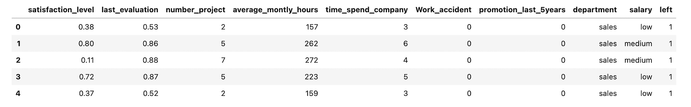

“employee”数据集的前几行。 图片由作者提供。

## 预处理

Pycaret 拥有一套模块，包含针对特定机器学习任务的一系列函数。我们使用的数据集包含一个分类问题，因此我们将主要使用[classification](https://pycaret.org/classification1/)模块。

第一步是导入 setup 函数。此函数在执行其他步骤之前运行。它初始化了 Pycaret 环境，并创建了一个用于预处理数据以准备建模的转换管道。运行时，Pycaret 会推断所有特征和目标列的数据类型。

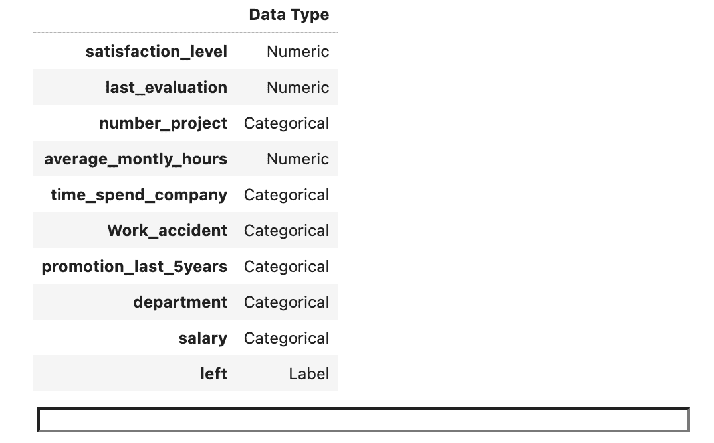

Pycaret 已经推断了特征和目标变量的数据类型。 图片由作者提供

如果我们确认这些数据类型是正确的，并且也愿意依赖 Pycaret 的默认预处理方法，那么我们只需按下回车键，Pycaret 将准备好数据以进行建模，并打印出描述所采取步骤的报告。

以下是该 59 行报告的前 15 行。setup 函数具有大量可选参数，可用于创建自定义预处理。例如，参数 `categorical_features` 可用于手动指定未正确推断的数据类型的分类列。可用参数的完整列表可以在[**这里**](https://pycaret.org/classification1/)找到。

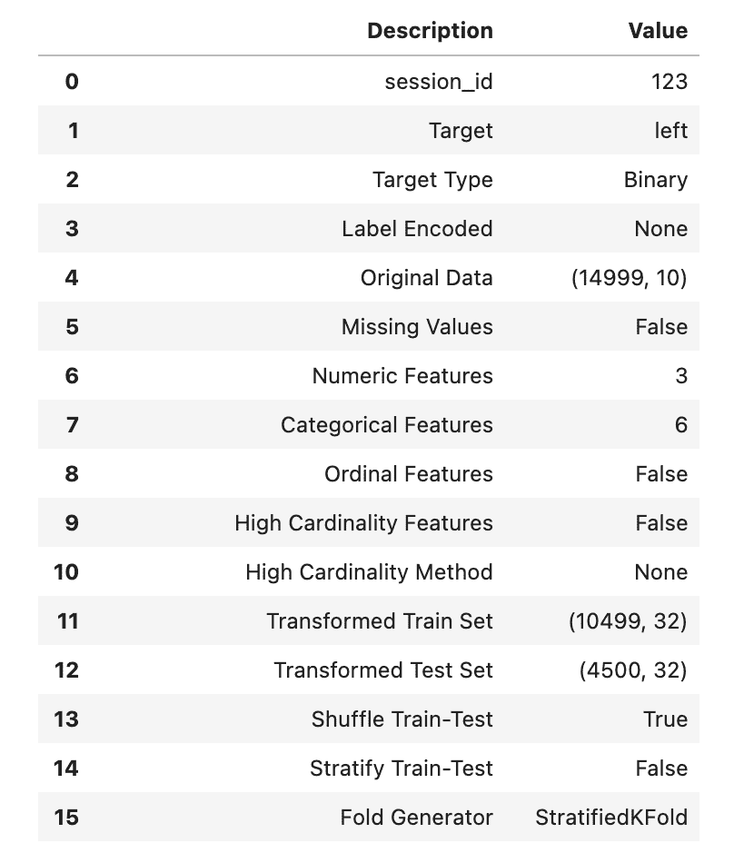

预处理报告的前 15 行。 图片由作者提供。

在真实世界的机器学习项目中，我们很可能会进行更深入的探索性分析和自定义预处理。然而，为了本教程的目的，我们将继续使用默认的预处理方法。

## 基准模型

通常在机器学习工作流中，首先训练一个简单模型以建立性能基准，然后再转向更复杂的算法是明智的选择。

在撰写时，Pycaret 支持 18 种不同的分类算法。完整的列表可以在[**这里**](https://pycaret.org/classification1/)找到。对于基线模型，我们将使用逻辑回归，并使用`create_model`函数进行训练。要选择算法，我们传入在[**文档**](https://pycaret.org/classification1/)中找到的缩写字符串。训练后，Pycaret 将打印一份详细说明模型性能的报告。

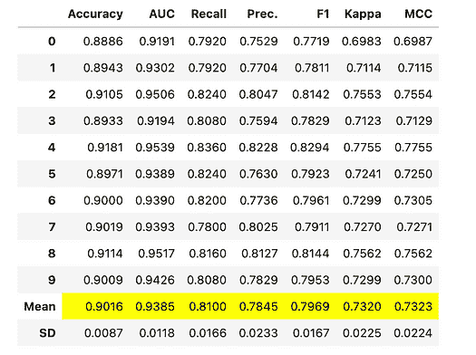

`create_model`报告。图片由作者提供。

## 比较模型

通过建立基线模型，我们已经确定了预处理和设置足以构建分类模型。

下一步是比较不同的分类算法，以确定哪一个最适合我们的数据集和问题。Pycaret 有一个叫做`compare_models()`的函数，可以让我们用一行代码比较所有可用算法的性能。

这个函数将尝试所有算法，并输出按准确度排名的列表。你可以通过`sort`参数更改目标指标。

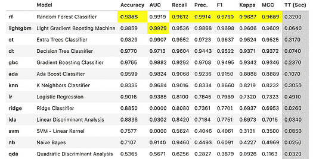

比较模型。图片由作者提供。

从中我们可以看出，随机森林是总体上最好的模型。我们将在接下来的工作流程中使用这个模型。

我们再次运行`create_model()`，这次选择随机森林算法。

## 调整模型

当我们运行`create_model`时，它会自动使用默认参数。这些参数不一定是最优的，所以我们需要调整模型以找到最佳选择。运行`tune_model()`函数使用随机网格搜索来调整模型的超参数。

默认情况下，函数将使用预定义的参数网格，但可以通过将自定义网格传递给`custom_grid`参数来进行自定义。默认情况下，函数还会优化准确度评分，但也可以使用`optimize`参数进行自定义。

在下面的代码中，我们使用默认参数网格来调整模型，并优化 MCC 评分。

该函数返回一个包含 k 折验证分数的表格，默认情况下折数为 10。

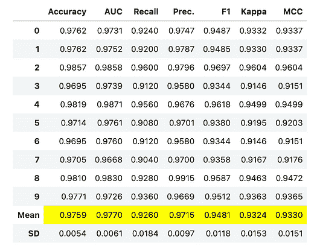

模型调整。图片由作者提供。

## 解释结果

Pycaret 提供了一系列内置图表来解释模型结果，可以使用`plot_model()`函数访问这些图表。

下面我们使用这个函数检查特征重要性。

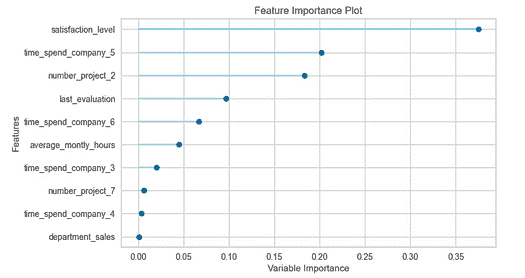

特征重要性。图片由作者提供。

让我们也可视化混淆矩阵。

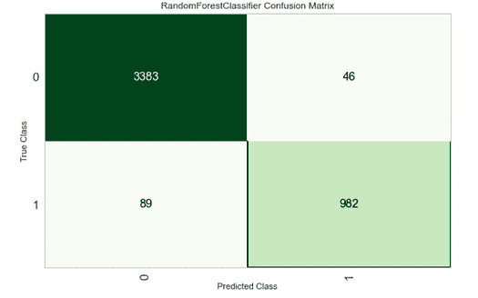

混淆矩阵。图片由作者提供。

## 部署模型

Pycaret 还具有将模型部署到 AWS 云的附加功能。

要在 AWS 上部署模型，你必须首先在 [aws.amazon.com](https://aws.amazon.com/?aws-products-analytics.sort-by=item.additionalFields.productNameLowercase&aws-products-analytics.sort-order=asc&aws-products-business-apps.sort-by=item.additionalFields.productNameLowercase&aws-products-business-apps.sort-order=asc&aws-products-containers.sort-by=item.additionalFields.productNameLowercase&aws-products-containers.sort-order=asc&aws-products-compute.sort-by=item.additionalFields.productNameLowercase&aws-products-compute.sort-order=asc&aws-products-iot.sort-by=item.additionalFields.productNameLowercase&aws-products-iot.sort-order=asc&aws-products-ml.sort-by=item.additionalFields.productNameLowercase&aws-products-ml.sort-order=asc&aws-products-mgmt-govern.sort-by=item.additionalFields.productNameLowercase&aws-products-mgmt-govern.sort-order=asc&aws-products-migration.sort-by=item.additionalFields.productNameLowercase&aws-products-migration.sort-order=asc&aws-products-network.sort-by=item.additionalFields.productNameLowercase&aws-products-network.sort-order=asc&aws-products-security.sort-by=item.additionalFields.productNameLowercase&aws-products-security.sort-order=asc&aws-products-storage.sort-by=item.additionalFields.productNameLowercase&aws-products-storage.sort-order=asc) 上创建一个账户。创建后，你需要生成一个访问密钥，以便允许 Pycaret 函数写入你的账户。按以下步骤操作。

1.  登录到你的 AWS 账户。

1.  悬停在右上角的用户名上。

1.  从出现的列表中选择安全凭证。

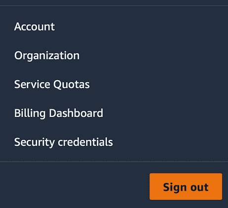

4\. 在这里展开访问密钥部分，并点击“创建新的访问密钥”。

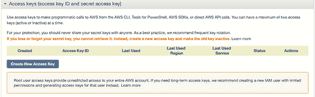

5\. 在此阶段，当提示时，你需要下载凭证文件。稍后你需要使用此文件中的凭证。

6\. 为了允许 Pycaret 与你的 AWS 账户交互，你还需要安装并配置 AWS CLI。首先运行以下命令。

```py
curl "[`awscli.amazonaws.com/AWSCLIV2.pkg`](https://awscli.amazonaws.com/AWSCLIV2.pkg)" -o "AWSCLIV2.pkg"
```

然后运行：

```py
sudo installer -pkg ./AWSCLIV2.pkg -target /
```

现在输入 `aws --version` 以确认一切已正确安装。你应该看到类似这样的内容。

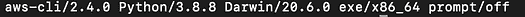

现在已安装，我们可以使用你的账户详情配置 AWS CLI。运行下面显示的命令，它会要求你输入以下信息。

**AWS Access Key ID：** 可以在我们之前下载的凭证文件中找到。

**AWS Secret Access Key：** 也可以在凭证文件中找到。

**默认区域名称：** 可以在 AWS 控制台中找到。

**默认输出格式：** 应留空。

接下来，我们创建一个 S3 存储桶以存储部署的模型。从 AWS 控制台选择 S3，然后创建一个你选择名称的存储桶。

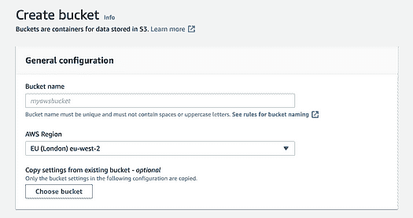

现在我们准备使用 Pycaret 部署我们选择的模型。

如果模型已经部署，你将看到以下消息。


## 生成预测

为了使用模型，我们在之前保留的验证数据上生成预测。

下面显示的代码从 S3 加载模型，并在去除了标签的验证数据上生成预测。

通过运行 `predictions[:5]` 来查看前 5 个预测结果。

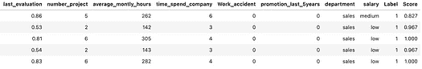

前 5 个预测。图片来自作者

## 监控

生产机器学习工作流的一个重要方面是跟踪和监控执行的实验。Pycaret 与 [MLflow](https://mlflow.org/) 集成，后者是一个用于管理端到端机器学习生命周期的开源平台。

要通过 Pycaret 使用 MLflow，我们需要导入 MLflow（这应该已经随 Pycaret 一起安装）并设置跟踪 URI。然后，我们在调用 setup 函数时添加几个额外的参数，如下所示。

现在，如果我们将跟踪 URI 复制到浏览器中，你应该能看到 mlflow UI 和它跟踪的实验。

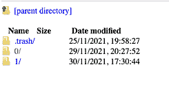

mlflow UI。图片来自作者

我们可以点击查看每个实验的度量指标、工件和参数。

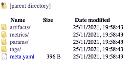

实验跟踪。图片来自作者

这是一个简单的教程，用于学习端到端机器学习项目的基本步骤。在现实世界中，大多数机器学习问题、数据和部署解决方案需要更复杂的处理。然而，为了本教程的目的，我使用了一个简单的数据集和 Python 库，以帮助你开始了解端到端机器学习生命周期。

Pycaret 是一个低代码机器学习库的例子。目前有很多工具正在开发，旨在以不同方式简化机器学习开发。要了解更多关于这些低成本机器学习库的信息，请参见我之前的文章。

[**低成本机器学习工具**](https://towardsdatascience.com/low-effort-machine-learning-tools-9622d7d57135)

有关现实世界中机器学习的更多信息，请参见下面的文章。

[**现实生活中的机器学习**](https://towardsdatascience.com/machine-learning-in-real-life-eebcb08f099c)

感谢阅读！

**简介: [Rebecca Vickery](https://www.linkedin.com/in/rebecca-vickery/)** 是一位数据科学家，拥有丰富的数据分析、机器学习和数据工程经验。12 年 SQL 经验，4 年以上 Python、R、Apache Airflow 和 Google Analytics 经验。

**相关:**

+   你不知道的关于 Scikit-Learn 的 10 件事

+   数据科学中的五个命令行工具

+   可解释的机器学习 Python 库

### 更多相关主题

+   [机器学习算法完整的端到端部署](https://www.kdnuggets.com/2021/12/deployment-machine-learning-algorithm-live-production-environment.html)

+   [5 款最佳端到端开源 MLOps 工具](https://www.kdnuggets.com/5-best-end-to-end-open-source-mlops-tools)

+   [使用 HuggingFace 实现的简单端到端项目](https://www.kdnuggets.com/a-simple-to-implement-end-to-end-project-with-huggingface)

+   [2024 年你必须尝试的 7 个端到端 MLOps 平台](https://www.kdnuggets.com/7-end-to-end-mlops-platforms-you-must-try-in-2024)

+   [机器学习算法必备指南：初学者指南](https://www.kdnuggets.com/2021/05/essential-machine-learning-algorithms-beginners.html)

+   [机器学习算法初学者指南前十名](https://www.kdnuggets.com/a-beginner-guide-to-the-top-10-machine-learning-algorithms)
