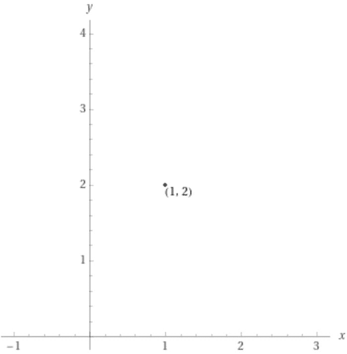
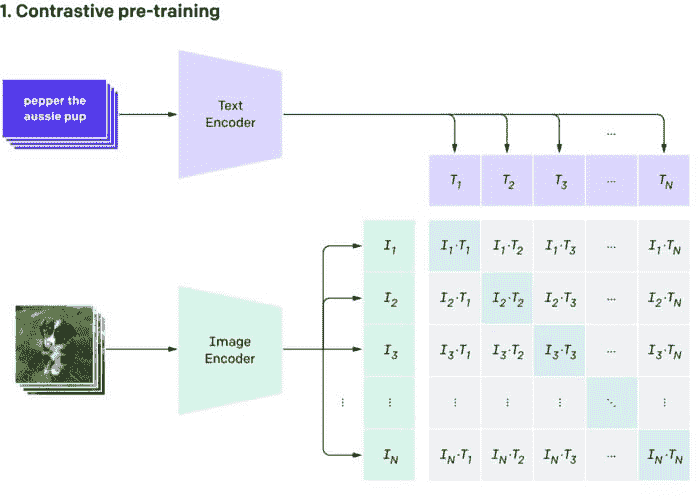
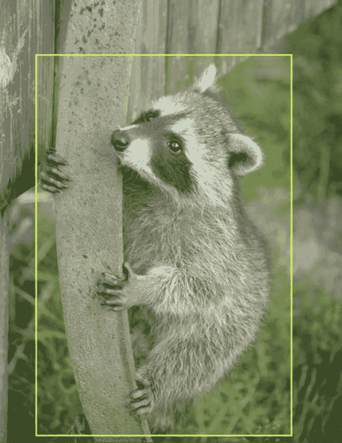

# CLIP 模型初学者指南

> 原文：[`www.kdnuggets.com/2021/03/beginners-guide-clip-model.html`](https://www.kdnuggets.com/2021/03/beginners-guide-clip-model.html)

评论

**作者：[Matthew Brems](https://www.linkedin.com/in/matthewbrems/)，Roboflow 增长经理**

你可能听说过 [OpenAI 的 CLIP 模型](https://openai.com/blog/clip/)。如果你查过，它表示 CLIP 是“对比语言-图像预训练”的缩写。这对我来说并不立即清晰，所以我 [阅读了论文](https://arxiv.org/pdf/2103.00020.pdf) 来了解他们如何开发 CLIP 模型 —— [以及相应的博客文章](https://openai.com/blog/clip/)。

* * *

## 我们的前三大课程推荐

 1\. [谷歌网络安全证书](https://www.kdnuggets.com/google-cybersecurity) - 快速进入网络安全职业。

 2\. [谷歌数据分析专业证书](https://www.kdnuggets.com/google-data-analytics) - 提升你的数据分析能力

 3\. [谷歌 IT 支持专业证书](https://www.kdnuggets.com/google-itsupport) - 支持组织的 IT 部门

* * *

我在这里为你分解 CLIP，力求做到——希望——易于理解和有趣！在这篇文章中，我将涵盖：

+   CLIP 是什么，

+   CLIP 是如何工作的，以及

+   为什么 CLIP 很酷。

### 什么是 CLIP？

CLIP 是第一个多模态（在这种情况下是视觉和文本）模型，旨在解决计算机视觉问题，并于 2021 年 1 月 5 日由 [OpenAI](https://openai.com/blog/clip/) 发布。从 [OpenAI CLIP 仓库](https://github.com/openai/CLIP) 中，“CLIP（对比语言-图像预训练）是一个在各种（图像，文本）对上训练的神经网络。它可以用自然语言指令来预测给定图像的最相关文本片段，而无需直接优化任务，类似于 GPT-2 和 GPT-3 的零样本能力。”

根据你的背景，这 *可能* 有意义——但这里有很多可能对你来说不熟悉的内容。让我们深入探讨一下。

+   CLIP 是一个神经网络模型。

+   它的训练数据包含 400,000,000 个（图像，文本）对。一个（图像，文本）对可能是一张图片及其说明。这意味着有 400,000,000 张图片及其说明被匹配在一起，这些数据用于训练 CLIP 模型。

+   *“它可以根据给定图像预测最相关的文本片段。”* 你可以将一张图片输入到 CLIP 模型中，它会返回最可能的说明或摘要。

+   *“无需直接针对任务进行优化，与 GPT-2 和 GPT-3 的零样本能力类似。”* 大多数机器学习模型学习一个特定任务。例如，一个经过训练来分类狗和猫的图像分类器被期望在我们给它的任务上表现良好：分类狗和猫。我们通常不期望一个经过训练来识别狗和猫的机器学习模型在检测浣熊方面表现得很好。然而，一些模型——包括 CLIP、GPT-2 和 GPT-3——在它们没有直接训练的任务上表现得很好，这被称为“零样本学习”。

+   “零样本学习”是指模型尝试预测在训练数据中出现零次的类别。因此，将一个只训练过猫和狗的模型用于检测浣熊。像 CLIP 这样的模型，由于它如何利用（图像，文本）对中的文本信息，通常在零样本学习方面表现非常好——即使你查看的图像与训练图像非常不同，你的 CLIP 模型也很可能能为该图像提供一个好的标题。

综合来看，CLIP 模型是：

+   一个基于数亿张图像和标题构建的神经网络模型，

+   可以根据给定的图像返回最佳标题，并且

+   具有令人印象深刻的“零样本”能力，使其能够准确预测从未见过的整个类别！

当我撰写我的[计算机视觉简介](https://blog.roboflow.com/intro-to-computer-vision/)文章时，我将计算机视觉描述为“计算机以类似于人类的方式看见和理解其所见的能力。”

[当我教授自然语言处理](https://github.com/matthewbrems/nlp-fundamentals-python)时，我以类似的方式描述 NLP：“计算机以类似于人类的方式理解语言的能力。”

**CLIP 是计算机视觉与自然语言处理之间的桥梁。**

它不仅仅是计算机视觉和自然语言处理之间的桥梁——它是一个**非常强大的桥梁**，在两者之间具有很大的灵活性和广泛的应用。

### CLIP 是如何工作的？

为了使图像和文本相互关联，它们必须都被[嵌入](https://en.wikipedia.org/wiki/Embedding)。即使你没有这样想过，你之前也曾经使用过嵌入。让我们通过一个例子来说明。假设你有一只猫和两只狗。你可以将其表示为图表上的一个点，如下所示：

“1 只猫，2 只狗。”的嵌入（[来源](https://www.wolframalpha.com/input/?i=%281%2C2%29)）

这可能看起来不是很令人兴奋，但我们刚刚将这些信息嵌入到你可能在初中学过的 X-Y 坐标系中（正式称为[欧几里得空间](https://en.wikipedia.org/wiki/Euclidean_space)）。你还可以在同一个图上嵌入你朋友的宠物信息，或者选择多种不同的方式来表示这些信息（例如，将狗放在猫前面，或添加一个用于浣熊的第三维度）。

我喜欢将嵌入理解为一种将信息压缩到数学空间的方式。我们刚刚将关于狗和猫的信息压缩到数学空间中。***我们也可以对文本和图像进行同样的操作！***

**CLIP 模型由两个称为编码器的子模型组成：**

+   一个将文本嵌入（压缩）到数学空间中的文本编码器。

+   一个将图像嵌入（压缩）到数学空间中的图像编码器。

每当你训练一个[监督学习模型](https://towardsdatascience.com/a-brief-introduction-to-supervised-learning-54a3e3932590)时，你必须找到某种方法来衡量该模型的“好坏”——目标是拟合一个“最好”和“最不差”的模型。

CLIP 模型也不例外：文本编码器和图像编码器都被调整以最大化好坏并最小化坏。

**那么，我们如何衡量“好坏”？**

在下图中，你会看到一组紫色文本卡片进入文本编码器。每张卡片的输出将是一系列数字。例如，顶部的卡片，`pepper the aussie pup`，将进入文本编码器——即将其压缩到数学空间中的工具——并以类似（0, 0.2, 0.8）的数字系列输出。

对于图像也会发生完全相同的情况：每张图像将进入图像编码器，每张图像的输出也将是一系列数字。图片中的，可能是 Pepper 这只澳大利亚小狗的图像，将输出类似（0.05, 0.25, 0.7）的数字。

预训练阶段。 ([Source](https://openai.com/blog/clip/).)

**我们模型的“好坏”**

在理想的情况下，文本“pepper the aussie pup”的数字系列将与对应图像的数字系列非常接近（相同）。*事实上，这应该在所有地方都是如此*：文本的数字系列应该非常接近对应图像的数字系列。我们衡量模型“好坏”的一种方法是看每个文本的嵌入表示（数字系列）与每个图像的嵌入表示的接近程度。

计算两组数字之间相似性的便捷方法是：[余弦相似度](https://www.machinelearningplus.com/nlp/cosine-similarity/)。我们在这里不会深入探讨这个公式的内部运作，但可以放心，它是一个经过验证的查看两个向量或数字序列相似性的方法。（虽然这并不是唯一的方法！）

在上图中，浅蓝色方块表示文本和图像重合的部分。例如，T1 是第一个文本的嵌入表示；I1 是第一个图像的嵌入表示。我们希望 I1 和 T1 的余弦相似度尽可能高。对于 I2 和 T2 也是如此，所有浅蓝色方块都应如此。**这些余弦相似度越高，我们的模型的“好”就越多！**

**我们模型的“坏”**

与此同时，尽管我们希望最大化每一个蓝色方块的余弦相似度，但还有很多灰色方块表示文本和图像之间的不匹配。例如，T1 是文本“pepper the aussie pup”，但可能 I2 是[一张浣熊的图片](https://public.roboflow.com/object-detection/raccoon)。

带有边界框注释的浣熊图片。 ([来源](https://public.roboflow.com/object-detection/raccoon).)

尽管这只浣熊很可爱，但我们希望这张图片（I2）与文本`pepper the aussie pup`之间的余弦相似度很小，因为这不是 Pepper the Aussie 小狗！

尽管我们希望所有蓝色方块之间具有较高的余弦相似度（因为这衡量了“好”），但我们希望所有灰色方块之间具有较低的余弦相似度，因为这衡量了“坏”。

最大化蓝色方块的余弦相似度；最小化灰色方块的余弦相似度。 ([来源](https://openai.com/blog/clip/).)

**文本和图像编码器如何进行训练？**

文本编码器和图像编码器同时进行训练，通过同时最大化这些蓝色方块的余弦相似度，并最小化灰色方块的余弦相似度，来对所有文本+图像对进行优化。

> 注意：根据数据的大小，这可能需要很长时间。CLIP 模型在 400,000,000 张标记图像上进行了训练。训练过程花费了 30 天，使用了[592 个 V100 GPU](https://www.nvidia.com/en-us/data-center/v100/)。在 AWS 按需实例上训练这些模型的费用将达到 1,000,000 美元！

一旦模型训练完成，你可以将一张图片传递给图像编码器，以获取最符合该图片的文本描述——或者，反过来，你也可以将文本描述传递给模型，以获取图像，就像你在下面的一些应用中看到的那样！

**CLIP 是计算机视觉与自然语言处理之间的桥梁。**

### CLIP 为什么很酷？

通过计算机视觉与自然语言处理之间的桥梁，CLIP 具有很多优势和酷炫的应用。我们将重点关注这些应用，但也有一些优势需要指出：

+   泛化能力：模型通常非常脆弱，只能知道你训练它们做的非常具体的事情。CLIP 通过利用文本中的语义信息，扩展了分类模型的知识范围。标准分类模型完全丢弃了类别标签的语义含义，后台仅是列举的数字类别；CLIP 通过理解类别的意义来工作。

+   比以往更好地连接文本/图像：考虑到速度和准确性，CLIP 可能真的是“世界上最好的字幕写手”。

+   已标记的数据：CLIP 是基于已经创建的图像和字幕构建的；其他最先进的计算机视觉算法需要大量额外的人力来进行标记。

> 为什么 [@OpenAI](https://twitter.com/OpenAI?ref_src=twsrc%5Etfw) 的 CLIP 模型很重要？[`t.co/X7bnSgZ0or`](https://t.co/X7bnSgZ0or)
> 
> — Joseph Nelson (@josephofiowa) [2021 年 1 月 6 日](https://twitter.com/josephofiowa/status/1346639942571712521?ref_src=twsrc%5Etfw)

到目前为止，CLIP 的一些用途：

+   [CLIP 已被用来在像 Unsplash 这样的站点上索引照片](https://twitter.com/metasemantic/status/1349446585952989186?s=20)。

+   一位 Twitter 用户将包括 Elvis Presley、Beyoncé 和 Billie Eilish 的名人，[并使用 CLIP 和 StyleGAN 生成了“我的小马”风格的肖像。](https://twitter.com/metasemantic/status/1368713208429764616)

+   你玩过 Pictionary 吗？现在你可以在 [paint.wtf 上在线玩游戏，在那里你会被 CLIP 评判](https://paint.wtf/)。

+   CLIP 可以用来轻松改善 NSFW 过滤器！

+   [找到匹配心情的照片——例如，通过诗歌段落](https://twitter.com/metasemantic/status/1349446585952989186)。

+   OpenAI 还创建了 [DALL-E，它可以从文本生成图像](https://openai.com/blog/dall-e/)。

我们希望你能查看上述一些内容——或创建你自己的！我们有一个 [CLIP 教程](https://blog.roboflow.com/how-to-use-openai-clip/) 供你跟随。如果你用它做了什么，[告诉我们，以便我们将其添加到上述列表中](https://roboflow.com/contact)！

值得注意的是，CLIP 是计算机视觉与自然语言处理之间的 *一个* 桥梁。CLIP 并不是唯一的桥梁。你可以以非常不同的方式构建这些文本和图像编码器，或者找到其他连接这两者的方法。**然而，CLIP 迄今为止是一个异常创新的技术，促进了显著的额外创新。**

我们迫不及待地想看到你用 CLIP 创建的内容，以及在其基础上取得的进展！

**个人简介：[Matthew Brems](https://www.linkedin.com/in/matthewbrems/)** 是 Roboflow 的增长经理。

[原始内容](https://blog.roboflow.com/clip-model-eli5-beginner-guide/)。经许可转载。

**相关内容：**

+   OpenAI 发布了两个 Transformer 模型，神奇地链接了语言和计算机视觉

+   评估目标检测模型使用平均精度

+   使用 SRU+ 降低训练 NLP 模型的高成本

### 更多相关话题

+   [初学者的端到端机器学习指南](https://www.kdnuggets.com/2021/12/beginner-guide-end-end-machine-learning.html)

+   [必备的机器学习算法：初学者指南](https://www.kdnuggets.com/2021/05/essential-machine-learning-algorithms-beginners.html)

+   [初学者的 Q 学习指南](https://www.kdnuggets.com/2022/06/beginner-guide-q-learning.html)

+   [初学者的 Python 网页抓取指南](https://www.kdnuggets.com/2022/10/beginner-guide-web-scraping-python.html)

+   [初学者的云计算指南](https://www.kdnuggets.com/2023/01/beginner-guide-cloud-computing.html)

+   [初学者的数据科学异常检测技术指南](https://www.kdnuggets.com/2023/05/beginner-guide-anomaly-detection-techniques-data-science.html)
