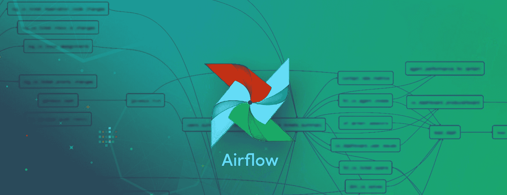
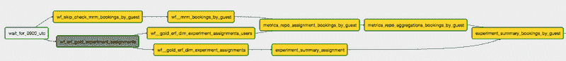
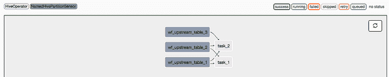

# 数据工程入门指南 - 第二部分

> 原文：[`www.kdnuggets.com/2018/03/beginners-guide-data-engineering-part-2.html/2`](https://www.kdnuggets.com/2018/03/beginners-guide-data-engineering-part-2.html/2)

 评论

### Airflow 管道的结构

现在我们已经了解了事实表、维度表、日期分区的概念，以及数据回填的含义，让我们进一步明确这些概念，并将其应用于实际的 Airflow ETL 作业中。

* * *

## 我们的前三大课程推荐

 1\. [Google 网络安全证书](https://www.kdnuggets.com/google-cybersecurity) - 快速进入网络安全职业生涯。

 2\. [Google 数据分析专业证书](https://www.kdnuggets.com/google-data-analytics) - 提升你的数据分析技能

 3\. [Google IT 支持专业证书](https://www.kdnuggets.com/google-itsupport) - 支持你的组织在 IT 方面

* * *

**定义有向无环图 (DAG)**

正如我们在[早期文章](https://medium.com/@rchang/a-beginners-guide-to-data-engineering-part-i-4227c5c457d7)中提到的，任何 ETL 作业本质上都是建立在三个构建块之上的：**提取**、**转换**和**加载**。尽管从概念上讲这可能听起来很简单，但实际中的 ETL 作业往往很复杂，由许多 E、T 和 L 任务的组合组成。因此，使用图形可视化复杂的数据流通常很有用。从视觉上看，图中的*节点*代表一个任务，而*箭头*代表一个任务对另一个任务的依赖关系。由于数据只需要在给定任务上计算一次，然后计算结果会继续传递，图是*有向的*和*无环的*。这就是为什么 Airflow 作业通常被称为“DAG”（**有向** **无环** **图**）的原因。

[来源](https://medium.com/airbnb-engineering/https-medium-com-jonathan-parks-scaling-erf-23fd17c91166)：Airbnb 实验报告框架 DAG 的截图

Airflow UI 的一个巧妙设计是它允许用户以[图形视图](https://airflow.apache.org/ui.html#graph-view)可视化 DAG，使用代码作为配置。数据管道的作者必须定义任务之间的依赖结构才能进行可视化。这个规范通常写在一个叫做*DAG 定义文件*的文件中，这个文件展示了 Airflow 作业的结构。

**操作符：传感器、操作符和传输**

虽然 DAG 描述了*如何*运行数据管道，但操作符描述了*在数据管道中做什么*。通常，操作符分为三大类：

+   **传感器：**等待一定时间、外部文件或上游数据源

+   **操作符：**触发某种操作（例如运行一个 bash 命令、执行一个 python 函数，或执行一个 Hive 查询等）。

+   **传输：**将数据从一个位置移动到另一个位置

精明的读者可能会看到这些操作符如何对应于 **E**xtract，

**T**ransform 和 **L**oad 步骤是我们之前讨论过的。

**传感器**在经过一定时间或当上游数据源的数据可用时，解除数据流的阻塞。在 Airbnb，由于我们的大多数 ETL 作业涉及 Hive 查询，我们经常使用`[NamedHivePartitionSensors](https://github.com/apache/incubator-airflow/blob/master/airflow/sensors/named_hive_partition_sensor.py)`来检查 Hive 表的最新分区是否已准备好进行下游处理。

**操作符**触发数据转换，这对应于 **T**ransform 步骤。由于 Airflow 是开源的，贡献者可以[扩展](https://github.com/apache/incubator-airflow/tree/master/airflow/operators) `BaseOperator` 类以创建自定义操作符。 在 Airbnb，我们最常使用的操作符是`[HiveOperator](https://github.com/apache/incubator-airflow/blob/master/airflow/operators/hive_operator.py#L22)`（执行 hive 查询），但我们也经常使用`[PythonOperator](https://github.com/apache/incubator-airflow/blob/master/airflow/operators/python_operator.py)`（例如运行 Python 脚本）和`[BashOperator](https://github.com/apache/incubator-airflow/blob/master/airflow/operators/bash_operator.py)`（例如运行 bash 脚本，或甚至是一个 fancy Spark 作业）。这里的可能性是无限的！

最后，我们还拥有专门的操作符，**传输**数据从一个地方到另一个地方，这通常对应于 ETL 中的 **L**oad 步骤。在 Airbnb，我们经常使用`[MySqlToHiveTransfer](https://github.com/apache/incubator-airflow/blob/master/airflow/operators/mysql_to_hive.py)`或`[S3ToHiveTransfer](https://github.com/apache/incubator-airflow/blob/master/airflow/operators/s3_to_hive_operator.py)`，但这在很大程度上取决于数据基础设施和数据仓库的位置。

**一个简单的例子**

下面是一个简单的例子，展示了如何定义一个 DAG 定义文件、实例化一个 Airflow DAG，并使用我们之前描述的各种操作符来定义相应的 DAG 结构。

当 DAG 被渲染时，我们看到以下图形视图：

玩具示例 DAG 的图形视图

### ETL 最佳实践

[图片来源](http://www.omen-azen.com/eat-together-1/)：打造你的工艺需要实践，因此遵循最佳实践是明智的

像任何工艺一样，编写简洁、可读且可扩展的 Airflow 作业需要实践。在我第一次工作时，ETL 对我而言只是一些我必须完成的平凡机械任务。我没有将其视为一种工艺，也不知道最佳实践。在 Airbnb，我学到了很多关于最佳实践的知识，并开始欣赏优秀的 ETL 以及它们的美妙。下面，我列出了一些好的 ETL 管道应遵循的原则，但并非详尽无遗：

+   **分区数据表：**如前所述，当处理大规模的长历史表时，数据分区特别有用。当数据使用日期戳进行分区时，我们可以利用动态分区来并行化回填。

+   **增量加载数据：**这一原则使你的 ETL 更加模块化和易于管理，特别是在从事实表构建维度表时。在每次运行中，我们只需将新事务追加到之前日期分区的维度表中，而不是扫描整个事实历史。

+   **强制幂等性：**许多数据科学家依赖时间点快照进行历史分析。这意味着随着时间的推移，基础源表不应被修改，否则我们将得到不同的结果。管道应构建成这样，即相同的查询在相同的业务逻辑和时间范围内运行时返回相同的结果。这一属性有一个 Fancy 名称叫做幂等性。

+   **参数化工作流：**就像模板极大地简化了 HTML 页面的组织一样，Jinja 可以与 SQL 结合使用。正如我们之前提到的，Jinja 模板的一个常见用法是将回填逻辑纳入典型的 Hive 查询中。[Stitch Fix](https://www.google.com/search?q=stitchfix+jinja&oq=stitchfix+jinja&aqs=chrome..69i57j69i59.3030j0j1&sourceid=chrome&ie=UTF-8)有一篇很好的文章总结了他们如何在 ETL 中使用这一技术。

+   **尽早并频繁地添加数据检查：**在处理数据时，将数据写入暂存表中，检查数据质量，然后再用最终生产表交换暂存表是很有用的。在 Airbnb，我们称之为*stage-check-exchange*范式。这个 3 步范式中的检查是重要的防御机制——它们可以是简单的检查，例如统计记录总数是否大于 0，或者复杂的异常检测系统，用于检查未见过的类别或异常值。

stage-check-exchange 操作的骨架（即数据管道的“单元测试”）

+   **构建有用的警报和监控系统：**由于 ETL 作业通常需要很长时间才能运行，因此添加警报和监控是很有用的，这样我们就不需要不断关注 DAG 的进度。不同的公司以多种创造性的方法来监控 DAG——在 Airbnb，我们经常使用 EmailOperators 发送缺失 SLA 的作业的警报邮件。其他团队则使用警报来标记实验失衡。还有一个[有趣的例子](https://www.slideshare.net/cloudera/building-robust-pipelines-with-airflow-wrangle-conference-2017)来自 Zymergen，他们通过 SlackOperator 报告模型性能指标，如 R 平方。

这些原则很多灵感来自于与经验丰富的数据工程师的对话、我自己构建 Airflow DAGs 的经验，以及对 Gerard Toonstra 的[ETL 最佳实践与 Airflow](https://gtoonstra.github.io/etl-with-airflow/principles.html)的阅读。对于感兴趣的读者，我强烈推荐 Maxime 的以下演讲：

[来源](https://www.youtube.com/watch?v=dgaoqOZlvEA)：Airflow 的原创作者 Maxime 谈论 ETL 最佳实践

### 第二部分回顾

在这一系列的第二篇文章中，我们更详细地讨论了星型模式和数据建模。我们了解了事实表和维度表之间的区别，并看到了使用日期戳作为分区键的优势，尤其是在回填时。此外，我们剖析了 Airflow 作业的结构，并明确了 Airflow 中不同操作符的功能。我们还强调了构建 ETL 的最佳实践，并展示了 Airflow 作业在与 Jinja 和 SlackOperators 结合使用时的灵活性。可能性无穷无尽！

在系列的最后一篇文章中，我将讨论一些高级数据工程模式——具体来说，从构建管道到构建框架的过程。我将再次使用我们在 Airbnb 使用的一些示例框架作为激励示例。

如果你觉得这篇文章有用，请访问[**第一部分**](https://medium.com/@rchang/a-beginners-guide-to-data-engineering-part-i-4227c5c457d7)，并关注**第三部分**。

*我想感谢*[*Jason Goodman*](https://medium.com/@jasonkgoodman)*和 Michael Musson 对我的宝贵反馈*

**简介：[Robert Chang](https://www.linkedin.com/in/robert-chang-877b1720/)** 是 Airbnb 的一个数据科学家，专注于机器学习、机器学习基础设施和房东增长。在加入 Airbnb 之前，他曾是 Twitter 的数据科学家，并拥有斯坦福大学的统计学学位和加州大学伯克利分校的运筹学学位。

[原文](https://towardsdatascience.com/a-beginners-guide-to-data-engineering-part-ii-47c4e7cbda71)。经许可转载。

**相关内容：**

+   数据工程初学者指南——第一部分

+   对新手和初级数据科学家的建议

+   如何构建数据科学管道

### 更多相关话题

+   [数据工程初学者指南](https://www.kdnuggets.com/2023/07/beginner-guide-data-engineering.html)

+   [数据科学中的异常检测技术初学者指南](https://www.kdnuggets.com/2023/05/beginner-guide-anomaly-detection-techniques-data-science.html)

+   [数据科学入门指南](https://www.kdnuggets.com/2023/07/introduction-data-science-beginner-guide.html)

+   [Pyjanitor 数据清洗初学者指南](https://www.kdnuggets.com/beginners-guide-to-data-cleaning-with-pyjanitor)

+   [端到端机器学习初学者指南](https://www.kdnuggets.com/2021/12/beginner-guide-end-end-machine-learning.html)

+   [机器学习算法精要：初学者指南](https://www.kdnuggets.com/2021/05/essential-machine-learning-algorithms-beginners.html)
