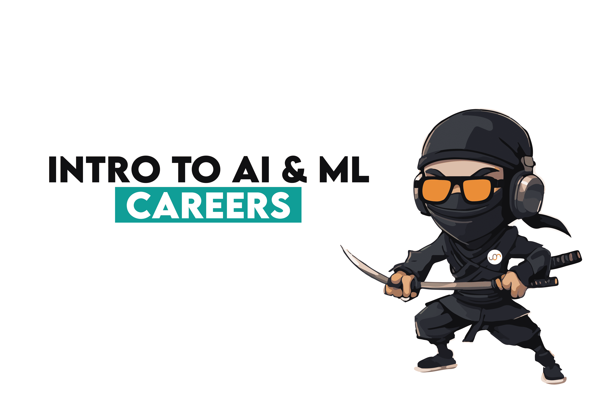
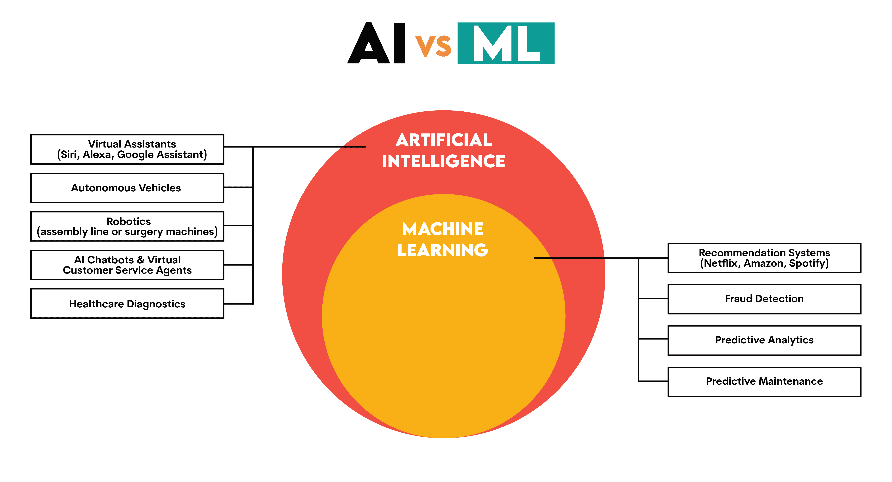
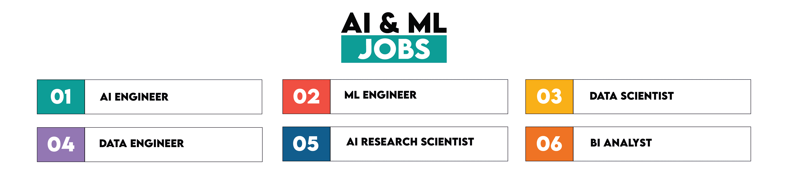
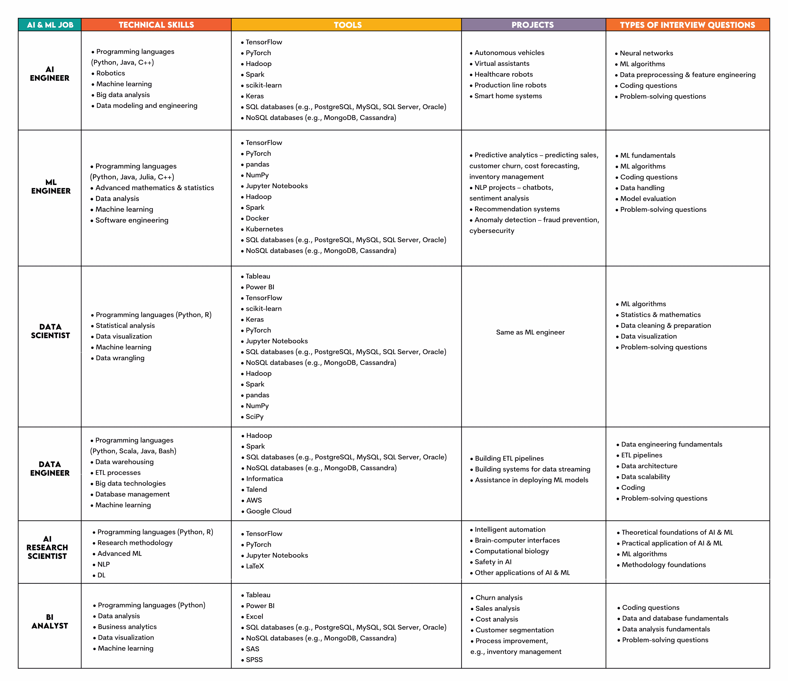

# AI 和机器学习职业入门指南

> 原文：[`www.kdnuggets.com/beginners-guide-to-careers-in-ai-and-machine-learning`](https://www.kdnuggets.com/beginners-guide-to-careers-in-ai-and-machine-learning)

*图片由作者提供*

* * *

## 我们的前三大课程推荐

 1\. [Google 网络安全证书](https://www.kdnuggets.com/google-cybersecurity) – 快速进入网络安全职业道路。

 2\. [Google 数据分析专业证书](https://www.kdnuggets.com/google-data-analytics) – 提升你的数据分析能力

 3\. [Google IT 支持专业证书](https://www.kdnuggets.com/google-itsupport) – 支持你所在组织的 IT 工作

* * *

人工智能（AI）和机器学习（ML）的广泛发展迫使就业市场进行调整。AI 和 ML 通才的时代已经结束，我们进入了专家时代。

即使是更有经验的人也可能难以找到合适的方向，更不用说初学者了。

这就是我创建这个小指南来帮助理解不同 AI 和 ML 职位的原因。

## **什么是 AI 和 ML？**

AI 是计算机科学的一个领域，旨在创建表现出类似人类智能的计算机系统。

ML 是 AI 的一个子领域，使用算法来构建和部署可以从数据中学习并在没有明确指令的情况下做出决策的模型。

## **AI 和 ML 的职位**

AI 和 ML 的复杂性及其各种目的导致了各种工作对它们的不同应用。

这里是我将要讨论的十个职位。

尽管它们都需要 AI 和 ML，虽然技能和工具有时会重叠，但每个职位都需要 AI 和 ML 专业知识的某些独特方面。

这里是这些差异的概述。

## **1\. AI 工程师**

这个角色专注于开发、实施、测试和维护 AI 系统。

#### **技术技能**

核心 AI 工程师技能围绕构建 AI 模型，因此编程语言和 ML 技术至关重要。

+   编程语言（[Python](https://www.python.org)，[Java](https://www.java.com/en/)，[C++](https://isocpp.org)）– [模型原型设计](https://c3.ai/glossary/data-science/model-prototyping/)和开发，[大数据](https://en.wikipedia.org/wiki/Big_data)，[计算机视觉](https://towardsdatascience.com/everything-you-ever-wanted-to-know-about-computer-vision-heres-a-look-why-it-s-so-awesome-e8a58dfb641e)以及实时系统

+   [机器人技术](https://www.v7labs.com/blog/ai-in-robotics)

+   机器学习 – 熟悉不同类型的 ML 算法

+   大数据分析——为 ML 模型准备数据，[特征工程](https://www.heavy.ai/technical-glossary/feature-engineering)、模式和趋势分析

+   数据建模和工程——存储数据并为模型构建[数据管道](https://www.astera.com/type/blog/build-a-data-pipeline/)

#### **工具**

主要使用的工具包括 Python 库、大数据工具和数据库。

+   [TensorFlow](https://www.tensorflow.org)、[PyTorch](https://pytorch.org)——使用[动态图](https://pytorch.org/blog/computational-graphs-constructed-in-pytorch/)和[静态图计算](https://www.geeksforgeeks.org/dynamic-vs-static-computational-graphs-pytorch-and-tensorflow/)创建神经网络和 ML 应用

+   [Hadoop](https://hadoop.apache.org)、[Spark](https://spark.apache.org)——处理和分析[大数据](https://www.sas.com/en_us/insights/big-data/what-is-big-data.html)

+   [scikit-learn](https://scikit-learn.org/stable/)、[Keras](https://keras.io)——实现[监督](https://scikit-learn.org/stable/supervised_learning.html)和[无监督 ML 算法](https://scikit-learn.org/stable/unsupervised_learning.html)并构建模型，包括[深度学习模型](https://www.ibm.com/topics/deep-learning)

+   SQL（例如，[PostgreSQL](https://www.postgresql.org)、[MySQL](https://www.mysql.com)、[SQL Server](https://www.microsoft.com/en-us/sql-server/sql-server-downloads)、[Oracle](https://www.oracle.com/database/)）、NoSQL 数据库，如 [MongoDB](https://www.mongodb.com)（用于[文档导向数据](https://www.mongodb.com/resources/basics/databases/document-databases)，例如，[JSON](https://www.json.org/json-en.html) 类似文档）和 [Cassandra](https://cassandra.apache.org/_/index.html)（[列族数据模型](https://dkharazi.github.io/blog/nosql-column)，适用于时间序列数据）——存储和管理结构化及非结构化数据

#### **项目**

AI 工程师致力于自动化项目和 AI 系统，如：

+   自动驾驶车辆

+   虚拟助手

+   医疗机器人

+   生产线机器人

+   智能家居系统

#### **面试问题类型**

面试问题反映了所需技能，因此预计会涉及以下主题：

+   [神经网络](https://aws.amazon.com/what-is/neural-network/)

+   [ML 算法](https://www.ibm.com/topics/machine-learning-algorithms)

+   [数据预处理](https://www.techtarget.com/searchdatamanagement/definition/data-preprocessing) 和 [特征工程](https://www.heavy.ai/technical-glossary/feature-engineering)

+   编码问题

+   问题解决问题

## **2. ML 工程师**

ML 工程师开发、部署和维护 ML 模型。他们的重点是[部署](https://serokell.io/blog/ml-model-deployment)和[生产环境中的模型调优](https://serokell.io/blog/ml-model-deployment)。

#### **技术技能**

除了机器学习的常规技能，ML 工程师的主要技能还有软件工程和高级数学。

+   编程语言 ([Python](https://www.python.org)、[Java](https://www.java.com/en/)、[Julia](https://julialang.org)、[C++](https://isocpp.org)) – 实现 ML 算法、模型开发与部署、数值和科学计算

+   高级数学与统计 – 理解数据、构建算法、ML 模型优化和 [评估](https://www.iguazio.com/glossary/model-evaluation/)

+   数据分析 – [清理和准备数据](https://www.obviously.ai/post/data-cleaning-in-machine-learning) 以进行 [模型训练](https://oden.io/glossary/model-training/)

+   ML 算法 – 与 AI 工程师相同

+   软件工程 – [版本控制](https://www.atlassian.com/git/tutorials/what-is-version-control) 和 [测试框架](https://smartbear.com/learn/automated-testing/test-automation-frameworks/)

#### **工具**

ML 工程师的工具与 AI 工程师的工具类似。

+   [TensorFlow](https://www.tensorflow.org)、[PyTorch](https://pytorch.org) – 开发、训练和部署 ML 和 [深度学习模型](https://www.ibm.com/topics/deep-learning)

+   [pandas](https://pandas.pydata.org)、[NumPy](https://numpy.org) – 数据处理和数值计算

+   [Jupyter Notebooks](https://jupyter.org) – 互动编码、数据可视化、文档编写

+   [Hadoop](https://hadoop.apache.org)、[Spark](https://spark.apache.org) – 与 AI 工程师相同

+   [Docker](https://www.docker.com)、[Kubernetes](https://kubernetes.io) – [ML 应用的容器化](https://www.comet.com/site/blog/containerization-of-machine-learning-applications/) 和管理

+   SQL 和 NoSQL 数据库 – 与 AI 工程师相同

#### **项目**

ML 工程师的知识应用于这些项目：

+   [预测分析](https://cloud.google.com/learn/what-is-predictive-analytics) – 销售预测、客户流失预测、成本预测、库存管理

+   NLP 项目 – 聊天机器人、[情感分析](https://aws.amazon.com/what-is/sentiment-analysis/)

+   [推荐系统](https://utsavdesai26.medium.com/recommendation-systems-explained-understanding-the-basic-to-advance-43a5fce77c47) – 根据客户的行为和偏好推荐产品、内容和服务

+   [异常检测](https://www.ibm.com/blog/anomaly-detection-machine-learning/) – 欺诈预防、网络安全

#### **面试问题类型**

ML 是每个 ML 工程师工作中的核心，因此也是面试的重点。

+   ML 概念 – ML 基础，例如机器学习类型、[过拟合](https://aws.amazon.com/what-is/overfitting/) 和 [欠拟合](https://www.ibm.com/topics/underfitting)

+   ML 算法

+   编程问题

+   数据处理 – 准备数据进行建模的基础

+   模型评估 – [模型评估技术和指标](https://www.markovml.com/blog/model-evaluation-metrics)，包括准确率、精确度、召回率、F1 分数和 ROC 曲线

+   问题解决问题

## **3\. 数据科学家**

数据科学家收集和清洗数据，进行探索性数据分析（EDA）以更好地理解数据。他们创建统计模型、[机器学习算法](https://www.stratascratch.com/blog/machine-learning-algorithms-you-should-know-for-data-science/?utm_source=blog&utm_medium=click&utm_campaign=kdn+career+in+ai+and+ml)和可视化，以了解数据中的模式并做出预测。

与 ML 工程师不同，数据科学家更涉及机器学习模型的初始阶段；他们专注于发现数据模式并从中提取洞察。

#### **技术技能**

数据科学家使用的技能集中在提供可操作的洞察。

+   编程语言（[Python](https://www.python.org)，[R](https://www.r-project.org/about.html)）– 查询数据库、管理数据、[统计分析](https://www.scribbr.com/category/statistics/)、机器学习算法、数据可视化

+   统计分析 – 理解数据，[假设检验](https://www.scribbr.com/statistics/hypothesis-testing/)，发现趋势

+   [数据可视化](https://www.ibm.com/topics/data-visualization) – 可视化趋势和洞察

+   机器学习

+   [数据整理](https://online.hbs.edu/blog/post/data-wrangling) – 通过清理、格式化和结构化数据为分析做准备

#### **工具**

+   [Tableau](https://www.tableau.com)，[Power BI](https://www.microsoft.com/en-us/power-platform/products/power-bi) – 数据可视化

+   [TensorFlow](https://www.tensorflow.org)，[scikit-learn](https://www.r-project.org/about.html)，[Keras](https://keras.io)，[PyTorch](https://pytorch.org) – 开发、训练、部署 ML 和 DL 模型

+   [Jupyter Notebooks](https://jupyter.org) – 交互式编码、数据可视化、文档编制

+   SQL 和 NoSQL 数据库 – 与 ML 工程师相同

+   [Hadoop](https://hadoop.apache.org)，[Spark](https://spark.apache.org) – 与 ML 工程师相同

+   [pandas](https://pandas.pydata.org)，[NumPy](https://numpy.org)，[SciPy](https://scipy.org) – 数据操作和数值计算

#### **项目**

数据科学家从事与 ML 工程师相同的项目，只是在部署前阶段。

#### **面试问题类型**

+   机器学习算法

+   统计与数学 – [描述性统计](https://conjointly.com/kb/descriptive-statistics/)，[推断统计](https://www.scribbr.com/statistics/inferential-statistics/)，[概率](https://www.scribbr.com/statistics/inferential-statistics/)，[回归分析](https://hbr.org/2015/11/a-refresher-on-regression-analysis)，实验与[AB 测试](https://www.stratascratch.com/blog/ab-testing-data-science-interview-questions-guide/?utm_source=blog&utm_medium=click&utm_campaign=kdn+career+in+ai+and+ml)，时间序列分析、微积分、线性代数

+   数据清洗和准备

+   数据可视化

+   问题解决类问题

## **4\. 数据工程师**

他们开发和维护数据处理系统，并构建数据管道以确保数据的可用性。机器学习不是他们的核心工作。然而，他们与 ML 工程师和数据科学家合作，以确保 ML 模型的数据可用性，因此必须了解 ML 基础。此外，他们有时会将 ML 算法集成到数据管道中，例如用于数据分类或异常检测。

#### **技术技能**

+   编程语言 ([Python](https://www.python.org), [Scala](https://www.scala-lang.org), [Java](https://www.java.com/en/), [Bash](https://www.gnu.org/software/bash/)) – 数据处理、大数据处理、脚本编写、自动化、构建 [数据管道](https://hazelcast.com/glossary/data-pipeline/)、管理系统进程和文件

+   [数据仓库](https://www.javatpoint.com/data-warehouse) – 集成数据存储

+   [ETL（提取、转换、加载）流程](https://www.ibm.com/topics/etl) – 构建 ETL 管道

+   大数据技术 – [分布式存储](https://www.scaler.com/topics/distributed-storage-and-computing-in-big-data/)、[数据流](https://aws.amazon.com/what-is/streaming-data/)、高级分析

+   数据库管理 – 数据存储、安全性和可用性

+   ML – 用于 ML 驱动的数据管道

#### **工具**

+   [Hadoop](https://hadoop.apache.org), [Spark](https://spark.apache.org) – 大数据分布式存储和处理

+   SQL 和 NoSQL 数据库 – 与数据科学家相同

+   [Informatica](https://www.informatica.com), [Talend](https://www.talend.com) – [数据集成](https://www.heavy.ai/technical-glossary/data-integration)、ETL 和数据管理

+   [AWS](https://aws.amazon.com), [Google Cloud Platform](https://cloud.google.com/?hl=en) – 云计算

#### **项目**

数据工程师从事使数据对其他角色可用的项目。

+   构建 ETL 管道

+   构建数据流系统

+   协助部署 ML 模型

#### **面试问题类型**

数据工程师必须展示对数据架构和基础设施的知识。

+   [数据工程基础](https://redpanda.com/guides/fundamentals-of-data-engineering)

+   ETL 管道

+   [数据架构](https://www.ibm.com/topics/data-architecture)

+   [数据可扩展性](https://www.couchbase.com/resources/concepts/database-scalability/)

+   编码

+   解决问题的问题

## **5. AI 研究科学家**

这些科学家进行研究，专注于开发新算法和 AI 原理。

#### **技术技能**

+   编程语言 ([Python](https://www.python.org), [R](https://www.r-project.org/about.html)) – 数据分析、[原型设计](https://c3.ai/glossary/data-science/model-prototyping/)和部署 AI 模型

+   研究方法论 – [实验设计](https://en.wikipedia.org/wiki/Design_of_experiments)、假设制定与测试、结果分析

+   高级 ML – 开发和完善算法

+   NLP – 提升 NLP 系统的能力

+   DL – 提升 DL 系统的能力

#### **工具**

+   [TensorFlow](https://www.tensorflow.org)，[PyTorch](https://pytorch.org) – 开发、训练和部署机器学习和深度学习模型

+   [Jupyter Notebooks](https://jupyter.org) – 互动编码、数据可视化和记录研究工作流程

+   [LaTeX](https://www.latex-project.org) – 科学写作

#### **项目**

他们负责创建和改进用于：

+   [智能自动化](https://www.ibm.com/topics/intelligent-automation)

+   [脑机接口](https://en.wikipedia.org/wiki/Brain%E2%80%93computer_interface)

+   [计算生物学](https://en.wikipedia.org/wiki/Brain%E2%80%93computer_interface)

+   人工智能的安全性

+   人工智能和机器学习的其他应用

#### **面试问题类型**

人工智能研究科学家必须展示实际的*以及*非常强的理论人工智能和机器学习知识。

+   人工智能与机器学习的理论基础

+   人工智能的实际应用

+   机器学习算法 – 各种机器学习算法的理论与应用

+   方法论基础

## **6\. 商业智能分析师**

BI 分析师分析数据，揭示可操作的见解，并通过数据可视化、报告和仪表板向利益相关者展示。商业智能中的人工智能通常用于自动化数据处理、识别数据中的趋势和模式，以及预测分析。

#### **技术技能**

+   编程语言（[Python](https://www.python.org)） – 数据查询、处理、分析、报告、可视化

+   数据分析 – 提供可操作的见解以支持决策

+   [商业分析](https://www.stratascratch.com/blog/business-analytics-vs-business-intelligence/?utm_source=blog&utm_medium=click&utm_campaign=kdn+career+in+ai+and+ml) – 识别机会和优化业务流程

+   数据可视化 – 以视觉方式呈现见解

+   机器学习 – 预测分析、异常检测、增强的数据见解

#### **工具**

+   [Tableau](https://www.tableau.com)，[Power BI](https://www.microsoft.com/en-us/power-platform/products/power-bi) – 数据可视化、报告、创建[互动仪表板](https://www.tableau.com/learn/articles/dashboards/what-is)

+   [Excel](https://www.microsoft.com/en-us/microsoft-365/excel) – 数据处理、分析和可视化

+   SQL 和 NoSQL 数据库 – 与数据工程师相同

+   [SAS](https://www.sas.com/en_us/software/stat.html)，[SPSS](https://www.ibm.com/products/spss-statistics) – 统计分析和[预测建模](https://www.techtarget.com/searchenterpriseai/definition/predictive-modeling)

#### **项目**

他们所从事的项目集中于分析和报告：

+   流失分析

+   销售分析

+   成本分析

+   客户细分

+   流程改进，例如库存管理

#### **面试问题类型**

BI 分析师的面试问题侧重于编码和数据分析技能。

+   编码问题

+   数据和数据库基础

+   数据分析基础

+   问题解决问题

## **结论**

AI 和 ML 是广泛且不断发展的领域。随着它们的发展，要求 AI 和 ML 技能的职位也在不断变化。几乎每天都有新的职位描述和专业化，反映出企业对利用 AI 和 ML 潜力的需求不断增长。

我讨论了六个你可能最感兴趣的职位。然而，这些并不是唯一的 AI 和 ML 职位。还有很多其他职位，并且这些职位会不断涌现，所以尽量保持更新。

****[Nate Rosidi](https://twitter.com/StrataScratch)**** 是一位数据科学家，专注于产品策略。他也是一位兼职教授，教授分析学，并且是 StrataScratch 的创始人，该平台帮助数据科学家准备面试，提供来自顶级公司的真实面试问题。Nate 撰写关于职业市场的最新趋势，提供面试建议，分享数据科学项目，并涵盖所有 SQL 内容。

### 更多相关主题

+   [KDnuggets 新闻，11 月 2 日：数据科学的现状…](https://www.kdnuggets.com/2022/n43.html)

+   [端到端机器学习的初学者指南](https://www.kdnuggets.com/2021/12/beginner-guide-end-end-machine-learning.html)

+   [必备机器学习算法：初学者指南](https://www.kdnuggets.com/2021/05/essential-machine-learning-algorithms-beginners.html)

+   [初学者指南：十大机器学习算法](https://www.kdnuggets.com/a-beginner-guide-to-the-top-10-machine-learning-algorithms)

+   [Python 机器学习入门指南](https://www.kdnuggets.com/beginners-guide-to-machine-learning-with-python)

+   [使用 DeepChecks 的机器学习测试初学者指南](https://www.kdnuggets.com/beginners-guide-to-machine-learning-testing-with-deepchecks)
