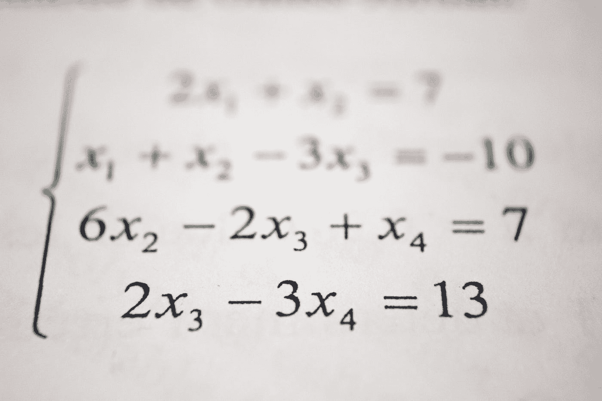

# 机器学习的初学者学习路径

> 原文：[`www.kdnuggets.com/2020/05/beginners-learning-path-machine-learning.html`](https://www.kdnuggets.com/2020/05/beginners-learning-path-machine-learning.html)

评论

*照片由 [Franck V.](https://unsplash.com/@franckinjapan?utm_source=medium&utm_medium=referral) 在 [Unsplash](https://unsplash.com/?utm_source=medium&utm_medium=referral) 提供。*

* * *

## 我们的前三大课程推荐

 1\. [Google 网络安全证书](https://www.kdnuggets.com/google-cybersecurity) - 加入网络安全职业的快速通道。

 2\. [Google 数据分析专业证书](https://www.kdnuggets.com/google-data-analytics) - 提升你的数据分析技能

 3\. [Google IT 支持专业证书](https://www.kdnuggets.com/google-itsupport) - 支持你的组织的 IT

* * *

对于机器学习感到下定决心，但对从哪里开始感到困惑？我曾经面临过同样的困惑，不知道该如何开始？应该学习 Python 还是选择 R？数学对我来说总是令人害怕的部分，我总是担心从哪里学习数学？我也担心如何为机器学习打下坚实的基础。无论如何，你应该为自己感到庆幸，至少你已经下定了决心。

在这篇文章中，我将告诉你在开始实际机器学习之前应该采取的一些基本步骤和课程。

### 机器学习的第一步（基础编程）

第一步是你应该学习编程，最可能是 Python。如果你从未写过一行代码，那么我推荐你学习哈佛大学的 CS50，这是一门针对编程初学者的最佳课程，它会从零开始教你所有的 C 语言，以及很多 Python 和 JavaScript 的基础知识，还包括 SQL 和 JSON 的基础。这门非常激动人心的课程在 edx.org 上免费，你可以在[这里](https://www.edx.org/course/cs50s-introduction-computer-science-harvardx-cs50x)找到它。关于 CS50 的文章可以在[这里](https://blog.usejournal.com/a-novices-guide-to-learning-to-code-with-cs50-d55a050fc57c)阅读。

如果你想直接从 Python 开始，那么我建议你参加 MIT 的《Python 计算机科学导论》，它在 edX 上提供[免费](https://www.edx.org/course/6-00-1x-introduction-to-computer-science-and-programming-using-python-3)课程。请注意，这门课程的先决条件是高中代数，因为你需要解决许多现实世界的数学问题。

如果你觉得自己的计算逻辑不好，且编程中的问题解决能力不强，我推荐微软的这门课程，它与计算思维相关，且在 edx 上完全是[免费](https://www.edx.org/course/logic-and-computational-thinking-4)。这门课程非常棒，教授了很多计算逻辑和批判性思维。

如果你对编程基础很熟练但对面向对象编程没有了解，我建议你学习面向对象编程。虽然它在机器学习（基础级别）中使用不多，但确实很有帮助。我会推荐这门课程，它讲授了 OOP 和 Python 中的算法基础。你可以在 edx.org 上找到这门[免费](https://www.edx.org/course/computing-in-python-iv-objects-algorithms-2)的课程。

下一步是熟悉数据结构和算法。一个好的程序员必须了解一些基本算法，比如链表、二叉树等。微软的这门课程将教你这些：

+   算法分析

+   算法的排序和搜索

+   数据结构：链表、栈、队列

这门课程可以在 edx.org 上[免费](https://www.edx.org/course/algorithms-and-data-structures-4)获得。

如果你想深入了解数据结构和算法，UC San Diego 的专业化是一个杰作。它包含 6 门课程，将你从零基础带到数据结构和算法的高手级别。你可以点击每门课程并免费审阅其材料，但如果你想获得证书，价格为 50$/月，取决于你完成的速度。可以在 Coursera.org 上找到这个专业化或点击[这里](https://www.coursera.org/specializations/data-structures-algorithms)。

### 机器学习的第 2 步

是的，你猜对了，大多数初学者最危险的部分，数学。

*照片由 [Antoine Dautry](https://unsplash.com/@antoine1003?utm_source=medium&utm_medium=referral) 提供，发布于 [Unsplash](https://unsplash.com/?utm_source=medium&utm_medium=referral)。*

但不用担心，它并不像我们想象的那么困难。如果你认为自己在高中数学（向量、矩阵、微积分、概率和统计）方面有良好的基础，你可以简单地参加一个复习课程。如果你觉得自己不够好，那么学习数学的最佳地方是[KHAN ACADEMY](https://www.khanacademy.org/)。Khan Academy 的内容非常丰富且有帮助，一切都可以免费获得。你可以在这里找到所有线性代数、概率和统计以及多变量微积分的课程。

另一个不错的课程是来自 Imperial College London 的 Coursera 机器学习数学专业化。这是一门很棒的课程，讲解基础并复习概念，但不会深入探讨。练习和测验非常具有挑战性，共有 3 门课程。

+   [机器学习数学：线性代数](https://www.coursera.org/learn/linear-algebra-machine-learning/)

+   [机器学习数学：多变量微积分](https://www.coursera.org/learn/multivariate-calculus-machine-learning)

+   [机器学习数学：主成分分析（PCA）](https://www.coursera.org/learn/pca-machine-learning)

麻省理工学院有一门优秀的统计学课程，该课程讲授

+   使用矩量法和最大似然法构造估计量，并决定如何在它们之间进行选择

+   使用置信区间和假设检验来量化不确定性

+   使用拟合优度测试在不同模型之间进行选择

+   使用线性、非线性和广义线性模型进行预测

+   使用主成分分析（PCA）进行降维

在 edx.org 上[免费](https://www.edx.org/course/fundamentals-of-statistics-2)提供。

如果你想在编程的同时学习数学，微软有一门很好的课程，“机器学习的基础数学：Python 版”。这是一门互动课程，使用 Python 的著名库 Numpy、pandas 和 matplotlib 进行图形化数学教学，这些库是该课程的先决条件。可以在 edx.org 上[免费](https://www.edx.org/course/essential-math-for-machine-learning-python-edition-3)找到这门课程。

Udacity 提供了 3 门很棒的免费统计学课程。

+   [统计学入门](https://www.udacity.com/course/intro-to-statistics--st101)

+   [统计学](https://www.udacity.com/course/statistics--st095)

+   [推论统计入门](https://www.udacity.com/course/intro-to-inferential-statistics--ud201)

你还可以在学习实际机器学习的同时学习数学，遇到不懂的内容，可以在可汗学院或 YouTube 上搜索，有许多相关的优秀视频。

### 机器学习的第三步

既然你已经熟悉了线性代数、多变量微积分和统计学，现在你需要学习 Python 著名的数据可视化库，包括 Numpy、Pandas、Matplotlib 和 Scipy，它们帮助你分析和操作各种数据，并以图形方式展示。虽然还有很多其他的数据可视化库，但这些是最重要的。将你的线性代数和微积分概念以图形方式实现并可视化。

在这方面的杰作之一是密歇根大学的“Python 统计学专业化”课程，详细讲授数据可视化及其操作。当然，可以在 coursera.org 上[免费](https://www.coursera.org/specializations/statistics-with-python)（点击每门课程进行免费旁听）。

另一门由密歇根大学提供的适合数据分析初学者的课程是“Introduction to Data Science in Python”，它以非常好的方式从 numpy 的基础知识开始教授 pandas。在 coursera.org 上[免费](https://www.coursera.org/learn/python-data-analysis?specialization=data-science-python)提供。该课程的下一部分是颠覆性的。名为“Applied Plotting, Charting, and Data Representation in Python”，它教授所有图形可视化及其技巧和方法。

另一个好的课程是哈佛大学的“Python for Research”，该课程教授这些库以及一些著名的案例研究，其最终项目非常令人兴奋，并且学到很多新东西。在 edx.org 上[免费](https://www.edx.org/course/using-python-for-research-2)提供。

另一个非常全面的课程是由加州大学圣地亚哥分校提供的“Python for Data Science”，该课程教授

+   Python

+   Jupyter notebooks

+   pandas

+   NumPy

+   Matplotlib

+   git

+   sci kit-learn

+   NLTK

虽然这门课程也会教你机器学习的基础知识，但更重要的是教授数据科学库。在 edx.org 上[免费](https://www.edx.org/course/python-for-data-science-3)提供（不要忘记阅读其前提条件）。

### 第四步 实用机器学习

*照片由[Franck V.](https://unsplash.com/@franckinjapan?utm_source=medium&utm_medium=referral)提供，来自[Unsplash](https://unsplash.com/?utm_source=medium&utm_medium=referral)。*

到目前为止，你已经学习了线性代数、多变量微积分、概率统计和 Python 及其数据可视化库，因此你现在准备进入最激动人心的部分——机器学习。第一门课程可能意义重大。如果它不好，你可能会因为不喜欢这门课程而改变领域。因此，这里所有的课程都将是高质量的，在你开始第一门机器学习课程之前做些研究。

这门入门课程不会教你机器学习，而是会给你一个关于机器学习的概念，机器学习术语的含义，人工智能策略及其伦理。这门课程将提供对机器学习是什么以及如何运作的概述，以及其工作流程和如何在公司中构建人工智能。它为你提供了一个很好的人工智能介绍和概述。课程由著名的机器学习讲师[Andrew Ng](https://www.coursera.org/instructor/andrewng)教授，在 coursera.org 上[免费](https://www.coursera.org/learn/ai-for-everyone)提供。

不管你是谷歌搜索还是查看任何博客，大家推荐的第一门课程都是斯坦福大学的机器学习课程，由 [Andrew Ng](https://www.coursera.org/instructor/andrewng) 主讲，这真是一门美妙的课程。已有超过 250 万名学生注册了这门课程，超过 20 万名学生给出了评分（4.9*）。它从最基本的概念讲到高级概念，是一门非常全面的初学者课程。该课程总长度超过 56 小时。想要阅读这门课程的评价吗？[这里](https://medium.com/@irshaduetian/review-of-machine-learning-course-by-andrew-ng-and-what-to-do-next-1184d45ad16a) 是你可以去的地方。[另一个](https://medium.com/@ionejunhong/review-of-andrew-ngs-machine-learning-and-deep-learning-specialization-courses-on-coursera-4f9dc92437e4) 评价在这里。[这里](https://www.quora.com/What-is-your-review-of-Coursera-Machine-Learning) 是 Quora 上关于这门课程的另一个评价。以下是课程内容的列表。

+   线性回归

+   多项式回归

+   逻辑回归

+   多类别分类

+   神经网络

+   支持向量机（SVM）

+   K-means 聚类

+   主成分分析（PCA）

+   异常检测

+   推荐系统

唯一的问题（根据一些人的说法）是它是用 octave/Matlab 教授的，但对我来说这不是什么大问题，因为它将澄清所有机器学习的基础和深层概念，实现这些概念在任何其他语言中都不会有任何问题，而且 Matlab 也是一项额外的技能。此课程在斯坦福大学的官方网站上免费提供（[这里](https://see.stanford.edu/Course/CS229/47)）和 coursera.org ([这里](https://www.coursera.org/learn/machine-learning?))。

这门课程是每个人都必须上的，因为它好得无法用言语表达。

这门课程之后，你需要将你所学的所有内容在 Python 中实现，并在学习的基础上进一步深入。因此，由 [deeplearning.ai](http://deeplearning.ai/) 提供的由 Andrew Ng、[Kian Katanfrosh](https://www.coursera.org/instructor/~24382163) 和 [Younes Bensouda](https://www.coursera.org/instructor/younes) 主讲的 Coursera 上的进阶专门化课程也是必修的。这个专门化课程包括 5 门课程，分别是

+   神经网络和深度学习

+   改进深度神经网络：超参数调整、正则化和优化

+   结构化机器学习项目

+   卷积神经网络

+   序列模型

你将获得的主要技能包括

+   TensorFlow

+   卷积神经网络

+   人工神经网络

+   深度学习

现在你对 TensorFlow 和机器学习有了很好的掌握。你可能不喜欢 TensorFlow，或者你只是想测试 TensorFlow 的著名对手 PyTorch（由 Facebook 提供），那么为什么不开始这门由 Udacity 提供的 Facebook 与 Amazon Web Services 合作的免费深度学习课程呢？这也是 Udacity 著名的深度学习 [Nano Degree](https://www.udacity.com/course/deep-learning-nanodegree--nd101)，价值 1400 美元。

当然，这只是一个开始，还有很多东西需要学习和发现，但如果你做这些事情，希望你能对自己的现状和下一步要做的事有个了解。

### 一些建议和推荐

这里有一些推荐。

+   现在就开始收听 OC Devel 的“机器学习指南”播客吧。这将给你提供一个关于机器学习的全面概述，以及一名安卓和网络应用开发者转向机器学习道路的经历。可在[Apple Podcasts](https://podcasts.apple.com/us/podcast/machine-learning-guide/id1204521130)/iTunes、Google Podcasts 及其[官网](http://ocdevel.com/mlg)收听。

+   获取《动手学机器学习：Scikit-Learn 和 TensorFlow 实践》（或其 2019 年 10 月发布的新版本，名为《动手学机器学习：Scikit-Learn、Keras 和 TensorFlow 实践》）。本书作者是[Aurélien Géron](https://www.amazon.com/Aur%C3%A9lien-G%C3%A9ron/e/B004MOO740/ref=dp_byline_cont_book_1)。本书第一版在[人工智能（图书）](https://www.amazon.com/gp/bestsellers/books/491300/ref=pd_zg_hrsr_books)、[自然语言处理（图书）](https://www.amazon.com/gp/bestsellers/books/271581011/ref=pd_zg_hrsr_books)和[计算机神经网络](https://www.amazon.com/gp/bestsellers/books/3896/ref=pd_zg_hrsr_books)类别中均排名第一。这本书内容非常全面，值得推荐。

+   不要忘了阅读[这篇](https://towardsdatascience.com/5-steps-and-10-steps-to-learn-machine-learning-c4b61f78c712)。其中有很多有用的信息。

+   在[Kaggle](https://www.kaggle.com/)上多加练习（你一旦开始机器学习，就会了解它）。

+   保持专注，相信自己能够做到。你只需要保持一致性。

祝好运，祝你在学习如何让*机器更智能*时有愉快的时光。

[原文](https://towardsdatascience.com/beginners-learning-path-for-machine-learning-5a7fb90f751a)。已获得授权转载。

**相关：**

+   [学习人工智能的路径](https://www.kdnuggets.com/2017/05/path-learning-artificial-intelligence.html)

+   [如何自学数据科学：实用指南](https://www.kdnuggets.com/2020/02/learn-data-science-guide.html)

+   [基于高中知识的机器学习与人工智能简介](https://www.kdnuggets.com/2020/02/intro-machine-learning-ai.html)

### 相关话题

+   [成为优秀数据科学家的 5 项关键技能](https://www.kdnuggets.com/2021/12/5-key-skills-needed-become-great-data-scientist.html)

+   [每个初学数据科学的人都应该掌握的 6 种预测模型](https://www.kdnuggets.com/2021/12/6-predictive-models-every-beginner-data-scientist-master.html)

+   [2021 年最佳 ETL 工具](https://www.kdnuggets.com/2021/12/mozart-best-etl-tools-2021.html)

+   [停止学习数据科学以找到目标，找到目标以……](https://www.kdnuggets.com/2021/12/stop-learning-data-science-find-purpose.html)

+   [学习数据科学统计的最佳资源](https://www.kdnuggets.com/2021/12/springboard-top-resources-learn-data-science-statistics.html)

+   [成功数据科学家的 5 个特征](https://www.kdnuggets.com/2021/12/5-characteristics-successful-data-scientist.html)
