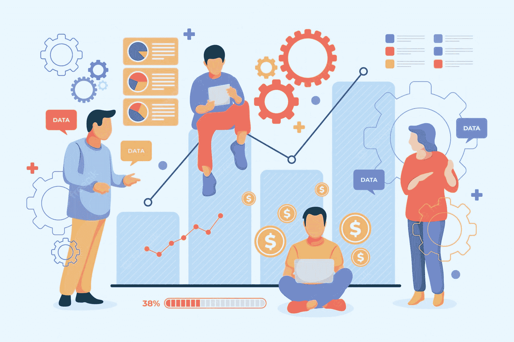

# 成为数据优先企业的好处

> 原文：[`www.kdnuggets.com/2022/07/benefits-becoming-datafirst-enterprise.html`](https://www.kdnuggets.com/2022/07/benefits-becoming-datafirst-enterprise.html)

# 介绍

* * *

## 我们的三大课程推荐

 1\. [Google 网络安全证书](https://www.kdnuggets.com/google-cybersecurity) - 快速进入网络安全职业。

 2\. [Google 数据分析专业证书](https://www.kdnuggets.com/google-data-analytics) - 提升你的数据分析技能

 3\. [Google IT 支持专业证书](https://www.kdnuggets.com/google-itsupport) - 支持你的组织在 IT 领域

* * *

数据是新的石油，但如今并不是区分竞争力的因素。许多组织拥有大量的数据，需要了解如何组织、访问和管理这些数据。因此，速度，即访问数据的敏捷性和处理优质数据，已成为使组织领先于竞争对手的关键因素。

[商业统计向量由 freepik 创建](https://www.freepik.com/free-vector/people-analyzing-growth-charts_12643938.htm?query=data)

我们将讨论以数据驱动洞察为中心的工具的好处。进一步地，我们将学习这些工具如何在与商业智能（BI）和人工智能（AI）解决方案结合后，得出更有意义的洞察。

但在深入讨论我们的主要议题之前，让我们首先了解什么是商业智能，以及传统智能和现代智能之间的区别。此外，本文还简要介绍了 BI 与 AI 的不同之处，然后详细阐述了成为数据优先组织的各种好处。

# 什么是商业智能？

这是通过管理和分析原始数据来获得的智能，并能够生成可操作的洞察，帮助企业做出关键决策。简单来说，它是一系列数据分析工具，帮助领导者做出明智的商业决策。

那么，哪些商业决策是由数据驱动的呢？如果你的组织采纳了数据文化，那么几乎所有的决策都是由数据驱动的。数据驱动型组织不依赖于直觉或多年经验。在快速数字化转型的过程中，了解客户的变化动态，通过直接学习从数据中得出的偏好变得至关重要。

# 传统与现代智能

现代智能解决方案的采用正在增加。这为商业用户提供了一种更无缝的方式来可视化数据并回答他们的问题。

传统的 BI 解决方案更倾向于自上而下，即静态报告回答业务的某些问题。如果出现后续问题，则需要重复这一过程，并经过多个令人不满的迭代步骤，从分析师那里获取回应后再反馈给业务领导者。这种缓慢的迭代报告周期阻碍并削弱了业务做出及时决策的能力。正如我们在本文开头强调的速度重要性，这些排队的后续查询请求导致数据陈旧，并给企业带来竞争劣势。

因此，数据民主化是实现快速访问数据、新数据发现与探索以及有效信息共享的首选解决方案。现代智能使企业能够使用分析工具应对不断变化的期望，快速定制仪表盘和生成报告。虽然 IT 团队继续管理和保护数据访问，但业务用户与 IT 团队之间的无缝协作将推动关键业务决策的速度，实现双赢。

# BI 与 AI 的区别

BI（商业智能）由一系列流程、工具和技术组成，这些流程、工具和技术将原始数据转化为有意义的信息，并支持有效的决策制定。

目前，许多组织拥有数据分析和数据科学团队来推动与数据相关的项目，因此理解 BI 和 AI 解决方案的好处非常重要。

广义上，数据分析分为 4 类：

+   描述性：它专注于回答有关发生了什么的具体问题。

+   诊断性：它回答“为什么”部分，即为什么会发生特定事件？

+   预测性：随着企业致力于从历史数据中学习，预测分析帮助他们回答未来可能发生的事情。

+   处方性：根据对可能未来事件的预测，处方分析为组织提供最佳行动方案或对该事件的回应。

尽管 BI 主要处理结构化数据并生成报告和分析，但 AI 解决方案还可以将非结构化数据作为输入，并将其转化为机器可理解的数据格式。

BI 大多是回顾性的，即帮助回答有关已经发生的事情和原因的高层问题。AI 则超越过去，具有前瞻性，即回答未来可能发生的事情以及企业下一步应该怎么做。

# 数据的好处持续增加

不言而喻，数据对组织的成功至关重要，并提供了多种好处。让我们了解几个使用案例，看看高质量的数据如何为您的业务指明正确的方向：

+   数据不仅限于分析，还包括了解哪些数据资源将带来最大价值。当领导者需要识别具有最大投资回报率或高影响力和价值的项目时，数据驱动的洞察帮助他们优先考虑项目，从而有效利用时间和资源。

+   数据还提供了对组织中不同部门和地区的全面视图。洞察可以在汇总级别生成，也可以缩小到特定的兴趣部门。它帮助企业识别自己的优势和劣势，并最终据此设计其路线图。

+   高质量的数据使员工能够利用闲暇时间从潜在的数据模式中发现创新。这种创新最终开启了推动业务价值的新途径。

+   数据帮助组织回答如何吸引和引导新客户、为什么客户应该选择他们的产品，以及如何进一步改进以保留客户基础等问题。值得注意的是，成功的商业关键在于建立一个快乐的客户基础，即回头客。

+   本质上，组织只有在将数据作为文化的一部分来推广时才能获得数据的好处，即每位员工（包括高层管理人员和开发人员）都参与数据驱动决策。高质量的数据带来高信心的决策和有效的业务成果。总之，智能使用数据为业务成功奠定了基础。

# 开发数据驱动的洞察

许多组织正在致力于开发一种洞察工具，[《福布斯》](https://www.majesteye.com/why-is-data-important-for-your-business/#:~:text=In%20fact%2C%20according%20to%20Forbes%2C%20companies%20that%20use%20the%20insights%20from%20big%20data%20experience%20an%20average%20increase%20in%20revenue%20of%20around%2044%25.)也引用了它的好处。

*“根据* [*福布斯*](https://www.forbes.com/sites/louiscolumbus/2018/07/08/how-to-improve-customer-experiences-with-real-time-analytics/?sh=3521fc426e82)*，利用大数据洞察的公司平均收入增长约为 44%。*“

让我们了解投资建立这种工具的其他有机理由：

+   它帮助企业更快、更及时地了解客户需求。

+   它通过识别如何吸引和引导新客户，同时建立一个快乐的客户基础，来协助业务增长模型。

+   该工具通过关注特定客户群体，帮助建立业务价值主张，以了解他们对哪些服务和产品最感兴趣。

+   它揭示了客户的购买模式、他们对特定产品的实用性认知，并可能为业务带来显著的投资回报率。

+   总结来说，这样的工具使企业通过更深入地了解客户生命周期，从而设计合适的营销活动，利用这些洞察更好地满足客户需求。

在这篇文章中，我们了解了传统智能与现代智能的区别，以及商业智能（BI）与人工智能（AI）的不同。接着，我们探讨了组织如何从优质数据中获得好处的各个维度。最后，我们还讨论了构建数据驱动洞察工具的必要性，以及它如何作为业务增长的推动者。

## 参考资料

+   [`www.majesteye.com/why-is-data-important-for-your-business/`](https://www.majesteye.com/why-is-data-important-for-your-business/)

+   [`careerfoundry.com/en/blog/data-analytics/business-intelligence-vs-data-analytics/`](https://careerfoundry.com/en/blog/data-analytics/business-intelligence-vs-data-analytics/)

+   [`www.tableau.com/learn/articles/business-intelligence`](https://www.tableau.com/learn/articles/business-intelligence)

+   [`www.tableau.com/learn/articles/business-intelligence/enterprise-business-intelligence/benefits`](https://www.tableau.com/learn/articles/business-intelligence/enterprise-business-intelligence/benefits)

**[Vidhi Chugh](https://vidhi-chugh.medium.com/)** 是一位获奖的人工智能/机器学习创新领袖和人工智能伦理学家。她在数据科学、产品和研究的交叉点工作，以提供商业价值和洞察。她提倡以数据为中心的科学，是数据治理领域的领先专家，致力于构建可信赖的人工智能解决方案。

### 更多相关内容

+   [A/B 测试的 3 大好处（+ 如何入门）](https://www.kdnuggets.com/2022/08/sphere-3-benefits-ab-testing-get-started.html)

+   [自然语言人工智能对内容创作者的好处](https://www.kdnuggets.com/2022/08/benefits-natural-language-ai-content-creators.html)

+   [为何 TinyML 案例越来越受欢迎？](https://www.kdnuggets.com/2022/10/tinyml-cases-becoming-popular.html)

+   [成为科技行业专家的终极路线图](https://www.kdnuggets.com/the-ultimate-roadmap-to-becoming-specialised-in-the-tech-industry)

+   [企业中的机器学习：应用案例与挑战](https://www.kdnuggets.com/2022/08/dss-machine-learning-enterprise-cases-challenges.html)
