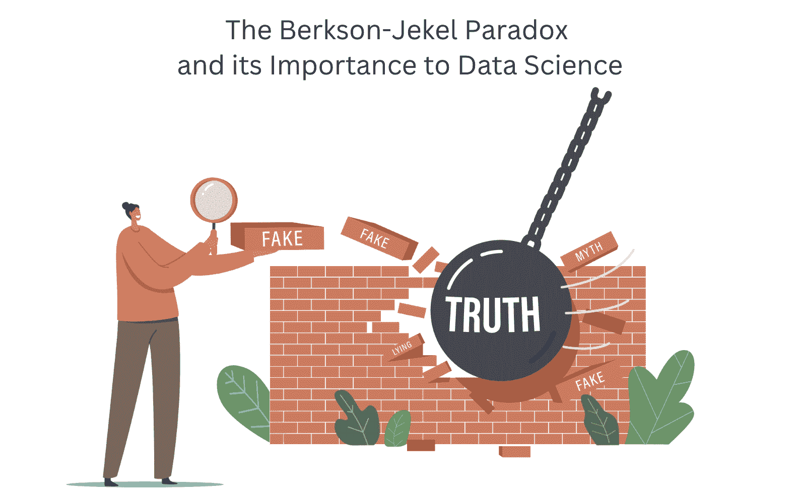

# 伯克森-杰克尔悖论及其对数据科学的重要性

> 原文：[`www.kdnuggets.com/2023/03/berksonjekel-paradox-importance-data-science.html`](https://www.kdnuggets.com/2023/03/berksonjekel-paradox-importance-data-science.html)

作者提供的图片

如果你是数据科学家或有意成为数据科学家，你将知道统计在这个领域中的重要性。统计帮助数据科学家收集、分析和解释数据，通过识别模式和趋势，进而做出未来的预测。

* * *

## 我们的前三大课程推荐

 1\. [谷歌网络安全证书](https://www.kdnuggets.com/google-cybersecurity) - 快速开启网络安全职业生涯。

 2\. [谷歌数据分析专业证书](https://www.kdnuggets.com/google-data-analytics) - 提升你的数据分析技能

 3\. [谷歌 IT 支持专业证书](https://www.kdnuggets.com/google-itsupport) - 支持您的组织 IT 工作

* * *

# 什么是统计悖论？

统计悖论是指统计结果与预期相矛盾的情况。由于很难在没有进一步方法的情况下理解数据，因此确切原因可能很难确定。然而，这些悖论对于数据科学家来说是重要的，因为它们提供了可能导致误导性结果的线索。

以下是与数据科学相关的统计悖论列表：

+   辛普森悖论

+   伯克森悖论

+   假阳性悖论

+   精确度悖论

+   可学习性-哥德尔悖论

在这篇文章中，我们将重点关注伯克森-杰克尔悖论及其对数据科学的相关性。

# 伯克森-杰克尔悖论是什么？

伯克森-杰克尔悖论是指当两个变量在数据中相关时，当数据被分组或子集化时，相关性不会被识别。通俗来说，这种相关性在数据的不同子组中是不同的。

伯克森-杰克尔悖论以最早描述这一悖论的统计学家约瑟夫·伯克森和约翰·杰克尔的名字命名。伯克森-杰克尔悖论的发现是在这两位统计学家研究吸烟与肺癌之间的关联时进行的。在他们的研究中，他们发现，住院治疗肺炎的患者与肺癌之间存在关联，而这种关联与一般人群相比。然而，他们进一步的研究表明，这种关联是由于吸烟者更频繁地因肺炎住院，而非吸烟者则较少。

## 为什么会发生这种情况？

根据统计学家对伯克森-杰克尔悖论的首次研究，你可能会说需要更多研究来弄清楚相关性的确切原因。然而，也有其他原因解释伯克森-杰克尔悖论的发生。

+   隐藏变量：数据集可能包含影响结果的隐藏变量。因此，当研究两个变量的相关性时，数据科学家和研究人员可能未考虑所有潜在因素。

+   样本偏差：数据样本可能无法代表总体，这可能导致误导性的相关性。

+   相关性与因果性：在数据科学中，重要的是要记住相关性并不意味着因果性。两个变量可能相关，但这并不意味着一个变量导致了另一个变量。

# 为什么伯克森-杰克尔悖论在数据科学中很重要？

统计推理在数据科学中非常重要，主要问题在于处理误导性结果。作为数据科学家，你希望确保生成准确的结果，以用于决策过程和未来预测。做出错误的预测或产生误导性结果是最不希望发生的情况。

## 如何避免伯克森-杰克尔悖论

有几种方法可以用来避免伯克森-杰克尔悖论：

### 使用统计方法控制隐藏变量

+   统计建模：你可以使用统计建模来更好地理解两个或多个变量之间的关系。这样，你可以识别可能影响结果的隐藏变量。

+   随机对照试验：这是一种将参与者随机分配到治疗组或对照组的方法。这可以帮助数据科学家控制可能影响研究结果的隐藏变量。

+   结合结果：你可以将多个研究结果结合起来，以帮助你更好地理解研究。这样，数据科学家对每个研究中的隐藏变量有了更好的理解和控制。

### 数据来源的多样性

如果你在处理由于样本数据不代表总体而导致的误导性结果，可以考虑使用来自不同来源的数据。这将帮助你获得更具代表性的总体样本，更深入地研究变量，并获得更好的理解。

# 总结

误导性的结果可能会阻碍公司发展。因此，在处理数据时，数据专业人员需要了解数据的局限性、不同变量及其之间的关系，以及如何减少误导性结果的发生。

如果你想了解更多关于辛普森悖论的内容，可以阅读这个：辛普森悖论及其在数据科学中的影响

如果你想了解更多关于其他统计悖论的内容，可以阅读这个：5 个数据科学家应该知道的统计悖论

**[尼莎·阿亚](https://www.linkedin.com/in/nisha-arya-ahmed/)** 是一名数据科学家、自由技术撰稿人以及 KDnuggets 的社区经理。她特别关注提供数据科学职业建议或教程及基于理论的知识。她还希望探索人工智能如何/可以促进人类寿命的不同方式。她是一位渴望学习者，寻求拓宽技术知识和写作技能，同时帮助指导他人。

### 更多相关主题

+   [辛普森悖论及其在数据科学中的影响](https://www.kdnuggets.com/2023/03/simpson-paradox-implications-data-science.html)

+   [数据科学中数据清理的重要性](https://www.kdnuggets.com/2023/08/importance-data-cleaning-data-science.html)

+   [数据科学中实验设计的重要性](https://www.kdnuggets.com/2022/08/importance-experiment-design-data-science.html)

+   [数据科学中概率的重要性](https://www.kdnuggets.com/2023/02/importance-probability-data-science.html)

+   [机器学习不像你的大脑 第六部分：重要性…](https://www.kdnuggets.com/2022/08/machine-learning-like-brain-part-6-importance-precise-synapse-weights-ability-set-quickly.html)

+   [庆祝对数据隐私重要性的认知](https://www.kdnuggets.com/2022/01/celebrating-awareness-importance-data-privacy.html)
