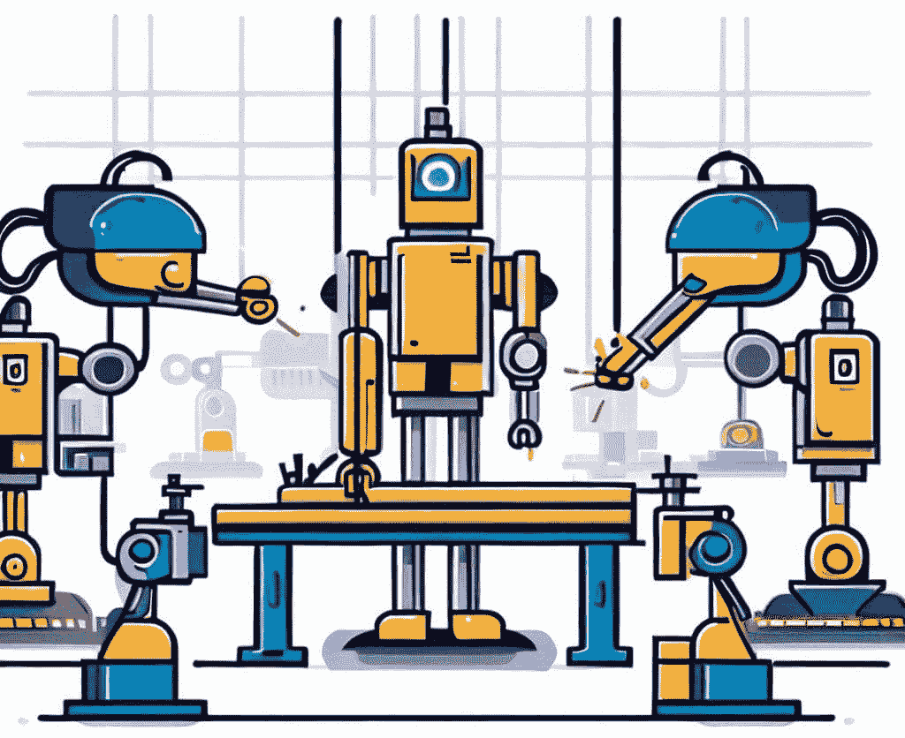

# 2023 年你应该考虑的顶级 AutoML 框架

> 原文：[`www.kdnuggets.com/2023/05/best-automl-frameworks-2023.html`](https://www.kdnuggets.com/2023/05/best-automl-frameworks-2023.html)

图片来源于 Bing 图片创作工具

人工智能（AI）将在未来改变我们的社会。对 AI 专家、数据分析师和数据专家的巨大需求意味着那些希望在竞争激烈的技术环境中取得成功的组织，必须在资源分配上尽可能高效。由于 [AI 专业人士](https://www.kdnuggets.com/2022/08/indemand-artificial-intelligence-skills-learn-2022.html) 缺乏，数据的探索和预测必须尽可能自动化，以便专家能够专注于更重要的任务。

自动机器学习（AutoML）框架正是实现这一目标的工具。通过自动化数据模型的选择、构建和参数化，AutoML 框架可以为数据专家腾出时间，以便他们专注于更复杂的分析方面。本文将讨论 AutoML 框架的基本知识，它们如何帮助开发 AI 项目，以及在 2023 年最值得使用的 AutoML 框架。

# 为什么使用 AutoML 框架？

数据集使分析师能够创建预测模型。尽管机器学习可以处理数据并形成预测模型，但这一过程通常繁琐且耗时。传统的机器学习涉及数据处理、确定目标数据特征、寻找最准确的学习模型、调整必要的超参数，以及使用最佳参数训练学习模型。当这一过程中的某些或全部步骤可以自动化时，结果可以更快获得。

AutoML 和 AI 可以开启新的可能性，但在不当使用的情况下，它们也可能成为危险的武器。自动机器学习和 AI 正日益成为一种威胁。网络攻击、身份盗窃和 [信用卡诈骗](https://www.aura.com/learn/credit-card-scams) 都可能借助 AI 或自动机器学习的帮助进行，因为它们能够快速处理大量数据并寻找匹配。

AutoML 框架通过处理常规序列和消除手动测试模型来消除数据分析师工作的繁琐方面。AutoML 可以自动化数据的收集和组织过程，并帮助测试模型的超参数。以下是一些最好的 AutoML 框架，可以帮助数据专家在项目中取得更大的成就。

# 1\. TransmogrifAI

使用 Scala 语言创建，并基于 SparkML 框架的 TransmogrifAI 自动化了机器学习的五个最重要功能。优化超参数、检查函数、选择模型、推导函数和变形（因此得名）都是该框架可以自动化的功能。这对于[数据清洗](https://www.tableau.com/learn/articles/what-is-data-cleaning)、模型选择和特征工程非常有用。

# 2\. AutoGluon

AutoGluon 是 AWS 提供的一个开源库，主要面向机器学习应用开发人员。这是一个理想的 AutoML 框架，适合那些不是专家的人，因为它非常用户友好，同时提供强大的深度学习方法。可以迅速且高精度地实现预测。它也可以成为那些希望探索给定数据集所能实现的内容的良好起点。

AutoGluon 在自动对象识别、表格预测以及以文本和图像形式组织数据方面表现出色。对于更专业的用户，AutoGluon AutoML 框架通过其开源库提供了对模型参数编程的深入了解。

# 3\. MLJAR

MLJAR 可以通过浏览器访问，并可用作快速创建和测试 AutoML 模型的平台。与 NVIDIA 的 CUDA、Python 和 Tensorflow 兼容，还提供了易于使用的 Hyperfeit 搜索功能。数据集可以轻松下载到网站，机器学习算法可以被尝试和测试以确定最佳算法。通过 MLJAR AutoML 框架，识别和部署最佳预测模型变得更加简单，甚至可以分享你的结果。

这显然是更好的 AutoML 框架之一，但它确实需要付费。用户必须支付订阅费用才能使用所有功能，或者只能使用免费的版本，数据限制为 0.25 GB。

# 4\. DataRobot

也许是列表中最容易识别的名称，DataRobot 是数据分析师使用的流行 AutoML 框架。预测分析可以用于没有编程、软件开发或机器学习知识的业务人员。在一个简单的过程中，组织可以创建实时预测模型，通过自动化机器学习提高准确性。

这个机器学习框架的工作流程可以被调整以满足用户的需求。商业专业人士可以轻松使用它根据输入的数据获得准确的预测，而经验丰富的数据科学家则可以调整参数以完善他们自己的预测模型。

# 5\. Google Cloud AutoML

Google AutoML 使得拥有较少机器学习知识的开发人员能够创建高度准确的自定义模型。它支持大量的算法和机器学习技术。利用神经网络架构，Google AutoML 简化了整个过程，并提供了易于使用的界面。

然而，Google AutoML 的价格不菲，除非你打算仅用于研究目的，否则公司不提供免费或演示版本，在这种情况下，可以使用限制版本。

# 结论

自动化机器学习正在[逐渐流行](https://www.forbes.com/sites/serenitygibbons/2023/02/02/2023-business-predictions-as-ai-and-automation-rise-in-popularity/)，对这一领域专家的需求正在快速增长。有很多重要的任务只能由数据科学家和分析师完成，例如管理模型性能和分析预测模型产生的数据。

自动化这些日常任务可以节省数据分析师的大量时间，使他们能够专注于更关键的职责。这就是为什么 AutoML 框架如此有价值，并且未来仍将继续如此的原因。

**[Nahla Davies](http://nahlawrites.com/)** 是一名软件开发人员和技术作家。在全职从事技术写作之前，她曾担任过诸多有趣的职位，其中包括在一家《Inc. 5000》体验式品牌化组织担任首席程序员，该组织的客户包括三星、时代华纳、Netflix 和索尼。

* * *

## 我们的前三大课程推荐

 1\. [Google 网络安全证书](https://www.kdnuggets.com/google-cybersecurity) - 快速进入网络安全职业轨道。

 2\. [Google 数据分析专业证书](https://www.kdnuggets.com/google-data-analytics) - 提升你的数据分析技能

 3\. [Google IT 支持专业证书](https://www.kdnuggets.com/google-itsupport) - 支持你的组织的 IT 工作

* * *

### 更多相关话题

+   [如果你想成为数据分析师，你应该考虑的 3 门课程](https://www.kdnuggets.com/3-courses-you-should-consider-if-you-want-to-become-a-data-analyst)

+   [你应该考虑数据操作职业吗？](https://www.kdnuggets.com/2023/05/consider-dataops-career.html)

+   [印度值得考虑的顶级公司](https://www.kdnuggets.com/top-companies-in-india-to-consider-for-employment)

+   [2023 年你应该了解的 10 个惊人机器学习可视化](https://www.kdnuggets.com/2022/11/10-amazing-machine-learning-visualizations-know-2023.html)

+   [投资人工智能？这里是需要考虑的事项](https://www.kdnuggets.com/investing-in-ai-here-is-what-to-consider)

+   [每个机器学习工程师应该掌握的 5 种机器学习技能](https://www.kdnuggets.com/2023/03/5-machine-learning-skills-every-machine-learning-engineer-know-2023.html)
