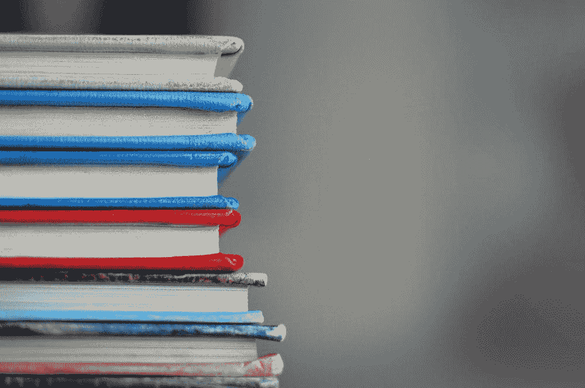
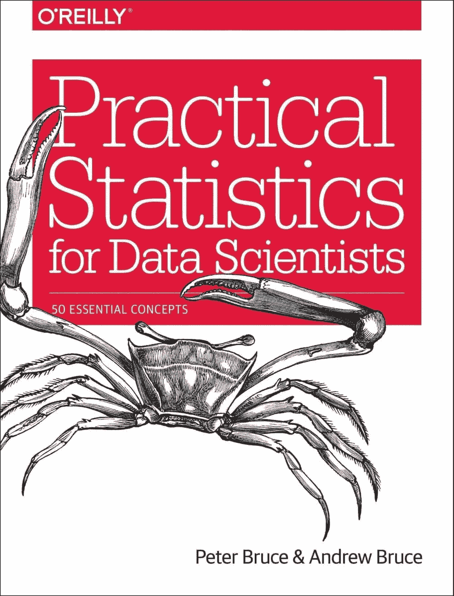
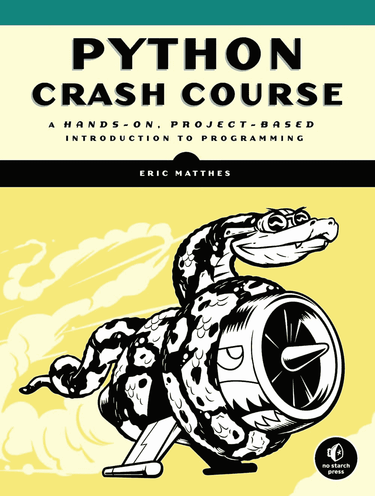
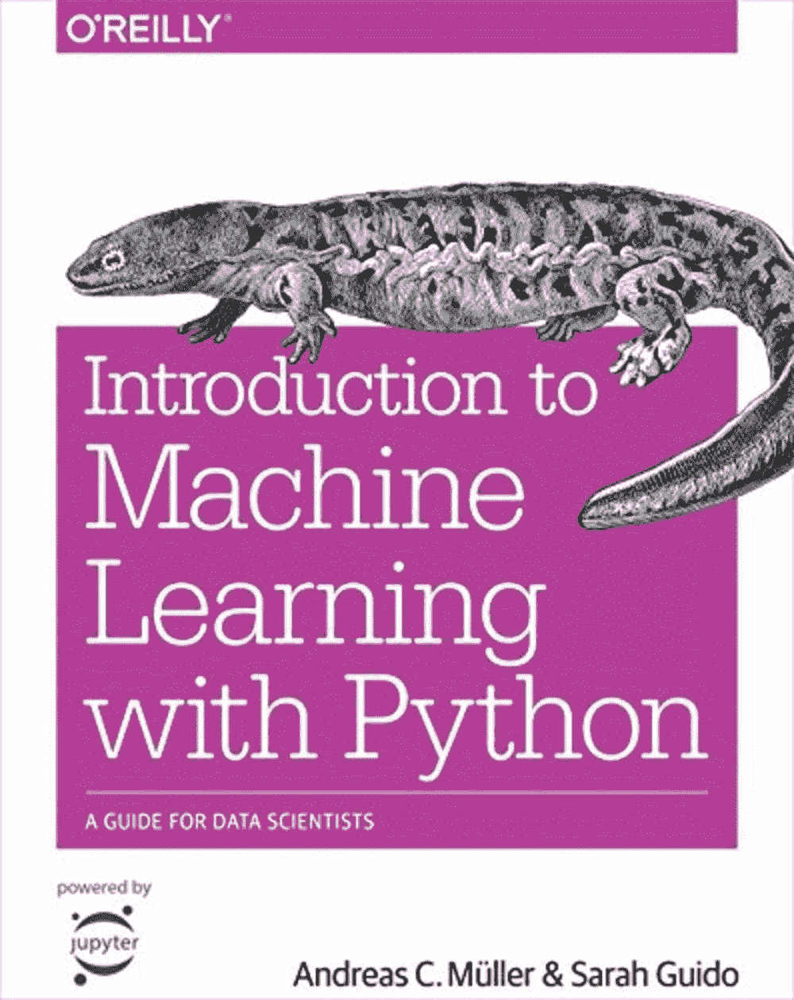
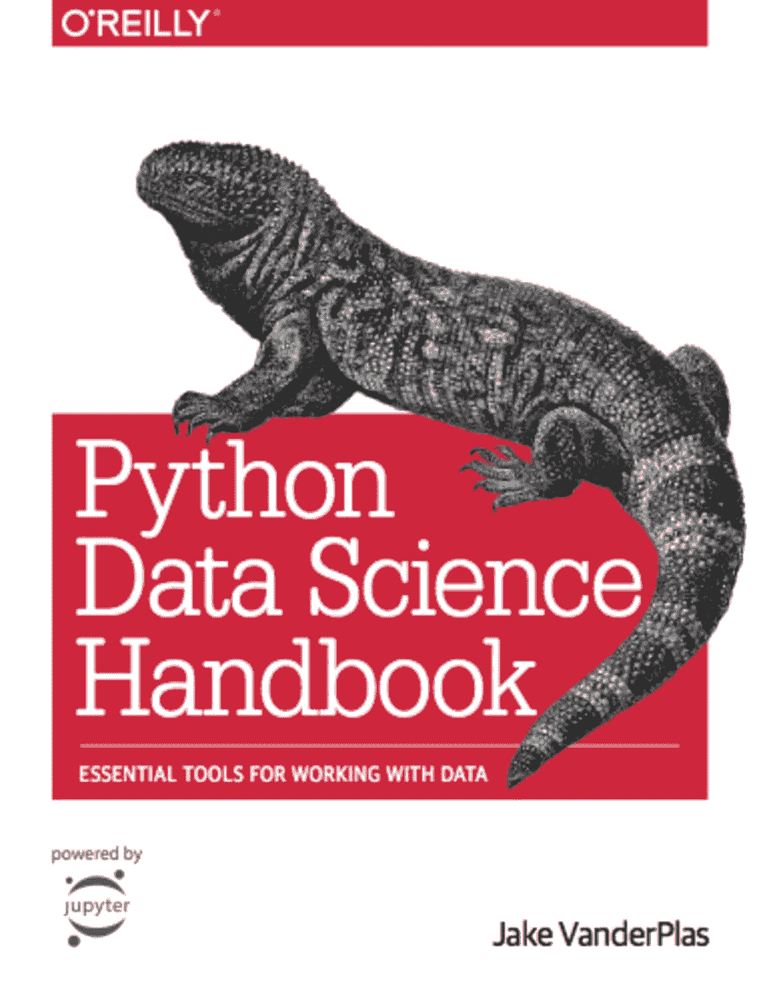
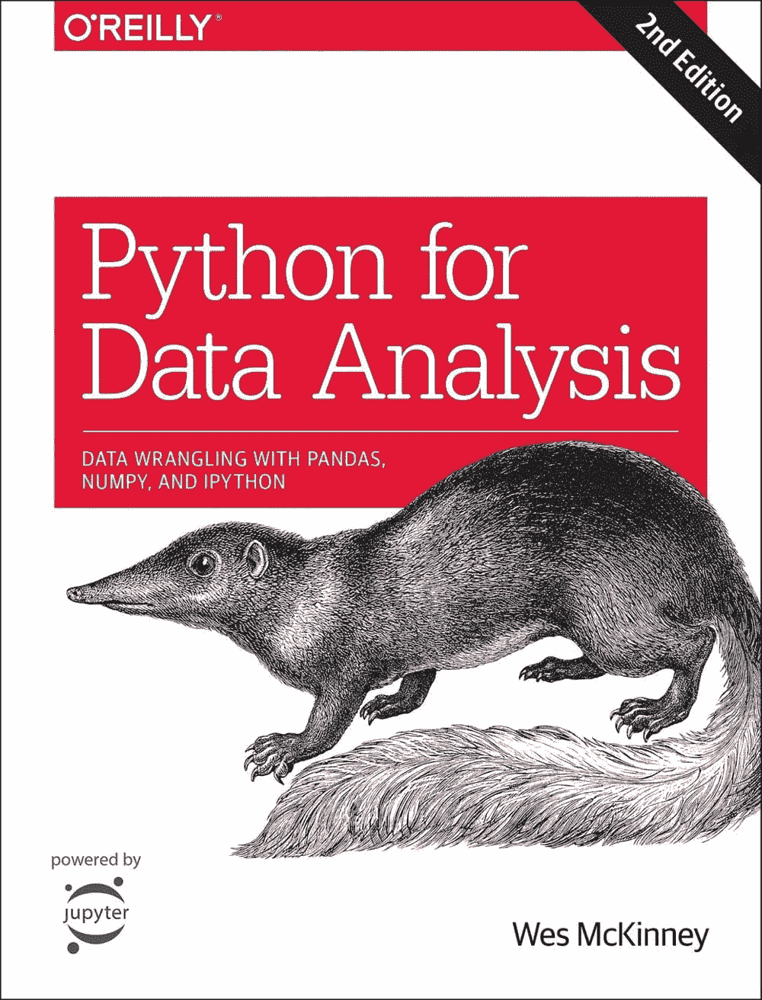

# 适合初学者的数据科学书籍

> 原文：[`www.kdnuggets.com/2022/03/best-data-science-books-beginners.html`](https://www.kdnuggets.com/2022/03/best-data-science-books-beginners.html)

图片由 [Kimberly Farmer](https://unsplash.com/@kimberlyfarmer?utm_source=unsplash&utm_medium=referral&utm_content=creditCopyText) 提供，来源于 [Unsplash](https://unsplash.com/?utm_source=unsplash&utm_medium=referral&utm_content=creditCopyText)

随着播客和 YouTuber 在社交媒体世界的兴起，向人们传达发生了什么、有什么新鲜事等，最好的知识仍然存在于图书馆的书籍中。

* * *

## 我们的前三个课程推荐

 1\. [谷歌网络安全证书](https://www.kdnuggets.com/google-cybersecurity) - 快速进入网络安全职业。

 2\. [谷歌数据分析专业证书](https://www.kdnuggets.com/google-data-analytics) - 提升你的数据分析技能

 3\. [谷歌 IT 支持专业证书](https://www.kdnuggets.com/google-itsupport) - 支持你所在组织的 IT 工作

* * *

在网上学习已成为一种新的学习方式。然而，大多数这些研究曾经都是记录下来的。许多人对进入数据科学领域感兴趣，但选择合适的路径和资源可能会很困难。

有成百上千的训练营、备忘单和 PDF 报告可供选择；但是，你如何知道哪个才是适合你的，而不会感到不知所措呢？

我将介绍一些推荐的适合初学者的数据科学书籍。

## [数据科学实用统计学](https://www.amazon.com/Practical-Statistics-Data-Scientists-Essential/dp/1491952962)

作者：Peter Bruce 和 Andrew Bruce

当你首次考虑进入数据科学领域时，很多人会忽略该领域的基础知识：统计学。统计方法是数据科学的一个关键概念，但只有少数数据科学家对统计学有深入的理解和知识。

网上有许多关于统计学的课程和书籍可供购买，但很少有资源从数据科学的角度涵盖统计学。

如果你希望成为一名成功的数据科学家，你必须经历不同的层次，并以良好的标准理解每一层。这本书可以让你从理解数据科学到掌握数据科学。

在这本书中，你将学习随机抽样及其如何减少偏差并产生更高质量的数据集，以及使用回归来估计结果和检测异常。

## [Python 速成教程](https://www.amazon.com/Python-Crash-Course-2nd-Edition/dp/1593279280/ref=pd_vtp_2/130-3248652-8969061?pd_rd_w=ngl2d&pf_rd_p=016e3697-91be-4dc2-9533-ef9350e7e73d&pf_rd_r=C77BXYH27CRQGEBJY682&pd_rd_r=6eccaa1b-b0b9-48f8-8827-e44fa3404d44&pd_rd_wg=WcnTC&pd_rd_i=1593279280&psc=1)

作者：Eric Matthes

如果你选择了 Python 作为你的编程语言学习，这本《Python 速成教程》非常适合你。这本书是全球最畅销的 Python 编程语言学习指南。

你将学习编程的基础知识，如类和循环，同时学习如何编写干净的代码，书中有练习以指导和测试你的技能。

当你完成书的简介部分并对 Python 有了良好的理解后，你将进入项目实现、数据可视化和简单的 Web 应用程序开发。

很多数据科学项目需要 Python 的基础知识，因此学习这些是至关重要的，它们将帮助你提高数据科学技能，并为你在这一领域的发展奠定基础。

## [Python 机器学习简介：数据科学家的指南](https://www.amazon.com/Introduction-Machine-Learning-Python-Scientists/dp/1449369413)

作者：Andreas C. Müller 和 Sarah Guido

机器学习是数据科学中非常热门的元素，越来越多的人尝试从数据科学家转型为机器学习工程师。

这本书是为 Python 用户准备的，但如果你没有 Python 的基础知识，这本书也能帮助你在学习过程中掌握这门语言。

这本书将涵盖机器学习的基础知识，提供实际示例，帮助你逐步构建一个机器学习模型。适合需要了解 Python 和机器学习基础的初学者。

一旦你理解了概念，建议你继续阅读高级书籍。

## [Python 数据科学手册](https://www.amazon.com/Python-Data-Science-Handbook-Essential/dp/1491912057/)

作者：Jake VanderPlas

当你对编程和数据科学的概念有了更多的信心后，你将准备好探索 Python 库。

这本书深入讲解了 Python 库，如 Pandas、Numpy、Matplotlib、Scikit-learn 等。掌握这些技能后，你将能够提高数据技能，进行更好的分析，并制作数据可视化以展示你的发现。

这是数据科学领域中的一个重要步骤，许多当前的数据科学家日常工作都围绕这些库展开。

## [Python 数据分析](https://www.amazon.com/Python-Data-Analysis-Wrangling-IPython/dp/1491957662/)

作者：**Wes McKinney**

尽管机器学习目前正如火如荼，但数据科学的其他方面也被广泛使用。数据分析就是其中之一。

本书提供了使用 Python 处理、处理、清理和分析数据集的完整指导。你将学习到 pandas、NumPy、IPython 等的最新版本，并能够处理实际案例研究。

学会解决现实世界的数据分析问题是作为数据科学家的一个重要技能，强烈推荐。作为数据科学家，你的大部分时间都用于数据整理，不过如果你对库和工具有很好的了解，可以减少这方面的时间。

**[Nisha Arya](https://www.linkedin.com/in/nisha-arya-ahmed/)** 是一名数据科学家和自由技术写作人。她特别关注提供数据科学职业建议或教程以及围绕数据科学的理论知识。她还希望探索人工智能如何/能如何有利于人类寿命的不同方式。作为一个热衷于学习的者，她寻求拓宽自己的技术知识和写作技能，同时帮助指导他人。

### 了解更多相关内容

+   [KDnuggets 新闻 22:n12，3 月 23 日：最佳数据科学书籍…](https://www.kdnuggets.com/2022/n12.html)

+   [24 本最佳（且免费的）机器学习书籍](https://www.kdnuggets.com/2020/03/24-best-free-books-understand-machine-learning.html)

+   [KDnuggets 新闻，5 月 25 日：每位…的 6 种 Python 机器学习工具](https://www.kdnuggets.com/2022/n21.html)

+   [数据科学书籍完整合集 - 第一部分](https://www.kdnuggets.com/2022/05/complete-collection-data-science-books-part-1.html)

+   [数据科学书籍完整合集 - 第二部分](https://www.kdnuggets.com/2022/05/complete-collection-data-science-books-part-2.html)

+   [KDnuggets 新闻，11 月 2 日：数据科学的现状…](https://www.kdnuggets.com/2022/n43.html)
