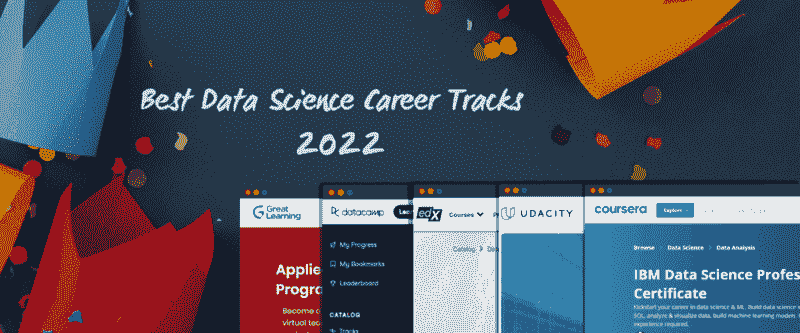
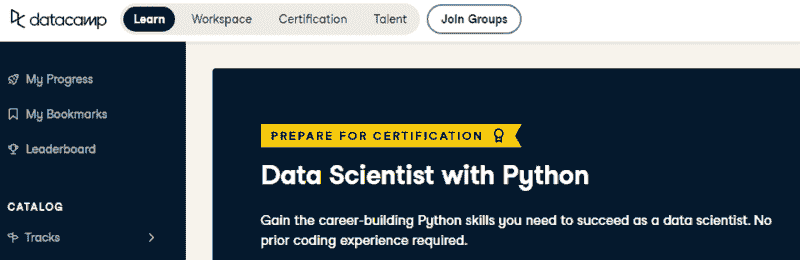
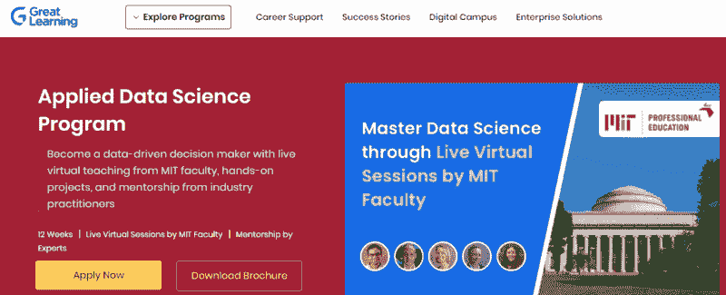
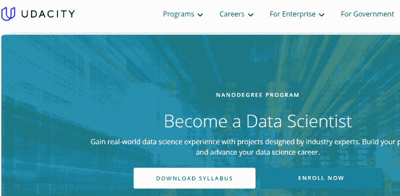
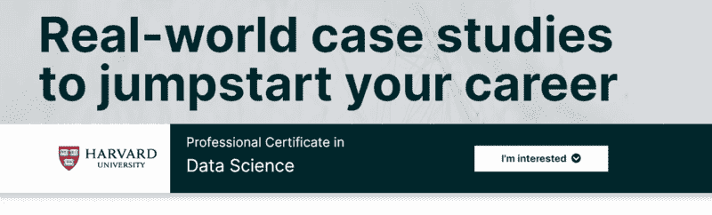

# 2022 年最佳数据科学职业轨迹

> 原文：[`www.kdnuggets.com/2022/04/best-data-science-career-tracks-2022.html`](https://www.kdnuggets.com/2022/04/best-data-science-career-tracks-2022.html)

作者提供的图片

从随机的数据科学课程中学习会导致对职业道路的很多困惑。这也会让你感到沮丧，因为你投入的时间和精力学到的东西没有实际价值。因此，如果你想在一年内了解数据世界的一切并获得认证，那么我建议你报名参加一个数据科学职业轨迹。一个简单的数据科学轨迹包括几个课程，这些课程将为你准备真实的挑战。它还将帮助你建立数据科学作品集项目，并提供职业支持。

* * *

## 我们的前三大课程推荐

 1\. [谷歌网络安全证书](https://www.kdnuggets.com/google-cybersecurity) - 快速进入网络安全职业。

 2\. [谷歌数据分析专业证书](https://www.kdnuggets.com/google-data-analytics) - 提升你的数据分析技能

 3\. [谷歌 IT 支持专业证书](https://www.kdnuggets.com/google-itsupport) - 支持你的组织 IT

* * *

我是数据科学课程的坚定支持者，因为它们在过去帮助了我。我写过几篇关于职业轨迹如何帮助我获得数据科学专业认证的博客：五步成为数据科学专业人士 和 如何获得数据科学家认证。在这篇博客中，我将帮助你选择最具性价比、互动学习平台和认证的数据科学职业轨迹。

# Python 数据科学家轨迹

图片来源于 [DataCamp](https://app.datacamp.com/learn/career-tracks/data-scientist-with-python?version=5)

[Python 数据科学家轨迹](https://app.datacamp.com/learn/career-tracks/data-scientist-with-python?version=5) 是一个准备你参加认证考试的职业轨迹。你将学习如何导入、清理、操作和可视化数据。它还将教你自然语言处理（NLP）和机器学习的基础知识。数据科学职业轨迹在理论、实时编码、评估测试、指导项目和教程方面都得到了完美的平衡。完成数据科学轨迹后，该平台将指导你参加认证考试，并在获得证书后，DataCamp 将帮助你找到下一个梦想数据职位。

月度订阅费用不时会有所变化，因为他们总是有某种促销活动，这非常好。你还可以通过[GitHub Education](https://education.github.com/pack/offers?sort=popularity&tag=Learn)获得 2 个月的免费高级订阅，或者如果你是**非政府组织**的一部分，你可以申请获得免费的年度订阅。内容和互动练习使其对**非技术**专业人士非常有吸引力。数据科学专业证书难以获得，并且逐渐成为行业标准。

# MIT 应用数据科学项目

图片来源于 [Great Learning](https://www.mygreatlearning.com/mit-data-science-program)

[MIT 应用数据科学项目](https://www.mygreatlearning.com/mit-data-science-program) 是最好的职业认证项目之一。它提供由 MIT 教职员工进行的实时虚拟教学、个性化的指导和支持，以及在行业专家指导下的实践培训。你不仅仅是获得了世界顶级大学的认证，还通过与专家合作项目获得了专业经验。数据科学课程包括数据科学基础、数据分析和可视化、机器学习、推荐系统以及为期 3 周的结业项目。

MIT 应用数据科学项目提供**高价值**，如果你想快速提升你的职业生涯，我建议你报名参加该项目，并在**12 周**内完成它。 [Great Learning](https://www.mygreatlearning.com/) 平台提供专门的支持和职业咨询。如果你对支付该项目费用有疑虑，可以查看 Great Learning 上的庞大[数据科学课程](https://www.mygreatlearning.com/data-science/courses)库。这个库包含短期课程、证书项目、职业路径和免费课程。

# IBM 数据科学专业证书

图片来源于 [Coursera](https://www.coursera.org/professional-certificates/ibm-data-science)

通过参加**12 个月**的[IBM 数据科学专业证书](https://www.coursera.org/professional-certificates/ibm-data-science)项目，启动你的数据科学和机器学习职业生涯。该项目包含**10 门课程**，涵盖数据科学、Python 和 SQL 的基础知识。课程没有先决条件，因此即使是非技术专业人士也可以开始数据科学职业生涯。

该项目将教你有关数据科学工具、方法论、人工智能与开发、数据科学项目的处理、数据库与 SQL、数据分析与可视化以及机器学习的知识。完成课程后，你将获得**IBM 证书**和职场技能。你可以获得经济援助，或者如果你是学生，可以免费获得，前提是你的大学已经注册。我是[Coursera](https://www.coursera.org/)学习平台的忠实粉丝，它彻底改变了我的远程学习体验。我相信你一旦开始探索这个平台的隐藏功能，也会爱上它。

# 成为数据科学家

图片来源于[Udacity](https://www.udacity.com/course/data-scientist-nanodegree--nd025)

通过参加[Udacity 数据科学家纳米学位](https://www.udacity.com/course/data-scientist-nanodegree--nd025)项目，成为一名数据科学家。[Udacity](https://www.udacity.com/)的课程让我学到了很多关于**生产级**Python 编程的知识，并帮助我理解了机器学习的关键概念。在处理最新技术时，你会感到投入和激励。

纳米学位项目为期 4 个月，涵盖了所有重要的主题，如编程（Python、SQL、终端）、概率与统计、数据处理、使用 matplotlib 的数据可视化和机器学习。除了这些基本主题，你还将学习撰写数据科学博客文章，为灾难响应构建**数据管道**，以及参与各种数据科学和机器学习项目。

该课程价格昂贵，但我向你保证，这些花费是值得的。你还可以获得个人折扣或经济援助，这将使其对来自发展中国家的学生更为实惠。

# HarvardX 数据科学专业证书

图片来源于[edX](https://www.edx.org/professional-certificate/harvardx-data-science)

[HarvardX 数据科学专业证书](https://www.edx.org/professional-certificate/harvardx-data-science)是一个**基于 R 语言**的项目，它将向你介绍 RStudio、tidyverse、GitHub 和机器学习算法。为期一年的证书项目涵盖了 R 编程基础、数据可视化、统计与概率、建模、开发工具、数据处理和机器学习。你将获得哈佛大学的认证，并拥有一种高需求的编程语言的经验。该项目包括 9 门课程，每年运行两次，分别在**1 月**和**7 月**。

# 结论

在最近的博客中，Natassha Selvaraj 解释了如何避免教程陷阱。关键在于为你的未来做出合理选择，而不是浪费时间在随机教程上。她解释了每个教程都在教你相同的内容，而你却没有进展。如果你想避免教程陷阱并走上通向成功的正道，那么从我提到的任何职业路径开始吧。职业路径会按完美的顺序教会你所有内容，并为你提供参与热门作品项目的机会。

**[Abid Ali Awan](https://www.polywork.com/kingabzpro)**（[@1abidaliawan](https://twitter.com/1abidaliawan)）是一位认证的数据科学专家，热衷于构建机器学习模型。目前，他专注于内容创作和撰写有关机器学习和数据科学技术的技术博客。Abid 拥有技术管理硕士学位和电信工程学士学位。他的愿景是利用图神经网络为有心理问题的学生开发一个 AI 产品。

### 更多相关话题

+   [2022 年 8 门最佳数据科学课程，助力职业大跃进](https://www.kdnuggets.com/2022/02/scaler-8-best-data-science-courses-enroll-2022-steep-career-advancement.html)

+   [2022 年数据科学最佳学习资源](https://www.kdnuggets.com/2022/01/best-learning-resources-data-science-2022.html)

+   [通过第三最佳在线硕士课程推进你的职业生涯…](https://www.kdnuggets.com/2023/07/bay-path-advance-career-3rd-best-online-masters-data-science-program.html)

+   [6 门最佳免费在线课程：学习 Python 并提升你的职业生涯](https://www.kdnuggets.com/2022/11/corise-6-best-free-online-courses-python-boost-career.html)

+   [KDnuggets 新闻 2022 年 3 月 16 日：学习数据科学基础知识与 5 个…](https://www.kdnuggets.com/2022/n11.html)

+   [人工智能、分析、机器学习、数据科学、深度学习…](https://www.kdnuggets.com/2021/12/developments-predictions-ai-machine-learning-data-science-research.html)
