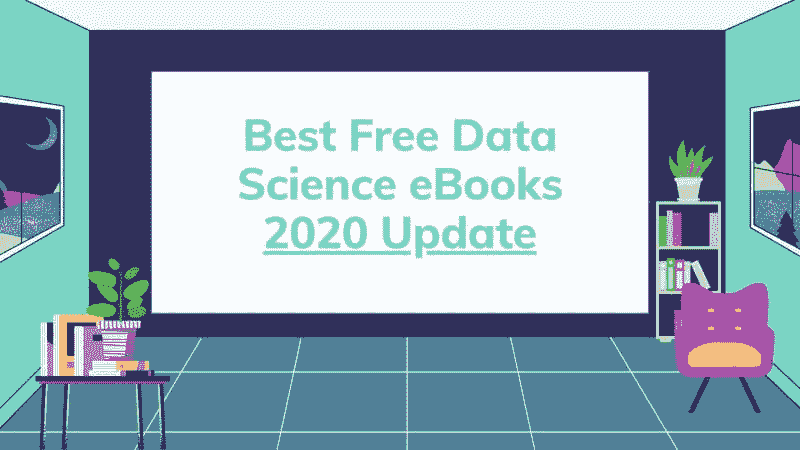

# 最佳免费数据科学电子书：2020 年更新

> 原文：[`www.kdnuggets.com/2020/09/best-free-data-science-ebooks-2020-update.html`](https://www.kdnuggets.com/2020/09/best-free-data-science-ebooks-2020-update.html)

评论

**由[布伦达·哈利](https://twitter.com/brendahali)，营销数据专家**

图片来源：作者（布伦达·哈利）

* * *

## 我们的前三个课程推荐

 1\. [Google 网络安全证书](https://www.kdnuggets.com/google-cybersecurity) - 快速入门网络安全职业。

 2\. [Google 数据分析专业证书](https://www.kdnuggets.com/google-data-analytics) - 提升你的数据分析技能

 3\. [Google IT 支持专业证书](https://www.kdnuggets.com/google-itsupport) - 支持你所在组织的 IT

* * *

我们处在一个不断进步的行业中，学习资源是无限的。

去年我整理了一份帮助我在数据科学学习路径上有帮助的电子书汇编，[并且得到了导师和教授的推荐，用于解决特定项目或深入理解概念](https://towardsdatascience.com/the-best-free-data-science-ebooks-b671691e5231)。

当我花时间深入学习时，我发现了一些之前未推荐的新书，[或找到所有我推荐书籍的更新](https://towardsdatascience.com/the-best-free-data-science-ebooks-b671691e5231)。所有电子书都合法免费或采用‘你愿意支付多少就付多少’的概念，最低为 $0。

如果你喜欢一本书，并且有条件的话，我建议你寻找支持作者的方式，例如购买纸质版、在 Patreon 上支持他们，或是请他们喝杯咖啡。

**让我们让优质教育内容为大众所用。**

*免责声明：Python 和有时的 R 是我首选的编程语言，这也是为什么大多数书籍基于这些语言。如果你有其他语言书籍的推荐，请在评论中分享或*[发送我一条推文](https://twitter.com/brendahali)*，我会将其添加到推荐中。*

### 概率与统计

**[OpenIntro Statistics (2019)](https://leanpub.com/openintro-statistics)** 由 [David Diez](https://leanpub.com/u/diez)、[Mine Cetinkaya-Rundel](https://leanpub.com/u/mine-cetinkaya-rundel)、[Christopher Barr](https://leanpub.com/u/cdbarr) 和 [OpenIntro](https://leanpub.com/u/openintro) 合著

描述：一个完整的统计学基础，也为数据科学打下基础。OpenIntro Statistics 提供了大学水平的传统统计学介绍。这本教科书在大学水平广泛使用，为从社区学院到常春藤联盟的学生提供了卓越且易于接触的入门教材。

**[概率论导论](http://www.probabilitybook.net/)** — 2019 年哈佛大学 Stats 110 官方书籍，Joseph K. Blitzstein 和 Jessica Hwang 著

描述：这本书提供了理解统计学、随机性和不确定性的基本语言和工具。书中探讨了各种应用和示例，从巧合和悖论到 Google PageRank 和马尔可夫链蒙特卡洛（MCMC）。其他探讨的应用领域还包括遗传学、医学、计算机科学和信息理论。

作者以易于理解的风格呈现材料，并通过现实世界的例子来激发概念。要做好准备，这本书很厚重！

同时，查看他们的 [很棒的概率速查表](http://www.wzchen.com/probability-cheatsheet)。

**[黑客的概率编程与贝叶斯方法（2020）](http://camdavidsonpilon.github.io/Probabilistic-Programming-and-Bayesian-Methods-for-Hackers/)** 由 Cam Davidson-Pilon 著

描述：《黑客的贝叶斯方法》旨在从计算/理解优先、数学其次的角度介绍贝叶斯推断。当然，作为一本入门书籍，我们只能停留在这个层次：一本入门书。对于数学训练有素的人，他们可以通过其他专门设计的数学分析文本来解答这本书引发的好奇心。对于数学背景较少或不感兴趣于数学但仅仅对贝叶斯方法的实践感兴趣的爱好者，这本书应该足够且有趣。

请查看他们的 [使用 TensorFlow 的神奇 Github 仓库](https://github.com/CamDavidsonPilon/Probabilistic-Programming-and-Bayesian-Methods-for-Hackers)。

**[数据科学的实用统计学（2017）](https://drive.google.com/viewerng/viewer?url=https://math2510.coltongrainger.com/books/2017-bruce-and-bruce-pratical-statistics-for-data-scientists.pdf)** 由 Peter Bruce 和 Andrew Bruce 著

描述：这本书面向已经对 R 编程语言有一定了解，并且有一定（可能是不稳定或短暂的）统计学基础的数据科学家。我们两个人都来自统计学领域，因此我们对统计学对数据科学艺术的贡献有一定的理解。同时，我们也深知传统统计教学的局限性：统计学作为一门学科已有一个半世纪的历史，大多数统计学教科书和课程都带有如同海洋轮般的惯性和阻力。

### **编程**

**[R 编程与数据科学](https://leanpub.com/rprogramming)** 由 Roger d. Peng 著

描述：这本书向你介绍了 R 编程的基础，使用的是作为行业领先的 Johns Hopkins 数据科学专业化课程的一部分开发的相同材料。这本书所教授的技能将为你开始学习数据科学的旅程奠定基础。

**[使用 R 进行探索性数据分析](https://leanpub.com/exdata)** 由 Roger d. Peng 编著

描述：本书教你使用 R 有效地可视化和探索复杂的数据集。探索性数据分析是数据科学过程中的关键部分，因为它允许你明确你的问题并优化你的建模策略。本书基于业界领先的 Johns Hopkins 数据科学专业课程。

**[命令行下的数据科学 (2020)](https://www.datascienceatthecommandline.com/1e/)** 由 Jeroen Janssens 编著

描述：本书从网站、API、数据库和电子表格中获取数据

+   对文本、CSV、HTML/XML 和 JSON 进行清洗操作

+   探索数据、计算描述性统计数据，并创建可视化图表

+   管理你的数据科学工作流程

+   从一行代码和现有的 Python 或 R 代码中创建可重用的命令行工具

+   并行化和分发数据密集型管道

+   使用降维、聚类、回归和分类算法对数据建模

**[Python 3 101 (2019 — 更新版](https://python101.pythonlibrary.org/))** 由 Michael Driscoll 编著

描述：学习如何从头到尾使用 Python 3 进行编程。Python 101 从 Python 的基础知识开始，然后在此基础上扩展你所学到的内容。本书的主要受众是那些有编程经验但想学习 Python 的人。本书不仅涵盖了初级内容，还包括了相当数量的中级材料。

**[使用 Python 进行自然语言处理](https://www.nltk.org/book/)** 由 Steven Bird、Ewan Klein 和 Edward Loper 编著

描述：本书是对自然语言处理（NLP）的实用介绍。你将通过实例学习，编写真实的程序，并掌握通过实现测试一个想法的价值。如果你还没有学习过，本书将教你编程。与其他编程书籍不同，我们提供了大量的插图和来自 NLP 的练习。我们的方法也很有原则，即我们涵盖了理论基础，并且不回避细致的语言学和计算分析。我们力求在理论和应用之间取得平衡，识别其中的联系和张力。最后，我们认识到，除非这个过程也充满乐趣，否则你不会坚持下去，因此我们尽力包含了许多有趣和娱乐性的应用和例子，有时甚至是异想天开的。

**[大规模数据集挖掘 (2019)](https://drive.google.com/viewerng/viewer?url=http://infolab.stanford.edu/~ullman/mmds/book0n.pdf)** 由 Jure Leskovec（斯坦福大学）、Anand Rajaraman（Rocketship Ventures）和 Jeffrey D. Ullman（斯坦福大学）编著

描述：这本书专注于处理非常大量的数据，即数据大到无法放入主内存中。由于强调数据规模，许多例子涉及 Web 或从 Web 中派生的数据。此外，本书采取算法视角：数据挖掘是关于将算法应用于数据，而不是使用数据来“训练”某种机器学习引擎。

**[机器学习的渴望（2016）](https://www.deeplearning.ai/machine-learning-yearning/)** 由 Andrew Ng 编著

描述：AI 正在改变众多行业。《机器学习的渴望》教你如何构建机器学习项目。

本书的重点不是教你机器学习算法，而是如何使机器学习算法有效。阅读《机器学习的渴望》后，你将能够：

+   优先考虑 AI 项目中最有前景的方向

+   诊断机器学习系统中的错误

+   在复杂环境中构建机器学习，例如训练/测试集不匹配

+   设置机器学习项目，以便与人类水平表现进行比较或超越

+   了解何时以及如何应用端到端学习、迁移学习和多任务学习。

### 领导数据科学团队

**[执行数据科学（2018）](https://leanpub.com/eds)** 由 Brian Caffo、Roger D. Peng 和 Jeffrey Leek 编著

描述：这本书教你如何组建和领导数据科学企业，以便你的组织能够从大数据中提取信息。

有其他必须列入清单的电子书吗？请在评论中告诉我或发推文给我 [`twitter.com/brendahali`](https://twitter.com/brendahali)

**简介：[布伦达·哈利](https://twitter.com/brendahali)** (**[LinkedIn](https://www.linkedin.com/in/brenda-hali/)**) 是一位驻华盛顿 D.C.的市场数据专家。她热衷于女性在技术和数据领域的参与。

[原始文档](https://towardsdatascience.com/the-best-free-data-science-ebooks-2020-update-dac5e170a478)。经许可转载。

**相关：**

+   统计学习的要素：免费电子书

+   理解机器学习：免费电子书

+   人人皆学 Python：免费电子书

### 更多相关内容

+   [停止学习数据科学以找到目的，并以找到目的为...](https://www.kdnuggets.com/2021/12/stop-learning-data-science-find-purpose.html)

+   [学习数据科学统计的顶级资源](https://www.kdnuggets.com/2021/12/springboard-top-resources-learn-data-science-statistics.html)

+   [成功数据科学家的 5 个特征](https://www.kdnuggets.com/2021/12/5-characteristics-successful-data-scientist.html)

+   [每个数据科学家都应该知道的三个 R 库（即使你使用 Python）](https://www.kdnuggets.com/2021/12/three-r-libraries-every-data-scientist-know-even-python.html)

+   [一个 90 亿美元的人工智能失败，详解](https://www.kdnuggets.com/2021/12/9b-ai-failure-examined.html)

+   [为什么 Python 是初创公司的理想编程语言](https://www.kdnuggets.com/2021/12/makes-python-ideal-programming-language-startups.html)
