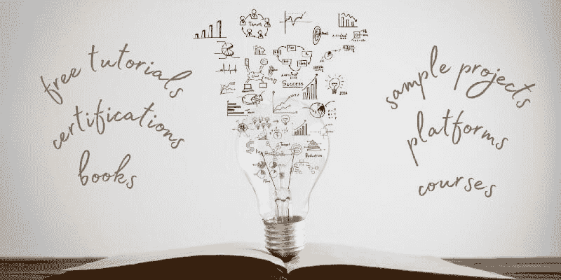
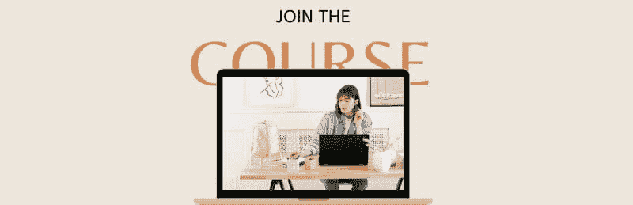
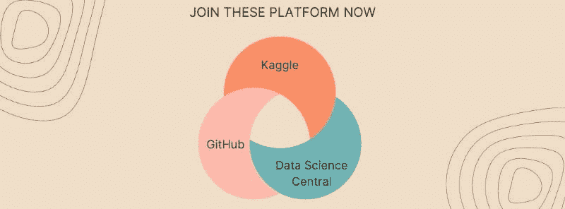
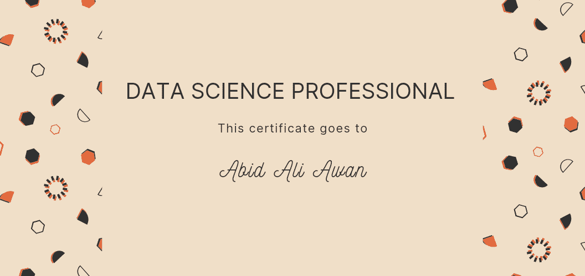
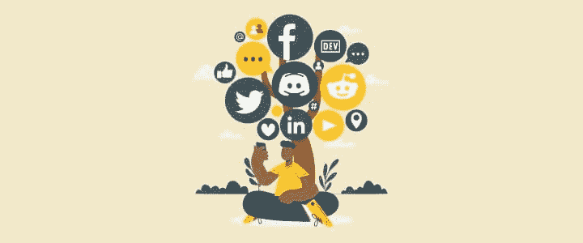

# 2022 年数据科学最佳学习资源

> 原文：[`www.kdnuggets.com/2022/01/best-learning-resources-data-science-2022.html`](https://www.kdnuggets.com/2022/01/best-learning-resources-data-science-2022.html)

作者图片 | 照片由 [jannoon028](https://www.freepik.com/free-photo/symbols-come-out-bulb-top-book_985250.htm#page=1&query=data%20learn&position=2&from_view=search) 提供

当我开始我的数据科学职业生涯时，我对从哪里开始、学习什么或哪些课程最好感到困惑。简单的谷歌搜索无法帮助你，你可能会浪费很多时间寻找合适的资源。在经历了这种困难之后，我向自己承诺要简化事情，以帮助他人。这个博客包含了帮助你快速启动职业生涯的最佳书籍、课程、平台、认证和社交网络的列表。

* * *

## 我们的前三名课程推荐

 1\. [谷歌网络安全证书](https://www.kdnuggets.com/google-cybersecurity) - 快速进入网络安全职业轨道。

 2\. [谷歌数据分析专业证书](https://www.kdnuggets.com/google-data-analytics) - 提升你的数据分析能力。

 3\. [谷歌 IT 支持专业证书](https://www.kdnuggets.com/google-itsupport) - 支持你的组织进行 IT 工作。

* * *

## 书籍

作者图片

有些人喜欢阅读书籍，因此今年有一些有趣的书籍可供选择。在我们跳到书单之前，花点时间问问自己喜欢哪种编程语言。大多数人会选择**Python**，但**R**和**Julia**也非常受欢迎，因为它们都是为数据科学设计的。

**初级水平：** [数据分析的 Python：使用 Pandas、NumPy 和 IPython 进行数据整理](https://www.amazon.com/gp/product/1491957662/ref=as_li_tl?ie=UTF8&tag=quantpytho-20&camp=1789&creative=9325&linkCode=as2&creativeASIN=1491957662&linkId=8c3bf87b221dbcd8f541f0db20d4da83)

**中级水平：** [数据科学实用统计学](https://www.amazon.in/Practical-Statistics-Data-Scientists-Essential/dp/8194435005/ref=pd_sbs_1/257-4386611-5385532?pd_rd_w=LKFEw&pf_rd_p=458377ad-f0e1-4b16-b359-07fb8404ce8b&pf_rd_r=BSBTA733JSS7J2PBQAZD&pd_rd_r=8fa4ddb3-2129-4b80-b6fd-36f073aaf854&pd_rd_wg=v1MHW&pd_rd_i=8194435005&psc=1)

**R 爱好者：** [数据科学中的 R](https://www.oreilly.com/library/view/r-for-data/9781491910382/)

**未来语言：** [Julia 数据科学](https://www.amazon.com/dp/B09KMRKQ96/)

## 课程

作者图片

我的旅程开始于 [Codecademy](https://www.codecademy.com/) 和 [DataCamp](https://app.datacamp.com/learn/) 的课程，这些课程教会了我 Python、R、SQL 和统计学的基础知识。我强烈建议初学者尝试任何数据科学课程，并尽量按时完成。

以下列表包含免费课程、付费课程和短期教程。这些课程将帮助你建立坚实的基础，以便开始进行实际的数据项目。

**免费课程**

+   [数据科学完整课程——在 10 小时内学习数据科学](https://www.youtube.com/watch?v=-ETQ97mXXF0)

+   [学习数据科学教程——无代码——初学者完整课程](https://www.youtube.com/watch?v=ua-CiDNNj30&t=762s)

+   [数据科学硕士课程简介](https://github.com/briandalessandro/DataScienceCourse/tree/master/ipython/Lectures)

**付费课程**

+   Udacity: [学习成为数据科学家在线课程](https://www.udacity.com/course/data-scientist-nanodegree--nd025?irclickid=QlxSPkwh5xyIWdTRvMzWh2bTUkGwC3RyX1mQyo0&irgwc=1&utm_source=affiliate&utm_medium=&aff=2010620&utm_term=&utm_campaign=__&utm_content=&adid=788185)

+   DataCamp: [Python 数据科学家轨迹](https://app.datacamp.com/learn/career-tracks/data-scientist-with-python?version=5)

+   Coursera: [IBM 数据科学专业证书](https://www.coursera.org/professional-certificates/ibm-data-science)

+   Codecademy: [数据科学家职业路径](https://www.codecademy.com/learn/paths/data-science)

**教程**

+   [数据科学初学者教程：是什么，基础知识与流程](https://www.guru99.com/data-science-tutorial.html)

+   [完整 Python Pandas 数据科学教程！（读取 CSV/Excel 文件，排序，筛选，分组）](https://www.youtube.com/watch?v=vmEHCJofslg)

+   [数据可视化 Python](https://www.youtube.com/watch?v=_YWwU-gJI5U)

## 平台

作者提供的图像

如果我在开始数据科学之旅之前就知道**Kaggle**，我的生活会更轻松。这些平台提供示例、简单的指南以及进行实验的能力。你可以从笔记本中学习，或与专家数据科学社区讨论想法。

如果你想在数据科学和机器学习领域取得成功，只需在 Kaggle 上创建一个账户，并开始参与各种讨论。同时，创建一个**GitHub**账户，从更大的开发者社区中学习。

+   [Kaggle](https://www.kaggle.com/)

+   [GitHub](https://github.com/)

+   [数据科学中心](https://www.datasciencecentral.com/)

**附加：** 使用 [Paperswithcode](https://paperswithcode.com/) 和 [DAGsHub](https://dagshub.com/) 学习应用机器学习。

## 博客

图像来自 [freepik](https://www.freepik.com/freepik)

数据科学博客提供了关于特定工具、新概念和适合初学者的教程的简短信息。在完成几个课程后，我立刻爱上了 **Towards Data Science** 和 **Analytics Vidhya** 上易于跟随的博客。它们仍在帮助我在数据分析和机器学习方面不断进步。

+   [Towards Data Science](https://towardsdatascience.com/)

+   KDnuggets

+   [博客 — Analytics Vidhya](https://www.analyticsvidhya.com/blog/)

+   [Towards AI](https://towardsai.net/)

## 认证

作者提供的示例证书

如果你没有数据科学学位，认证将为你在求职市场上提供优势。目前大多数平台都提供认证考试，许多认证是值得的。

这些认证考试将考察你在数据分析、编程技能、统计思维、建模和展示方面的能力。

+   [DataCamp 认证](https://app.datacamp.com/certification/data-scientist-professional)

+   [Databricks 认证专业数据科学家](https://academy.databricks.com/exam/databricks-certified-professional-data-scientist)

+   [HarvardX 数据科学专业证书 | edX](https://www.edx.org/professional-certificate/harvardx-data-science)

+   [大数据科学家认证 | 认证数据科学家 | DASCA](https://www.dasca.org/data-science-certifications/big-data-scientist)

## 数据社交网络

作者提供的图片 | 元素来源于 [freepik](https://www.freepik.com/free-vector/social-tree-concept-illustration_12491662.htm#page=1&query=social%20media&position=10&from_view=search)

你如何保持对不断变化的数据科学领域的更新？通过关注专家、影响者或加入数据科学社交网络。这些社交网络包括 Discord（Learn AI Together）、LinkedIn、Twitter、Dev.to 和 Reddit（r/datascience）。

+   [Discord](https://discord.gg/BHKWspTh)

+   [LinkedIn](https://www.linkedin.com/search/results/groups/?keywords=data%20science&origin=SWITCH_SEARCH_VERTICAL&position=5&searchId=47948ef1-fc6d-4620-a404-00c7e17e81ae&sid=jZ7)

+   [Twitter](https://twitter.com/search?q=Data%20Science&src=typeahead_click)

+   [Dev.to](https://dev.to/search?q=data%20science)

+   [Reddit](https://www.reddit.com/r/datascience/)

## 结论

我收到了很多直接消息和邮件，询问“如何开始学习数据科学。”大多数人说，他们认为如果能够学会基础知识，就能开始赚取六位数的薪水，这种心态是错误的。因此，如果你是为了错误的理由去做这件事，我建议你在这里停止，开始寻找你喜欢的事物。这个过程会变得困难，你会失去方向。简而言之，你将浪费时间和金钱去做你不喜欢的事情。

在这篇博客中，我们了解了最佳的学习资源和平台。开始关注 Twitter 或 LinkedIn 上的数据影响者，在 Kaggle 上创建一个账户，从一个免费的课程开始，然后完成一个付费课程，以深入了解机器学习和最佳编码实践。

> ***"数据科学需要奉献和努力工作。"***

**[Abid Ali Awan](https://www.polywork.com/kingabzpro)** ([@1abidaliawan](https://twitter.com/1abidaliawan)) 是一位认证的数据科学专业人士，喜欢构建机器学习模型。目前，他专注于内容创作和撰写有关机器学习和数据科学技术的技术博客。Abid 拥有技术管理硕士学位和电信工程学士学位。他的愿景是使用图神经网络为那些面临心理健康困扰的学生开发一个 AI 产品。

### 更多相关内容

+   [2022 年值得报名的 8 个最佳数据科学课程，助力职业快速提升](https://www.kdnuggets.com/2022/02/scaler-8-best-data-science-courses-enroll-2022-steep-career-advancement.html)

+   [2022 年最佳数据科学职业路线图](https://www.kdnuggets.com/2022/04/best-data-science-career-tracks-2022.html)

+   [最佳数据科学资源、训练营和学习课程…](https://www.kdnuggets.com/2023/12/springboard-best-data-science-resources-bootcamp-courses-learn-data-science-new-year)

+   [学习数据分析和数据科学的最佳免费资源](https://www.kdnuggets.com/2024/03/365datascience-best-free-resources-learn-data-analysis-data-science)

+   [人工智能、分析、机器学习、数据科学、深度学习…](https://www.kdnuggets.com/2021/12/developments-predictions-ai-machine-learning-data-science-research.html)

+   [数据可视化最佳实践与有效沟通资源](https://www.kdnuggets.com/2023/04/data-visualization-best-practices-resources-effective-communication.html)
