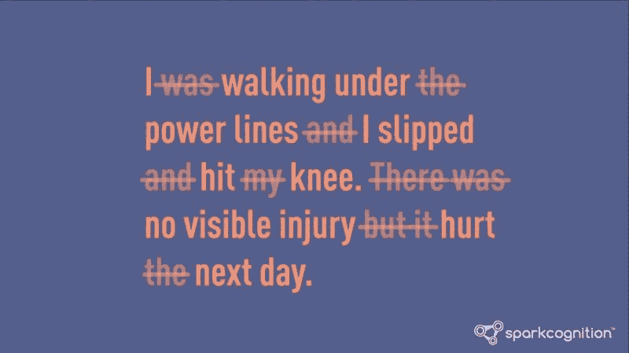
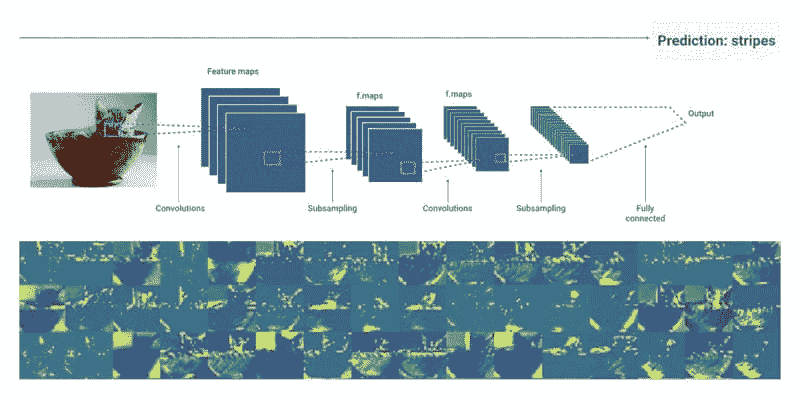

# 最佳机器学习 YouTube 视频（10 分钟以内）

> 原文：[`www.kdnuggets.com/2020/06/best-machine-learning-youtube-videos-under-10-minutes.html`](https://www.kdnuggets.com/2020/06/best-machine-learning-youtube-videos-under-10-minutes.html)

评论

机器学习教育内容通常以学术论文或博客文章的形式呈现。这些资源非常宝贵。然而，它们有时可能篇幅较长，耗时较多。如果你只是想学习基本概念，而不需要所有背后的数学和理论，简洁的机器学习视频可能是更好的选择。此列表中的 YouTube 视频涵盖了诸如[机器学习是什么](https://lionbridge.ai/artSACicles/whats-the-difference-between-ai-machine-learning-and-deep-learning/)、自然语言处理基础、计算机视觉的工作原理以及视频游戏中的机器学习等概念。

* * *

## 我们的前三个课程推荐

 1\. [谷歌网络安全证书](https://www.kdnuggets.com/google-cybersecurity) - 快速进入网络安全职业。

 2\. [谷歌数据分析专业证书](https://www.kdnuggets.com/google-data-analytics) - 提升你的数据分析技能

 3\. [谷歌 IT 支持专业证书](https://www.kdnuggets.com/google-itsupport) - 支持你的组织 IT

* * *

### 1\. 机器学习是什么？ | 机器学习基础

**上传日期：** 2018 年 9 月 19 日

**频道：** Simplilearn

Simplilearn 的视频清晰简明地解释了许多机器学习的基本概念。在视频中，Simplilearn 解释了监督学习、无监督学习和强化学习之间的区别。此外，他们简要介绍了 K 近邻算法。视频使用了良好的视觉效果、图表和简单的示例。最后，视频包含了一个快速的测验和对一些最有趣的机器学习应用的简短概述。

### 2\. 自然语言处理（NLP）基础

**上传日期：** 2018 年 6 月 6 日

**频道：** SparkCognition

AI 解决方案提供商 SparkCognition 在这段不到五分钟的视频中解释了 NLP 的基础知识。他们能够在如此短的时间内传递如此多的信息令人赞叹。

NLP – 停用词

该视频使用了出色的视觉效果和动画，以帮助创建清晰简明的解释。它简要地涉及了结构化数据与非结构化数据、停用词以及 NLP 如何改善搜索引擎。最后，SparkCognition 解释了企业如何利用 NLP 分析数据，提升运营效率和安全性。

### 3\. 计算机视觉的工作原理

**上传日期：** 2018 年 4 月 19 日

**频道：** Google Cloud Platform

计算机视觉是机器学习领域最大的研究领域之一。Google 的这个视频提供了对计算机视觉工作原理的深入但简洁的解释。在视频中，他们解释了计算机如何看待图像以及机器学习模型如何被训练以识别物体。

CNNs

此外，视频简要解释了卷积神经网络（CNN）以及它们如何使用[labeled training data](https://lionbridge.ai/services/ai-training-data/)进行预测和提高准确性。最后，视频还提到 CNNs 擅长理解空间特征，但在处理时间特征时存在困难。视频时长刚过七分钟，Google 成功地用出色的视觉辅助展示了大量信息。

### 4\. 多智能体捉迷藏

**上传日期：** 2019 年 9 月 17 日

**频道：** OpenAI

来自 OpenAI 的这个实验非常有趣，展示了多智能体竞争如何导致智能行为。

在这个视频中，OpenAI 解释了他们如何用简单规则和初步工具构建一个虚拟的捉迷藏世界。在这个世界里，他们放置了多个角色，分为躲藏者和寻找者。在经过数百万轮游戏后，代理开始通过强化学习学会利用工具来获得优势。他们开始合作，找到创造性的方法来赢得比赛。最终，他们甚至学会了利用编程中的漏洞来作弊取得胜利。有关实验的更多评论视频可以在[Two Minute Papers](https://www.youtube.com/watch?v=Lu56xVlZ40M&t=303s)频道找到。

### 5\. MarI/O – 游戏中的机器学习

**上传日期：** 2015 年 6 月 13 日

**频道：** SethBling

在这个视频中，Twitch 主播和计算机程序员 SethBling 介绍了 MarI/O，这是一款他开发的 AI 程序，学会了如何玩《超级马里奥世界》。

Seth 展示了程序的游戏技能，并解释了神经网络的基础知识和 MarI/O 的 24 小时进化学习系统。他讲解了神经网络如何被训练以玩游戏，神经网络看到什么，以及它如何学习做出决策并随着时间的推移进化。

每个视频不到 10 分钟，非常适合在通勤或午休时观看，同时增强你对机器学习基础知识的了解。观看以上视频后，你应该能更好地理解机器学习是什么、自然语言处理和计算机视觉的基础知识，以及游戏中的机器学习。

想了解更多关于机器学习的文章吗？请查看[20 Best YouTube Channels for AI and Machine Learning](https://lionbridge.ai/articles/20-best-youtube-channels-for-ai-and-machine-learning/)以及下面的相关资源。

**个人简介：[Limarc Ambalina](https://www.linkedin.com/in/limarc-ambalina-11604371/)** 是一位驻东京的作家，专注于 AI、科技和流行文化。他曾为包括 Hacker Noon、Japan Today 和 Towards Data Science 在内的多个出版物撰稿。

[原文](https://lionbridge.ai/articles/best-machine-learning-youtube-videos-under-10-minutes/)。经许可转载。

**相关：**

+   5 篇关于面部识别的机器学习论文

+   10 篇必读的机器学习文章（2020 年 3 月）

+   5 篇关于情感分析的必读论文

### 更多相关内容

+   [来自大学的 AI 最佳课程（带 YouTube 播放列表）](https://www.kdnuggets.com/2023/08/best-courses-ai-universities-youtube-playlists.html)

+   [提升机器学习技能的 15 个顶级 YouTube 频道](https://www.kdnuggets.com/2023/03/top-15-youtube-channels-level-machine-learning-skills.html)

+   [KDnuggets 新闻 22:n16，4 月 20 日：学习的顶级 YouTube 频道……](https://www.kdnuggets.com/2022/n16.html)

+   [学习数据科学的顶级 YouTube 频道](https://www.kdnuggets.com/2022/04/top-youtube-channels-learning-data-science.html)

+   [数据分析的 7 个顶级 YouTube 课程](https://www.kdnuggets.com/2022/02/top-7-youtube-courses-data-analytics.html)

+   [6 个学习 AI 的 YouTube 频道](https://www.kdnuggets.com/6-youtube-channels-to-learn-about-ai)
