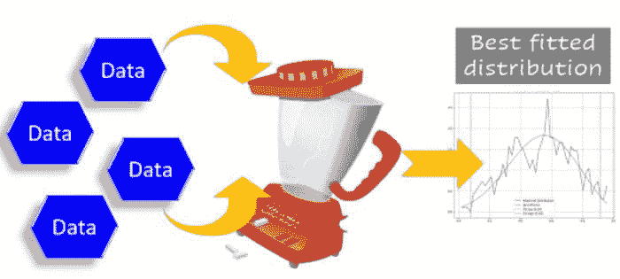
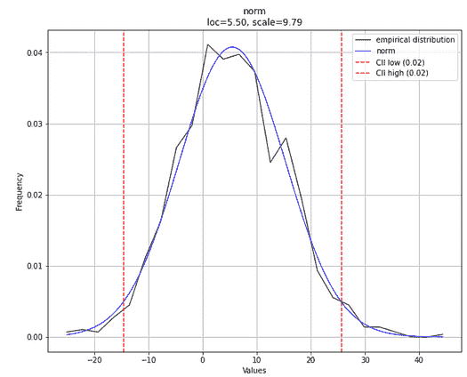
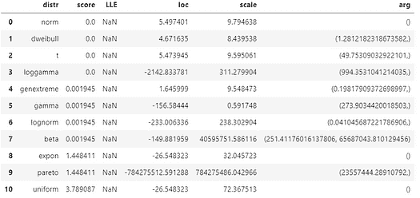
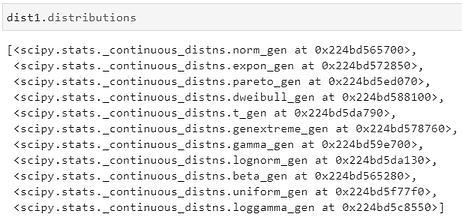
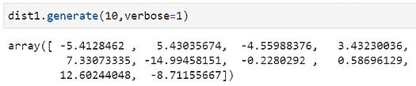
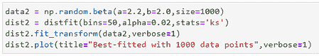
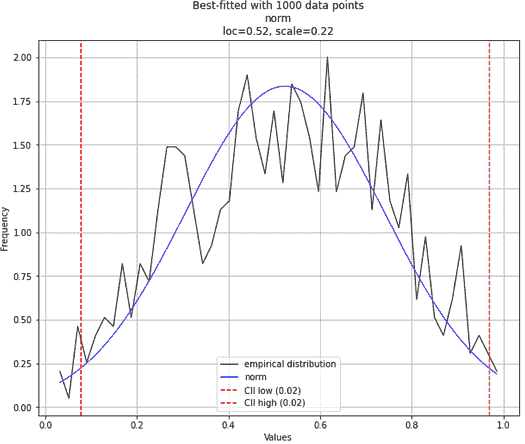
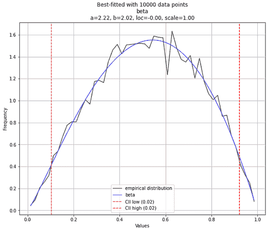

# 轻松找到最匹配的数据分布

> 原文：[`www.kdnuggets.com/2021/10/best-matching-distribution-data-effortlessly.html`](https://www.kdnuggets.com/2021/10/best-matching-distribution-data-effortlessly.html)

评论

## 我们的目标是什么？



**图片来源**：由作者准备，使用了 [Pixabay 图片](https://pixabay.com/vectors/mixer-grinder-blender-machine-575443/)（免费使用）

你有一些数据点。最好是数值型的。

你想找出**这些数据可能来自哪个统计分布**。经典的统计推断问题。

当然，有严格的统计方法可以实现这个目标。但是，也许你是一个忙碌的数据科学家。或者是一个更忙的程序员，他恰好被分配了这个数据集，需要迅速编写一个应用端点，以找到最匹配数据的分布。以便另一个机器学习应用可以使用基于此分布生成的一些合成数据。

简而言之，你没有很多时间，想要找到一种**快速的方法来发现*最匹配*的数据分布**。

基本上，你希望对多个分布运行一批**自动化的拟合优度（GOF）测试**，并快速总结结果。

当然，你可以从头开始编写代码，使用例如 Scipy 库逐一运行标准 GOF 测试，针对多个分布进行测试。

或者，你可以使用这个[**小巧但实用的 Python 库**](https://erdogant.github.io/distfit/pages/html/index.html)——distfit 来为你完成繁重的工作。

## Distfit——一个用于自动拟合数据分布的 Python 库

根据他们的[网站](https://erdogant.github.io/distfit/pages/html/index.html)，`**distfit**` 是一个用于单变量分布概率密度拟合的 Python 包。它通过残差平方和（RSS）和其他 GOF 测量来确定**在 89 种理论分布中最好的拟合**。

让我们看看如何使用它。这是 [**演示笔记本**](https://github.com/tirthajyoti/Stats-Maths-with-Python/blob/master/Fitting-data-to-univariate-distributions-with-distfit.ipynb)。

按照常规安装，

```py
pip install -U distfit
```

## 生成测试数据并进行拟合

生成一些正态分布的测试数据，并将它们拟合到 distfit 对象中。

> 基本上，你希望对多个分布运行一批**自动化的拟合优度（GOF）测试**，并快速总结结果

## 拟合效果如何？

那么，拟合效果如何？

注意，在上面的代码中，模型`dist1`对生成分布或其参数（即正态分布的`loc`或`scale`参数）没有任何了解，也不知道我们调用了`np.random.normal`来生成数据。

我们可以通过一段简单的代码一次性测试拟合优度和估计参数，

```py
dist1.plot(verbose=1)
```

这是预期的图（注意，由于生成数据的随机性质，图形在你的情况下肯定会有所不同）。

**注意图例副标题中拟合过程估计的`**loc**`**和`**scale**`**参数**。这些参数值与我们之前设置的值非常接近，不是吗？估计的分布类型显示为`norm`，即正态分布。完全正确。



**作者创建的图像**

## 关于拟合模型的更多信息

使用另一行代码，你可以获取所有拟合到数据（内部）并测试拟合优度的分布的摘要。

```py
dist1.summary
```

你会得到如下结果，



**作者创建的图像**

这显示了所有测试过的各种分布的参数。它还显示了`**score**`**，**表明拟合优度**——即预期数据和给定数据之间的距离，数值越低越好。请注意，在这个模型中有多个分布的得分相同且为零，但根据内部逻辑，正态分布被选择为最可信的分布。

**为什么在这个摘要中只有 10 个分布**？因为默认情况下，它使用最受欢迎的 10 个分布的列表进行扫描。你可以在初始化`distfit`对象时将确切的列表作为参数指定。

## 使用 Scipy 内部

如果你输入`dist1.distributions`，你将看到用于拟合过程的函数列表，这些函数来自 Scipy 包。



## 不要仅仅停留在拟合阶段，还要生成合成数据

作为附加功能，`distfit`模型提供了一个 API，可以基于最佳拟合分布轻松生成数据。在这里，我们生成了 10 个随机变量，`loc=5.5`和`scale=9.79`（如之前拟合的）。



## 需要注意的事项

如果两个或多个分布的数据形状相似度很高，估计可能会出错。**特别是，当样本量（训练数据）较小时**。

例如，让我们从[**Beta 分布**](https://en.wikipedia.org/wiki/Beta_distribution)生成一些数据，参数选择使得它们*看起来几乎像正态分布*。如果我们选择**α**和**β**相等或接近相等，我们可以实现这一点。然后，如果你拟合 1000 个数据点，你可能会得到正态分布作为最佳拟合分布。





**作者创建的图像**

然而，如果你将样本量扩展到 10,000 个点，你很可能会得到正确的答案。



**作者创建的图像**

## 你可以做的其他事情

你可以选择使用哪种**统计测试**（RSS、Kolmogorov-Smirnov 等）来确定最佳拟合。

你还可以指定**确切的列表**来遍历分布。

你可以使用`distfit.predict`方法来**预测响应变量的概率**。

我们只展示了连续分布拟合的例子。你也可以对**离散分布**进行拟合。

## 为什么这是“高效数据科学”的一个例子？

我认为使用像`distfit`这样的工具包是***高效数据科学***的一个绝佳例子。

我在这篇文章中写了什么是高效的数据科学。本质上，它意味着**以更高的速度、更稳健的方式进行相同的数据科学活动**。

[**为什么以及如何学习“高效的数据科学”？**](https://medium.com/productive-data-science/why-and-how-should-you-learn-productive-data-science-53377b473f37)

你可以用 Scipy 函数从头编写纯 Python 代码，循环遍历各种分布，并对你拥有的数据进行 GOF 测试。但**既然已经有人为这个任务编写了一个优秀的库（配有高质量的文档），你为什么还要浪费时间呢**？

这就是为什么你可以在想要将单变量数据拟合到最佳分布并一次性获取所有统计属性时考虑使用`distfit`。

你可以查看作者的[**GitHub**](https://github.com/tirthajyoti?tab=repositories)**库**，以获取机器学习和数据科学的代码、创意和资源。如果你像我一样，对 AI/机器学习/数据科学充满热情，请随时[在 LinkedIn 上添加我](https://www.linkedin.com/in/tirthajyoti-sarkar-2127aa7/)或[关注我在 Twitter 上](https://twitter.com/tirthajyotiS)。

[原文](https://towardsdatascience.com/find-the-best-matching-distribution-for-your-data-effortlessly-bcc091aa08ab)。已获许可转载。

**简历： [Tirthajyoti Sarkar](https://www.linkedin.com/in/tirthajyoti-sarkar-2127aa7/)** 是 Adapdix Corp 的数据科学/机器学习经理。他定期为 KDnuggets 和 TDS 等出版物撰写与数据科学和机器学习相关的各种主题。他撰写了数据科学书籍，并为开源软件做出贡献。Tirthajyoti 拥有电子工程博士学位，目前正在攻读计算数据分析硕士学位。可以通过 tirthajyoti at gmail[dot]com 联系他。

**相关：**

+   用 Python 创建带有异常签名的合成时间序列

+   如何在 Python 中进行“无限制”数学运算

+   用合成数据教 AI 分类时间序列模式

* * *

## 我们的前三大课程推荐

 1\. [谷歌网络安全证书](https://www.kdnuggets.com/google-cybersecurity) - 快速进入网络安全职业生涯。

 2\. [谷歌数据分析专业证书](https://www.kdnuggets.com/google-data-analytics) - 提升你的数据分析技能

 3\. [谷歌 IT 支持专业证书](https://www.kdnuggets.com/google-itsupport) - 支持你的组织 IT 工作

* * *

### 更多相关话题

+   [停止学习数据科学以寻找目标，并寻找目标去…](https://www.kdnuggets.com/2021/12/stop-learning-data-science-find-purpose.html)

+   [使用 PyTest 入门：轻松编写和运行 Python 测试](https://www.kdnuggets.com/getting-started-with-pytest-effortlessly-write-and-run-tests-in-python)

+   [如何使用 Python 确定最佳拟合数据分布](https://www.kdnuggets.com/2021/09/determine-best-fitting-data-distribution-python.html)

+   [综合指南：正态分布](https://www.kdnuggets.com/2022/06/comprehensive-guide-normal-distribution.html)

+   [如何找到最佳的数据科学远程工作](https://www.kdnuggets.com/2022/12/find-best-data-science-remote-jobs.html)

+   [快速指南：找到合适的标注人才](https://www.kdnuggets.com/2022/04/quick-guide-find-right-minds-annotation.html)
