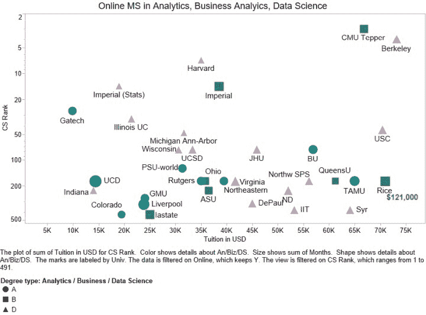

# 更新的在线分析、商业分析、数据科学硕士学位

> 原文：[`www.kdnuggets.com/2020/09/best-online-masters-data-science-analytics-online.html`](https://www.kdnuggets.com/2020/09/best-online-masters-data-science-analytics-online.html)

评论

当前的疫情深刻改变了许多事情，但对 AI 和数据科学教育的需求并没有减少。变化在于在线教育的转变加速了。

现在有更多大学提供在线学位，包括 AI、数据科学和机器学习，因此我们将此目录主要限制在那些拥有顶级大学计算机科学排名的大学。特别感谢 Asel Mendis 收集了本博客中使用的大部分数据。

* * *

## 我们的前三课程推荐

 1\. [Google 网络安全证书](https://www.kdnuggets.com/google-cybersecurity) - 快速进入网络安全职业轨道。

 2\. [Google 数据分析专业证书](https://www.kdnuggets.com/google-data-analytics) - 提升你的数据分析技能

 3\. [Google IT 支持专业证书](https://www.kdnuggets.com/google-itsupport) - 支持你的组织的 IT 需求

* * *

我们在 2017 年和 2019 年发布了类似的名单。

这是我们 2020 年最佳在线硕士学位项目的目录，包括 AI、商业分析、数据分析、数据科学和机器学习。

CS 排名是[Top Universities 计算机与信息系统研究生项目](https://www.topuniversities.com/university-rankings/university-subject-rankings/2020/computer-science-information-systems)的排名。他们为前 50 所学校提供了单独的排名，然后为接下来的 450 所学校提供了范围（51-100、101-150 等）。

下图 1 展示了排名与学费的关系，适用于排名<500 的学校。排名范围内，我们取了该范围的中点。 

**图 1：顶级在线分析、商业分析、数据科学硕士学位。**

仅显示了 Top Universities 计算机科学排名<500 的学校。

形状/颜色对应学位类型：蓝色圆形代表分析，绿色方形代表商业，紫色三角形代表数据科学。形状的大小对应教育的时长。

一些观察：

+   这份名单中的几乎所有学校都来自美国，除了 DSTI（法国）、帝国学院（英国）、利物浦大学（英国）、UCD（爱尔兰）和女王大学（加拿大）。

+   尽管我们没有 2019 年的所有学费数据，但我们看到许多学校在 2020 年提高了学费。这一趋势无法持续太久。

+   我们没有看到学校排名与学费之间的明显相关性。

    一些商业分析项目非常昂贵（Rice 的学费为 121,000 美元），而乔治亚理工学院仅需 9,900 美元。鉴于在线获得优质教育的便利和众多选择，许多顶级以外的学校是否能够继续收取如此高的在线教育学费仍然值得怀疑。

最受欢迎的学位名称是“数据科学”，在超过一半的情况下使用。

调查的学校中，数据分析占比为 17%，商业分析占比为 9%。

以下是学位名称的频率（去除 MS、MSc、硕士等）：

+   数据科学，35

+   数据分析，11

+   商业分析，6

+   分析，2

+   分析与数据科学，2

+   人工智能，1

+   CS 和定量方法，1

+   数据科学与人工智能，1

+   管理分析，1

+   管理信息系统，1

+   硕士统计学（数据科学），1

+   信息学专业研究，1

+   战略分析，1

下表提供了 64 个顶级在线硕士项目的详细信息。

在一些情况下，当没有 CS 顶级大学排名时，

我们为整个大学提供了全球排名前列的大学排名。

**表 1：顶级在线分析、商业分析、数据科学硕士学位。**

| **CS 排名 2020** | **大学，学位** | **描述** | **时长** | **学费（美元）** |
| --- | --- | --- | --- | --- |
| 3 | CMU Tepper [商业分析硕士](https://analytics.tepper.cmu.edu/curriculum/) | MSBA 旨在为有技术背景的人士提供深入分析技能，并晋升为高级业务分析师职位。 | 18-24 个月 | 66820 |
| 4 | UC Berkeley [信息与数据科学硕士](https://datascience.berkeley.edu) | 在线授课的信息与数据科学硕士（MIDS）项目培养数据科学专业人士成为该领域的领军人物。通过融合跨学科课程、经验丰富的教师、成就斐然的同侪网络和灵活的在线学习，这一认证项目将 UC Berkeley 带到你身边，无论你身在何处。 | 20 | 73224 |
| 7 | 哈佛大学 [数据科学硕士](https://www.extension.harvard.edu/academics/graduate-degrees/data-science-degree) | 此学位让你深入理解数据科学方法，包括预测建模、数据挖掘、机器学习、人工智能、数据可视化和大数据。 | 12 | 35000 |
| 14 | 伦敦帝国学院 [商业分析硕士](https://www.imperial.ac.uk/business-school/programmes/msc-business-analytics/) | 你将学习如何应用最新的学术思维和分析及计算工具来帮助做出商业决策。尽管我们的项目建立在严格的技术和定量培训基础上，但也高度应用。选修课程和项目专注于某一行业，给予你根据个人兴趣调整课程的机会。 | 校内 12 个月，在线 22 个月 | 38500 |
| 14 | 伦敦帝国学院 [数据科学硕士（MSc Statistics (Data Science)）](https://www.imperial.ac.uk/mathematics/postgraduate/msc/statistics/prospective/msc-statistics-data-science/) | 课程将关注与大规模科学数据处理相关的各种工具和技术，包括机器学习理论、数据转换与表示、数据可视化以及使用分析软件。 | 12 | 19000 |
| 27 | 乔治亚理工学院 [分析学硕士（MS in Analytics）](https://pe.gatech.edu/degrees/analytics) | 通过乔治亚理工学院的在线分析学硕士（OMS Analytics），你可以建立并增强你的专业知识，使自己对众多公司更具价值。我们的跨学科方法为你提供了向一些最具知识的商业智能、统计学和运筹学领域的专家学习的机会，以及大数据和高性能计算领域的专家。 | 12-24 | 9900 |
| 33 | 伊利诺伊大学厄本那-香槟分校 [数据科学计算机硕士（Master of Computer Science in Data Science）](https://cs.illinois.edu/academics/graduate/professional-mcs/online-master-computer-science-data-science) | 本课程通过聚焦数据科学的课程，要求完成 32 学分的研究生课程，每门课程 4 学分，共八门研究生课程。MCS-DS 包括机器学习、数据挖掘、数据可视化和云计算的必修课程。 | 12-18 | 21440 |
| 44 | 南加州大学 [应用数据科学硕士（MS in Applied Data Science）](https://online.usc.edu/programs/master-of-science-in-applied-data-science/) | 我们的学生沉浸于数据分析的整体领域、分析师和/或数据科学家的角色，以及信息学技能可以应用于关键组织任务的领域。他们理解数据管理、数据可视化、数据挖掘和人工智能技术（特别是机器学习）对分析过程的重要性，以及这些技术如何应用于现实世界的挑战。 | 18-24 | 70471 |
| 48 | 密歇根大学 [应用数据科学硕士（Master of Applied Data Science）](https://online.umich.edu/online-degrees/master-of-applied-data-science/) | 应用数据科学硕士（MADS）项目将为你提供从头到尾管理数据科学的全面准备，适用于各种现实世界情境。该项目在灵活的在线格式中融合了理论、计算和应用。MADS 项目包括数据收集、处理、分析、可视化、报告和干预的学习和应用。它将使你能够学习如何用数据得出结论并做出决策，同时关注数据使用的伦理问题。 | 12 | 31688 |
| 75 | 波士顿大学 [应用数据分析硕士学位](https://www.bu.edu/online/programs/graduate-programs/applied-data-analytics-masters-degree/) | 适合中期职业 IT 专业人士或具有计算机科学背景的学生，该项目专注于分析培训，提供坚实的数据分析知识，并在学术严谨的框架内考察最新行业工具和方法的呈现及应用。 | 16-24 | 56864 |
| 75 | 约翰斯·霍普金斯大学 [数据科学硕士学位](https://ep.jhu.edu/programs-and-courses/programs/data-science) | 严谨的课程设置专注于计算机科学、统计学和应用数学的基础，同时结合实际案例。通过在线学习和在约翰斯·霍普金斯应用物理实验室的先进设施中现场学习，学生可以向实践中的工程师和数据科学家学习。 | 12-24 | 45950 |
| 75 | 普渡大学 [商业分析硕士学位](https://krannert.purdue.edu/online/ms-business-analytics/) | 适合希望利用对技术和分析专业知识日益增长需求的在职专业人士。 | 12-24 | 32064 |
| 125 | 宾夕法尼亚州立大学世界校园 [数据分析专业研究生硕士学位](https://www.worldcampus.psu.edu/degrees-and-certificates/data-analytics-base/overview) | 该项目通过大学内三个学术部门的强大合作关系提供，给你提供了从具有多样背景的教师那里受益的机会。凭借广泛的经验，我们的教师可以教授你如何在大规模和超大规模及不同领域中使用统计学、计算机科学、机器学习和软件工程来收集、分类、分析和建模数据。 | 12-24 | 31380 |
| 175 | 诺斯伊斯特大学 [信息学专业研究生硕士学位](https://www.northeastern.edu/graduate/program/master-of-professional-studies-in-informatics-online-226/) | 本项目通过平衡的课程设置，结合信息科学知识和技术技能培训，以及对商业基础和 IT 创新战略思维的理解，帮助学生在 IT 应用和管理职位上取得成功。通过将计算技能和应用与信息战略、数据治理、伦理和商业智能的实际挑战相结合，学生在信息技术管理、系统设计与开发、信息安全、人机交互、数据分析、云计算和网络服务及企业架构等领域获得能力。 | 18 | 39500 |
| 175 | 西北大学 [数据科学硕士](https://sps.northwestern.edu/masters/data-science/) | 数据科学硕士项目的学生获得了在当今数据密集型世界中成功所需的关键技能。他们学习如何利用关系型和文档数据库系统及基于开源系统（如 R、Python 和 TensorFlow）构建的分析软件。他们学会了如何使用传统统计学和机器学习方法进行可靠的预测。 | 12-24 个月 | 56100 |
| 175 | 俄亥俄大学 [商业分析硕士](https://onlinemasters.ohio.edu/masters-business-analytics/) | 这个在线商业分析硕士项目超越了传统的工具和方法。它传授了你需要的高级分析技能，以深入挖掘组织数据并利用这些数据做出关键的商业决策。 | 16-20 个月 | 35820 |
| 175 | 皇后大学 [全球管理分析硕士](https://smith.queensu.ca/grad_studies/mma/program/global-mma/landing.php) | 针对寻求掌握将分析应用于商业需求的全球专业人士。了解不仅如何有效使用数据，还如何构建和管理复杂项目并领导高绩效团队。 | 12 个月 | 61200 |
| 175 | 莱斯大学 [商业分析硕士](https://business.rice.edu/online-mba-rice-business) | 在莱斯商学院，你将建立有效开展业务所需的基础，然后学习如何跨团队思考和工作，以最大化组织内每个部门的产出。 | 24 个月 | 121,000 |
| 175 | 罗格斯大学 [分析与数据科学硕士](https://mbs.rutgers.edu/program/analytics-discovery-informatics-data-sciences-online) | 商业与科学硕士学位中的分析课程为数据驱动的决策制定做好准备。它将计算机科学、统计学、机器学习、数据挖掘和大数据领域结合在一起。学生将获得各种技能，包括分析大数据集的能力、开发建模解决方案以支持决策的能力，以及对数据分析如何驱动商业决策的透彻理解。 | 18-24 个月 | 35000 |
| 175 | 德克萨斯农工大学 [分析硕士](https://mays.tamu.edu/ms-analytics/) | 分析硕士项目的使命是将工作专业人士转变为能够使用现代分析技术协作解决商业问题的领导者。 | 24 个月 | 65000 |
| 175 | 都柏林大学 [数据分析硕士和专业文凭](https://www.ucd.ie/courses/msc-data-analytics) | 本课程将帮助你分析和理解通过大量自由获取的在线信息定期创建的大数据集。这是一项极其有价值的技能，雇主对这一技能的需求很高。 | 36 个月 | 14437 |
| 175 | 弗吉尼亚大学 [数据科学硕士](https://onlinedatasciencemasters.virginia.edu/) | 弗吉尼亚大学数据科学学院的新在线数据科学硕士（MSDS）课程扩展了我们前沿课程的可及性，超越了夏洛茨维尔。数据科学在几乎所有行业中的应用是 21 世纪最重要的任务之一。我们很高兴欢迎来自地区、国家和全球的新一届多样化学生。 | 24 | 41728 |
| 225 | 亚利桑那州立大学 [商业分析硕士](https://asuonline.asu.edu/online-degree-programs/graduate/master-science-business-analytics/) | 如果你想站在大数据的前沿，在线商业分析硕士将教你如何操控、解析和分析静态数据。你将深入了解大数据和数据分析，同时学习如何利用数据为业务关键解决方案提供支持。 | 16 | 36500 |
| 225 | 印第安纳大学 [数据科学硕士](https://datascience.indiana.edu/programs/ms-data-science-online.html) | 该项目旨在为中期职业人士提供便利和灵活性。你将在一个易于访问和直观的格式中，获得你选择主题的深入专业知识。 | 12-18 | 14000 |
| 225 | 圣母大学 [数据科学硕士](https://datascience.nd.edu/programs/masters/) | 圣母大学在线数据科学硕士项目由应用与计算数学与统计系（ACMS）提供，并得到门多萨商学院、信息技术办公室和赫斯堡图书馆教职员工的参与。 | 21 | 52000 |
| 275 | 乔治·梅森大学 [数据分析工程硕士](https://masononline.gmu.edu/programs/master-of-science-in-data-analytics-engineering/) | 数据分析工程（DAEN）硕士项目是乔治·梅森大学沃尔根诺工程学院的一个跨学科项目。该项目为学生提供了广泛的数据分析算法、工具和流程的知识和经验，并专注于灵活且广泛的课程，以帮助毕业生解决各种现实世界的问题。 | 12-24 | 24000 |
| 115 全球 | 德保罗大学 [数据科学硕士](https://www.cdm.depaul.edu/academics/Pages/MS-in-Data-Science.aspx) | 我们的在线学习项目模拟了课堂体验，提供 100%软件、教师顾问、职业服务及广泛校友网络的访问。了解如何管理和分析复杂数据，开发数据科学模型以支持决策，并有效地向非技术观众传达分析结果。 | 12-24 | 44980 |
| 325 | 利物浦大学 [人工智能硕士](https://online.liverpool.ac.uk/all-programmes/msc-artificial-intelligence/) | 该项目将为你提供开发、设计和评估各种用途的智能系统所需的技能。 | 30 | 23895 |
| 375 | 伊利诺伊理工学院 [数据科学硕士](https://www.iit.edu/academics/programs/data-science-mas) | 数据科学硕士项目的学生深入探讨给定问题的基本前提，学习重新构建问题，并确定结果是否合理。他们通过探索和改进现有数据的结构、创建和评估模型、构建和测试假设来实现这一目标。他们学习如何分析数据、可视化结果，同样重要的是，如何清晰地表达他们的发现。 | 12-24 | 53262 |
| 375 | 锡拉丘兹大学 [应用数据科学硕士](https://ischoolonline.syr.edu/academics/applied-data-science/) | 应用数据科学硕士的跨学科课程专注于四个关键学习能力：数据采集和组织、技术分析、可视化和沟通以及实际应用。每个能力为学生提供了一个发展资源和演示作品集的机会，同时在一个或多个感兴趣领域中增长他们的专业知识。 | 12-24 | 64152 |
| 223 全球 | 科罗拉多州立大学全球 [数据分析硕士](https://csuglobal.edu/graduate/masters-degrees/data-analytics) | 学生通过商业智能和数据分析准备成为组织领导者。作为 CSU Global 的数据分析硕士（MSDA）学生，你将提升与各种核心业务职能——会计、金融、物流、管理和战略——相关的决策技能。 | 12-18 | 19500 |
| 425 | 爱荷华州立大学 [商业分析硕士](https://www.business.iastate.edu/masters/business-analytics/) | 商业分析硕士是一个面向在职专业人士的跨学科研究生项目，解决“大数据”环境中处理数据分析和商业智能的挑战。该项目旨在满足当今企业和组织在激烈的全球竞争和不断的技术变革中的需求。 | 21 | 25000 |
| 525 | 德雷克塞尔大学 [数据科学硕士](https://www.online.drexel.edu/online-degrees/information-sciences-degrees/ms-data-science/index.aspx) | 德雷克塞尔大学的在线数据科学硕士课程是计算机科学和信息系统的结合。通过课程，你将学习如何操作和总结数据；深入挖掘数据和文本；确定趋势；并将你的发现编织成一个能够清晰传达给组织的故事。 | 12 | 60390 |
| 525 | 加州大学河滨分校 [数据科学硕士](https://engineeringonline.ucr.edu/data-science/) | 在线工程硕士学位，专注于数据科学，能够教会你从大量数据中提炼有价值的见解。课程设计使毕业生能够开发高效的技术，以识别、分析和可视化数据组中的隐藏模式，提取关键信息。 | 13 | 29988 |
| 575 | 密苏里大学 [数据科学与分析硕士](https://online.missouri.edu/degreeprograms/informatics-institute/data-science-analytics/masters/) | MU 的在线数据科学与分析硕士学位将为你提供将大数据转化为智能数据所需的知识、工具和经验。如果你希望帮助各行各业的公司解决复杂的数据问题，这可能是适合你的学位。 | 12-18 | 37878 |
| 575 | 俄勒冈州立大学 [数据分析硕士](https://ecampus.oregonstate.edu/online-degrees/graduate/data-analytics/) | 在俄勒冈州立大学的在线数据分析硕士项目中，你将探索有趣且具有挑战性的真实数据问题，同时装备自己以应对大规模数据的量化工具。 | 12-18 | 25200 |
| 575 | 德州理工大学 [数据科学硕士](https://www.depts.ttu.edu/rawlsbusiness/graduate/ms/datascience/) | 我们为期一年的数据科学硕士课程已获得 STEM 认证。学生将学习如何使用先进技术、操作大数据，并利用统计方法解读数据。掌握这些技能后，学生将获得将理解转化为组织战略所需的商业技能。 | 12 | 25064 |
| 446 全球 | 布兰迪斯大学 [战略分析硕士](https://www.brandeis.edu/gps/future-students/learn-about-our-programs/strategic-analytics.html#) | 布兰迪斯大学一贯被《美国新闻与世界报道》评为全国顶尖大学，拥有培养变革者的悠久历史。我们为专业人士设计的前沿、100% 在线课程，均衡关注数据的艺术与科学。通过我们的战略分析硕士项目，你将掌握将数据分析转化为有洞察力、数据驱动故事所需的技术和战略技能，以影响关键决策者。 | 12-24 | 35350 |
| 725 全球 | 沃斯特理工学院 [数据科学硕士](https://www.wpi.edu/academics/online/study/data-science-online-ms) | 我们便捷的在线格式并不是唯一的好处；我们提供量身定制的数据科学学习路径。除了教授数据科学基础的核心课程外，你还可以从各种选修课程中选择，为未来的数据科学事业做好准备。 | 12-24 | 53130 |
| 775 全球 | 俄克拉荷马州立大学 [商业分析与数据科学硕士](https://business.okstate.edu/analytics/program.html) | 一个 37 学分的 STEM 项目，通过将课堂上获得的知识应用于解决现实世界的商业问题，提供实际的数据分析经验，使用软件包括 Alteryx、Colab、PowerBI、Python、R、SAS、Tableau 等。 | 36 个月（兼职） | 11880 |
| na | 奥斯汀佩大学 [计算机科学与定量方法硕士](https://www.bestcollegesonline.org/most-affordable/online-masters-data-science/) | 与在线数据科学学位类似，奥斯汀佩大学的课程将计算机科学、数学和商业分析结合起来，以帮助制定业务和组织决策。 | 12-18 | 17000 |
| na | 贝帕斯大学 [应用数据科学硕士](https://www.baypath.edu/academics/graduate-programs/applied-data-science-ms/) | 贝帕斯大学的应用数据科学项目带领学生学习从最大似然、假设检验和调查抽样，到重抽样方法、时间序列分析和贝叶斯分析，各种回归方法，以及最终详细讲解支持向量机、树基方法、神经网络、图模型、EM 算法和集成学习等机器学习方法。 | 12-24 月 | 29340 |
| na | 贝尔维尤大学 [数据科学硕士](https://www.bellevue.edu/degrees/master/data-science-ms/) | 贝尔维尤大学的在线数据科学硕士学位旨在让你掌握策划、分析和从大型数据集中发现相关信息的能力。你将学习到解决几乎任何领域复杂问题所需的工具、方法和系统。虽然不需要数据科学或计算经验，但具有一些数学、计算和统计学背景会有所帮助。 | 12-18 | 17850 |
| na | 卡布里尼大学 [数据科学硕士](https://www.cabrini.edu/graduate-degrees/programs/data-science) | 在这个完全在线的学位项目中，学生获得了为数据导向的职业做准备的基本技能，如商业智能分析师、数据挖掘分析师、IT 项目经理和数据库管理员。 | 24 个月 | 25380 |
| na | 科罗拉多技术大学 [计算机科学硕士 - 数据科学](https://www.coloradotech.edu/degrees/masters/computer-science/data-science) | 计算机科学硕士（MSCS）学位课程包括核心课程，旨在提供计算机科学最重要学科如计算机算法、操作系统、数据库、安全和网络，以及软件工程的相关和高级教学。 | 12-24 | 29280 |
| na | CUNY 职业研究学院 [数据科学硕士](https://sps.cuny.edu/academics/graduate/master-science-data-science-ms) | 该项目的学习目标和严格的实践课程围绕雇主需求设计。在项目期间，学生使用流行的编程语言如`R`和`Python`构建越来越复杂的项目组合，反映当前 IT 工作场所的经验和需求。学生构建预测和规范性模型，进行演示练习，并在便捷的在线环境中审阅彼此的工作，确保他们具备当今市场上最受重视的专业知识。 | 12-18 | 16635 |
| na | 达文波特大学 [数据分析硕士](https://www.davenport.edu/academics/areas/arts-and-sciences/master-science-data-analytics) | 该课程为已经熟悉数据分析和新入门者提供了数据挖掘、数据可视化、沟通和预测分析的技能。你还将掌握现代数据仓库和云计算等**备受追捧的技能**，并精通行业标准软件，如`SQL`、`R Programming`、`IBM SPSS Statistics`、`IBM SPSS Modeler`、`Tableau`、`RStudio`等。 | 12-18 | 26460 |
| na | 丹佛大学 [数据科学硕士](https://ritchieonline.du.edu/data-science/) | 在线数据科学硕士课程包括 15 门课程，为学生提供编程、数据挖掘、机器学习、数据库管理和数据可视化等关键能力的知识和技能。 | 18-24 | 64080 |
| na | 数据科学技术学院 (DSTI) [应用数据科学与 AI 硕士](https://www.datasciencetech.institute/advanced-msc-information-systems-artificial-intelligence-big-data-engineering/) | 该课程将使你深入理解人工智能技术的主要科学基础，专注于建模而非数据科学 API 和框架的调查。该应用硕士课程在应用数学及其实现方面具有“深度优先”的特点，由“法国数学学派”的教授主讲。 | 12 | 8700 欧元 |
| na | 数据科学技术学院 (DSTI) [应用数据分析硕士](https://www.datasciencetech.institute/applied-msc-in-data-analytics/) | 该课程将通过数据分析增强决策能力，从而提升你的商业技能和职业机会。在此应用硕士课程中，你将掌握进行分析所需的技术和工具，并提供相关且结构化的报告，提高公司项目的投资回报率。 | 12 | 5700 欧元 |
| na | 数据科学技术学院 (DSTI) [人工智能数据工程应用硕士](https://www.datasciencetech.institute/applied-msc-in-data-engineering/) | 该课程将让你深入了解大数据与 IT 方面的知识，以及数据科学。课程将提供追求成功职业生涯所需的基础，包括计算机科学和数学理解，以及实际项目。 | 12 | 8700 euro |
| na | 埃尔姆赫斯特学院 [数据科学硕士](https://www.elmhurst.edu/academics/departments/computer-science-information-systems/programs/m-s-data-science/) | 我们采取全面的方法，将分析和机器学习与业务整合。这个创新课程赋予你在统计学、分析方法和编程工具方面的技术能力，同时提升你重要的业务技能。结果是：一个全面的知识基础，让你能够掌握那些让他人困惑的信息，在任何专业环境中创造真实的业务价值。 | 24 | 26550 |
| na | 刘易斯大学 [数据科学硕士](https://online.lewisu.edu/msds) | 在线数据科学硕士课程为你提供数据挖掘、数据可视化、预测分析和数据管理的技能。刘易斯大学的在线数据科学硕士学位旨在为你提供更高的数学和计算机科学技能，以应对大数据分析中遇到的问题。 | 12-18 | 31590 |
| na | 马里兰大学全球校区 [数据分析硕士](https://www.umgc.edu/academic-programs/masters-degrees/data-analytics.cfm) | 马里兰大学全球校区的数据分析硕士课程旨在满足对能够将不断增长的机构数据转化为有价值资产的高技能专业人才的日益增长的需求。你将获得使用各种分析工具的实践经验，学习如何管理和操作数据，创建数据可视化，并提出数据驱动的战略建议以影响业务结果。 | 12 | 17280 |
| na | 玛丽维尔大学 [数据科学硕士](https://online.maryville.edu/online-masters-degrees/data-science/) | 我们在顶级雇主的建议下建立了我们的课程，这些雇主在各行业中使用数据科学，因此我们的课程重点关注现代数据科学工具箱中最需要的技能，如多种编程语言的计算机编程、机器学习、预测建模和大数据分析。 | 12-18 | 27540 |
| na | 梅里马克学院 [数据科学硕士](https://onlinedsa.merrimack.edu/data-science/) | 该课程通过工程学院和商学院的合作提供，将数据科学家所需的工程技能与将数据集转化为利益相关者可用的见解的商业智慧相结合。 | 12-16 | 30464 |
| na | 北中大学 [数据科学硕士](https://www.ncu.edu/programs-degrees/masters/master-science-data-science#gref) | 我们的数据科学硕士项目旨在帮助学生深入理解这一新兴的跨学科领域。学生将获得包括数据生命周期在内的广泛知识，学会如何将大量非结构化数据处理成组织可以利用的可用数据集。 | 23 | 31970 |
| na | 俄克拉荷马州立大学 [管理信息系统硕士](https://business.okstate.edu/mis-analytics/academic.html) | MIS 项目不要求未来的学生拥有商业背景或学位。33-34 学时的课程包括 22 学时的核心课程（兼职学生为 21 学时核心课程）和一个选修/选项领域，以便学生可以专注于 MIS 的兴趣领域。除非另有说明，否则所有课程均可通过在线学习选项获得。 | 12-18 | 17127 |
| na | 雷吉斯大学 [数据科学硕士](https://www.regis.edu/academics/majors-and-programs/graduate/data-science-ms) | 从保险到银行，再到医疗保健，几乎每个行业都认识到数据及其分析和解释的重要性。数据科学硕士学位将为你在预测分析、统计、数据可视化和数据工程等领域的热门职业机会做好准备。 | 12-18 | 34200 |
| na | 罗切斯特理工学院（RIT）[数据科学硕士](https://www.rit.edu/study/data-science-ms) | 鼓励学生与数据科学、分析和基础设施领域的专家合作，提供解决实际问题的实践经验。课程包括学生选择选修课程的机会，以追求数据科学广泛领域及其各种应用领域中的多种职业路径。该项目为所有背景的学生，无论是科学、工程还是商业背景，都提供了从事数据科学职业的准备。 | 24 | 35730 |
| na | 圣母大学圣玛丽学院（IN）[数据科学硕士](https://grad.saintmarys.edu/academic-programs/ms-data-science) | 在我们的数据科学硕士项目中，一个职业科学硕士（PSM）项目，你将发展成一名具有深厚分析技能的专业从业者。成为一个全面的个人，具备数据科学的深厚知识，同时具备有效沟通和项目管理的能力。 | 24 | 29700 |
| na | 南方卫理公会大学（SMU）[数据科学硕士](https://datascience.smu.edu/) | 旨在为当前和未来的数据科学专业人士提供所需的高级技能，以管理、分析、挖掘和理解复杂数据，从而在组织中做出战略决策。 | 20-28 | 57084 |
| na | 新罕布什尔大学 (SNHU) [数据分析硕士](https://www.snhu.edu/online-degrees/masters/ms-in-data-analytics) | 让你深入学习这一领域，磨练当前劳动力市场上最受追捧的技能之一。你将学习如何使用高级统计技术和工具进行数据和信息管理，以收集和分析大数据集。你还将学习如何应用你的计算、分析和建模技能，为关键利益相关者提供决策支持。 | 15 | 22572 |
| na | 圣地亚哥大学 [应用数据科学硕士](https://onlinedegrees.sandiego.edu/masters-applied-data-science/) | 应用数据科学硕士项目由数据科学专家与关键行业和政府利益相关者紧密合作开发，提供深入的实践和技术培训，旨在使毕业生在这一重要且快速发展的领域获得职业成功。 | 12-24 | 33300 |
| na | 威斯康星大学 [数据科学硕士](https://datasciencedegree.wisconsin.edu/data-science-program/data-science-masters/) | 该数据科学硕士项目将教你如何利用最新工具和分析方法 harness 大数据的力量。创新的虚拟实验室让你可以远程访问软件工具和编程语言，如 R、Python、SQL Server 和 Tableau，从而节省购买和安装这些应用程序的成本、时间和麻烦。 | 12-18 | 30600 |
| na | Utica College [数据科学硕士](https://programs.online.utica.edu/programs/masters-data-science) | Utica 的 30 学分在线数据科学硕士项目将帮助你在组织和社会背景下考虑数据，从而影响各种组织和行业的战略和政策制定。 | 24 | 24900 |
| na | Walsh College [数据分析硕士](https://www.walshcollege.edu/master-of-science-data-analytics) | 让你掌握评估、解释和转化信息的知识和技能，以解决复杂的商业问题，并帮助组织实施战略性的数据驱动解决方案。对于没有技术背景的学生，MSDA 包括对数据库、编程和网络的介绍。 | 18-24 | 25500 - 31450 |
| na | 西部 governors 大学 (WGU) [数据分析硕士](https://www.wgu.edu/online-it-degrees/data-analytics-masters-program.html#close) | 拥有你的 M.S. 数据分析学位，你将成为数据挖掘、管理、映射和处理的专家，使你能够提高收入潜力并最大化职业发展机会。 | 18-24 个月 | 10620 |

我们希望此列表对你有用，如果我们遗漏了什么，请在评论中添加。

**相关**

+   2019 年最佳数据科学与分析硕士 – 欧洲版

+   数据科学 MOOCs 过于肤浅

+   4 门免费的数学课程，提升你的数据科学技能

### 更多相关内容

+   [成为出色数据科学家需要的 5 项关键技能](https://www.kdnuggets.com/2021/12/5-key-skills-needed-become-great-data-scientist.html)

+   [每个初学者数据科学家应该掌握的 6 种预测模型](https://www.kdnuggets.com/2021/12/6-predictive-models-every-beginner-data-scientist-master.html)

+   [2021 年最佳 ETL 工具](https://www.kdnuggets.com/2021/12/mozart-best-etl-tools-2021.html)

+   [学习数据科学统计的顶级资源](https://www.kdnuggets.com/2021/12/springboard-top-resources-learn-data-science-statistics.html)

+   [停止学习数据科学，寻找目标，并找到目标…](https://www.kdnuggets.com/2021/12/stop-learning-data-science-find-purpose.html)

+   [建立一个扎实的数据团队](https://www.kdnuggets.com/2021/12/build-solid-data-team.html)
