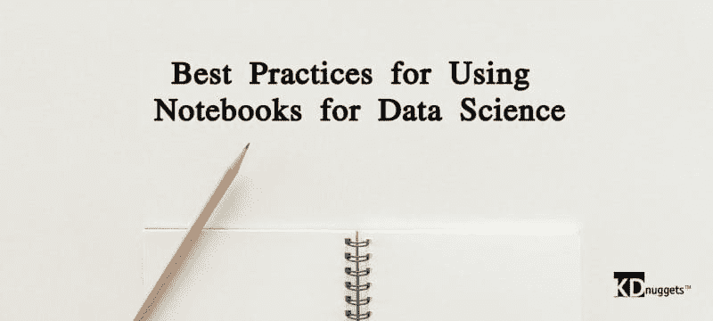

# 数据科学中使用笔记本的最佳实践

> 原文：[`www.kdnuggets.com/2018/11/best-practices-notebooks-data-science.html`](https://www.kdnuggets.com/2018/11/best-practices-notebooks-data-science.html)

 评论

**作者 [Armin Wasicek](https://www.linkedin.com/in/arminwasicek/)，Sumo Logic**

* * *

## 我们的前三个课程推荐

 1\. [谷歌网络安全证书](https://www.kdnuggets.com/google-cybersecurity) - 快速进入网络安全职业轨道

 2\. [谷歌数据分析专业证书](https://www.kdnuggets.com/google-data-analytics) - 提升你的数据分析能力

 3\. [谷歌 IT 支持专业证书](https://www.kdnuggets.com/google-itsupport) - 支持你的组织的 IT

* * *

在数据科学领域，笔记本已成为一种重要工具——它们是由个人或团队创建的活跃文档，用于编写和运行代码、显示结果以及分享成果和见解。

像其他故事一样，数据科学笔记本遵循其类型的特定结构。通常有四个部分——(1) 开始时定义数据集，(2) 继续清理和准备数据，(3) 使用数据进行建模，(4) 解释结果。本质上，笔记本应记录实验为何启动、如何进行以及展示结果的解释。

为了说明笔记本的功能，让我们退一步了解其结构，讨论人类速度与机器速度，探索笔记本如何提高生产力，并概述编写笔记本的五个最佳实践。

### **笔记本的结构**

一个笔记本将计算分为称为段落的单独步骤。每个段落包含输入和输出部分。每个段落单独执行，并修改笔记本的全局状态。状态可以定义为所有相关变量、记忆和寄存器的集合。段落中不得包含计算，但可以包含文本或可视化来说明代码的工作原理。

### **人类速度与机器速度**

笔记本的力量在于其能够分段并减缓计算速度。计算机程序的常规执行速度是机器速度。机器速度意味着当程序被提交给处理器执行时，它会尽可能快地从头到尾运行，只在 IO 或用户输入时才会阻塞。因此，程序的状态变化非常快，以至于人类无法观察或修改。程序员通常会附加调试器，在所谓的断点处停止程序并读取和分析其状态。因此，他们会将执行速度减慢到人类速度。

笔记本使得查询状态变得更加明确。某些段落专注于计算进展，即推进状态，而其他段落则仅用于读取和显示状态。此外，在执行过程中可以通过覆盖某些变量来回滚状态。也可以简单地终止当前执行，从而删除状态并重新开始。

### **笔记本作为提升生产力的工具**

笔记本通过促进逐步改进来提高生产力。修改代码和仅重新运行相关段落的成本很低。因此，在开发笔记本时，用户会建立状态，然后在该状态上进行迭代，直到取得进展。与之相对，运行一个独立的程序将需要更多的设置时间，并且可能会受到副作用的影响。笔记本更有可能将所有状态保存在工作内存中，而每次运行独立程序时都需要重新建立状态。

这需要更多的时间，并且所需的 IO 操作可能会失败。在内存中迭代程序状态被证明是非常高效的。这对于数据科学家尤其如此，因为他们的程序通常处理大量数据，这些数据需要加载到内存中以及进行可能耗时的计算。

从组织的角度来看，笔记本是知识管理的宝贵工具。它们被设计成自包含、可共享的知识单元，并能为以下方面进行修正：

+   知识转移

+   审计和验证

+   协作

### **编写笔记本的最佳实践**

所以，有兴趣实施笔记本吗？在开始这个过程时，有几个要点需要考虑：

### #1 一个笔记本，专注于一个主题。

笔记本包含了完整的程序、数据和思想记录，以传递给其他人。为此，它们需要保持专注。虽然将所有内容放在一个地方很诱人，但这可能会让读者感到困惑。不如写两个或更多的笔记本，而不是在一个笔记本中过载。

### #2 状态是明确的。

一个常见的困惑来源是程序状态在段落之间通过隐藏变量传递。代表两个后续段落之间接口的变量集合应该明确列出。应该避免引用除前一个段落外的其他段落的变量。

### #3 将代码分模块

笔记本整合了代码，但它不是代码开发的工具。代码开发工具是集成开发环境（IDE）。因此，笔记本应只包含粘合代码和一个核心算法。所有其他代码应在 IDE 中开发、单元测试、版本控制，然后通过库导入到笔记本中。模块化及其他良好的软件工程实践在笔记本中依然有效。实践表明，过多的代码会使笔记本变得杂乱，分散注意力于原始目的或分析目标。

### #4 使用明确变量并整理代码

笔记本的目的是为了分享和供他人阅读。如果我们没有提出好的、自我解释的名称，其他人可能不容易跟上我们的思路。整理代码也是很重要的。笔记本在质量上要求比传统代码更高。

### #5 标记图表

一幅图胜千言。然而，图表需要一些文字来标记轴线、描述线条和点，以及理解其他重要信息，如样本大小等。没有这些信息，读者可能难以把握图表的比例或重要性。此外，图表容易从笔记本中复制粘贴到其他文档或聊天中，这样它们会失去原始笔记本的上下文。

总结 - 思维过程的分段是笔记本强大功能的来源。在解决问题时逐步改进能提升生产力。笔记本应该提供最先进的用户体验，并结合机器学习框架，以释放数据的价值。

**简历: [Armin Wasicek](https://www.linkedin.com/in/arminwasicek/)** 是 Sumo Logic 的高级软件工程师，专注于高级分析。此前，他在学术界和工业界度过了许多年愉快的研究生涯。他的兴趣包括机器学习、安全性和物联网。Armin 拥有奥地利维也纳技术大学的博士和硕士学位，并曾在加州大学伯克利分校担任 Marie Curie 研究员。

**相关:**

+   数据科学编程最佳实践

+   如何在 Google Cloud 上设置免费的数据科学环境

+   为什么称自己为数据科学家？

### 更多内容

+   [Anaconda 的新动态！数据科学培训和云托管笔记本](https://www.kdnuggets.com/2022/11/anaconda-new-anaconda-data-science-training-cloud-hosted-notebooks.html)

+   [数据科学的 7 款最佳免费云笔记本](https://www.kdnuggets.com/top-7-free-cloud-notebooks-for-data-science)

+   [2022 年 5 款最佳免费云笔记本](https://www.kdnuggets.com/2022/04/top-5-free-cloud-notebooks-2022.html)

+   [将 ChatGPT 融入数据科学工作流程：技巧与最佳实践](https://www.kdnuggets.com/2023/05/integrating-chatgpt-data-science-workflows-tips-best-practices.html)

+   [数据科学团队协作的 5 大最佳实践](https://www.kdnuggets.com/2023/06/5-best-practices-data-science-team-collaboration.html)

+   [数据科学的 5 个 Python 最佳实践](https://www.kdnuggets.com/5-python-best-practices-for-data-science)
