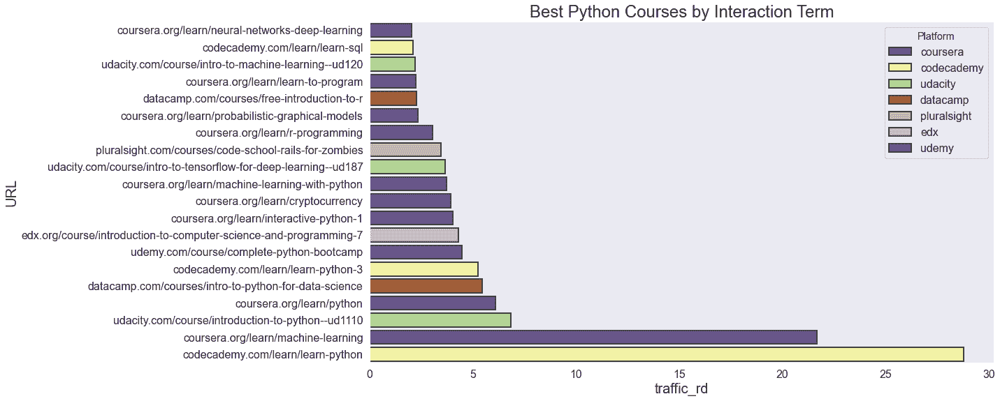

# 最佳 Python 课程：分析总结

> 原文：[`www.kdnuggets.com/2022/01/best-python-courses-analysis-summary.html`](https://www.kdnuggets.com/2022/01/best-python-courses-analysis-summary.html)

## 介绍

如果我们询问：“十大最佳 Python 课程是什么？”数据揭示了什么？收集了来自顶级平台的几乎所有课程，显示出有很多选择，共有超过 3000 个课程。

* * *

## 我们的前三大课程推荐

 1\. [谷歌网络安全证书](https://www.kdnuggets.com/google-cybersecurity) - 快速进入网络安全职业生涯

 2\. [谷歌数据分析专业证书](https://www.kdnuggets.com/google-data-analytics) - 提升你的数据分析技能

 3\. [谷歌 IT 支持专业证书](https://www.kdnuggets.com/google-itsupport) - 支持你组织的 IT

* * *

本文总结了我的分析并呈现了前三大课程。有关完整的文章，包括重现我结果所需的所有代码，请参见原文：[根据数据分析的十大最佳 Python 课程](https://www.learndatasci.com/best-python-courses/)。

## TL;DR: 胜出者

在所有收集的课程中，分析显示这些是前三名：

1.  [Codecademy 的学习 Python](https://www.learndatasci.com/out/codecademy-learn-python-3/)

1.  [Udacity 的 Python 编程入门](https://www.learndatasci.com/out/udacity-introduction-python-programming/)

1.  [Coursera 的人人编程（Python 入门）](https://www.learndatasci.com/out/coursera-programming-everybody-getting-started-python/)

如果你只是想了解推荐的课程，可以查看前三名。然而，如果你对生成这些排名的数据显示和方法感兴趣，请继续阅读完整总结。

## 妥协与假设

数据分析需要采用还原主义的方法来看待世界。通常，数据必须被选择，因为它与期望的属性有较好的相关性。这些妥协和假设是必要的，但同样重要的是能够说明我们所做的假设。这样，其他人可以对你的方法进行批评并理解其局限性。

## 假设：

+   [谷歌搜索引擎排名](http://infolab.stanford.edu/~backrub/google.html)是对反向链接数量和质量的公平反映

+   课程页面的受欢迎程度与其独特链接的数量正相关

+   课程页面的受欢迎程度与其流量正相关

+   分析中使用的平台选择是全面的

+   对页面中“Python”或顶级关键字的数据过滤没有排除相关课程或包含不相关课程

## 局限性：

+   使用的[基础 Ahrefs](https://ahrefs.com/)计划提供了 Google 上的前 50 个搜索结果，而不是所有可能的结果集

+   Ahrefs 的域名评分只是 Google 秘密算法的估计

## 数据准备

准备数据以进行分析通常是最具挑战性的步骤。在这种情况下，我：

1\. 将每个课程平台导出为单独的 CSV 文件。

我们已经知道我们需要进一步过滤数据以排除某些无关的页面，但那是后话。

2\. 确保我们的 Python 环境中有所需的库：[pandas](https://www.learndatasci.com/tutorials/python-pandas-tutorial-complete-introduction-for-beginners/)，matplotlib/seaborn，以及[scipy](https://docs.scipy.org/doc/scipy/getting_started.html)。

这些库将有助于探索和可视化数据。

3\. 创建一个空的 DataFrame，并将每个文件合并到该 DataFrame 中。

由于每个 CSV 都有自己的索引，我们需要重置索引以为合并后的数据框创建一个新索引。

4\. 检查数据以构建有意义的过滤器

这处理了第 1 点提到的问题。

5\. 删除重复项

例如，URL 可以是" http"或"https"，可能有或没有 www。

6\. 应用特征工程创建了一个引用域和流量之间的交互项。

计算流量和引用域的 z 分数，使用 scipy 库创建一个新属性：两个 z 分数的平均值。

7\. 进行了另一轮清理

例如，Codecademy 的 Python 2 课程排名第一，但被 Python 3 所取代。解决方案：我们保留了 Codecademy 的位置并切换了推荐课程。目前，人类的常识是这种分析中的一个关键输入。

## 数据可视化

正如通常情况一样，数据可视化在数据准备阶段就开始了。这有助于了解是什么使得情况变得复杂。

例如，一旦课程按其流量和引用域进行绘制，就很明显我们仍然需要进行一些主要的清理（如第 7 步所述）以移除不相关的课程。以下图表显示了一些进入数据中的无关课程：

进行可视化通常需要创建一个新的数据框，将数据分组为你所需的格式。例如，按平台分组的 Python 课程和流量条形图：

上述图表带来了一个有趣的观察：一个平台上的 Python 相关课程越多，并不一定意味着流量越多。这似乎证实了质量比数量更重要的格言。

## 定性分析

定量分析给出了我们的排名。对于一些免费的课程的定性分析，我将它们合并起来并分享了我的看法。

### 1\. [通过 Codecademy 学习 Python](https://www.learndatasci.com/out/codecademy-learn-python-3/)

证书：✔ 测验：✔ 项目：✔ 互动：✔

一门扎实的初级课程，解决 Python 问题，涵盖其他课程常常完全忽略的基础主题。

### 2\. [Udacity 的 Python 编程入门](https://www.learndatasci.com/out/udacity-introduction-python-programming/)

视频：✔ 测验：✔

尽管这门初级课程没有给我留下像其他课程那样的深刻印象，但仍然提供了很好的价值。例如，与 Codecademy 不同的是，每节课都有录制的讲座。

### 3\. [适合所有人的编程（Python 入门） by Coursera](https://www.learndatasci.com/out/coursera-programming-everybody-getting-started-python/)

证书：✔（需支付）视频：✔ 测验：✔

这门课程的视频比我试用的其他课程更有条理和趣味。课程的节奏和难度起初较低，但最终会使你达到中级水平的 Python 知识。Python 学习环境特别设计得很好。

## 结论

Codecademy 的课程看起来是开始 Python 学习的安全选择。但无论你选择哪个课程，都要尽可能多地进行项目实践。找到一个你感兴趣的问题，并持续编程，直到你有解决方案。展示你的解决方案，帮助他人，甚至将其作为职业。使用 Python —— 以及编程的一般性 —— 为自己和他人创造价值，是一个奖励性的反馈循环，将不断激励你前进和提升。

我们希望这篇文章能帮助你在 Python 学习之路上前进。查看 [原文](https://www.learndatasci.com/best-python-courses/) 以获取更多细节、完整代码以及其他前 10 名的内容。

**[布伦丹·马丁](https://www.linkedin.com/in/brendanreecemartin/)** 是创始人兼主编，[**LearnDataSci**](https://www.learndatasci.com/)。LearnDataSci 使数据科学学习在线上对每个人都可及。每月的文章旨在帮助在线学习者对数据科学和机器学习主题有直观的理解，这些主题对数据科学职业至关重要。

### 更多相关话题

+   [6 个最佳免费在线课程，助你学习 Python 并提升职业](https://www.kdnuggets.com/2022/11/corise-6-best-free-online-courses-python-boost-career.html)

+   [2022 年值得报名的 8 门数据科学课程，助力职业快速发展](https://www.kdnuggets.com/2022/02/scaler-8-best-data-science-courses-enroll-2022-steep-career-advancement.html)

+   [大学提供的 AI 最佳课程及 YouTube 播放列表](https://www.kdnuggets.com/2023/08/best-courses-ai-universities-youtube-playlists.html)

+   [6 个最佳免费在线课程，助你快速学习 SQL](https://www.kdnuggets.com/2022/10/corise-6-best-free-online-courses-jumpstart-learning-sql.html)

+   [最佳数据科学资源、训练营和课程以学习……](https://www.kdnuggets.com/2023/12/springboard-best-data-science-resources-bootcamp-courses-learn-data-science-new-year)

+   [学习数据分析和数据科学的最佳免费资源](https://www.kdnuggets.com/2024/03/365datascience-best-free-resources-learn-data-analysis-data-science)
