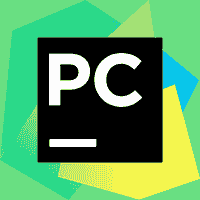
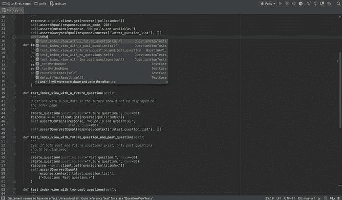
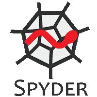
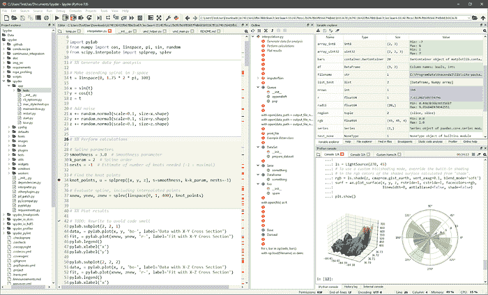
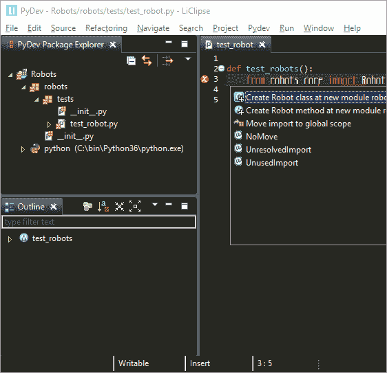
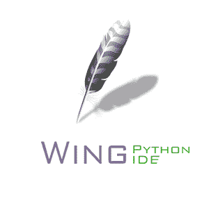
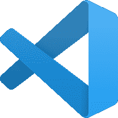
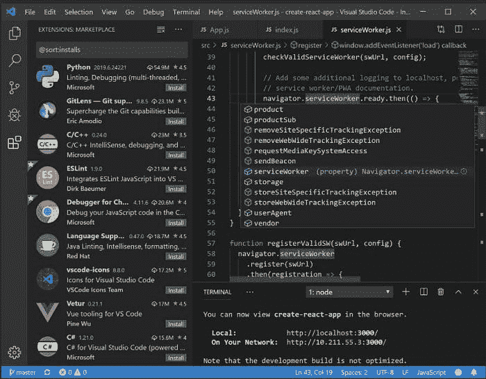
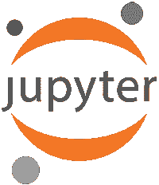
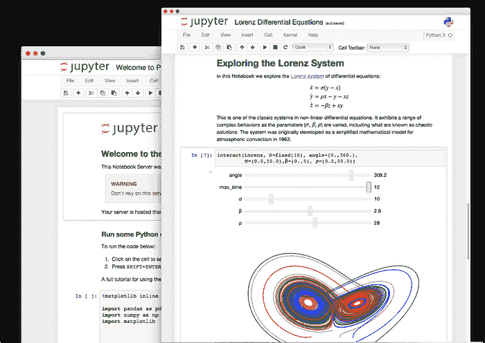

# 你应该了解的最佳 Python IDE 和代码编辑器

> 原文：[`www.kdnuggets.com/2021/01/best-python-ide-code-editors.html`](https://www.kdnuggets.com/2021/01/best-python-ide-code-editors.html)

评论

**由 [Claire D. Costa](https://www.linkedin.com/in/claire-d-costa-a0379419b/)，Digitalogy LLC 的内容撰写者和策略师**。

* * *

## 我们的前三个课程推荐

 1\. [Google 网络安全证书](https://www.kdnuggets.com/google-cybersecurity) - 快速进入网络安全职业。

 2\. [Google 数据分析专业证书](https://www.kdnuggets.com/google-data-analytics) - 提升你的数据分析技能

 3\. [Google IT 支持专业证书](https://www.kdnuggets.com/google-itsupport) - 支持你的组织进行 IT

* * *

*照片由 [luis gomes](https://www.pexels.com/@luis-gomes-166706?utm_content=attributionCopyText&utm_medium=referral&utm_source=pexels) 提供，来自 [Pexels](https://www.pexels.com/photo/blur-close-up-code-computer-546819/?utm_content=attributionCopyText&utm_medium=referral&utm_source=pexels)。*

> *Python 是对程序员需要多少自由的实验。自由过多，则没有人能读懂他人的代码；自由过少，则表达能力受到威胁。* - Guido van Rossum

自从其创建以来，Python 已迅速演变成一种多功能的编程语言，成为从 web 应用程序到被部署到[人工智能](https://blog.digitalogy.co/artificial-intelligence-technologies/)、[机器学习](https://towardsdatascience.com/machine-learning-books-you-must-read-in-2020-d6e0620b34d7)、深度学习等多个不同项目的选择。

[Python](https://www.python.org/) 拥有许多特点，例如其简单性、大量的包和库，以及相对较快的程序执行速度，仅举几例。

> GitHub 的第二大热门语言，也是机器学习中最受欢迎的语言。

对于程序员来说，**代码编辑器或 IDE** 是接触任何编程语言的第一步，因此选择它们是前进过程中最关键的步骤之一。**在本文中，我们将探讨一些顶级 Python IDE 和代码编辑器，以及你应该或不应该选择它们作为下一个项目的理由。**

根据 StackOverflow 的数据，Python 是增长最快的主要编程语言：[Stack Overflow 开发者调查 2019](https://insights.stackoverflow.com/survey/2019)

### 什么是集成开发环境（IDE）？

IDE 代表 [集成开发环境](https://press.rebus.community/programmingfundamentals/chapter/integrated-development-environment/#:~:text=An%20integrated%20development%20environment%20(IDE,IDEs%20have%20intelligent%20code%20completion.)，不仅包括用于管理代码的标准代码编辑器，还提供了一整套调试、执行和测试工具，这是软件开发的绝对必要条件。有些 IDE 还配备了内置的编译器和解释器。以下是一些**标准功能**，常见的 IDE 在单一专用环境中提供：

+   语法高亮

+   构建自动化

+   版本控制

+   可视化编程

+   代码格式化和补全

+   代码重构

+   支持与外部工具的集成

### IDE 与代码编辑器

代码编辑器或集成开发环境（IDE）是任何程序员最基本的软件，它是他们一天的开始和结束。为了实现其最大潜力，最佳的起点是一个可以基本支持 Python 的代码编辑器或 IDE，但这还不全是。**许多 **[**编程语言**](https://towardsdatascience.com/top-programming-languages-for-ai-engineers-in-2020-33a9f16a80b0) **可以完全不依赖 IDE，而有些则依赖 IDE。**

**代码编辑器 —** 代码编辑器是程序员用于应用开发的核心软件。可以将其视为一个简单的文本编辑器，但具有额外的编程特定的高级功能，例如：

+   语法高亮

+   代码格式化

+   拆分文件查看和编辑

+   即时项目切换

+   多重选择

+   跨平台支持

+   轻量级

**IDE —** 另一方面，IDE 配备了一套工具，这些工具不仅帮助开发应用程序，还帮助进行测试、调试、重构和构建自动化。不用说，在大多数情况下，IDE 可以提供代码编辑器的所有功能，但代码编辑器无法替代 IDE。

### 2020 年最佳 Python IDE 和代码编辑器

选择合适的工具至关重要。同样，在开始一个新项目时，作为程序员，你在选择完美的代码编辑器或 IDE 时有很多选择。市场上有许多 Python 的 IDE 和代码编辑器，在本节中，我们将讨论一些最佳的选项及其优缺点。

+   **PyCharm**

*图像来源 — [PyCharm](https://www.jetbrains.com/pycharm/)。*

+   **类别：** IDE

+   **首次发布日期：** 2010

+   **平台兼容性：** Windows、macOS、Linux

+   **适合人群：** 中级到高级 Python 用户

+   **支持的语言：** Python、Javascript、CoffeeScript 等

+   **价格：** Freemium（免费限制功能社区版本，付费全功能专业版本）

+   **下载：** [PyCharm 下载链接](https://www.jetbrains.com/pycharm/)

+   **使用 PyCharm Python IDE 的流行公司 —** Twitter、HP、Thoughtworks、GROUPON 和 Telephonic。

**由 JetBrains 开发**，PyCharm 是一个 **跨平台 IDE**，提供了版本控制、图形调试器、集成单元测试等多种功能，并且非常适合用于 Web 开发和数据科学任务。借助 PyCharm 的 API，开发者可以创建自定义插件，为 IDE 添加新功能。**其他功能包括：**

+   代码补全

+   实时更新代码更改

+   Python 重构

+   支持全栈 Web 开发

+   支持如 matplotlib、numpy 和 scipy 等科学工具

+   支持 Git、Mercurial 等

+   提供了付费版和社区版

**优点 —**

+   可以提高生产力和代码质量

+   高度活跃的社区支持

**缺点 —**

+   加载速度可能较慢

+   为最佳兼容性，要求对现有项目更改默认设置

+   初始安装可能较困难

**参考截图**

*图片来源 — [PyCharm](https://www.jetbrains.com/pycharm/)。*

+   **Spyder**

*图片来源 — [Spyder](https://www.spyder-ide.org/)。*

+   **类别：**IDE

+   **首次发布年份：**2009

+   **平台兼容性：**Windows、macOS、Linux

+   **适用对象：**Python 数据科学家

+   **价格：**免费

+   **下载：**[Spyder 下载链接](https://www.spyder-ide.org/)

**Spyder** 提供对 NumPy、SciPy、Matplotlib 和 Pandas 等包的支持。面向科学家、工程师和数据分析师，Spyder 提供了高级的数据探索、分析和可视化工具。**这个跨平台 IDE 的功能包括：**

+   代码补全

+   语法高亮

+   通过分析器进行代码基准测试

+   多项目处理

+   查找文件功能

+   历史日志

+   内置控制台用于内部检查

+   支持第三方插件

**优点 —**

+   包含对众多科学工具的支持

+   提供了出色的社区支持

+   互动控制台

+   轻量级

**缺点 —**

+   附带执行依赖

+   对新手来说可能有些挑战

**参考截图**

*图片来源 — [Spyder](https://www.spyder-ide.org/)。|* **[spyder-ide/spyder](https://github.com/spyder-ide/spyder)**

+   **Eclipse + Pydev**

+   **类别：**IDE

+   **首次发布年份：**2001 — **Eclipse**，2003 — **Pydev**

+   **平台兼容性：**Windows、macOS、Linux

+   **适用对象：**中级到高级 Python 用户

+   **支持语言：**Python（Eclipse 支持 Java 和许多其他编程语言）

+   **价格：**免费

+   **下载：**[PyDev 下载链接](https://www.pydev.org/)

+   **使用 PyDev 和 Eclipse Python IDE 的知名公司 —** Hike、Edify、Accenture、Wongnai 和 Webedia。

[**Eclipse**](https://www.eclipse.org/) 是最顶尖的 IDE 之一，支持包括 Python 在内的广泛编程语言的应用开发。最初用于开发 Java 应用，通过插件引入对其他编程语言的支持。用于 Python 开发的插件是 Pydev，提供了**额外的好处**，如：

+   Django、Pylint 和单元测试集成

+   互动控制台

+   远程调试器

+   跳转到定义

+   类型提示

+   自动补全代码和自动导入

**优点 —**

+   易于使用

+   程序员友好的功能

+   免费

**缺点 —**

+   复杂的用户界面使得使用起来具有挑战性

+   如果你是初学者，那么使用 Eclipse 会很困难

**参考截图**

*图片来源 — [Pydev](https://www.pydev.org/)。*

+   **IDLE**

*图片来源 — [Python](https://www.python.org/)。*

+   **类别：**IDE

+   **首次发布年份：**1998

+   **平台兼容性：**Windows、macOS、Linux

+   **适用对象：**初学 Python 用户

+   **价格：**免费

+   **下载：**[IDLE 下载链接](https://docs.python.org/3/library/idle.html)

+   **使用 IDLE Python IDE 的热门公司 —** 谷歌、维基百科、CERN、雅虎和 NASA。

IDLE 的全称是**集成开发和学习环境**，已与 Python 一起捆绑使用超过 15 年。IDLE 是一个**跨平台 IDE**，提供了一组基本功能，以保持简洁。**提供的功能包括：**

+   带有彩色代码、高亮输入、输出和错误信息的 Shell 窗口

+   支持多窗口文本编辑器

+   代码自动补全

+   代码格式化

+   文件内搜索

+   带有断点的调试器

+   支持智能缩进

**优点 —**

+   适合初学者和教育机构

**缺点 —**

+   缺少更高级 IDE 提供的功能，如项目管理能力

**[IDLE - Python 3.8.3 文档](https://docs.python.org/3/library/idle.html)**

+   **Wing**

*图片来源 — [Wing](https://wingware.com/)。*

+   **类别：**IDE

+   **首次发布年份：**2000 年 9 月 7 日

+   **平台：** Windows、Linux 和 Mac

+   **适用对象：**中级到高级 Python 用户

+   **价格：**每用户每年 $179 的商业使用费，永久商业使用许可证每用户 $245

+   **下载：**[Wing 下载链接](https://wingware.com/)

+   **使用 Wing Python IDE 的热门公司 —** Facebook、谷歌、英特尔、苹果和 NASA

功能丰富的 Python IDE Wing 旨在通过引入智能功能如智能编辑器和简单的代码导航来加快开发速度。Wing 有 101、Personal 和 Pro 三个版本，其中 Pro 版本功能最为丰富，也是唯一付费的。**Wing 的其他显著功能包括：**

+   代码补全、错误检测和质量分析

+   智能重构功能

+   互动调试器

+   单元测试集成

+   可自定义界面

+   支持远程开发

+   支持 Django、Flask 等框架

**优点 —**

+   与版本控制系统如 Git 配合良好

+   强大的调试能力

**缺点 —**

+   缺乏吸引人的用户界面

+   **Cloud9 IDE**

*图片来源 — [AmazonCloud9](https://aws.amazon.com/cloud9/)。*

+   **类别**: IDE

+   **首次发布年份: **2010

+   **平台**: Linux/MacOS/Windows

+   **使用 Cloud9 Python IDE 的流行公司 — **Linkedin、Salesforce、Mailchimp、Mozilla、Edify 和 Soundcloud。

**Amazon Web Services**的一部分，[Cloud9 IDE](https://aws.amazon.com/cloud9) 让你可以通过浏览器访问基于云的 IDE。所有代码都在亚马逊的基础设施上执行，提供了无缝且轻量的开发体验。**功能包括：**

+   需要最少的项目配置

+   强大的代码编辑器

+   代码高亮、格式化和补全功能

+   内置终端

+   强大的调试器

+   实时配对编程功能

+   即时项目设置，覆盖大多数编程语言和库

+   通过终端畅通访问多个 AWS 服务

**优点 —**

+   使无服务器应用程序的开发变得轻松

+   异常强大且全球可访问的基础设施

**缺点 —**

+   完全依赖互联网访问

+   **Sublime Text 3**

*图片来源 — [Sublime](https://www.sublimetext.com/3)。*

+   **类别: **代码编辑器

+   **首次发布年份: **2008

+   **平台兼容性: **Windows、macOS、Linux

+   **适用对象: **初学者、专业人士

+   **支持语言: **Python 和 C#

+   **价格: **免费增值

+   **下载: **[Sublime text 3 下载链接](https://www.sublimetext.com/3)

+   **使用 Sublime Text Python IDE 的流行公司 — **Starbucks、Myntra、Trivago、Stack 和 Zapier。

**Sublime Text** 是最常用的跨平台代码编辑器之一，支持多种编程语言，包括 Python。Sublime 提供多种功能，如丰富的主题进行视觉自定义、干净且无干扰的用户界面，并支持通过插件扩展核心功能的包管理器。**其他功能包括：**

+   通过包管理器获取最新插件

+   文件自动保存

+   宏功能

+   语法高亮和代码自动补全

+   同时代码编辑

+   跳转到任何位置、定义和符号

**优点 —**

+   简洁的用户界面

+   分屏编辑

+   快速且高性能的编辑器

**缺点 —**

+   令人烦恼的弹出窗口要求购买 Sublime 许可证

+   繁杂的快捷键数量

+   复杂的包管理器

+   **Visual Studio Code**

*图片来源 — [Visual Studio Code](https://code.visualstudio.com/)。*

+   **类别: **IDE

+   **首次发布年份: **2015

+   **平台兼容性: **Windows、macOS、Linux

+   **适用对象**: 专业人士

+   **支持语言：**所有主要编程语言（Python、C++、C#、CSS、Dockerfile、Go、HTML、Java、JavaScript、JSON、Less、Markdown、PHP、PowerShell、Python、SCSS、T-SQL、TypeScript）

+   **价格：**免费

+   **下载：**[Visual Studio Code 下载链接](https://code.visualstudio.com/)

+   **使用 Visual Source Code（Python IDE）的热门公司 —** The Delta Group、TwentyEight, Inc.、Focus Ponte Global、Creative Mettle 和 National Audubon Society, Inc.

**由微软开发，** Visual Studio Code 是一款备受推崇的跨平台代码编辑器，具有高度的可定制性，并允许在多种编程语言中进行开发，包括 Python。它为程序员提供了丰富的功能，如智能调试、可定制性、插件支持等。**主要亮点包括：**

+   内置对 Git 和版本控制的支持

+   代码重构

+   集成终端

+   智能感知用于更智能的代码高亮和自动完成

+   直观的代码调试功能

+   无缝部署到 Azure

**优点 —**

+   定期更新，活跃的社区支持

+   免费

**缺点 —**

+   插件数量庞大，找到合适的插件可能有挑战

+   对大文件的处理能力平平

+   启动时间较长

**参考截图**

*图片来源 — [Visual Studio Code](https://code.visualstudio.com/)。*

**[Visual Studio Code 中的 Python](https://code.visualstudio.com/docs/languages/python)**

+   **Atom**

*图片来源 — [Atom](https://atom.io/)。*

+   **类别：**代码编辑器

+   **首次发布年份：**2014

+   **平台兼容性：**Windows、macOS、Linux

+   **适合人群：**初学者、专业人士

+   **支持语言：**Python、HTML、Java 和其他 34 种语言。

+   **价格：**免费

+   **下载：**[Atom 下载链接](https://atom.io/)

+   **使用 Atom（Python IDE）的热门公司 —**埃森哲、Hubspot、Figma、Lyft 和 Typeform。

**由 GitHub 开发，** 这是源代码托管和软件版本控制领域的领先者，Atom 是一个轻量级的跨平台代码编辑器，支持 Python 和许多其他编程语言。Atom 提供了许多以插件形式呈现的功能，增强了其核心特性。它基于 HTML、JavaScript、CSS 和 Node.js，底层框架为 Electron。**提供的功能包括：**

+   通过内置的包管理器支持第三方包

+   支持开发者协作

+   超过 8000 个功能和用户体验扩展包

+   支持多窗格文件访问

+   智能代码自动完成

+   自定义选项

**优点 —**

+   轻量级代码编辑器

+   社区驱动的开发和支持

**缺点 —**

+   最近的更新增加了内存使用

+   使用前需要在设置中进行一些调整

+   **Jupyter**

*图片来源 — [Jupyter](https://jupyter.org/install.html)。*

+   **类别：**集成开发环境（IDE）

+   **首次发布年份：**2015 年 2 月

+   **浏览器兼容性：**Chrome、Firefox、Safari

+   **价格：**免费

+   **下载：**[Jupyter 下载链接](https://jupyter.org/install.html)

+   **使用 Jupyter Python IDE 的知名公司 — **Google、Bloomberg、Microsoft、IBM 和 Soundcloud。

也被称为**Project Jupyter，**它是一个[**开源**](https://blog.digitalogy.co/open-source-technology/)**和跨平台的 IDE**，许多数据科学家和分析师更倾向于使用它而不是其他工具。非常适合处理 AI、ML、DL 等技术以及包括 Python 在内的多种编程语言。Jupyter 笔记本提供了无缝的代码、文本和方程式创建与共享，用于各种目的，包括分析、可视化和开发。**提供的功能包括：**

+   代码格式化和高亮

+   通过电子邮件、Dropbox 轻松分享

+   生成交互式输出

+   与大数据兼容良好

+   可以从本地和云机器运行

**优势 —**

+   需要最少的设置

+   适合快速数据分析

**劣势 —**

+   缺乏经验的用户可能会觉得 Jupyter 复杂

**参考截图**

*图片来源 — [Jupyter](https://jupyter.org/install.html)。*

### 如何为自己选择最佳 Python IDE 和代码编辑器

选择正确的 IDE 或代码编辑器可能意味着在快速开发中节省时间，或者由于鲁莽的决策而浪费时间。我们在前一部分提到了许多 IDE 和代码编辑器及其一些显著的特性。如果您对选择哪个来进行下一个 Python 项目感到困惑，我们建议您快速阅读一下。毕竟，没有一套合适的 IDE 和代码编辑器，程序员会是什么样的呢？

**注意：**为了消除各种问题，我想提醒您，这篇文章只是我个人想要分享的意见，您有权与其不同意。

[原文](https://towardsdatascience.com/best-python-ides-and-code-editors-you-must-use-in-2020-2303a53db24)。已获得许可转载。

**简介：** [Claire D. Costa](https://www.linkedin.com/in/claire-d-costa-a0379419b/) 是 Digitalogy 的内容创作者和营销人员，Digitalogy 是一个技术采购和定制匹配市场，根据全球用户的具体需求，将他们与经过筛选的顶级开发人员和设计师连接起来。

**相关：**

+   [这里是最受欢迎的 Python IDE/编辑器](https://www.kdnuggets.com/2020/10/most-popular-python-ides-editors.html)

+   [新调查：您在 2020 年使用最多的 Python IDE/编辑器是什么？](https://www.kdnuggets.com/2020/09/poll-python-ide-editor.html)

+   [Netflix 的 Polynote 是一个新的开源框架，用于构建更好的数据科学笔记本](https://www.kdnuggets.com/2020/08/netflix-polynote-open-source-framework-better-data-science-notebooks.html)

### 更多相关主题

+   [使用管道编写干净的 Python 代码](https://www.kdnuggets.com/2021/12/write-clean-python-code-pipes.html)

+   [构建一个稳固的数据团队](https://www.kdnuggets.com/2021/12/build-solid-data-team.html)

+   [每个数据科学家都应该了解的三个 R 库（即使你使用 Python）](https://www.kdnuggets.com/2021/12/three-r-libraries-every-data-scientist-know-even-python.html)

+   [每个初学者数据科学家应掌握的 6 种预测模型](https://www.kdnuggets.com/2021/12/6-predictive-models-every-beginner-data-scientist-master.html)

+   [2021 年最佳 ETL 工具](https://www.kdnuggets.com/2021/12/mozart-best-etl-tools-2021.html)

+   [是什么让 Python 成为初创公司的理想编程语言](https://www.kdnuggets.com/2021/12/makes-python-ideal-programming-language-startups.html)
