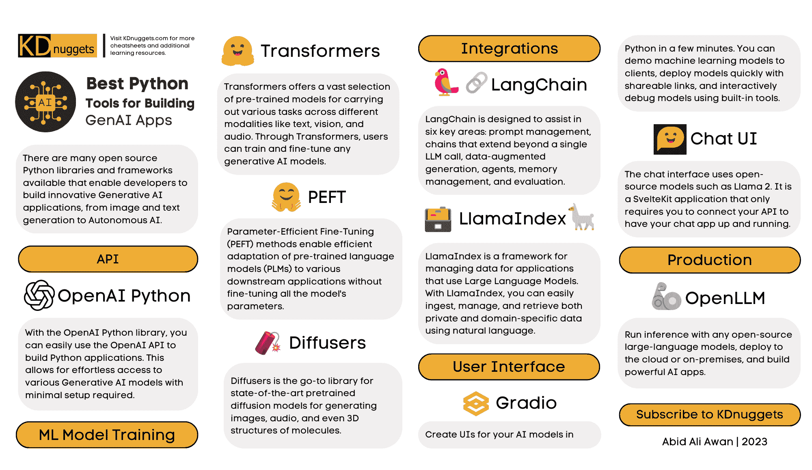

# 构建生成式 AI 应用程序的最佳 Python 工具备忘单

> 原文：[`www.kdnuggets.com/2023/08/best-python-tools-generative-ai-cheat-sheet.html`](https://www.kdnuggets.com/2023/08/best-python-tools-generative-ai-cheat-sheet.html)

# 新一代的声音

* * *

## 我们的前三大课程推荐

 1\. [Google 网络安全证书](https://www.kdnuggets.com/google-cybersecurity) - 快速进入网络安全职业。

 2\. [Google 数据分析专业证书](https://www.kdnuggets.com/google-data-analytics) - 提升你的数据分析技能

 3\. [Google IT 支持专业证书](https://www.kdnuggets.com/google-itsupport) - 支持你的组织在 IT 方面

* * *

KDnuggets 发布了一个[富有洞察力的新备忘单](https://www.kdnuggets.com/wp-content/uploads/Best_Python_Tools_for_Building_Generative_AI_Applications_KDnuggets.pdf)，突出了构建生成式 AI 应用程序的顶级 Python 库。

正如读者无疑意识到的那样，生成式 AI 目前是数据科学和机器学习中最热门的领域之一。像 ChatGPT 这样的模型凭借其从简单提示中生成出令人惊叹的高质量文本的能力，捕捉了公众的想象力。

由于其多功能性、丰富的库生态系统以及与 PyTorch 和 TensorFlow 等流行 AI 框架的轻松集成，Python 已成为开发生成式 AI 应用程序的首选语言。[KDnuggets 的这份新备忘单](https://www.kdnuggets.com/wp-content/uploads/Best_Python_Tools_for_Building_Generative_AI_Applications_KDnuggets.pdf) 提供了数据科学家在构建生成式应用程序时应了解的关键 Python 库的快速概览，从文本生成到人机聊天界面及其他领域。

要了解更多关于生成式 AI 应用程序构建中使用哪些 Python 工具的信息，[查看我们的最新备忘单](https://www.kdnuggets.com/wp-content/uploads/Best_Python_Tools_for_Building_Generative_AI_Applications_KDnuggets.pdf)。

> 目前有许多开源的 Python 库和框架可以使开发人员构建创新的生成式 AI 应用程序，从图像和文本生成到自主 AI。

涵盖的一些亮点包括 OpenAI 用于访问诸如 ChatGPT 的模型，Transformers 用于训练和微调，Gradio 用于快速构建演示模型的用户界面，LangChain 用于将多个模型链接在一起，以及 LlamaIndex 用于摄取和管理私有数据。

总体来说，这份备忘单将大量实用指南浓缩成一页。无论是希望开始使用生成式 AI 的初学者，还是经验丰富的从业者，都可以从这份精简的参考资料中受益，它提供了最好的工具和库。KDnuggets 团队在编译和视觉组织数据科学家需要的信息方面做得非常出色，为构建下一代 AI 应用程序提供了极大的便利。

[立即查看](https://www.kdnuggets.com/wp-content/uploads/Best_Python_Tools_for_Building_Generative_AI_Applications_KDnuggets.pdf)，并请继续关注以获取更多信息。

### 了解更多此话题

+   [Python 数据清理备忘单](https://www.kdnuggets.com/2023/02/data-cleaning-python-cheat-sheet.html)

+   [Python 控制流备忘单](https://www.kdnuggets.com/2022/11/python-control-flow-cheatsheet.html)

+   [KDnuggets 2023 备忘单合集](https://www.kdnuggets.com/the-kdnuggets-2023-cheat-sheet-collection)

+   [ChatGPT 备忘单](https://www.kdnuggets.com/2023/01/chatgpt-cheat-sheet.html)

+   [数据科学 Docker 备忘单](https://www.kdnuggets.com/2023/02/docker-data-science-cheat-sheet.html)

+   [Streamlit 机器学习备忘单](https://www.kdnuggets.com/2023/01/streamlit-machine-learning-cheat-sheet.html)
