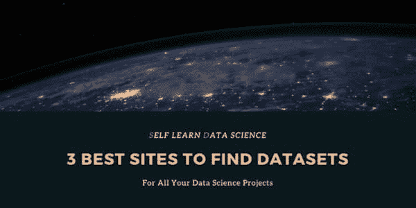
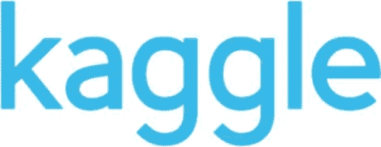
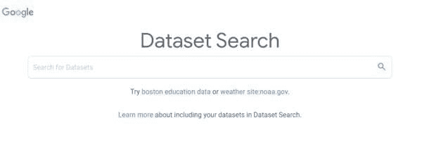
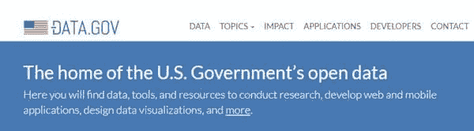

# 找到数据科学项目所需数据集的 3 个最佳网站

> 原文：[`www.kdnuggets.com/2020/04/best-sites-datasets-data-science.html`](https://www.kdnuggets.com/2020/04/best-sites-datasets-data-science.html)

评论

**由[Angelia Toh](https://selflearndatascience.com/), Self Learn Data Science 的联合创始人**。

* * *

## 我们的三大课程推荐

 1\. [Google 网络安全证书](https://www.kdnuggets.com/google-cybersecurity) - 快速开启网络安全职业生涯。

 2\. [Google 数据分析专业证书](https://www.kdnuggets.com/google-data-analytics) - 提升您的数据分析技能

 3\. [Google IT 支持专业证书](https://www.kdnuggets.com/google-itsupport) - 支持您的组织的 IT 工作

* * *

在您的数据科学学习旅程中，您不可避免地会需要寻找数据集。特别是当我们提倡在‘[如何在 2020 年成为数据科学家](https://selflearndatascience.com/how-to-become-a-data-scientist/)’中进行数据科学项目时，您应该始终关注那些可以进行实验的有趣数据集。在这里，我们列出了 3 个最佳网站，供您获取数据科学项目的数据集。

### 1\. [Kaggle](https://www.kaggle.com/)

您现在应该对 Kaggle 非常熟悉了。公司们一直在 Kaggle 上发布他们的数据，以利用社区的力量来解决现实生活中的问题。这使得 Kaggle 成为寻找具有实际问题陈述的数据集的理想场所。如果您想练习构建机器学习模型而不必麻烦地生成或标记数据，Kaggle 是最适合您的地方。此外，Kaggle 的笔记本部分允许用户分享他们的代码和模型，这些都可以作为极好的学习资源。我强烈推荐初学者在 Kaggle 上找到他们的第一个数据科学项目。

### 2\. [Google Dataset Search](https://datasetsearch.research.google.com/)

2020 年初刚刚推出的 Google Dataset Search 是最全面的数据集搜索引擎。它声称可以索引超过 2500 万个在线数据集，并且自 2018 年 9 月推出以来，已帮助科学家和研究人员更好地定位数据集。具备按数据类型、更新时间等条件进行筛选的功能，Google Dataset Search 已成为我们大多数人的首选。

如果数据集可以在网上找到，您一定可以通过搜索引擎找到它。

### 3\. [Data.gov](https://www.data.gov/)

在寻找数据科学数据集时，你可能会想查看你的政府发布的公开数据。这些数据如果得到有效利用，可能会带来对整个社区有益的解决方案。Data.gov 是一个由美国政府提供的开放数据湖，政府的数据被发布以促进科学社区内的研究和发展。在 Data.gov 上，数据按健康、能源或教育等主题分类，使得导航和查找所需数据变得容易。

如果你不是美国居民呢？试着用你喜欢的搜索引擎搜索“data your country”。通常，你会找到你所在国家政府发布数据的网站。例如，[这里](https://data.gov.in/) 是印度的数据网站，而 [这个](https://data.gov.uk/) 是英国的数据网站。

使用这些网站，你将能够找到任何你感兴趣的数据集。记住，实践数据科学是最好的学习方式。所以保持这些网站的访问，你肯定会需要它们。

**简介：**[Angelia Toh](https://www.facebook.com/angelia.toh.12)，‘Impossible’ 只是提醒我‘I’m possible’。永远不要停止学习 | 自学数据科学家，自学数据科学的共同创始人。

**相关：**

+   [20+ 个机器学习数据集和项目创意](https://www.kdnuggets.com/2020/03/20-machine-learning-datasets-project-ideas.html)

+   [大型 NLP 数据库：访问近 300 个数据集](https://www.kdnuggets.com/2020/02/big-bad-nlp-database.html)

+   [谷歌数据集搜索提供 2500 万个数据集的访问](https://www.kdnuggets.com/2020/01/google-dataset-search.html)

### 更多相关主题

+   [停止学习数据科学以寻找目的，并寻找目的以……](https://www.kdnuggets.com/2021/12/stop-learning-data-science-find-purpose.html)

+   [如何找到最佳的数据科学远程工作](https://www.kdnuggets.com/2022/12/find-best-data-science-remote-jobs.html)

+   [快速指南：找到合适的标注人员](https://www.kdnuggets.com/2022/04/quick-guide-find-right-minds-annotation.html)

+   [在图像中找到图片而无需标记](https://www.kdnuggets.com/2022/09/find-picture-image-without-marking.html)

+   [如何构建模型以找到用户旅程中最有影响力的路径](https://www.kdnuggets.com/2022/09/objectiv-build-model-impactful-paths-user-journeys.html)

+   [如何在 Python 中找到集合差异](https://www.kdnuggets.com/2023/03/find-set-difference-python.html)
