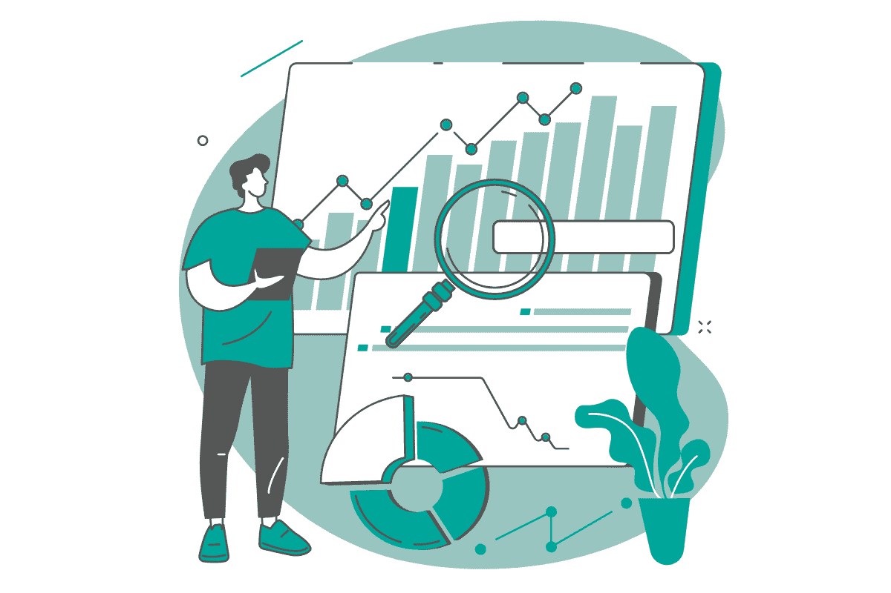
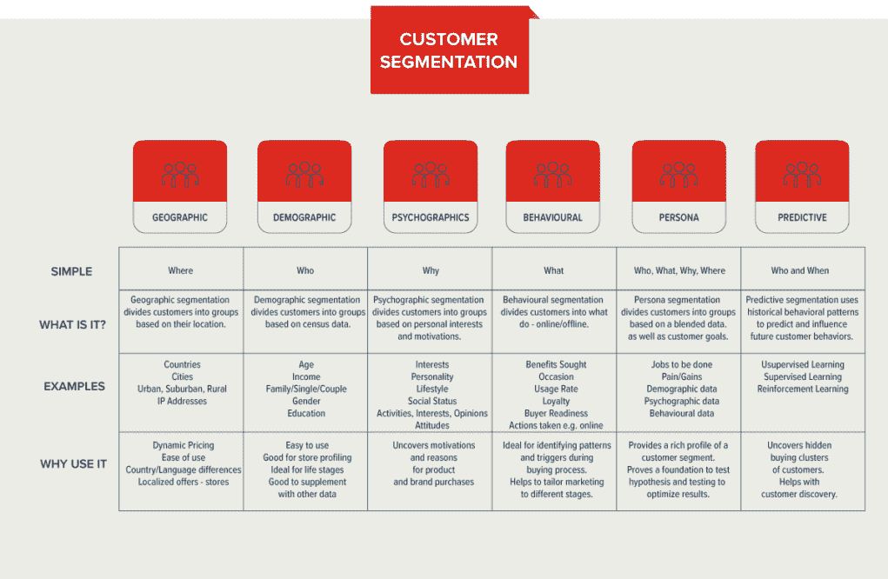
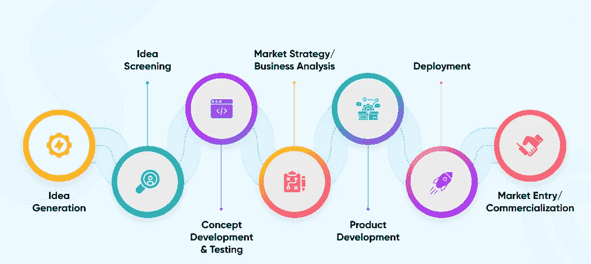

# 如何更好地利用数据科学促进业务增长

> 原文：[`www.kdnuggets.com/2022/08/better-leverage-data-science-business-growth.html`](https://www.kdnuggets.com/2022/08/better-leverage-data-science-business-growth.html)

关于世界如何变化以及如何与之开展业务的讨论很多，我们生活在一个前所未有的时代，一切都不再如从前。主要的“罪魁祸首”是技术进步，随之而来的是全球流通的数据量，以及这些数据以某种方式等待被使用。

* * *

## 我们的三大课程推荐

 1\. [谷歌网络安全证书](https://www.kdnuggets.com/google-cybersecurity) - 快速进入网络安全职业生涯。

 2\. [谷歌数据分析专业证书](https://www.kdnuggets.com/google-data-analytics) - 提升你的数据分析技能

 3\. [谷歌 IT 支持专业证书](https://www.kdnuggets.com/google-itsupport) - 支持你的组织进行 IT 管理

* * *

但，这种变化是否深刻到动摇了商业的基础？当你深入了解时，一切其实没有改变。正如保罗·西蒙所写，“在经历了不断的变化后，我们或多或少还是一样的。”这也适用这里吗？

我们不否认数据对商业世界的影响。然而，商业的成功仍然归结为两个问题，你需要回答：

+   针对谁？

+   什么？

针对谁，或者说你的客户是谁？这仍然是任何业务的起始点。你的产品可能很完美（或者你这么认为！），但如果没人购买它，那也无所谓。商业的关键是销售。因此，你需要找到那些愿意以对你和他们都合适的价格购买你产品的人。

你销售的是什么，换句话说，就是你的产品。这是你业务的另一个基础。你想销售的东西从一个想法开始。但在产品进入市场之前，需要进行复杂的工作，包括产品的开发、设计、质量检查、包装、定价、营销策略等。

业务中的这两种力量是交替的，你的客户影响你的产品，反之亦然。

然后进入第三部分，数据的影响得到充分体现。这是你做事的方式。你可以使用传统方法：依赖所谓的商业直觉，这样你不需要任何数据，一切都顺利，直到突然出现严重问题。

或者你可以采用‘现代方法’，即使用数据科学来帮助你做出业务决策。这里的关键词是‘帮助’。数据科学正是做到这一点的工具。它仅仅是一个工具，可以帮助你做出更好的业务决策，并将不良决策降到最低。数据科学不会取代人的理性，它不会代替你做决定，也绝对不完美。但它可以帮助你做出明智的决定，让你的商业直觉在数据无助的情况下发挥作用。

如何将数据科学融入这些业务基础中以推动业务增长？我们将来看一些例子。

# 客户分析

如果不了解你的客户，你就不知道他们想要什么和需要什么。了解这些对确定提供哪些产品至关重要。没有这些，就没有销售，更谈不上业务增长。

根据[Qualtrics](https://www.qualtrics.com/m/assets/wp-content/uploads/2018/08/AI-in-MR-Final.pdf)的报告，有五种技术将影响市场研究行业：

+   高级数据分析

+   自动化统计分析

+   自然语言处理

+   文本分析

+   物联网（IoT）

根据你处理的分析类型，这些技术的使用程度有所不同。

## 客户细分

*来源:* [*https://www.garyfox.co/customer-segmentation/*](https://www.garyfox.co/customer-segmentation/)

技术使你能够以一种直到最近才可能实现的方式对客户进行细分。要做到这一点，你需要收集大量的数据。

这可以从简单的地理区域划分开始，你可以收集如客户所在国家、城市和 IP 地址等数据。

然后你可以包括人口统计数据，如客户的年龄、收入、婚姻状况、性别、教育背景和种族。

当然，客户购买你产品的意愿不仅仅取决于他们的位置或年龄。你可以更进一步，收集关于他们的个性、生活方式、兴趣和观点的数据。

这已经是相当大量的数据，高级数据分析和自动化统计分析可以帮助你处理这些数据。数据科学可以使这种细分变得比你手动细分数据要快得多、准确得多、详细得多。

自然语言处理和文本分析在这里也可以发挥作用。越来越多的数据以音频文件或社交媒体（以及互联网的一般形式）上的文本形式被收集，包括帖子、评论、评价、短信等。想象一下逐条阅读每一个客户的评论，这几乎是不可能的！

数据科学允许根据这些数据进行更复杂的细分。你可以根据客户的行为进行细分，这使得基于综合数据创建客户画像成为可能。从这里可以分析客户的行为或言论，并预测和影响他们的行为。这是一个你比客户更了解他们自己的层次。

## 客户定位

一旦你对你的（潜在）客户了如指掌，你就可以更有信心地针对他们。这意味着在正确的时间和正确的价格向他们提供合适的产品。根据你的数据，你知道你不会向喜欢阅读哲学书籍的人推荐惊悚小说。但如果你有一部**伊曼努尔·康德**的《实践理性批判》的优秀新译本，可能正合他们的胃口。

他们的社会地位是什么？收入是多少？也许他们想买这本书但目前买不起？针对首批购买者的特别优惠怎么样？

这都是客户细分的扩展。它不仅有助于将你当前的产品提供给正确的市场，还可以朝另一个方向发展——即，决定开发新产品来进入其他市场细分。

## 保持顾客（满意）

保持客户与获取新客户同样重要。如果你在获取新客户的同时，现有客户却以更快的速度流失，那你就是在做错事！这没有增长！而且，如果客户知道你在保持他们方面做得不好，会使得新客户不愿意购买你的产品或使用你的服务。

顾客希望看到一种让他们感到被理解的个人化方式。你有机会通过使用你所拥有的大量数据来了解他们。

你还想奖励他们的忠诚。给他们一些额外的东西。否则，他们会转向竞争对手。

你想了解他们对产品或服务的满意度。他们希望产品设计、功能、质量和价格方面得到哪些改进。谁不喜欢时不时享受一些特别的优惠和福利呢？

再次，数据在这里发挥着重要作用。你可以利用它来计算明确告诉你客户忠诚度的指标。

例如，净推荐值（Net Promoter Score）表示客户对你的品牌的感受，以及他们是否愿意向家人和朋友推荐它。

另一个衡量忠诚度的方式可能是重复购买。公司内部定义了重复购买的标准，包括购买次数和每次购买之间的时间。然后你可以调查为什么有些客户留在你这里而有些客户没有。如果趋势是负面的，你可以扭转它。如果是积极的，你可以继续保持并在这个趋势上做得更好。

数据科学使你能够量化参与度水平。这个指标并不关注购买，但可以反映客户的满意度。它可能包括数据，如关注你社交媒体的客户数量，喜欢和评论你的帖子，分享帖子，评价你的产品或服务等。分享比点赞更好吗？评论比分享更好吗？评论是正面的还是负面的？赋予这些可能意味着一切或什么都不意味着的信息的价值，这就是数据科学的作用。例如，通过确定评论的“情感”，无论是高度积极、积极、中立、消极还是极度消极。你可以为此校准机器学习算法。速度更快，结果更一致。算法的世界观不会因为喝了一杯早晨咖啡而有所不同。

其中一个关键指标是流失率，它给出了新获得客户与保留客户的比例。这也可以帮助你检测是否存在客户流入或流出及其原因。如果没有这个指标，你只能猜测。但当你找到问题的原因时，解决其影响会更容易。

客户忠诚度指数更关注于客户的意图（未来）而非过去。换句话说，他们有多大可能推荐你、再次购买你的产品并尝试你的其他产品？

所有这些指标都帮助你了解自己在客户忠诚度方面的现状。从这里开始，你可以着手改善。你可以通过向客户提供个性化的优惠、忠诚度计划、折扣、新产品等来实现这一点。

# 产品开发

知道提供什么与向谁提供是紧密相连的。客户想要什么在每一个产品开发过程中都得到了体现。

了解客户的需求，你可以识别市场上的缺失。是全新的产品吗？是现有产品但增加了一些额外功能吗？也许是相同的功能但更具用户友好性？或者仅仅是设计上的不同，以便吸引客户？

在产品开发中使用数据科学可以更快地对市场和客户需求的变化做出反应，这反过来使你的业务有可能实现那些你本来会错过的销售。

*来源:* [*https://www.netsolutions.com/insights/everything-about-new-product-development/*](https://www.netsolutions.com/insights/everything-about-new-product_development/)

看着产品开发的步骤，你可以很容易地想象到数据科学可以帮助几乎每一个阶段。

## 产品创意分析

例如，分析创意的可行性及其市场潜力，你的竞争对手是谁，以及如何有所不同。这包括产品功能、设计、包装、定价和营销策略。

在筛选创意时，你必须考虑客户的需求、你是否能提供这些需求以及成本是多少。你拥有的这个伟大创意是否可行且有市场？一旦分析了所有数据，你可以开始开发和测试你的概念。

## 产品概念开发

当你开发和测试概念时，你应该再次考虑对客户的好处、市场上是否有类似产品、你的竞争对手是谁以及他们在做什么。

你能提供一些不同的东西来夺取竞争对手的市场份额或在他们之间占据一席之地吗？收集的关于客户对你概念创意的反应的数据可以告诉你你做对了什么。当然，你还可以通过获取客户的想法来改进你的概念。

## 市场营销策略

说到市场营销，细分再次出现。你的（潜在）客户是谁？根据你的回答，你应该调整产品设计、包装、定价、市场营销方式和分销方式，以满足客户需求。

## 产品开发或制造

在识别市场后，可以根据收集的数据及其分析开发产品。这意味着根据你的概念创建功能、设计产品并进行测试。

使用机器学习加快产品设计和工程，提高产品测试的精确度和自动化水平。

依靠数据科学来完全或部分自动化产品开发过程，从而降低你的成本，从创意到产品上市所需的时间，以及产品的质量。

这在数字产品方面尤其真实。但如果你在制造业，产品开发过程是类似的。同样，数据科学可以提供极大的帮助。你仍然需要开发产品、设计它、测试其质量并决定如何以及向谁市场推广。

## 产品改进

虽然这不严格属于数据开发的部分，但它必须不断改进，以使产品获得市场份额并保持市场份额。必须添加新功能或改进现有功能，以跟上竞争和不断变化的客户口味。

为了解决这个问题，数据科学可以通过其推荐引擎帮助你预测用户对产品（或产品的特定元素）的评分。这样，你可以找出如何改进与产品相关的任何方面，并提高客户满意度，从而支持你的增长。

# 市场营销分析

这与客户分析紧密相关，但也有额外的维度。

首先，你需要将客户进行细分，以便你可以将市场营销策略量身定制到特定的细分市场。一刀切的方法在这里行不通！

在市场营销分析中，[根据 Dr. Alan Zhang](https://towardsdatascience.com/marketing-analytics-anyone-can-do-it-750d8ca63806)，你需要处理：

+   客户生命周期

+   市场营销渠道

客户生命周期是与客户分析共享的方面。

然而，市场分析的一个额外元素是分析营销渠道。数据科学用于确定每个客户群体应使用哪些营销渠道、何时是最适合的目标时机、使用哪些营销活动等。

必须使用指标来评估营销决策。根据所选择的渠道和策略，点击率、跳出率、转化率、独立访客数、投资回报率等指标可以帮助你评估和改进你的营销决策。

# 内部流程

向正确的市场提供正确的产品，正如我们所看到的，也是一个可以通过数据科学优化的内部流程。还有其他一些内部流程虽然不直接与这两个业务基础相关，但同样重要，并且可能产生巨大的影响。

## 库存管理和分销

为了满足客户需求，你必须建立库存管理系统。通过数据科学，你可以实时获取库存信息。从那里，你可以向客户提供有关特定产品的可用性和位置的准确资讯。你可以停止积压那些销售不佳的产品，同时避免某些高需求产品的持续缺货问题。

你可以战略性地找到最佳的仓库和商店位置及规模、库存量、员工人数等。这不仅能让你迅速响应客户需求的变化，还能预测这些变化。

分销方面也是如此。你是否想使用自己的车队将产品送到客户手中？或者应该使用其他公司的服务？成本在这里扮演了重要角色，但交货时间也是关键。不仅客户收到产品的速度更快，而且通过数据分析，你的交货时间估算也能更加准确。然后你可以利用实际交货时间来检测流程中的不足。分析可能会导致决定使用自己的车队、雇用更多或更少的司机、优化配送路线、寻找新的运输方式、预测燃料成本、交通堵塞、延误等。这一切可以保持你的成本低，同时实现客户对可靠性和速度的期望。

与此相关的是，如果你在制造业中，使用数据科学来预测故障率，并调整生产线以应对需求的增加或减少。

## 人力资源

显而易见的是，要利用数据科学来推动业务增长，你需要[数据科学家](https://www.stratascratch.com/blog/what-does-a-data-scientist-do/)。不仅仅是他们，还需要一整套不同职位的专家，这些专家在公司成长过程中将变得必不可少。你怎么知道需要哪些[技能](https://www.stratascratch.com/blog/what-skills-do-you-need-as-a-data-scientist/)? 新员工表现如何？你只看重专业技能，还是员工的个性也很重要？同样重要的是，如何留住优秀员工？

人力资源管理可以从数据科学中受益。使用对候选人数据的算法可以帮助你确定适合的候选人，包括他们的教育背景、专业技能和个性。这样，你可以预测哪些候选人最有可能成为顶尖表现者。这大大改变了依靠直觉招聘的旧方式。

通过在培训和发展中使用数据科学，你可以摆脱一刀切的做法。员工各不相同。他们学习的方式不同（例如，有些人喜欢理论或实践方法），兴趣（例如，有些人渴望成为领导者，而有些人想更好地完成工作）或动机（例如，有些人更受金钱驱动，有些人则被学习新知识激励）也各异。为每个人量身定制培训和发展计划将使他们的潜力得到最大限度的发挥，同时保持他们的快乐。你只能从愿意留在公司并且满意的高质量员工中获益。

人力资源也可以在劳动力预测中使用数据科学。招聘是一个昂贵且耗时的过程。数据科学有助于预测劳动力需求的增加。这是业务增长的功能，但还需要考虑其他因素。知道你需要更多员工是一回事，了解员工的个人特征则是另一回事。就业市场的情况如何？你需要的人才是否存在？如果存在，他们的薪资是多少？使用数据科学可以预测这些变量，并通过在合适的时间招聘合适的人才来支持你的增长。

## 报告

小公司可能甚至不需要复杂的报告。将大部分数据保存在脑海中是很容易的，你大致知道自己的位置，可以自信地依靠直觉。然而，随着公司成长，你会意识到没有任何报告来导航你的业务会越来越像是在夜间、雾中、下雪时戴着眼罩驾驶。

拥有一个从数据源、经过分析到报告的数据管道，从而使你能够做出业务决策，变得至关重要。数据工程师、数据库设计师和管理员、数据分析师、统计学家以及 BI 开发人员，在拥有合适的工具的情况下，能够为你创造奇迹。

你可能会从基础知识开始，只将数据用于描述性目的。换句话说，你可以找出发生了什么。

从那时起，你可以以越来越复杂的方式使用数据。不仅仅是了解发生了什么，你还可以预测未来会发生什么，应该做些什么来使某些事情发生（或不发生），甚至发现数据集之间的未知联系，并弄清楚事情发生的原因和方式。

这难道不是任何想要增长的企业都希望了解的内容吗？

# 摘要

从我们的角度来看，数据和数据科学对业务运营产生了巨大影响，同时又没有改变什么。[公司](https://www.stratascratch.com/blog/11-best-companies-to-work-for-as-a-data-scientist/)仍然需要拥有产品或服务，并且必须销售才能生存和发展。然而，企业可以提供的产品类型、它们如何开发这些产品以及如何接触客户正在发生彻底的变化。

数据对业务运作产生了关键影响。然而，数据本身毫无意义，除非将其转化为信息和洞察。为此，你需要数据科学家。毫不奇怪，数据科学家多年来一直供不应求。他们的专业知识和不断增长的数据科学工具可以改变你业务的几乎每个方面：从产品设计、开发、测试和制造，到营销、定价、库存管理、分销、招聘和报告。

抵抗这种变化就像是在自残。

**[内特·罗西迪](https://www.stratascratch.com)** 是一位数据科学家和产品策略专家。他还是一名兼职教授，教授分析学，并且是[StrataScratch](https://www.stratascratch.com/)，一个帮助数据科学家准备顶级公司面试问题的平台的创始人。可以通过[Twitter: StrataScratch](https://twitter.com/StrataScratch)或[LinkedIn](https://www.linkedin.com/in/nathanrosidi/)与他联系。

### 了解更多相关话题

+   [学习数据科学和商业分析以推动创新和增长](https://www.kdnuggets.com/2023/08/learn-data-science-business-analytics-drive-innovation-growth.html)

+   [如何利用分析加速业务增长？](https://www.kdnuggets.com/2022/12/analytics-accelerate-business-growth.html)

+   [基于 LLM 的自主代理背后的增长](https://www.kdnuggets.com/the-growth-behind-llmbased-autonomous-agents)

+   [使用 RAPIDS cuDF 利用 GPU 进行特征工程](https://www.kdnuggets.com/2023/06/rapids-cudf-leverage-gpu-feature-engineering.html)

+   [如何利用 Docker 缓存优化构建速度](https://www.kdnuggets.com/how-to-leverage-docker-cache-for-optimizing-build-speeds)

+   [推动更好的商业决策](https://www.kdnuggets.com/2022/04/informs-driving-better-business-decisions.html)
