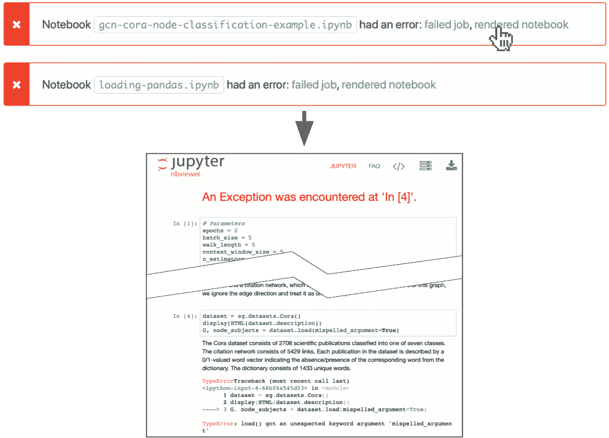
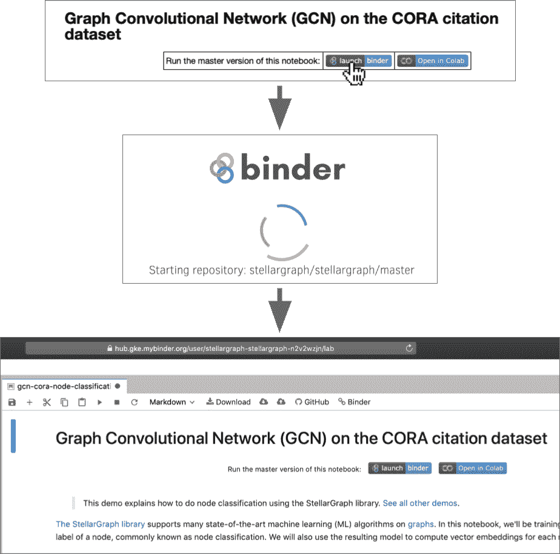
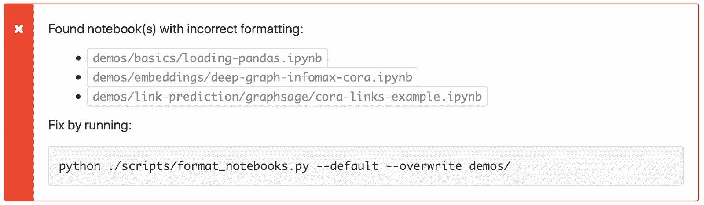

# 通过 CI 改进笔记本：自动测试图机器学习文档

> 原文：[`www.kdnuggets.com/2020/04/better-notebooks-through-ci-automatically-testing-documentation-graph-machine-learning.html`](https://www.kdnuggets.com/2020/04/better-notebooks-through-ci-automatically-testing-documentation-graph-machine-learning.html)

评论

**由 [Huon Wilson](https://www.linkedin.com/in/huon-wilson/)，CSIRO Data61**

照片由 [Martin Adams](https://unsplash.com/@martinadams?utm_source=unsplash&utm_medium=referral&utm_content=creditCopyText) 提供，来源于 [Unsplash](https://unsplash.com/s/photos/kite?utm_source=unsplash&utm_medium=referral&utm_content=creditCopyText)

构建数据科学库就像在两个世界之间行走：数据科学由 Python 笔记本主导，这是一种快速便捷的浏览器代码实验和演示方式，而软件工程则专注于使软件可靠和可重复。[StellarGraph](https://github.com/stellargraph/stellargraph) 使用持续集成来保持两者的优点。

StellarGraph 是一个开源、用户友好的 Python 库，用于 [图机器学习](https://medium.com/stellargraph/knowing-your-neighbours-machine-learning-on-graphs-9b7c3d0d5896)，基于 TensorFlow 和 Keras 构建。它提供了 [大量演示](https://github.com/stellargraph/stellargraph/tree/develop/demos) 功能的方式，即 [Jupyter 笔记本](https://jupyter.org/)，帮助数据科学家和其他人开始解决实际问题。这些演示可以直接在 GitHub 上查看，甚至有链接可以在 [Binder](https://mybinder.org/) 和 [Google Colab](https://colab.research.google.com/) 云服务中自动运行。

随着 StellarGraph 1.0 版本计划于本月晚些时候发布，我们已经开发了自动化流程，以确保我们的演示能够工作——并将继续工作——即使我们对库进行重大改进。

在这篇文章中，我们将详细介绍支持我们保持库的演示内容最新和信息丰富的持续集成（CI）。

### 工作原理

StellarGraph 的笔记本 CI 主要有三种工作方式：

+   验证每个笔记本是否 **最新并成功运行**，使用 [papermill](https://papermill.readthedocs.io/en/latest/) 来 **保持 CI 快速**，以提供良好的开发者体验

+   提供链接到 [nbviewer](https://nbviewer.jupyter.org/) 以 **方便地查看失败**，在浏览器中以良好渲染的方式显示

+   通过确保每个笔记本都有指向云服务的链接和相同的格式来检查我们是否提供了 **一致的体验**，使用 [black](https://github.com/psf/black) 和自定义代码。

让我们深入了解每一个细节。

### 高速度；可靠性；人类——选择两个

文档和示例在准确时最为有用。StellarGraph 是一个活跃的项目，拥有[不断的改进和修复](https://github.com/stellargraph/stellargraph/pulse/monthly)；这些改进使我们能够使笔记本更好，有些变化需要调整一个或两个笔记本。所有这些都必须做到*完美*。

我们的目标是确保**每个演示每次都能正常工作**，遵循[“不是火箭科学”软件工程原则](https://graydon2.dreamwidth.org/1597.html)。在逐个拉取请求的基础上保持笔记本的正常工作要容易得多。如果我们不保持它们的更新，我们可能需要很长时间才能发现它们已损坏，更不用说诊断原因并修复它们了。

我们非常小心，并根据需要更新和重新运行笔记本，但人类很容易犯错误。StellarGraph 拥有 40 多个笔记本，每周合并约 25 个拉取请求。这意味着即使是低错误率也会导致*大量*损坏的笔记本。

*软件退化：每周有 25 个拉取请求，每个拉取请求破坏笔记本的几率即使很低（1%），所有笔记本在一周后正常工作的概率会降到零。*

例如，假设每个拉取请求只有 1% 的概率使某些笔记本停止工作。即使是很小的几率，这意味着所有笔记本在一周后正常工作的概率只有 78%，一个月后则低于 40%。

我们尝试通过手动代码审查来保持笔记本的正常运行，使用[ReviewNB](https://www.reviewnb.com/) 应用程序。ReviewNB 提供比原始 JSON 更有用的差异，使得讨论良好和不那么好的更改变得容易。然而，人类是容易犯错的，可能会遗漏问题。此外，代码审查仅突出显示已编辑的笔记本；它不会突出显示*应该*编辑的笔记本！

### 自动运行笔记本

为了帮助我们人类，我们还利用计算机来检查笔记本：CI 检查它们在每个拉取请求和每次合并时是否正常运行，除了单元测试之外。但 CI 最有效的方式是快速，而我们的大多数笔记本展示了重量级机器学习，*这还不够快*。

减少 CI 时间的最简单方法是并行工作。几乎所有的笔记本仅依赖于 StellarGraph 库，因此它们可以独立执行。我们[并发](https://github.com/stellargraph/stellargraph/blob/59d269a10f207b6b5e5c2b891de8bd3d5408cb3b/.buildkite/pipeline.yml#L86)地[运行](https://github.com/stellargraph/stellargraph/blob/59d269a10f207b6b5e5c2b891de8bd3d5408cb3b/.buildkite/steps/test-demo-notebooks.sh)它们，使用[并行作业](https://buildkite.com/docs/tutorials/parallel-builds#parallel-jobs)在[Buildkite CI](https://buildkite.com/)上，但这仍然不够：一些笔记本单独运行时间过长。

我们使用[papermill](https://papermill.readthedocs.io/en/latest/)来[执行我们的笔记本](https://github.com/stellargraph/stellargraph/blob/59d269a10f207b6b5e5c2b891de8bd3d5408cb3b/.buildkite/steps/test-single-notebook.sh#L14)，因为它支持[参数化](https://papermill.readthedocs.io/en/latest/usage-parameterize.html)：在 CI 上运行时，我们的笔记本会训练其模型较短时间，或者计算较短的随机游走，或进行其他优化。

Papermill 的参数化功能允许我们在不需要在每个演示中添加丑陋的“我们在 CI 上吗”条件代码的情况下完成这一点。对于需要参数化的笔记本，我们只需稍作重构，使其包含一个需要调整的参数的单个单元格。然后，可以通过[a YAML 文件](https://github.com/stellargraph/stellargraph/blob/develop/.buildkite/notebook-parameters.yml)和参数 _file 选项替换新值。

这些笔记本在 CI 上暂时运行，因此模型的准确性并不是很重要。主要需要的是执行每一个代码路径，以验证一切是否正常。我们优化参数，使其尽可能小，同时仍然能处理每个边界情况，例如只将训练周期减少到两个而不是一个，以捕捉在周期之间发生的任何问题。

如果出现问题，比如函数参数更改或甚至内存不足，笔记本将无法运行，我们的测试也会失败。这立即告诉我们需要更多的更改以保持一切正常。

### 使用 Buildkite 构件和注释来突出显示错误

CI 帮助我们看到何时出了问题，但更好的方式是了解确切的问题。Papermill 通过记录笔记本的所有 stdout 和 stderr 输出来提供帮助；但深入查看冗长的 CI 日志是麻烦的。此外，这些日志通常缺乏足够的上下文，难以轻松理解问题，尤其是与笔记本的渲染视图相比，错误附加到单个单元格中，以及任何其他相关的单元格。

运行笔记本后，CI[将结果笔记本附加](https://github.com/stellargraph/stellargraph/blob/59d269a10f207b6b5e5c2b891de8bd3d5408cb3b/.buildkite/steps/test-single-notebook.sh#L18-L20)到执行它的步骤，无论是否通过。如果执行失败，这个输出笔记本将包括异常或其他错误。

我们使用的是一个[Buildkite 上的公共管道](https://buildkite.com/stellar/stellargraph-public)，因此构件是公开可见的，这意味着拉取请求的作者——或任何其他人——可以点击并下载它们以检查问题。

*当*[*笔记本在 CI 中失败*](https://github.com/stellargraph/stellargraph/pull/1215)*时，*[*会自动添加一个链接来查看失败的笔记本*](https://nbviewer.jupyter.org/urls/buildkite.com/organizations/stellar/pipelines/stellargraph-public/builds/2998/jobs/3203e1e3-77c6-45a5-a1b0-bb2fec15f795/artifacts/0d8d3f6e-f14e-4475-9d08-3921a3db1847)* 到 nbviewer，并且*[*该链接会自动添加到构建中*](https://buildkite.com/stellar/stellargraph-public/builds/2998#annotation-gcn-cora-node-classification-example.ipynb-3203e1e3-77c6-45a5-a1b0-bb2fec15f795)*。*

我们还大量使用 Buildkite。 [Nbviewer](https://nbviewer.jupyter.org/) 可以渲染任何公共的 Jupyter 笔记本 URL，包括这些文档。我们的 CI 创建了直接在浏览器中查看它们的链接，对于那些失败的笔记本， [会添加注释](https://github.com/stellargraph/stellargraph/blob/59d269a10f207b6b5e5c2b891de8bd3d5408cb3b/.buildkite/steps/test-single-notebook.sh#L35-L43) 在构建的顶部，附上该链接。理解问题只需查看失败的构建并点击一个高亮的链接即可。

### 一致的演示体验

StellarGraph 致力于为每个演示提供一致的体验，因为这使得：

+   StellarGraph 的用户可以在不同的演示之间切换，而无需理解每一个的独特之处。

+   StellarGraph 的开发者可以编写和编辑笔记本，因为过程的更多部分有预期的行为，避免了如格式化等浪费时间的操作。

+   自动化工具帮助我们维护演示文稿，因为输入的笔记本更加结构化。

*笔记本中的 Binder 按钮，例如在*[*使用 GCN 的介绍性节点分类演示*](https://github.com/stellargraph/stellargraph/blob/master/demos/node-classification/gcn/gcn-cora-node-classification-example.ipynb)*中，能在不到一分钟的时间内将读者直接带到*[*一个可执行环境*](https://mybinder.org/v2/gh/stellargraph/stellargraph/master?urlpath=lab/tree/demos/node-classification/gcn/gcn-cora-node-classification-example.ipynb)*。*

这项工作的基础是 [一个自定义脚本](https://github.com/stellargraph/stellargraph/blob/develop/scripts/format_notebooks.py) ，该脚本使用 [nbconvert](https://github.com/jupyter/nbconvert) 来运行一些笔记本预处理器。这些预处理器会执行如下任务：

+   [使用 black](https://github.com/stellargraph/stellargraph/blob/59d269a10f207b6b5e5c2b891de8bd3d5408cb3b/scripts/format_notebooks.py#L97-L124) 格式化代码

+   [重新编号单元执行次数](https://github.com/stellargraph/stellargraph/blob/59d269a10f207b6b5e5c2b891de8bd3d5408cb3b/scripts/format_notebooks.py#L68-L77) 从 1 开始，这样编辑者可以根据需要多次运行和重新运行笔记本，直到它正常工作，并且笔记本在发布时仍显示“ In [1], Out [1], In [2], Out [2], …”。

+   [插入适当的链接](https://github.com/stellargraph/stellargraph/blob/59d269a10f207b6b5e5c2b891de8bd3d5408cb3b/scripts/format_notebooks.py#L127-L181) 到 [Binder](https://mybinder.org/) 和 [Google Colab](https://colab.research.google.com/) 云服务，这样查看 GitHub 上演示的人就可以迅速切换到执行它们。

这个脚本通过一个命令直接应用所有格式，使得开发者可以轻松保持笔记本的一致性。不幸的是，便捷仅仅是部分解决方案；要求人们*记住*去做这件事意味着它偶尔会被忘记。

这里的解决方案与运行笔记本时相同：在 CI 中检查格式。我们的脚本通过一种模式支持这一点，它将笔记本重新格式化到一个临时路径，然后 [与原始笔记本比较](https://github.com/stellargraph/stellargraph/blob/59d269a10f207b6b5e5c2b891de8bd3d5408cb3b/scripts/format_notebooks.py#L393-L394) ：它们应该是相同的。

*当* [*笔记本格式不正确*](https://github.com/stellargraph/stellargraph/pull/1215)*时，CI 构建会*[*注释*](https://buildkite.com/stellar/stellargraph-public/builds/2998#annotation-format_notebooks)*带有这些笔记本的列表以及修复命令。*

如果有差异，脚本将 [添加注释](https://github.com/stellargraph/stellargraph/blob/59d269a10f207b6b5e5c2b891de8bd3d5408cb3b/scripts/format_notebooks.py#L426-L435) 到 [构建](https://buildkite.com/stellar/stellargraph-public/builds/2998#annotation-format_notebooks) 上，建议适当的修复命令。

### 结论

[StellarGraph](https://github.com/stellargraph/stellargraph) 以 [其演示](https://github.com/stellargraph/stellargraph/tree/develop/demos) 为傲，我们依靠自动化来保持它们的优质，即使在一个高速发展的项目中，如我们向 1.0 版本发布的过程中。通过 ReviewNB，我们获得了很好的审查体验，并在笔记本无法运行或格式不合适时会收到警报。所有这些都发生在任何更改被提交之前，问题会通过方便的链接和建议修复方案在 Buildkite CI 中标记出来。

我们的所有代码都是 [开源的](https://github.com/stellargraph/stellargraph)，因此我们希望通过分享，其他人可以将数据科学和软件工程的世界结合起来，并看到两者的好处。

通过我们对 [使用图卷积网络的节点分类](https://github.com/stellargraph/stellargraph/blob/master/demos/node-classification/gcn/gcn-cora-node-classification-example.ipynb) 的演示，开始使用 StellarGraph 库进行图机器学习。

*StellarGraph 中的 CI 工作主要由*[*Tim Pitman*](https://github.com/timpitman)*完成，*[*Huon Wilson*](https://github.com/huonw)*提供了贡献。格式化脚本主要由*[*Andrew Docherty*](https://github.com/adocherty)*编写，Tim 和 Huon 扩展了该脚本。*[*Denis Khoshaba*](https://github.com/TheDen)*保持我们的 CI 和基础设施顺利运行。为了使 papermill 在 CI 上表现得更好，Huon*[*贡献了几处调整*](https://github.com/nteract/papermill/pulls?q=is%3Apr+author%3Ahuonw+)*。

*该工作得到了 CSIRO Data61 的支持，这是澳大利亚领先的数字研究网络。*

**简介: [Huon Wilson](https://www.linkedin.com/in/huon-wilson/)** 是一名软件工程师，拥有扎实的数学和统计学背景，具有编译器等低级系统编程领域的丰富经验，熟悉 C++、C 及 Rust 等编程语言。更高层次上，他在 R 和 Python 中有数值编程经验，了解大多数语言范式和许多其他软件工程领域。

[原文](https://medium.com/stellargraph/better-notebooks-through-ci-automatically-testing-documentation-for-graph-machine-learning-5789e277e597)。已获许可转载。

**相关:**

+   图形神经网络模型校准以获得可信预测

+   可扩展的图形机器学习：我们能攀登的高峰？

+   图形机器学习与用户体验：一段未开发的爱情故事

* * *

## 我们的 Top 3 课程推荐

 1\. [谷歌网络安全证书](https://www.kdnuggets.com/google-cybersecurity) - 快速进入网络安全职业轨道

 2\. [谷歌数据分析专业证书](https://www.kdnuggets.com/google-data-analytics) - 提升您的数据分析能力

 3\. [谷歌 IT 支持专业证书](https://www.kdnuggets.com/google-itsupport) - 支持您组织的 IT 工作

* * *

### 更多相关内容

+   [良好数据科学项目文档的 5 条规则](https://www.kdnuggets.com/2022/12/5-rules-good-data-science-project-documentation.html)

+   [如何使用机器学习自动标记数据](https://www.kdnuggets.com/2022/02/machine-learning-automatically-label-data.html)

+   [假设检验与 A/B 测试](https://www.kdnuggets.com/hypothesis-testing-and-ab-testing)

+   [2022 年 Top 5 免费云笔记本](https://www.kdnuggets.com/2022/04/top-5-free-cloud-notebooks-2022.html)

+   [来自 Anaconda 的新消息！数据科学培训与云托管笔记本](https://www.kdnuggets.com/2022/11/anaconda-new-anaconda-data-science-training-cloud-hosted-notebooks.html)

+   [数据科学的 7 大免费云笔记本](https://www.kdnuggets.com/top-7-free-cloud-notebooks-for-data-science)
