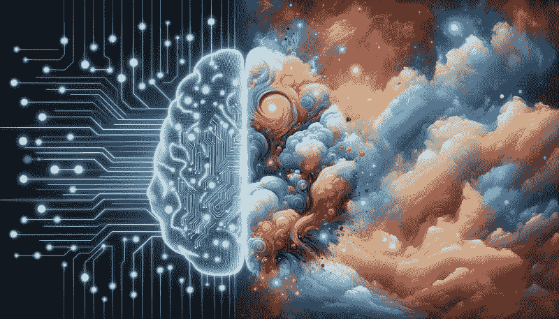
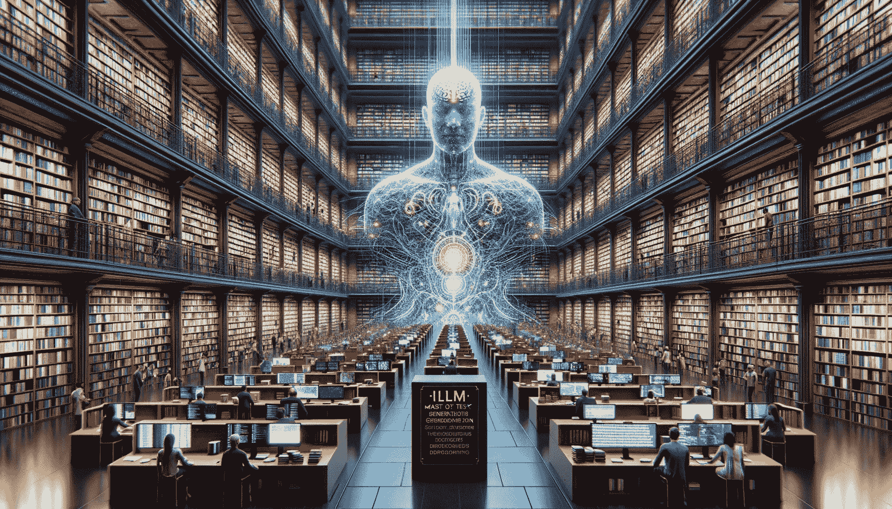
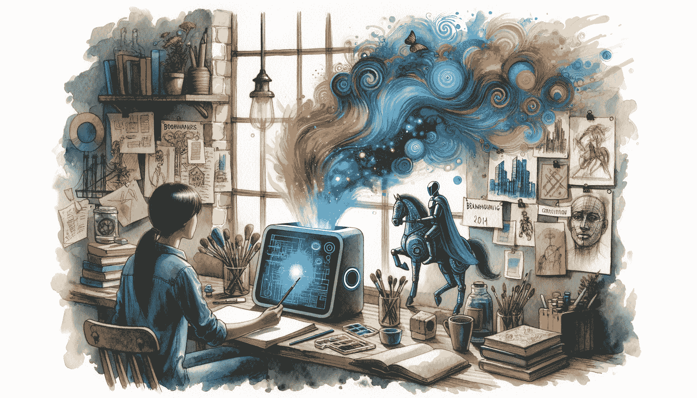

# 梦与现实之间：生成文本与幻觉

> 原文：[`www.kdnuggets.com/between-dreams-and-reality-generative-text-and-hallucinations`](https://www.kdnuggets.com/between-dreams-and-reality-generative-text-and-hallucinations)

由 DALL-E 生成的图像

在数字时代，人工智能的奇迹改变了我们互动、工作甚至思考的方式。

* * *

## 我们的前三名课程推荐

 1\. [谷歌网络安全证书](https://www.kdnuggets.com/google-cybersecurity) - 快速进入网络安全职业生涯。

 2\. [谷歌数据分析专业证书](https://www.kdnuggets.com/google-data-analytics) - 提升你的数据分析能力

 3\. [谷歌 IT 支持专业证书](https://www.kdnuggets.com/google-itsupport) - 支持你的组织 IT

* * *

从策划我们的播放列表的语音助手到预测市场趋势的算法，AI 已经无缝地融入我们的日常生活。

但和任何技术进步一样，它也不乏曲折。

大型语言模型或 LLM 是一个训练过的机器学习模型，根据你提供的提示生成文本。为了生成好的回应，模型利用了训练阶段所保留的所有知识。

最近，大型语言模型（LLMs）展示了令人印象深刻且不断增长的能力，包括对任何类型用户提示生成令人信服的回应。

然而，即使 LLMs 具有生成文本的惊人能力，仍然很难判断这些生成内容是否准确。

这正是通常所说的幻觉。

但这些幻觉是什么，它们如何影响 AI 的可靠性和实用性？

# 大型语言模型幻觉之谜

在文本生成、翻译、创意内容等方面，LLMs 都是高手。

尽管是强大的工具，LLM 确实存在一些显著的缺陷：

1.  使用的解码技术可能会产生乏味、缺乏连贯性或容易陷入单调重复的输出。

1.  他们的知识基础本质上是“静态”的，这带来了无缝更新的挑战。

1.  一个常见问题是生成的文本要么是无意义的，要么是不准确的。

最后一点被称为幻觉，这是一个从人类延伸到 AI 的概念。

对于人类而言，幻觉代表了尽管是虚构的却被感知为真实的体验。这一概念也扩展到 AI 模型中，其中幻觉文本看似准确，即使它是虚假的。

在大型语言模型的背景下，“幻觉”指的是模型生成的文本不正确、无意义或不真实的现象。

图片来源于 Dall-E

LLMs 的设计不同于数据库或搜索引擎，因此它们在回答时不参考特定的来源或知识。

我敢打赌你们大多数人可能在想……这怎么可能呢？

嗯……这些模型通过在给定提示的基础上生成文本。生成的回答并不总是直接基于特定的训练数据，而是为了与提示的上下文对齐。

简而言之：

它们可能自信地输出事实不准确或根本没有意义的信息。

# 解密幻觉的类型

识别人类的幻觉一直是一个重大挑战。考虑到我们有限的可靠基准对比能力，这一任务变得更加复杂。

尽管来自大型语言模型的输出概率分布等详细见解可以帮助这个过程，但这些数据并不总是可用，这增加了复杂性。

幻觉检测问题仍未解决，是持续研究的课题。

1.  **明显的虚假信息：** LLMs 可能会虚构不存在的事件或人物。

1.  **过于准确的信息：** 可能会过度分享，导致敏感信息的传播。

1.  **无意义的内容：** 有时，输出可能完全是胡言乱语。

    为什么会出现这些幻觉？

# 为什么会出现这些幻觉？

根本原因在于训练数据。LLMs 从大量数据集中学习，这些数据集有时可能是不完整、过时或甚至矛盾的。这种模糊性可能导致它们产生误导，把某些词汇或短语与不准确的概念联系起来。

此外，大量的数据意味着 LLMs 可能没有明确的“真相来源”来验证其生成的信息。

# 利用幻觉为你所用

有趣的是，这些幻觉可以是一种伪装的福音。如果你寻求创造力，你会希望 LLMs 如 ChatGPT 能够幻觉。

图片由 DALL-E 生成

想象一下请求一个独特的幻想故事情节，你会希望得到一个全新的叙事，而不是现有故事的复制品。

同样，在头脑风暴时，幻觉可以提供大量多样的创意。

# 缓解虚幻

意识到这一点是应对这些幻觉的第一步。以下是一些控制幻觉的策略：

+   **一致性检查：** 生成多个对同一提示的回应并进行比较。

+   **语义相似性检查：** 使用 BERTScore 等工具来衡量生成文本之间的语义相似性。

+   **在更新数据上进行训练：** 定期更新训练数据以确保相关性。你甚至可以对 GPT 模型进行微调，以提升其在某些特定领域的表现。

+   **用户意识：**教育用户关于潜在幻觉及交叉验证信息的重要性。

最后一个，但并非最不重要的… 探索！

这篇文章为 LLM 幻觉奠定了基础，但对你和你的应用程序的影响可能会大相径庭。

此外，你对这些现象的解释可能与实际情况不完全一致。全面理解和评估 LLM 幻觉对你工作的影响的关键在于深入探讨 LLM。

# 结论

AI，特别是 LLM 的发展过程，就像是在未开发的水域航行。虽然广阔的可能性令人兴奋，但必须警惕那些可能使我们偏离方向的幻影。

通过理解这些幻觉的本质并实施减轻它们的策略，我们可以继续利用 AI 的变革力量，确保其在不断演变的数字环境中的准确性和可靠性。

****[Josep Ferrer](https://www.linkedin.com/in/josep-ferrer-sanchez)**** 是来自巴塞罗那的分析工程师。他毕业于物理工程，目前在应用于人类移动的数据科学领域工作。他是一个兼职内容创作者，专注于数据科学和技术。Josep 撰写关于 AI 的所有内容，涵盖了这一领域的持续爆炸性应用。

### 更多相关主题

+   [数据编排：生成型 AI 成功与失败之间的分界线…](https://www.kdnuggets.com/2024/07/astronomer/data-orchestration-the-dividing-line-between-generative-ai-success-and-failure)

+   [从虚构到现实：ChatGPT 与真正 AI 的科幻梦…](https://www.kdnuggets.com/from-fiction-to-reality-chatgpt-and-the-sci-fi-dream-of-true-ai-conversation)

+   [数据科学职业：7 个期望与现实](https://www.kdnuggets.com/2022/06/data-science-career-7-expectations-reality.html)

+   [数据科学：现实与期望](https://www.kdnuggets.com/2022/03/data-science-reality-expectations.html)

+   [效率：生物神经元与人工神经元之间的差异](https://www.kdnuggets.com/2022/11/efficiency-spells-difference-biological-neurons-artificial-counterparts.html)

+   [弥合人类理解与机器学习之间的差距：…](https://www.kdnuggets.com/2023/06/closing-gap-human-understanding-machine-learning-explainable-ai-solution.html)
