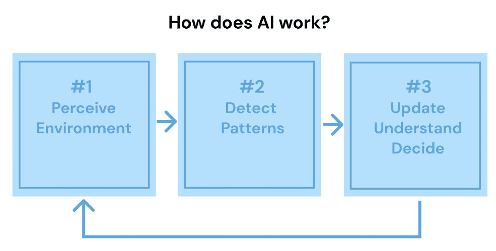

# 超越人类界限：超级智能的崛起

> 原文：[`www.kdnuggets.com/beyond-human-boundaries-the-rise-of-superintelligence`](https://www.kdnuggets.com/beyond-human-boundaries-the-rise-of-superintelligence)

图片来源：Dall-E

在技术迅速发展的世界中，有一个话题脱颖而出，吸引了科学家、技术爱好者和大众的想象力：

人工智能的崛起。

当我们站在一个新时代的面前，这个问题显得尤为重要：

AI 的未来会是怎样的？

跟随我，让我们一起发现一切！

# AI 革命

AI 已经取得了长足的进步，从简单的规则基础算法到模仿人类认知解决问题和做决定的深度学习模型。

图片来源：作者

AI 技术根据其模仿人类特征的能力分为三大类。

## 1. 人工窄智能（ANI）或具备专门能力的 AI

ANI，通常被称为弱 AI 或窄 AI，专注于特定应用或任务。它被设计用于执行单一任务，并尝试在有限的变量、限制和场景范围内模仿人类行为。

ANI 的例子在技术中随处可见，如 iPhone 上的 Siri 语音和语言处理或自动驾驶车辆中的视觉识别能力。

## 2. 人工通用智能（AGI）或等同于人类水平的 AI

AGI，也称为强 AI 或深度 AI，指的是机器理解、学习和使用智能来解决复杂问题的能力，类似于人类。AGI 基于‘心智理论’框架，使其能够感知其他智能实体的情感、信念和思维过程。

AGI 仍然是一个理论概念，但已引起主要科技公司的极大兴趣。例如，微软通过 OpenAI 投资了 10 亿美元于 AGI。如今，我们已经拥有 ChatGPT-4，它能够处理广泛的问题并展示更高水平的认知技能，代表了一种早期形式的 AGI。

## 3. 人工超级智能（ASI）或超越人类智力的 AI

ASI 代表了一种超越人类智力的 AI 形式，能够在每项任务中超越人类。ASI 不仅能够理解人类情感和体验，还被设想拥有自己的情感、信念和欲望。

虽然 ASI 目前是一个理论概念，但其预计的决策和问题解决能力预计将远远超越人类能力。

在深入探讨这种超级智能之前，让我们稍微回顾一下……

# AI 的未来在早期过去是什么样的？

人工智能的概念多年来在恐惧和迷人之间摇摆，早于实际术语的出现。普遍的看法是，真正的人工智能必须模仿人类形式，这掩盖了人工智能实际上已经运作了相当一段时间的现实。

显著的成就，比如在[国际象棋](https://www.researchgate.net/publication/222544943_Deep_blue)中超越人类技能，仅仅是冰山一角。自 1980 年代以来，人工智能一直是各个行业的重要组成部分。

加里·卡斯帕罗夫与深蓝棋手对弈的画面。

1990 年代，随着概率和贝叶斯方法的出现，机器学习经历了变革。这些进展为一些当前最普遍的人工智能应用奠定了基础，包括处理庞大数据集的能力。

这一能力扩展到对原始文本进行语义分析，使得网络用户可以通过输入简单查询，轻松地[在数十亿个网页中找到所需的信息](https://www.researchgate.net/publication/5887974_Extracting_semantic_representations_from_word_co-occurrence_statistics_A_computational_study)。

# 对超级智能的探索

超级智能不仅仅是以闪电般的速度处理数据。它涉及到在每一个智力方面的全面提升，从推理和创造力到自我改善。

想象一个机器在创新、思考和学习方面超越人类能力的世界。我们现在还不在这样的世界中，但随着技术的进步，这种情景可能比我们想象的更近。

最近的进展，例如 OpenAI 的 GPT-4，展示了人工智能的快速发展。考虑到在机器学习或量子计算等领域经历的所有突破，超级智能的出现变得越来越有可能。

这引出了我们要讨论的内容……

# 超级智能的潜力与风险

超级智能的好处是无穷无尽的。从医学领域的基于人工智能的疾病预测，到金融或气候变化，假设的超级智能可以提升人类社会。然而，现有的人工智能水平已经带来了一些重大影响，因此超级智能可能会使这些情况变得更加严重：

## 1. 转变工作场所

忘掉旧有的观念，即人工智能仅会影响低技能工作。得益于生成式人工智能的进步，如 DALL-E 和 Mid-Journey，即使是创造性职业也感受到了压力。

这些人工智能系统可以迅速生成艺术、文学和视频。它们的速度如此之快，已经开始超越人类记者编写基础新闻文章的能力。

这种转变引发了关于未来工作的重大问题，尤其是在我们曾认为免受自动化影响的领域。

## 2. 应对知识产权迷宫

人工智能的崛起在知识产权领域掀起了风暴。当一个人工智能创作一首歌曲或一个标志时，谁拥有这些作品？

+   程序员？

+   人工智能本身？

+   提供训练数据的创作者？

随着人工智能系统在现有内容上进行训练，现在能够生成极具说服力的虚假内容，这一问题变得越来越复杂。这一困境甚至引发了法律纠纷，[例如 Getty Images 起诉 Stability AI 关于照片使用的问题。](https://apnews.com/article/getty-images-artificial-intelligence-ai-image-generator-stable-diffusion-a98eeaaeb2bf13c5e8874ceb6a8ce196#:~:text=In%20a%20lawsuit%20filed%20early,to%20build%20a%20competing%20business.%E2%80%9D)

## 3\. 虚假信息挑战

人工智能以低成本和高效率生成逼真的虚假内容是把双刃剑。这项技术可能大幅扩大虚假信息在网上的传播，随着虚假内容变得越来越复杂，这一担忧也在不断增加。

## 4\. 决策中的人工智能

政府和企业越来越依赖人工智能来决策，如社会福利和执法等领域。这些系统分配的风险评分可能对人们的生活产生重大影响。

然而，问题在于：未加控制的人工智能可能会复制甚至加剧现有的社会偏见。

人类必须保持参与，指导人工智能的决策，以防止不公平的结果。

# 为人工智能时代做准备

权力越大，责任越大。随着人工智能的快速进步，我们需要跟上步伐。政策制定者、行业专家和开发者需要就人工智能的规则和法规进行合作。

确保这些智能系统与人类价值观和伦理对齐至关重要。如果没有适当的检查和制衡，未加控制的人工智能可能导致反乌托邦的结果，机器可能会支配人类。决策者必须迅速制定政策，以跟上这一不断发展的技术。

此外，人工智能的公平使用和分配是一个紧迫的问题。超级智能人工智能可能会赋予控制它的人巨大的权力，导致财富和影响力的不平等。确保人工智能的有益和公平使用是社会必须正视的挑战。

这引出了…

# 奇点理论

奇点理论最早由约翰·冯·诺依曼在 1958 年提出。对于那些不熟悉这一概念的人来说，它描述了一个假设的时刻，即人工智能要么发展出自我意识，要么获得如此先进的能力，以至于超越了人类的控制。

图片来源：[克雷格·贝拉米](https://www.craigbellamy.net/2023/03/03/the-singularity/)

在这种情况下，人工智能将以指数级的速度自主提升，远远超出人类的理解或控制。

然而，这一概念极具争议。

对这一理论的批评者认为，它低估了人类思维的能力，同时高估了人工智能的潜在能力。如果这种事件发生，其时间也成为科学家和技术专家之间争论的话题。

所以我们还不必惊慌！

# 以乐观态度迎接未来

人工智能发展的轨迹充满希望。通过采取平衡的方法，我们可以利用人工智能进步的好处，同时有效应对其挑战。

当我们站在历史的关键时刻时，我们必须以兴奋、谨慎和责任心迎接这一超级智能的曙光。

我们如何为即将到来的事物做好准备？

答案在于提高意识和持续自我教育。人工智能在自动化例行任务方面的非凡能力不仅节省时间，还让人类能够从事更复杂和富有创意的工作。

以医疗保健为例：人工智能对医学图像的解读能力可能挽救生命。同样，在交通领域，人工智能的作用日益增长，这在特斯拉等自驾车的受欢迎程度上得到了体现。

未来的发展预示着更加复杂的汽车技术。此外，人工智能正在简化物流和供应链，提高效率，降低成本。

**[Josep Ferrer](https://www.linkedin.com/in/josep-ferrer-sanchez)**是一位来自巴塞罗那的分析工程师。他拥有物理工程学位，目前在应用于人类流动性的数据科学领域工作。他还是一名兼职内容创作者，专注于数据科学和技术。Josep 撰写有关人工智能的所有内容，涵盖了这一领域的持续爆炸性发展。

### 了解更多相关话题

+   [超越编码：为何人情味至关重要](https://www.kdnuggets.com/beyond-coding-why-the-human-touch-matters)

+   [拖放分析：无代码数据科学的崛起](https://www.kdnuggets.com/drag-drop-analyze-the-rise-of-nocode-data-science)

+   [Prompt 工程的兴衰：流行还是未来？](https://www.kdnuggets.com/the-rise-and-fall-of-prompt-engineering-fad-or-future)

+   [为何 Emily Ekdahl 选择 co:rise 来提升她的工作表现…](https://www.kdnuggets.com/2022/08/corise-emily-ekdahl-chose-corise-level-job-performance-machine-learning-engineer.html)

+   [ChatOps/LMOps 的崛起](https://www.kdnuggets.com/2023/05/rise-chatopslmops.html)

+   [首席人工智能官的崛起](https://www.kdnuggets.com/the-rise-of-chief-ai-officer)
