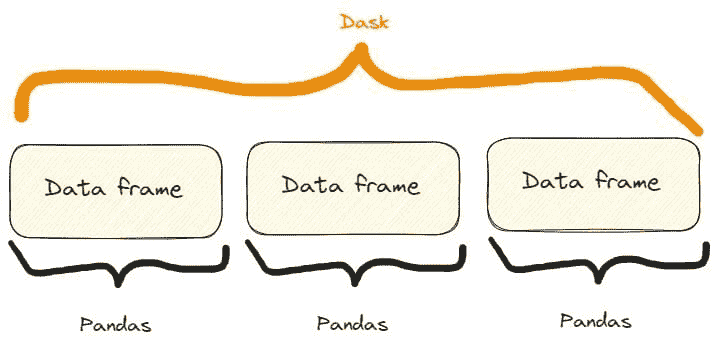

# 超越 Numpy 和 Pandas：解锁鲜为人知的 Python 库的潜力

> 原文：[`www.kdnuggets.com/2023/08/beyond-numpy-pandas-unlocking-potential-lesserknown-python-libraries.html`](https://www.kdnuggets.com/2023/08/beyond-numpy-pandas-unlocking-potential-lesserknown-python-libraries.html)


图片由 [OrMaVaredo](https://pixabay.com/it/users/ormavaredo-14515736/?utm_source=link-attribution&utm_medium=referral&utm_campaign=image&utm_content=5826755) 提供，发布在 [Pixabay](https://pixabay.com/it//?utm_source=link-attribution&utm_medium=referral&utm_campaign=image&utm_content=5826755)

Python 是世界上使用最广泛的编程语言之一，为开发者提供了广泛的库。

无论如何，当谈到数据处理和科学计算时，我们通常会想到像 `Numpy`、`Pandas` 或 `SciPy` 这样的库。

在这篇文章中，我们介绍了三种你可能感兴趣的 Python 库。

# 1\. Dask

## 介绍 Dask

Dask 是一个灵活的并行计算库，支持大规模数据处理的分布式计算和并行处理。

那么，我们为什么应该使用 Dask 呢？正如他们在 [他们的网站](https://www.dask.org/)上所说的：

> Python 已经成长为数据分析和通用编程中的主导语言。这种增长得益于像 NumPy、pandas 和 scikit-learn 这样的计算库。然而，这些包并未设计用于超越单一机器的规模。Dask 的开发目的是将这些包及其相关生态系统本地扩展到多核机器和分布式集群，以处理超出内存的数据集。

因此，Dask 的一个常见用途是 [他们说的](https://docs.dask.org/en/latest/dataframe.html)：

> Dask DataFrame 用于 pandas 通常需要的情况，通常是当 pandas 因数据大小或计算速度而失败时：
> 
> - 操作大型数据集，即使这些数据集无法全部加载到内存中
> 
> - 通过使用多个核心加速长时间计算
> 
> - 对大型数据集进行分布式计算，使用标准的 pandas 操作，如 groupby、join 和时间序列计算

因此，当我们需要处理巨大的 Pandas 数据框时，Dask 是一个不错的选择。这是因为 Dask：

> 允许用户在笔记本电脑上操作 100GB 以上的数据集，或在工作站上操作 1TB 以上的数据集

这确实是一个相当令人印象深刻的结果。

在幕后发生的情况是：

> Dask DataFrame 协调了许多按索引排列的 pandas DataFrame/Series。Dask DataFrame 按 *行* 进行分区，通过索引值对行进行分组以提高效率。这些 pandas 对象可能存储在磁盘上或其他机器上。

因此，我们有了这样的结果：



Dask 和 Pandas 数据框之间的区别。图像由作者提供，自 Dask 网站上引用的图像自由改编。

## Dask 一些实际功能

首先，我们需要安装 Dask。可以通过 `pip` 或 `conda` 来安装：

```py
$ pip install dask[complete]

or

$ conda install dask
```

**特性一：打开 CSV 文件**

我们可以展示 Dask 的第一个特性：如何打开一个 CSV 文件。我们可以这样做：

```py
import dask.dataframe as dd

# Load a large CSV file using Dask
df_dask = dd.read_csv('my_very_large_dataset.csv')

# Perform operations on the Dask DataFrame
mean_value_dask = df_dask['column_name'].mean().compute()
```

所以，正如代码所示，我们使用 Dask 的方式与 Pandas 非常相似。特别是：

+   我们使用 `read_csv()` 方法，完全与 Pandas 一样。

+   我们像在 Pandas 中一样截取一列。实际上，如果我们有一个名为 `df` 的 Pandas 数据框，我们可以这样截取一列：`df['column_name']`。

+   我们对截取的列应用 `mean()` 方法，类似于 Pandas，但这里我们还需要添加 `compute()` 方法。

同样，即使打开 CSV 文件的方法与 Pandas 相同，在底层 Dask 也在轻松处理超出单台机器内存容量的大型数据集。

这意味着我们看不到任何实际的区别，除了一个大型数据框不能在 Pandas 中打开，而在 Dask 中可以。

**特性二：扩展机器学习工作流**

我们可以使用 Dask 创建一个具有大量样本的分类数据集。然后，我们可以将其拆分为训练集和测试集，用 ML 模型拟合训练集，并计算测试集的预测结果。

我们可以这样做：

```py
import dask_ml.datasets as dask_datasets
from dask_ml.linear_model import LogisticRegression
from dask_ml.model_selection import train_test_split

# Load a classification dataset using Dask
X, y = dask_datasets.make_classification(n_samples=100000, chunks=1000)

# Split the data into train and test sets
X_train, X_test, y_train, y_test = train_test_split(X, y)

# Train a logistic regression model in parallel
model = LogisticRegression()
model.fit(X_train, y_train)

# Predict on the test set
y_pred = model.predict(X_test).compute()
```

这个例子强调了 Dask 即使在机器学习问题中也能处理巨大数据集的能力，通过将计算分配到多个核心上。

特别是，我们可以使用 `dask_datasets.make_classification()` 方法为分类案例创建一个 “Dask 数据集”，并可以指定样本数量和块数（甚至非常大！）。

与之前相似，预测结果通过 `compute()` 方法获得。

```py
**NOTE:**

in this case, you may need to intsall the module dask_ml.

You can do it like so:

$ pip install dask_ml
```

**特性三：高效的图像处理**

Dask 利用的并行处理能力也可以应用于图像。

特别是，我们可以打开多个图像，调整大小，然后保存调整大小后的图像。我们可以这样做：

```py
import dask.array as da
import dask_image.imread
from PIL import Image

# Load a collection of images using Dask
images = dask_image.imread.imread('image*.jpg')

# Resize the images in parallel
resized_images = da.stack([da.resize(image, (300, 300)) for image in images])

# Compute the result
result = resized_images.compute()

# Save the resized images
for i, image in enumerate(result):
    resized_image = Image.fromarray(image)
    resized_image.save(f'resized_image_{i}.jpg')
```

所以，过程如下：

1.  我们使用方法 `dask_image.imread.imread("image*.jpg")` 打开当前文件夹（或你可以指定的文件夹）中的所有 “.jpg” 图像。

1.  我们使用方法 `da.stack()` 将所有图像调整为 300x300，使用列表推导式。

1.  我们使用 `compute()` 方法计算结果，正如之前所做的那样。

1.  我们使用 `for` 循环保存所有调整大小的图像。

# 2. SymPy

## 介绍 Sympy

如果你需要进行数学计算和运算，并且希望坚持使用 Python，你可以尝试 Sympy。

的确：既然我们可以使用我们钟爱的 Python，为什么还要使用其他工具和软件呢？

根据他们在 [网站](https://www.sympy.org/en/index.html) 上写的内容，Sympy 是：

> 一个用于符号数学的 Python 库。它旨在成为一个功能齐全的计算机代数系统（CAS），同时保持代码尽可能简单，以便易于理解和扩展。SymPy 完全用 Python 编写。

但是为什么使用 SymPy？他们建议：

> SymPy 是…
> 
> **- 免费：** 根据 BSD 许可证，SymPy 既是言语上的自由，也是酒精上的自由。
> 
> **- 基于 Python：** SymPy 完全用 Python 编写，并使用 Python 作为语言。
> 
> **- 轻量级：** SymPy 仅依赖于 mpmath，一个纯 Python 库用于任意浮点算术，使其易于使用。
> 
> **- 一个库：** 除了作为交互工具使用，SymPy 还可以嵌入到其他应用程序中，并通过自定义函数进行扩展。

所以，它基本上拥有所有 Python 爱好者喜爱的特性！

现在，让我们看看它的一些特性。

## SymPy 的一些功能演示

首先，我们需要安装它：

```py
$ pip install sympy
```

```py
**PAY ATTENTION:**

if you write *$ pip install* *simpy* you'll install another (completely

different!) library.

So, the second letter is a "y", not an "i".
```

**功能一：解代数方程**

如果我们需要解代数方程，可以这样使用 SymPy：

```py
from sympy import symbols, Eq, solve

# Define the symbols
x, y = symbols('x y')

# Define the equation
equation = Eq(x**2 + y**2, 25)

# Solve the equation
solutions = solve(equation, (x, y))

# Print solution
print(solutions)

>>>

[(-sqrt(25 - y**2), y), (sqrt(25 - y**2), y)]
```

所以，这就是过程：

1.  我们用方法 `symbols()` 定义方程的符号。

1.  我们用方法 `Eq` 编写代数方程。

1.  我们用方法 `solve()` 解方程。

当我在大学时，我使用了不同的工具来解决这些问题，我必须说 SymPy，如我们所见，是非常易读和用户友好的。

但是，确实：这是一个 Python 库，那么它会有什么不同呢？

**功能二：计算导数**

计算导数是我们在数据分析中可能需要的另一项任务。通常，我们可能因为各种原因需要进行计算，SymPy 确实简化了这个过程。实际上，我们可以这样做：

```py
from sympy import symbols, diff

# Define the symbol
x = symbols('x')

# Define the function
f = x**3 + 2*x**2 + 3*x + 4

# Calculate the derivative
derivative = diff(f, x)

# Print derivative
print(derivative)

>>>

3*x**2 + 4*x + 3
```

如我们所见，这个过程非常简单且自解释：

1.  我们用 `symbols()` 定义我们导数的函数符号。

1.  我们定义函数。

1.  我们用 `diff()` 计算导数，指定函数和我们计算导数的符号（这是一个绝对导数，但在有 `x` 和 `y` 变量的函数的情况下，我们还可以进行偏导数）。

如果我们进行测试，我们会看到结果在 2 到 3 秒内到达。因此，它也相当快。

**功能三：计算积分**

当然，如果 SymPy 能够计算导数，它也能计算积分。让我们来做：

```py
from sympy import symbols, integrate, sin

# Define the symbol
x = symbols('x')

# Perform symbolic integration
integral = integrate(sin(x), x)

# Print integral
print(integral)

>>>

-cos(x)
```

在这里，我们使用方法 `integrate()`，指定要积分的函数和积分变量。

难道这不更简单吗？！

# 3\. Xarray

## 介绍 Xarray

Xarray 是一个扩展 NumPy 功能的 Python 库，使我们能够处理带标签的数组和数据集。

正如他们在 [他们的网站上](https://docs.xarray.dev/en/stable/) 说的：

> Xarray 使得在 Python 中处理带标签的多维数组变得简单、高效和有趣！

[同样](https://docs.xarray.dev/en/stable/getting-started-guide/why-xarray.html)：

> Xarray 在原始类似 NumPy 的多维数组之上引入了维度、坐标和属性的标签，这使得开发者的体验更加直观、简洁且不易出错。

换句话说，它通过在数组维度上添加标签或坐标来扩展 NumPy 数组的功能。这些标签提供了元数据，并使多维数据的更高级分析和操作成为可能。

例如，在 NumPy 中，数组是通过基于整数的索引来访问的。

在 Xarray 中，每个维度都可以有一个关联的标签，使得根据有意义的名称来理解和操作数据变得更加容易。

例如，与其用`arr[0, 1, 2]`访问数据，我们可以在 Xarray 中使用`arr.sel(x=0, y=1, z=2)`，其中`x`、`y`和`z`是维度标签。

这使得代码更易读！

那么，让我们看看 Xarray 的一些功能。

## Xarray 的一些功能演示

和往常一样，安装方法如下：

```py
$ pip install xarray
```

**特性一：使用标记坐标**

假设我们想创建一些与温度相关的数据，并希望用纬度和经度等坐标标记这些数据。我们可以这样做：

```py
import xarray as xr
import numpy as np

# Create temperature data
temperature = np.random.rand(100, 100) * 20 + 10

# Create coordinate arrays for latitude and longitude
latitudes = np.linspace(-90, 90, 100)
longitudes = np.linspace(-180, 180, 100)

# Create an Xarray data array with labeled coordinates
da = xr.DataArray(
    temperature,
    dims=['latitude', 'longitude'],
    coords={'latitude': latitudes, 'longitude': longitudes}
)

# Access data using labeled coordinates
subset = da.sel(latitude=slice(-45, 45), longitude=slice(-90, 0))
```

如果我们打印它们，会得到：

```py
# Print data
print(subset)

>>>
 <xarray.dataarray longitude:="">array([[13.45064786, 29.15218061, 14.77363206, ..., 12.00262833,
        16.42712411, 15.61353963],
       [23.47498117, 20.25554247, 14.44056286, ..., 19.04096482,
        15.60398491, 24.69535367],
       [25.48971105, 20.64944534, 21.2263141 , ..., 25.80933737,
        16.72629302, 29.48307134],
       ...,
       [10.19615833, 17.106716  , 10.79594252, ..., 29.6897709 ,
        20.68549602, 29.4015482 ],
       [26.54253304, 14.21939699, 11.085207  , ..., 15.56702191,
        19.64285595, 18.03809074],
       [26.50676351, 15.21217526, 23.63645069, ..., 17.22512125,
        13.96942377, 13.93766583]])
Coordinates:
  * latitude   (latitude) float64 -44.55 -42.73 -40.91 ... 40.91 42.73 44.55
  * longitude  (longitude) float64 -89.09 -85.45 -81.82 ... -9.091 -5.455 -1.818</xarray.dataarray>
```

那么，让我们一步步看一下这个过程：

1.  我们已将温度值创建为 NumPy 数组。

1.  我们将纬度和经度值定义为 NumPy 数组。

1.  我们使用`DataArray()`方法将所有数据存储在 Xarray 数组中。

1.  我们使用`sel()`方法选择了一部分纬度和经度，这个方法可以选择我们想要的子集值。

结果也很容易读取，因此标记在很多情况下确实很有帮助。

**特性二：处理缺失数据**

假设我们正在收集与全年温度相关的数据。我们想知道我们的数组中是否有一些空值。以下是检查的方法：

```py
import xarray as xr
import numpy as np
import pandas as pd

# Create temperature data with missing values
temperature = np.random.rand(365, 50, 50) * 20 + 10
temperature[0:10, :, :] = np.nan  # Set the first 10 days as missing values

# Create time, latitude, and longitude coordinate arrays
times = pd.date_range('2023-01-01', periods=365, freq='D')
latitudes = np.linspace(-90, 90, 50)
longitudes = np.linspace(-180, 180, 50)

# Create an Xarray data array with missing values
da = xr.DataArray(
    temperature,
    dims=['time', 'latitude', 'longitude'],
    coords={'time': times, 'latitude': latitudes, 'longitude': longitudes}
)

# Count the number of missing values along the time dimension
missing_count = da.isnull().sum(dim='time')

# Print missing values
print(missing_count)

>>>

 <xarray.dataarray longitude:="">array([[10, 10, 10, ..., 10, 10, 10],
       [10, 10, 10, ..., 10, 10, 10],
       [10, 10, 10, ..., 10, 10, 10],
       ...,
       [10, 10, 10, ..., 10, 10, 10],
       [10, 10, 10, ..., 10, 10, 10],
       [10, 10, 10, ..., 10, 10, 10]])
Coordinates:
  * latitude   (latitude) float64 -90.0 -86.33 -82.65 ... 82.65 86.33 90.0
  * longitude  (longitude) float64 -180.0 -172.7 -165.3 ... 165.3 172.7 180.0</xarray.dataarray>
```

因此，我们得出有 10 个空值。

另外，如果我们仔细观察代码，我们可以看到，我们可以将 Pandas 的方法应用于 Xarray，如`isnull.sum()`，它统计了缺失值的总数。

**特性一：处理和分析多维数据**

当我们有可能标记数组时，处理和分析多维数据的诱惑很大。那么，为什么不尝试一下呢？

例如，假设我们仍在收集与特定纬度和经度相关的温度数据。

我们可能想计算温度的均值、最大值和中位数。我们可以这样做：

```py
import xarray as xr
import numpy as np
import pandas as pd

# Create synthetic temperature data
temperature = np.random.rand(365, 50, 50) * 20 + 10

# Create time, latitude, and longitude coordinate arrays
times = pd.date_range('2023-01-01', periods=365, freq='D')
latitudes = np.linspace(-90, 90, 50)
longitudes = np.linspace(-180, 180, 50)

# Create an Xarray dataset
ds = xr.Dataset(
    {
        'temperature': (['time', 'latitude', 'longitude'], temperature),
    },
    coords={
        'time': times,
        'latitude': latitudes,
        'longitude': longitudes,
    }
)

# Perform statistical analysis on the temperature data
mean_temperature = ds['temperature'].mean(dim='time')
max_temperature = ds['temperature'].max(dim='time')
min_temperature = ds['temperature'].min(dim='time')

# Print values 
print(f"mean temperature:\n {mean_temperature}\n")
print(f"max temperature:\n {max_temperature}\n")
print(f"min temperature:\n {min_temperature}\n")

>>>

mean temperature:
 <xarray.dataarray longitude:="">
array([[19.99931701, 20.36395016, 20.04110699, ..., 19.98811842,
        20.08895803, 19.86064693],
       [19.84016491, 19.87077812, 20.27445405, ..., 19.8071972 ,
        19.62665953, 19.58231185],
       [19.63911165, 19.62051976, 19.61247548, ..., 19.85043831,
        20.13086891, 19.80267099],
       ...,
       [20.18590514, 20.05931149, 20.17133483, ..., 20.52858247,
        19.83882433, 20.66808513],
       [19.56455575, 19.90091128, 20.32566232, ..., 19.88689221,
        19.78811145, 19.91205212],
       [19.82268297, 20.14242279, 19.60842148, ..., 19.68290006,
        20.00327294, 19.68955107]])
Coordinates:
  * latitude   (latitude) float64 -90.0 -86.33 -82.65 ... 82.65 86.33 90.0
  * longitude  (longitude) float64 -180.0 -172.7 -165.3 ... 165.3 172.7 180.0

max temperature:
 <xarray.dataarray longitude:="">
array([[29.98465531, 29.97609171, 29.96821276, ..., 29.86639343,
        29.95069558, 29.98807808],
       [29.91802049, 29.92870312, 29.87625447, ..., 29.92519055,
        29.9964299 , 29.99792388],
       [29.96647016, 29.7934891 , 29.89731136, ..., 29.99174546,
        29.97267052, 29.96058079],
       ...,
       [29.91699117, 29.98920555, 29.83798369, ..., 29.90271746,
        29.93747041, 29.97244906],
       [29.99171911, 29.99051943, 29.92706773, ..., 29.90578739,
        29.99433847, 29.94506567],
       [29.99438621, 29.98798699, 29.97664488, ..., 29.98669576,
        29.91296382, 29.93100249]])
Coordinates:
  * latitude   (latitude) float64 -90.0 -86.33 -82.65 ... 82.65 86.33 90.0
  * longitude  (longitude) float64 -180.0 -172.7 -165.3 ... 165.3 172.7 180.0

min temperature:
 <xarray.dataarray longitude:="">
array([[10.0326431 , 10.07666029, 10.02795524, ..., 10.17215336,
        10.00264909, 10.05387097],
       [10.00355858, 10.00610942, 10.02567816, ..., 10.29100316,
        10.00861792, 10.16955806],
       [10.01636216, 10.02856619, 10.00389027, ..., 10.0929342 ,
        10.01504103, 10.06219179],
       ...,
       [10.00477003, 10.0303088 , 10.04494723, ..., 10.05720692,
        10.122994  , 10.04947012],
       [10.00422182, 10.0211205 , 10.00183528, ..., 10.03818058,
        10.02632697, 10.06722953],
       [10.10994581, 10.12445222, 10.03002468, ..., 10.06937041,
        10.04924046, 10.00645499]])
Coordinates:
  * latitude   (latitude) float64 -90.0 -86.33 -82.65 ... 82.65 86.33 90.0
  * longitude  (longitude) float64 -180.0 -172.7 -165.3 ... 165.3 172.7 180.0</xarray.dataarray></xarray.dataarray></xarray.dataarray>
```

我们也以清晰可读的方式得到了我们想要的结果。

再次如前所述，为了计算温度的最大值、最小值和均值，我们使用了应用于数组的 Pandas 函数。

# 结论

在这篇文章中，我们展示了三个用于科学计算和运算的库。

虽然 SymPy 可以替代其他工具和软件，使我们能够使用 Python 代码进行数学计算，但 Dask 和 Xarray 扩展了其他库的功能，帮助我们在遇到其他最著名的 Python 数据分析和处理库存在困难的情况下提供帮助。

**[费德里科·特罗塔](https://www.linkedin.com/in/federico-trotta/)** 从小就热爱写作，在学校时就写侦探故事作为班级考试的一部分。由于他的好奇心，他发现了编程和 AI。由于对写作的强烈热情，他无法避免开始写作这些话题，因此决定转行成为一名技术作家。他的目标是通过写作来教育人们有关 Python 编程、机器学习和数据科学的知识。了解更多关于他的内容，请访问 [federicotrotta.com](https://federicotrotta.com/)。

[原文](https://towardsdatascience.com/beyond-numpy-and-pandas-unlocking-the-potential-of-lesser-known-python-libraries-86d2bdc4d230)。经授权转载。

* * *

## 我们的三大课程推荐

 1\. [谷歌网络安全证书](https://www.kdnuggets.com/google-cybersecurity) - 快速进入网络安全职业道路。

 2\. [谷歌数据分析专业证书](https://www.kdnuggets.com/google-data-analytics) - 提升你的数据分析能力

 3\. [谷歌 IT 支持专业证书](https://www.kdnuggets.com/google-itsupport) - 支持组织的 IT 需求

* * *

### 更多相关内容

+   [解锁数据洞察：有效分析的关键 Pandas 函数](https://www.kdnuggets.com/unlocking-data-insights-key-pandas-functions-for-effective-analysis)

+   [通过这门免费的 DevOps 速成课程释放你的潜力](https://www.kdnuggets.com/2023/03/corise-unlock-potential-with-this-free-devops-crash-course.html)

+   [揭示 CTGAN 的潜力：利用生成型 AI 进行…](https://www.kdnuggets.com/2023/04/unveiling-potential-ctgan-harnessing-generative-ai-synthetic-data.html)

+   [ChatGPT 是否有潜力成为新的国际象棋超级大满贯？](https://www.kdnuggets.com/does-chatgpt-have-the-potential-to-become-a-new-chess-super-grandmaster)

+   [探索小数据场景中迁移学习的潜力](https://www.kdnuggets.com/exploring-the-potential-of-transfer-learning-in-small-data-scenarios)

+   [挖掘 2023 年数据产品的潜力](https://www.kdnuggets.com/2023/01/tapping-potential-data-products-2023.html)
