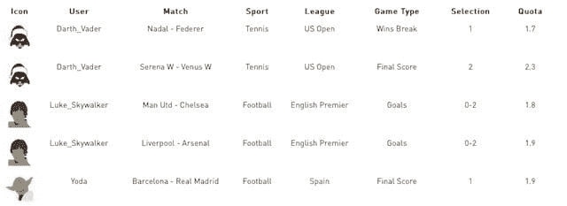
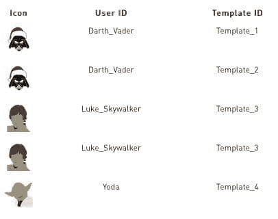
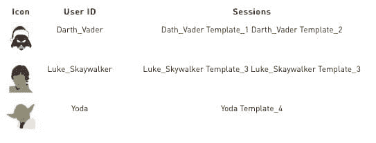

# 超越 Word2Vec 仅限于词汇的使用

> 原文：[`www.kdnuggets.com/2018/01/beyond-word2vec-for-words.html`](https://www.kdnuggets.com/2018/01/beyond-word2vec-for-words.html)

 评论

**作者：Stanko Kuveljic，[SmartCat](https://www.smartcat.io/)**

构建一个机器学习模型通常需要经历大量的哭泣、痛苦、特征工程、折磨、训练、调试、验证、绝望、测试以及因无尽的痛苦而带来的一点点痛苦。经历了这些之后，我们部署模型并使用它来对未来的数据进行预测。我们可以根据情况和用例每小时、每天、每周、每月或者即时运行一次我们的“小恶魔”模型。

让我们看看一个与在线体育博彩推荐引擎相关的例子。该引擎的目标是预测用户是否会在某场比赛中选择特定的选项（例如，最终得分 - 主队获胜，进球 - 3 个或更多进球等）。这些预测基于用户历史记录，这些预测用于构建一个推荐给用户的投注单。

为了实现实时快速推荐，我们可以在用户出现之前就计算所有内容。这种用例允许我们对特征提取进行幻想，我们可以尽情玩弄特征，以便构建一个更准确的模型，而不会影响应用程序的性能。下图展示了一些玩具管道和预测。因此，基本上，我们的应用程序将快速提供预测，而我们的“撒旦仪式”可以安全地在后台运行。

哇哦，图片中甚至还有独角兽。但是，考虑到我们没有预定义的数据集，所有工作都需要即时处理，那怎么办呢？我们的独角兽可不会开心的 :( 让我们回到那个老生常谈的在线体育博彩例子。我们可以为尚未开始的比赛准备预测，但对于那些在比赛进行中下注的用户，也就是所谓的实时投注呢？我们的复杂特征工程和模型评分流程可能在实时为成千上万的用户提供服务时会遇到困难。一场体育比赛每隔几秒钟就可能发生变化，因此实时预测确实是我们所期待的。更糟糕的是，我们可能会对一场比赛的信息有限，从而无法提取所需的特征。可以尝试优化一个在尚未开始的比赛中表现非常好的模型，并尝试用更少的特征构建一个新模型。但是，我们总可以尝试一些新方法，从不同的角度看待问题。我们曾经处理过类似的问题，并尝试了 word2vector，但在我们的情况下是 bet2vector。有关 word2vector 的一般解释，请访问我们最新的博客之一 [one](https://www.smartcat.io/blog/2017/word2vec-the-world-of-word-vectors/)。

**Everything2Vector**

所以 everything2vector 就是乐趣开始的地方。可以仅基于用户 ID 和过去模板的 IDs 为每个用户创建向量表示。我们来看以下数据样本：

从数据中我们可以看到，达斯·维德喜欢投注网球比赛，但他的儿子卢克则喜欢投注英超足球比赛。那么如何通过仅仅依靠 IDs 来实现魔法并进行学习呢？首先，我们需要进一步压缩关于比赛的信息，以便获取模板。这些模板可以根据一些相似特征对数据进行分组。在这种情况下，模板的创建方式是将相似的比赛——来自同一联赛的足球比赛、相同的比赛类型和类似的配额——分组到同一模板中。例如：

+   模板 1 - 网球 : 美国公开赛 : 赢得破发 : 1 : 配额范围 (1.5 - 2.1)

+   模板 2 - 网球 : 美国公开赛 : 决赛得分 : 2 : 配额范围 (1.8 - 2.6)

+   模板 3 - 足球 : 英超 : 进球数 : 0-2 : 配额范围 (1.5 - 2.0)

+   模板 4 - 足球 : 西甲 1 : 决赛得分 : 1 : 配额范围 (1.8 - 2.4)

+   ………………..

+   模板 1000 - 篮球 : NBA : 总分 : >200 : 配额范围 (1.5 - 2.0)

确定模板的这些规则可以从数据统计中计算出来，也可以通过一些领域知识来定义。但最重要的是，这些规则在确定模板 ID 时运行非常快。这就是我们在特征工程任务中所需的一切。当我们将之前的数据转换为模板时，我们得到：

请注意，skip-gram 使用诸如“卢克，我是你父亲”这样的句子来确定哪些词是相似的。要实现类似的功能，我们需要将所有历史数据按会话分组。通过这种方式，我们可以获得表示用户历史的句子，并且用户 ID 现在接近他过去玩过的模板，如下所示：

**结果**

让我们看看向量表示在训练过程中是如何学习的。当一个算法看到一个用户玩了某个比赛模板时，它会将用户的向量表示和已玩模板的向量表示在向量空间中推得很近。同时（使用负采样技术），它将玩家向量和未玩的比赛模板向量在向量空间中推得远离彼此。在下图中，我们可以看到我们的“向量”在空间中的分布。图像中再次出现了一只快乐的独角兽，因为它喜欢这个解决方案。

我们看到达斯·维达接近那些代表网球比赛的模板，因为他喜欢打网球。卢克远离他的父亲，因为他不喜欢网球，但他喜欢足球，他会更接近那些代表足球比赛的向量。还有尤达，他也踢足球，但在不同的联赛中。但他比达斯更接近卢克，因为足球模板比足球和网球模板更相似。

算法的输出是用户 ID 和模板 ID 的向量，可以存储在某处。在预测时，数据每几秒钟变化一次，我们可以实时计算预测结果。我们只需要查找当前可用的模板向量，并与用户向量计算余弦相似度，以获取用户和模板之间的相似度分数。除了尝试有趣之外，这种技术在数据集上取得了良好的结果，并且实现了对大量用户和模板的快速预测，这些用户和模板经常发生变化。最重要的是，这种技术可以应用到任何地方，并且效果很好。例如，如果我们有关于历史交易的信息[user ID - 购买 - item ID]，我们可以仅使用用户 ID 和物品 ID 来训练向量。基于训练得到的向量，我们可以向每个用户推荐最相似的物品。所谓最相似的，是指那些经常一起出现的物品。

圣诞快乐，愿力量向量与你同在。

[原文](https://www.smartcat.io/blog/2017/beyond-word2vec-usage-for-only-words/)。经许可转载。

**相关内容**

+   [**机器学习中的正则化**](https://www.kdnuggets.com/2018/01/regularization-machine-learning.html)

+   [**如果你不是 NLP 专家，如何在 Kaggle 比赛中获胜**](https://www.kdnuggets.com/2017/09/win-kaggle-nlp-not-expert.html)

+   [**数据科学家和机器学习工程师的十大 TED 演讲**](https://www.kdnuggets.com/2018/01/top-10-ted-talks-data-scientists-machine-learning.html)

* * *

## 我们的三大课程推荐

 1\. [Google 网络安全证书](https://www.kdnuggets.com/google-cybersecurity) - 快速开启你的网络安全职业生涯

 2\. [Google 数据分析专业证书](https://www.kdnuggets.com/google-data-analytics) - 提升你的数据分析技能

 3\. [Google IT 支持专业证书](https://www.kdnuggets.com/google-itsupport) - 支持你的组织的 IT 需求

* * *

### 更多相关话题

+   [Python 中的情感分析：超越词袋模型](https://www.kdnuggets.com/sentiment-analysis-in-python-going-beyond-bag-of-words)

+   [成为专业数据工程师所需的唯一免费课程](https://www.kdnuggets.com/the-only-free-course-you-need-to-become-a-professional-data-engineer)

+   [深度学习面试准备课程](https://www.kdnuggets.com/the-only-interview-prep-course-you-need-for-deep-learning)

+   [成为 MLOps 工程师的唯一免费课程](https://www.kdnuggets.com/the-only-free-course-you-need-to-become-a-mlops-engineer)

+   [让你数据分析师职业一飞冲天的唯一课程](https://www.kdnuggets.com/the-only-course-you-need-to-smash-your-data-analyst-career)

+   [适用于所有场景的唯一提示框架](https://www.kdnuggets.com/the-only-prompting-framework-for-every-use)
