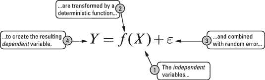
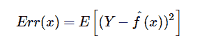
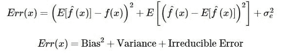
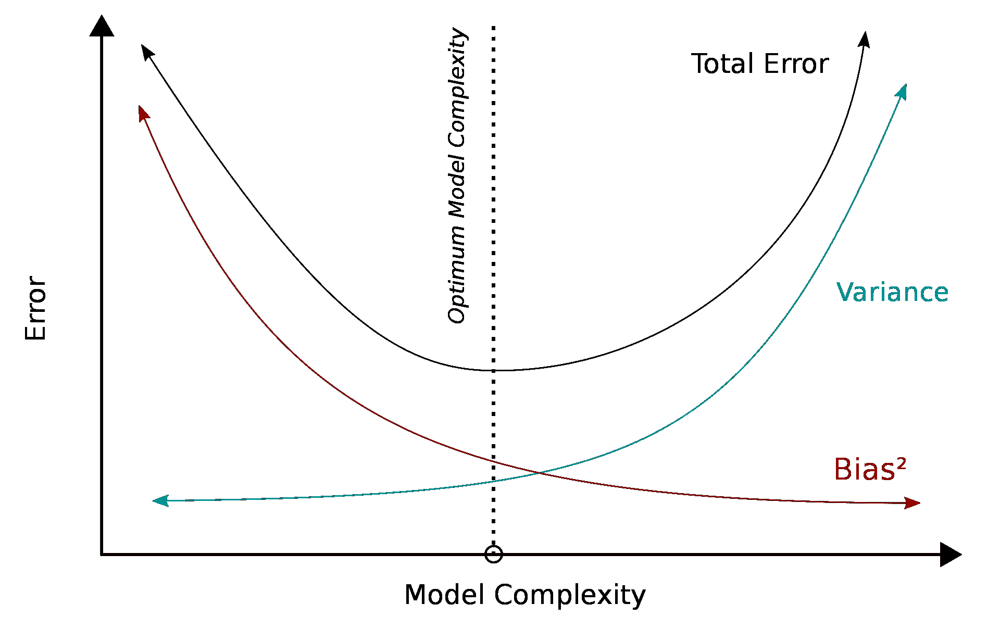

# 偏差-方差权衡

> 原文：[`www.kdnuggets.com/2022/08/biasvariance-tradeoff.html`](https://www.kdnuggets.com/2022/08/biasvariance-tradeoff.html)

编辑图片

你可能以前听说过偏差-方差权衡，觉得“嗯？”或者你可能从未听说过这个概念，正想着“这到底是什么？”

* * *

## 我们的前三个课程推荐

 1\. [谷歌网络安全证书](https://www.kdnuggets.com/google-cybersecurity) - 快速进入网络安全职业生涯

 2\. [谷歌数据分析专业证书](https://www.kdnuggets.com/google-data-analytics) - 提升你的数据分析技能

 3\. [谷歌 IT 支持专业证书](https://www.kdnuggets.com/google-itsupport) - 支持你的组织的 IT 需求

* * *

无论如何，偏差-方差权衡是监督式机器学习和预测建模中的一个重要概念。当你想训练一个预测模型时，可以选择各种监督式机器学习模型。每种模型都有其独特之处，但最大的区别在于它们的偏差和方差水平。

在模型预测中，你会关注预测误差。偏差和方差是预测误差的两种类型，被广泛应用于许多行业。在预测建模中，模型的偏差和方差之间存在权衡。

理解这些预测误差的工作原理以及如何利用它们将帮助你建立既准确又表现良好的模型，同时避免过拟合和欠拟合。

让我们从这两个概念的定义开始。

# 什么是偏差？

偏差是由于模型从数据集中学习信号的灵活性有限而导致的结果偏差。它是模型的平均预测值与我们尝试预测的正确值之间的差异。

当你遇到一个具有高偏差的模型时，这意味着模型在训练数据上学习得不好。这进一步导致在训练数据和测试数据上的误差较高，因为模型由于没有学习数据特征等而变得过于简化。

# 什么是方差？

方差是指模型在使用不同的训练数据集时的变化。它告诉我们数据的分布情况以及在使用不同数据集时的敏感度。

当你遇到一个具有高方差的模型时，这意味着模型在训练数据上学习得很好，但在未见过或测试数据上无法很好地推广。因此，这会导致测试数据上的误差率较高，造成过拟合。

# 那么，什么是权衡呢？

在机器学习模型中，也需要找到那个平衡点。

如果一个模型过于简单——这可能导致高偏差和低方差。如果一个模型过于复杂，参数过多——这可能导致高方差和低偏差。因此，我们的目标是找到那个完美的点，以避免过拟合或欠拟合的发生。

低方差模型通常较为简单，结构也较为简单——但存在高偏差的风险。这些模型的例子有朴素贝叶斯、回归等。这会导致欠拟合，因为模型无法识别数据中的信号，从而无法对未见过的数据进行预测。

低偏差模型通常较为复杂，结构也较为灵活——但存在高方差的风险。这些模型的例子有决策树、最近邻等。当模型过于复杂时，这会导致过拟合，因为模型记住了数据中的噪音，而不是信号。

如果你想了解更多关于如何避免过拟合、信号和噪音的信息，可以点击这个[链接](https://www.kdnuggets.com/2022/08/avoid-overfitting.html)。

这就是权衡发挥作用的地方。我们需要找到偏差和方差之间的平衡点，以最小化总误差。让我们深入了解总误差。

# 背后的数学

让我们从一个简单的公式开始，假设我们要预测的是‘Y’，其他协变量是‘X’。两者之间的关系可以定义为：

‘e’ 代表误差项。

在点 x 处的期望平方误差可以定义为：

这将产生：

这可以更好地定义为：

**总误差** = 偏差² + 方差 + 不可减少的误差

不可减少的误差指的是建模中无法减少的“噪音”——减少它的一种方法是通过数据清理。

来源: [维基百科](https://en.wikipedia.org/wiki/Bias%E2%80%93variance_tradeoff#/media/File:Bias_and_variance_contributing_to_total_error.svg)

然而，重要的是要注意，无论你的模型多么出色，数据总会有一个不可减少的误差元素，这无法被去除。当你找到偏差和方差之间的最佳平衡点时，你的模型将不会出现过拟合或欠拟合的情况。

# 结论

希望通过这篇文章，你能更好地理解什么是偏差，什么是方差以及它们如何影响预测建模。你还会了解到这两者之间的权衡是什么，为什么找到那个平衡点以产生最佳性能的模型是重要的，以避免过拟合或欠拟合——这背后有一点数学原理。

**[Nisha Arya](https://www.linkedin.com/in/nisha-arya-ahmed/)** 是一位数据科学家和自由技术作家。她特别关注提供数据科学职业建议、教程以及数据科学理论知识。她还希望探索人工智能如何有助于延长人类寿命的不同方式。作为一个热衷学习的人，她希望在拓宽技术知识和写作技能的同时，帮助指导他人。
