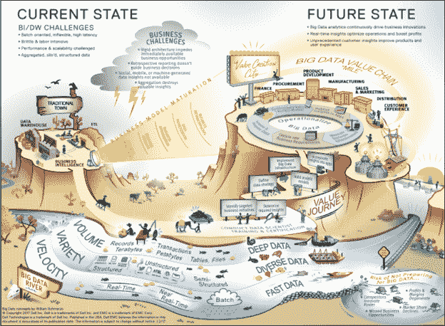
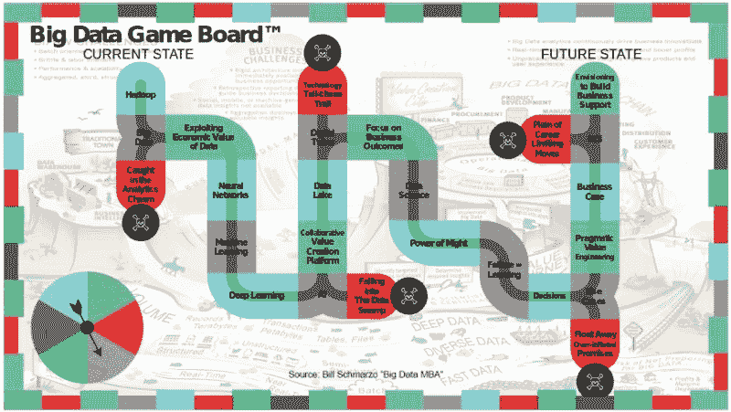
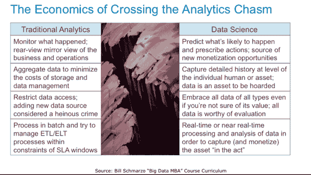
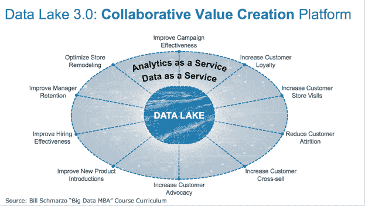
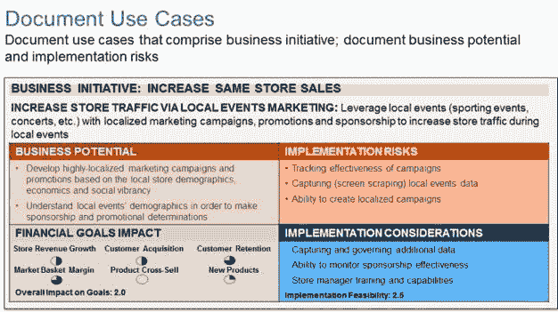
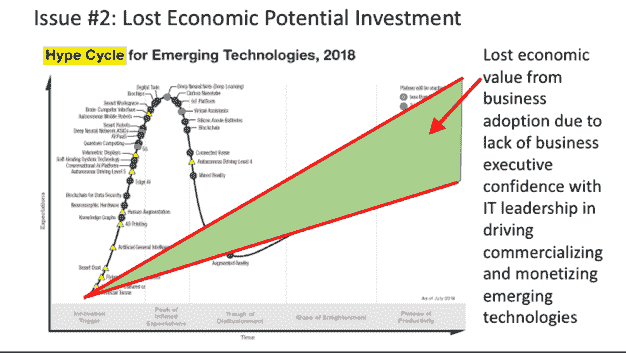
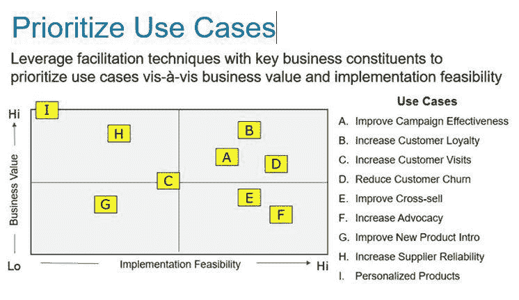

# 大数据游戏板™

> 原文：[`www.kdnuggets.com/2018/11/big-data-game-board.html`](https://www.kdnuggets.com/2018/11/big-data-game-board.html)

 评论

我最初在 2013 年 1 月发布了大数据故事图，以创造性地传达成功的大数据项目的关键因素（见图 1）。

**图 1: 大数据故事图**

* * *

## 我们的前三名课程推荐

 1\. [Google 网络安全证书](https://www.kdnuggets.com/google-cybersecurity) - 快速进入网络安全职业生涯。

 2\. [Google 数据分析专业证书](https://www.kdnuggets.com/google-data-analytics) - 提升您的数据分析水平

 3\. [Google IT 支持专业证书](https://www.kdnuggets.com/google-itsupport) - 支持您的组织的 IT

* * *

今天我唯一会做的重大改变就是将河流（它代表了大数据的深度、多样性和高速度）改为数据湖。

大数据故事图突出了 6 个对大数据项目成功至关重要的“里程碑”（看看您能否在图 1 中找到它们）：

+   **里程碑 #1: 激烈的市场动态**。市场动态因大数据而变化。数据像水一样强大。海量的结构化和非结构化数据、广泛的内部和外部数据、以及高速数据可以推动组织变革和业务创新。确保您的#BigData 之旅不会陷入经济价值存疑的数据沼泽。

+   **里程碑 #2: 业务与 IT 挑战**。大数据促进了业务转型，从利用部分数据的“后视镜”视角监控业务表现，转变为利用所有可用数据的实时预测型企业，以优化业务表现。然而，组织在利用大数据来转型其业务时面临重大挑战。

+   **里程碑 #3: 大数据业务转型**。组织在利用大数据分析来推动价值创造过程方面的愿景是什么？一些组织难以理解大数据的业务潜力。他们不清楚业务成熟的不同阶段。我们的“大数据成熟度”模型对组织的大数据业务愿景进行基准评估，并提供了一种识别所需数据货币化机会的复杂程度的方法。

+   **地标 #4: 大数据之旅**。大数据之旅需要业务和 IT 利益相关者之间的合作，以识别正确的业务机会和必要的大数据架构。大数据之旅需要 1) 专注于为组织的关键业务举措提供支持，同时 2) 确保大数据业务机会能够由 IT 实施。

+   **地标 #5: 运营大数据**。成功的组织定义了一个持续发现和发布有关业务的新见解的过程。组织需要一个明确的过程，将分析见解提取并整合回到运营系统中。该过程应清晰地定义业务用户、BI/DW 团队和数据科学家之间的角色和责任，以使大数据能够投入运营。

+   **地标 #6: 价值创造城市**。大数据有潜力转变或重新构建你的价值创造过程，从而创造竞争差异。组织需要一个将其愿景与组织的关键业务举措联系起来的大数据战略。设想研讨会和分析实验室可以识别出大数据如何为组织的价值创造过程提供动力。

更多大数据故事图地标的详细信息，请参见博客“[大数据故事图](https://infocus.dellemc.com/william_schmarzo/the-big-data-storymap/)”。

### **介绍大数据游戏板™**

虽然大数据故事图最近获得了很多关注，但它已经显得陈旧乏味，需要更新。因此，在我的朋友弗雷德里克·拉尔达罗（Twitter 账号 @FLardaro）的推动下，我创建了“***大数据游戏板™***”！所以，让“垄断”，“风险”，和“蜗牛赛跑”让开吧！是时候向全球的年轻人教授一个重要的职业发展游戏：如何利用数据和分析来改变你的生活！

介绍一下“**大数据游戏板™**”！

**图 2: 大数据游戏板™**

旋转转盘，看看你能否避免以下大数据（以及数据科学和 AI）陷阱：

**陷阱 #1：** 你是“**陷入分析鸿沟**”还是成功地“**利用数据的经济价值**”？

许多公司陷入了“分析鸿沟”。他们不理解如何利用“大数据经济学”从描述性的回顾报告和仪表板过渡到预测性分析见解和处方性行动。这一鸿沟阻碍了组织充分利用数据和分析的潜力，以推动组织的商业模式（见图 3）。

**图 3: 跨越分析鸿沟**

更多详情请参见“跨越大数据/数据科学分析鸿沟”博客。

**陷阱 #2：** 你是“**陷入数据沼泽**”还是在创建一个“**协作价值创造平台**”？

摆脱数据湖 2.0，其中数据被随机存储以待确定用途，而是开发数据湖 3.0，使其成为组织关键数字资产——数据和分析的终极存储库。数据湖 3.0 成为组织的协作价值创造平台，促进业务相关者与数据科学团队之间的合作，利用数据和分析发现新的客户、产品、服务、渠道和运营价值（见图 4）。

**图 4:  数据湖 3.0: 协作价值创造平台**

查看博客 “[数据货币化？看看首席数据货币化官](https://www.datasciencecentral.com/profiles/blogs/data-monetization-cue-the-chief-data-monetization-officer)” 了解有关数据湖 3.0——协作价值创造平台的更多细节。

**陷阱 #3:** 你是在追求“**技术追逐尾巴**”，还是“**专注于业务结果**”？

组织在大数据方面失败，并不是因为缺乏用例，而是因为用例过多。组织需要一个正式的、协作的过程来识别、验证、审查、评估和优先排序用例，并确保信息技术与业务在追求这些用例时保持一致，找到高业务价值与高实施可行性的最佳组合（想想“低垂的果实”）。在启动大数据和数据科学计划时，前期投入时间详细了解构成用例的财务、客户和运营驱动因素，并标记任何潜在的抑制因素和实施风险。以睁大眼睛的状态进入这场游戏（见图 5）！

**图 5:  文档使用案例的财务、客户和运营驱动因素**

查看博客 “[用例识别、验证和优先级排序](https://www.datasciencecentral.com/profiles/blogs/the-1-iot-challenge-use-case-identification-validation-and-1)” 获取指导组织的业务和运营用例识别、验证、评估和优先级排序的流程。

**陷阱 #4:** 你是在“**沉浸于夸大承诺**”中漂浮，还是采取“**务实的价值工程**”方法？

过度炒作的技术创新提供了最终的“梦想田野”时刻，让非科学家在进行科学实验。虽然组织对新技术的熟悉有其价值，但技术概念验证不应强加给业务相关者，并带有过度夸大的宏伟期望。商业用户早已停止相信技术的“银弹”解决方案——即一个看似神奇的简单解决方案来解决复杂问题（见图 6）。

**图 6:  过度炒作的技术创新的经济成本**

更多细节请参阅博客“[为什么接受炒作？是时候转变我们对新兴技术的处理方式了](https://www.datasciencecentral.com/profiles/blogs/why-accept-the-hype-time-to-transform-how-we-approach-emerging?xg_source=activity)”。

**陷阱 #5：** 你是否在“**CLM 平原：职业限制性举措**”中失败了，还是成功攀登了“**构建业务支持的愿景**”这座山？

成功的大数据之旅的一个关键挑战是获得业务和 IT 利益相关者之间的共识和一致，以识别初步的大数据业务用例，这些用例 1) 能够为业务带来足够的价值，同时 2) 具有较高的成功概率。 可以找到多个业务用例，其中大数据和先进分析能够提供有说服力的业务价值；对大数据和数据科学的采用至关重要的是，业务利益相关者有机会表达他们的意见，并主动帮助制定大数据和数据科学议程。

我们找到了一种工具，用于推动业务和 IT 的协作与一致，以确定你的大数据和数据科学之旅中“正确”的初步用例——优先级矩阵（见图 X）。

**图 7: 优先级矩阵**

请参阅博客“[优先级矩阵：在大数据旅程中对齐业务和 IT](https://www.linkedin.com/pulse/prioritization-matrix-aligning-business-big-data-journey-schmarzo/)”了解如何使用优先级矩阵推动组织对齐的机制。

所以现在我就坐下来等待 Hasbro 和 Ravensburger 来敲我的门，向我提供无尽的财富来大规模生产和推广我的“Big Data Game Board™”。 实际上，我可能会满足于几张 Chipotle、True Food 和 Starbucks 的礼品卡……

**相关内容：**

+   使用混淆矩阵量化错误成本

+   构建数据科学团队的成功游戏计划

+   伟大的数据科学家不仅仅是跳出思维框框，他们还重新定义了框框

### 更多相关主题

+   [停止学习数据科学以寻找目的，并寻找目的来…](https://www.kdnuggets.com/2021/12/stop-learning-data-science-find-purpose.html)

+   [学习数据科学统计学的最佳资源](https://www.kdnuggets.com/2021/12/springboard-top-resources-learn-data-science-statistics.html)

+   [成功数据科学家的 5 个特征](https://www.kdnuggets.com/2021/12/5-characteristics-successful-data-scientist.html)

+   [每个数据科学家都应该知道的三个 R 库（即使你使用 Python）](https://www.kdnuggets.com/2021/12/three-r-libraries-every-data-scientist-know-even-python.html)

+   [一个 90 亿美元的 AI 失败案例分析](https://www.kdnuggets.com/2021/12/9b-ai-failure-examined.html)

+   [是什么让 Python 成为初创公司理想的编程语言](https://www.kdnuggets.com/2021/12/makes-python-ideal-programming-language-startups.html)
