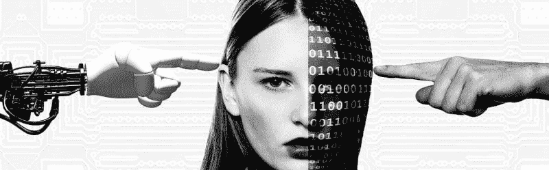

# 机器学习的苦涩教训

> 原文：[`www.kdnuggets.com/2020/07/bitter-lesson-machine-learning.html`](https://www.kdnuggets.com/2020/07/bitter-lesson-machine-learning.html)

评论

**由[理查德·萨顿](https://en.wikipedia.org/wiki/Richard_S._Sutton)，DeepMind 和阿尔伯塔大学**。

* * *

## 我们的前三课程推荐

 1\. [谷歌网络安全证书](https://www.kdnuggets.com/google-cybersecurity) - 快速进入网络安全职业

 2\. [谷歌数据分析专业证书](https://www.kdnuggets.com/google-data-analytics) - 提升你的数据分析技能

 3\. [谷歌 IT 支持专业证书](https://www.kdnuggets.com/google-itsupport) - 支持你所在组织的 IT

* * *

从 70 年的人工智能研究中可以得出的最大教训是，利用计算的一般方法最终是最有效的，并且差距很大。最终原因是摩尔定律，或者更准确地说，是其对计算单位成本持续指数下降的普遍化。大多数人工智能研究都假设代理可用的计算是恒定的（在这种情况下，利用人类知识将是提高性能的唯一途径之一），但在比典型研究项目稍长的时间内，大量更多的计算不可避免地变得可用。为了在短期内寻求有意义的改进，研究人员试图利用他们对领域的知识，但从长远来看，唯一重要的事情是利用计算。这两者并不一定相互矛盾，但在实践中往往会。投入到一种方法上的时间就是没有投入到另一种方法上的时间。对一种方法的心理投入往往会影响另一种方法。而人类知识的方法往往使方法复杂化，从而使其不太适合利用计算的通用方法。许多人工智能研究人员在之后才认识到这一苦涩的教训，回顾一些最突出的例子是很有启发性的。

> **从 70 年的人工智能研究中可以得出的最大教训是，利用计算的一般方法最终是最有效的，并且差距很大。**

在计算机国际象棋中，1997 年击败世界冠军卡斯帕罗夫的方法是基于大规模、深度搜索的。当时，大多数计算机国际象棋研究人员对这种方法感到失望，他们曾追求那些利用人类对国际象棋特殊结构理解的方法。当一种更简单、基于搜索的方法配合特殊硬件和软件证明了更有效时，这些依赖人类知识的国际象棋研究人员并不善于接受失败。他们说，“蛮力”搜索可能这次获胜，但这不是一种通用策略，而且反正这也不是人们下棋的方式。这些研究人员希望基于人类输入的方法获胜，当他们未能实现这一点时感到失望。

计算机围棋中的研究进展模式与此类似，只是延迟了 20 年。最初的大量努力旨在通过利用人类知识或游戏的特殊特性来避免搜索，但一旦有效地大规模应用搜索，这些努力都证明了无关紧要，甚至更糟。自我对弈学习以学习价值函数也非常重要（正如在许多其他游戏中一样，甚至在国际象棋中也是如此，尽管在 1997 年首次击败世界冠军的程序中，学习并没有发挥重要作用）。自我对弈学习和学习一般来说与搜索类似，因为它能使大量计算得以运用。搜索和学习是人工智能研究中利用大量计算的两个最重要的技术类别。在计算机围棋中，与计算机国际象棋类似，研究人员最初的努力是集中在利用人类理解（以减少搜索需求），而只有在很晚的时候，通过采用搜索和学习才取得了更大的成功。

在语音识别领域，1970 年代有过一次由 DARPA 赞助的早期竞赛。参赛者包括大量利用人类知识的特殊方法——词汇知识、音素知识、人体发音道知识等。另一方面是基于隐藏马尔可夫模型（HMMs）的统计性方法，这些方法计算量大得多。统计方法再次战胜了基于人类知识的方法。这导致了自然语言处理领域的重大变化，逐渐经历了数十年，统计和计算成为主导。最近语音识别领域深度学习的崛起是这一一致方向的最新一步。深度学习方法甚至更少依赖于人类知识，使用更多的计算和在巨大训练集上进行学习，以产生更出色的语音识别系统。正如在游戏中一样，研究人员总是试图使系统按照他们认为自己思维运作的方式工作——他们试图将这种知识放入他们的系统中——但最终证明这是适得其反的，并且是对研究人员时间的巨大浪费，当摩尔定律下，大规模计算成为可能，并找到了有效利用它的方法时。

在计算机视觉领域，也出现了类似的模式。早期的方法将视觉视为寻找边缘、或通用的圆柱体，或以 SIFT 特征来进行处理。但今天，所有这些都被抛弃了。现代的深度学习神经网络仅使用卷积和某些类型的不变性，表现得更好。

这是一个重要的教训。作为一个领域，我们仍未彻底领会这一点，因为我们继续犯同样的错误。为了看清这一点并有效抵制它，我们必须理解这些错误的吸引力。我们必须吸取苦涩的教训，即在我们认为自己思考的方式中构建知识在长期内是行不通的。这个苦涩的教训基于以下历史观察：1）人工智能研究人员常常试图将知识构建到他们的代理中，2）这在短期内总是有帮助，并且对研究人员来说是个人上令人满意的，但 3）从长远来看，这会停滞不前，甚至抑制进一步的进展，4）突破性的进展最终通过一种基于计算规模化的搜索和学习的对立方法到来。最终的成功带有苦涩，常常因为是对一种偏爱的、人本中心方法的胜利而未被完全消化。

从这个苦涩的教训中应该学到的一点是，通用方法的巨大力量，那些即使在计算量非常大的情况下也能持续扩展的方法。似乎能够以这种方式无限扩展的两种方法是*搜索*和*学习*。

从这个痛苦的教训中学习到的第二个一般性观点是，心智的实际内容极其复杂、无法挽回；我们应停止寻找关于心智内容的简单思维方式，如关于空间、物体、多个代理或对称性的简单思维方式。所有这些都是任意的、内在复杂的外部世界的一部分。它们不应该被内建，因为它们的复杂性是无穷的；相反，我们应该只内建能够发现和捕捉这种任意复杂性的元方法。这些方法的关键是它们能找到好的近似值，但寻找这些近似值的过程应该由我们的方法完成，而不是由我们自己完成。我们希望 AI 代理能够像我们一样发现，而不是包含我们已经发现的内容。内建我们的发现只会让我们更难看到发现过程是如何进行的。

[原文](http://incompleteideas.net/IncIdeas/BitterLesson.html)。经许可转载。

**简介：**[理查德·S·萨顿](https://en.wikipedia.org/wiki/Richard_S._Sutton)是[DeepMind](https://en.wikipedia.org/wiki/DeepMind)的杰出研究科学家，并且是加拿大[阿尔伯塔大学](https://en.wikipedia.org/wiki/University_of_Alberta)计算机科学的教授。萨顿被广泛认为是现代[强化学习](https://en.wikipedia.org/wiki/Reinforcement_learning)的奠基人之一，对该领域做出了若干重要贡献，包括[时序差分学习](https://en.wikipedia.org/wiki/Temporal_difference_learning)和策略梯度方法。

**相关：**

+   [深度神经网络在自然语言处理（NLP）中的不合理进展](https://www.kdnuggets.com/2020/06/unreasonable-progress-deep-neural-networks-nlp.html)

+   [独家：与强化学习之父 Rich Sutton 的采访](https://www.kdnuggets.com/2017/12/interview-rich-sutton-reinforcement-learning.html)

+   [1983-2010 年人工智能的复兴](https://www.kdnuggets.com/2018/02/resurgence-ai-1983-2010.html)

### 更多相关主题

+   [成为一名优秀数据科学家所需的 5 项关键技能](https://www.kdnuggets.com/2021/12/5-key-skills-needed-become-great-data-scientist.html)

+   [每个初学者数据科学家应掌握的 6 种预测模型](https://www.kdnuggets.com/2021/12/6-predictive-models-every-beginner-data-scientist-master.html)

+   [2021 年最佳 ETL 工具](https://www.kdnuggets.com/2021/12/mozart-best-etl-tools-2021.html)

+   [停止学习数据科学以寻找目标，并通过寻找目标……](https://www.kdnuggets.com/2021/12/stop-learning-data-science-find-purpose.html)

+   [学习数据科学统计学的顶级资源](https://www.kdnuggets.com/2021/12/springboard-top-resources-learn-data-science-statistics.html)

+   [成功数据科学家的 5 个特征](https://www.kdnuggets.com/2021/12/5-characteristics-successful-data-scientist.html)
