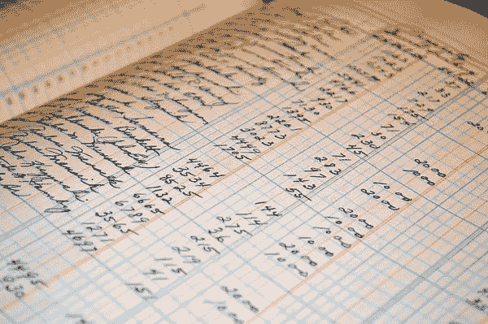

# 区块链在 7 个 Python 函数中的解释

> 原文：[`www.kdnuggets.com/2018/04/blockchain-explained-7-python-functions.html`](https://www.kdnuggets.com/2018/04/blockchain-explained-7-python-functions.html)

 评论

**由[Tom Cusack](https://www.linkedin.com/in/tomcusack1/)，银行业数据科学家**



我认为对于很多人来说，区块链是一种很难理解的现象。我开始观看视频和阅读文章，但对我来说，直到我编写了自己简单的区块链，我才真正理解它是什么及其潜在的应用。

我对区块链的理解是，它是一个公开的加密数据库。如果你是亚马逊，想用这项技术来跟踪你的库存水平，那么使用区块链有意义吗？可能没有，因为你的客户不会想花费资源来验证你的区块链，因为他们在网站上已经标明“仅剩 1 件”。

我将留给你们思考未来的应用。那么，事不宜迟，让我们设置我们的 7 个函数吧！

```py
def hash_function(k):
    *"""Hashes our transaction."""* if type(k) is not str:
        k = json.dumps(k, sort_keys=True)

    return hashlib.sha256(k).hexdigest()
```

区块链的核心是哈希函数。如果没有加密，区块链将很容易被操控，交易也可能被欺诈性地插入。

```py
def update_state(transaction, state):
    state = state.copy()

    for key in transaction:
        if key in state.keys():
            state[key] += transaction[key]
        else:
            state[key] = transaction[key]

    return state
```

‘状态’是记录谁拥有什么的。例如，我有 10 个硬币，我给 Medium 1 个，那么状态将是下面字典的值。

```py
{‘transaction’: {‘Tom’: 9, ‘Medium’: 1}}
```

重要的是要注意，透支是不允许的。如果存在的硬币只有 10 个，那么我不能给某人 11 个硬币。下面的函数验证了我们尝试进行的交易是否确实有效。此外，交易必须平衡。我不能给出 5 个硬币而让接收者收到 4 个硬币，因为这会导致硬币的销毁和创建。

```py
def valid_transaction(transaction, state):
    *"""A valid transaction must sum to 0."""* if sum(transaction.values()) is not 0:
        return False

    for key in transaction.keys():
        if key in state.keys():
            account_balance = state[key]
        else:
            account_balance = 0

        if account_balance + transaction[key] < 0:
            return False

    return True
```

现在，我们可以创建我们的区块。从之前的区块中读取信息，并用来将其链接到新区块。这一点也是区块链概念的核心。看似有效的交易可能会被尝试以欺诈方式插入区块链，但解密所有之前的区块在计算上（几乎）是不可能的，这保持了区块链的完整性。

```py
def make_block(transactions, chain):
    *"""Make a block to go into the chain."""* parent_hash = chain[-1]['hash']
    block_number = chain[-1]['contents']['block_number'] + 1

    block_contents = {
        'block_number': block_number,
        'parent_hash': parent_hash,
        'transaction_count': block_number + 1,
        'transaction': transactions
    }

    return {'hash': hash_function(block_contents), 'contents': block_contents}
```

以下是一个小助手函数，用于检查前一个区块的哈希值：

```py
def check_block_hash(block):
    expected_hash = hash_function(block['contents'])

    if block['hash'] is not expected_hash:
        raise

    return
```

一旦我们把所有东西都组合在一起，就该创建我们的区块了。我们现在将更新区块链。

```py
def check_block_validity(block, parent, state):
    parent_number = parent['contents']['block_number']
    parent_hash = parent['hash']
    block_number = block['contents']['block_number']

    for transaction in block['contents']['transaction']:
        if valid_transaction(transaction, state):
            state = update_state(transaction, state)
        else:
            raise

    check_block_hash(block)  # Check hash integrity

    if block_number is not parent_number + 1:
        raise

    if block['contents']['parent_hash'] is not parent_hash:
        raise

    return state
```

在我们完成之前，链必须经过验证：

```py
def check_chain(chain):
    *"""Check the chain is valid."""* if type(chain) is str:
        try:
            chain = json.loads(chain)
            assert (type(chain) == list)
        except ValueError:
            # String passed in was not valid JSON
            return False
    elif type(chain) is not list:
        return False

    state = {}

    for transaction in chain[0]['contents']['transaction']:
        state = update_state(transaction, state)

    check_block_hash(chain[0])
    parent = chain[0]

    for block in chain[1:]:
        state = check_block_validity(block, parent, state)
        parent = block

    return state
```

最后，需要一个交易函数，将以上所有内容连接在一起：

```py
def add_transaction_to_chain(transaction, state, chain):
    if valid_transaction(transaction, state):
        state = update_state(transaction, state)
    else:
        raise Exception('Invalid transaction.')

    my_block = make_block(state, chain)
    chain.append(my_block)

    for transaction in chain:
        check_chain(transaction)

    return state, chain
```

所以，现在我们有了我们的 7 个函数。我们怎么与之互动呢？首先，我们需要用一个*创世区块*来启动我们的链。这是我们新硬币（或库存等）的起点。为了本文的目的，我将说我，Tom，将以 10 个硬币开始。

```py
genesis_block = {
    'hash': hash_function({
        'block_number': 0,
        'parent_hash': None,
        'transaction_count': 1,
        'transaction': [{'Tom': 10}]
    }),
    'contents': {
        'block_number': 0,
        'parent_hash': None,
        'transaction_count': 1,
        'transaction': [{'Tom': 10}]
    },
}

block_chain = [genesis_block]
chain_state = {'Tom': 10}
```

现在，看看当我给 Medium 一些硬币时会发生什么：

```py
chain_state, block_chain = add_transaction_to_chain(transaction={'Tom': -1, 'Medium': 1}, state=chain_state, chain=block_chain)
```

状态会更新，以显示谁拥有什么：

```py
{'Medium': 1, 'Tom': 9}
```

区块链是这样的：

```py
[{'contents': {'block_number': 0,
               'parent_hash': None,
               'transaction': [{'Tom': 10}],
               'transaction_count': 1},
  'hash': '064d0b480b3b92761f31831d30ae9f01954efaa62371b4b44f11465ec22abe93'},
 {'contents': {'block_number': 1,
               'parent_hash': '064d0b480b3b92761f31831d30ae9f01954efaa62371b4b44f11465ec22abe93',
               'transaction': {'Medium': 1, 'Tom': 9},
               'transaction_count': 2},
  'hash': 'b4ae25f0cc0ee0b0caa66b9a3473e9a108652d53b1dc22a40962fef5c8c0f08c'}]
```

我们的第一个新交易已经创建并插入到堆栈顶部。现在，我希望我已经引起了你的好奇心，并且你有兴趣复制代码并进行尝试。在我看来，这就是学习新技术的最佳方式——深入其中。

玩玩代码，制作你自己的币。如果你尝试给出超过存在的币会发生什么？如果你不断创建新的支付者，状态会发生什么？

你能想到区块链的未来应用吗？请随时在评论中问我任何问题，我会尽力帮助你。

**简介：[汤姆·库萨克](https://www.linkedin.com/in/tomcusack1/)** 是银行业的数据科学家。

[原文](https://towardsdatascience.com/blockchain-explained-in-7-python-functions-c49c84f34ba5)。经许可转载。

**相关：**

+   区块链和 API

+   人工智能与区块链的融合：这是怎么回事？

+   Swiftapply  – 自动高效的 pandas 应用操作

* * *

## 我们的前三个课程推荐

 1\. [谷歌网络安全证书](https://www.kdnuggets.com/google-cybersecurity) - 快速进入网络安全职业生涯。

 2\. [谷歌数据分析专业证书](https://www.kdnuggets.com/google-data-analytics) - 提升你的数据分析能力

 3\. [谷歌 IT 支持专业证书](https://www.kdnuggets.com/google-itsupport) - 支持你的组织 IT 事务

* * *

### 更多相关话题

+   [成为优秀数据科学家所需的 5 项关键技能](https://www.kdnuggets.com/2021/12/5-key-skills-needed-become-great-data-scientist.html)

+   [每个初学者数据科学家应掌握的 6 种预测模型](https://www.kdnuggets.com/2021/12/6-predictive-models-every-beginner-data-scientist-master.html)

+   [2021 年最佳 ETL 工具](https://www.kdnuggets.com/2021/12/mozart-best-etl-tools-2021.html)

+   [使用管道编写干净的 Python 代码](https://www.kdnuggets.com/2021/12/write-clean-python-code-pipes.html)

+   [是什么使得 Python 成为初创企业理想的编程语言](https://www.kdnuggets.com/2021/12/makes-python-ideal-programming-language-startups.html)

+   [每个数据科学家都应该知道的三个 R 库（即使你使用 Python）](https://www.kdnuggets.com/2021/12/three-r-libraries-every-data-scientist-know-even-python.html)
