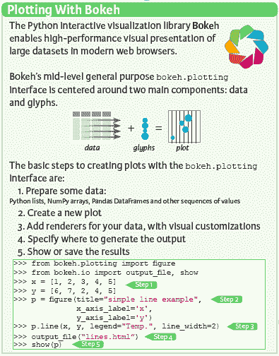
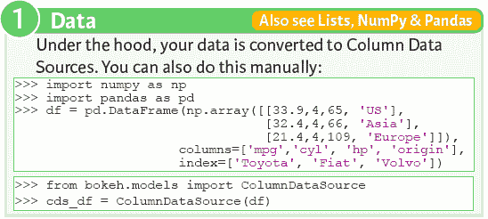
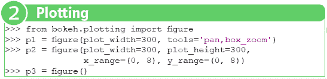
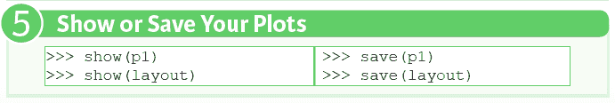
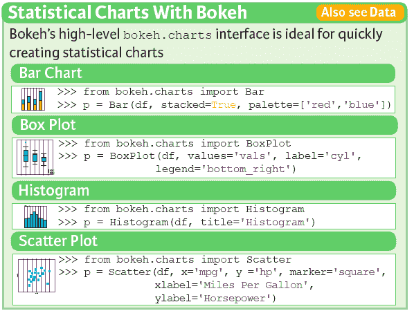

# Bokeh 速查表：Python 中的数据可视化

> 原文：[`www.kdnuggets.com/2017/03/bokeh-cheat-sheet.html`](https://www.kdnuggets.com/2017/03/bokeh-cheat-sheet.html)

**作者：Karlijn Willems，数据科学记者 & [DataCamp](https://www.datacamp.com/) 贡献者。**

### 使用 Bokeh 进行 Python 数据可视化

数据可视化和讲故事是数据科学工作流程中的一个步骤，但常常被忽视。相反，这也可能是你数据科学学习中最困难的步骤之一，因为以一种能够让你的信息呈现出你分析所带来的信息的方式来可视化数据或讲述数据故事可能特别具有挑战性。当你开始考虑这些话题时，你会经常听到[matplotlib](http://matplotlib.org/)是数据可视化的首选包，它确实如此，但有时你需要提升技能，如果你要在 Web 浏览器中交互式地可视化大型数据集。

这就是[Bokeh](http://bokeh.pydata.org/en/latest/)包的用武之地：一个 Python 数据可视化库，能够在现代 Web 浏览器中高性能地展示大型数据集。这个包提供了许多将数据以引人注目的方式可视化的可能性，但它也非常灵活且庞大，以至于当你想要开始使用时，可能会被其可能性所压倒。这就是为什么 DataCamp 与[Bryan Van de Ven](https://www.continuum.io/people/bryan-van-de-ven)，Bokeh 核心贡献者，合作开发了一门[使用 Bokeh 进行交互式数据可视化](https://www.datacamp.com/courses/interactive-data-visualization-with-bokeh)课程，该课程最近上线，逐步且互动地指导你了解这个包所提供的可能性。

此外，DataCamp 还确保你可以免费下载一份[Bokeh 速查表](https://www.datacamp.com/community/blog/bokeh-cheat-sheet-python)，以便在你遇到疑问时有一个方便的参考表可以依赖！

### Bokeh 速查表

Bokeh 包为用户提供了很多可视化的灵活性：那些通常用于快速制作图表和统计图的工具是 Bokeh 的中级通用[bokeh.plotting](http://bokeh.pydata.org/en/latest/docs/reference/plotting.html)接口和高级[bokeh.charts](http://bokeh.pydata.org/en/latest/docs/reference/charts.html)接口。

还有[ bokeh.models](http://bokeh.pydata.org/en/latest/docs/reference/models.html)接口，它为应用开发者提供了最大的灵活性，但没有包含在这份 Bokeh 速查表中。

现在，当你使用 bokeh.plotting 时，你会看到有两个主要组件，你需要了解如何高效地使用这个接口：数据和图形，这些组成了你的图表。

制作图表的基本步骤总共有五步：你需要你的数据来创建新的图表，你可以在其中添加字形和其他视觉自定义。你还需要指定你希望生成输出的位置，然后展示或保存结果，如左侧图片所示。

看起来很简单，对吧？让我们更详细地看看这些步骤。

### 数据

你可以传递各种类型的数据，如 Python 列表或元组、NumPy 数组或 Pandas DataFrame 来生成你的图表。

然而，在幕后，所有数据都被转换为 ColumnDataSource 对象。你也可以选择直接从字典和 Pandas DataFrame 创建 ColumnDataSource 对象，使用 ColumnDataSource() 函数，可以在从 bokeh.models 导入之后使用。如果你不确定如何创建和使用 DataFrames 和数组，可以考虑学习 DataCamp 的 [Pandas 教程](https://www.datacamp.com/community/tutorials/pandas-tutorial-dataframe-python) 和 [NumPy 教程](https://www.datacamp.com/community/tutorials/python-numpy-tutorial)，以及 [Pandas 备忘单](https://www.datacamp.com/community/blog/python-pandas-cheat-sheet) 和 [NumPy 备忘单](https://www.datacamp.com/community/blog/python-numpy-cheat-sheet)。

### 绘图

就像在使用 Matplotlib 时一样，你可以通过初始化图形来开始使用 Bokeh 绘图。为此，你需要先从 bokeh.plotting 导入 figure。你可以使用这个函数创建一个新的绘图图形；当你创建新图形时，有一些额外的参数可以指定，以确保你根据自己的喜好修改图形：使用 plot_width 和 plot_height 你可以调整图形的宽度和高度，使用 tools 参数，你可以向图形中添加某些工具，例如平移或框选缩放。

此外，像 x_range 或 y_range 这样的参数用于设置 x 轴和 y 轴的范围也很有用。当然，你也可以选择不传递任何参数，直接创建一个图形。

### 渲染器和视觉自定义

**字形**

当你创建了一个要绘制的图形后，真正的工作开始了：为你的数据添加渲染器和视觉自定义（如果需要）。你不可能跟得上 Bokeh 为你准备的所有字形，因此备忘单仅列出最重要的字形：散点标记和线形字形。你可以使用第二步创建的图形，通过应用 circle() 或 square() 方法，确保在图表上将数据点散布为圆形和方形。line() 和 multi_line() 方法也一样，你可以使用它们来绘制折线图。然后你的数据点通过线连接起来。

当然，这些并不是 Bokeh 库提供的所有字形。前往[此页面](http://bokeh.pydata.org/en/latest/docs/user_guide/plotting.html)以查看更多字形！

**自定义字形**

你在上一部分看到的字形并不是非常自定义，对吗？Bokeh 确实允许你添加高度自定义的字形，这将使用户在使用你的图表时体验完全不同。

你对选择和非选择字形有什么看法？它们允许你突出显示数据中的某些数据点或区域；或者悬停字形，当你将鼠标悬停在图表上时突出显示你的数据？

很酷，对吧？

但可能会非常有用的是颜色映射：你可以用与数据所属类别相对应的颜色来显示数据点；查看备忘单以获取代码示例！

**行和列布局**

另一个在制作自定义可视化时非常有用的功能是 Bokeh 中的布局模块。它包含 row()和 column()函数，分别允许你创建行和列的图表。这意味着你的图表将水平或垂直显示。然而，这并不意味着你不能带来一些变化：你可以通过嵌套它们来结合两者。

这已经是自定义图表呈现的第一步了。

**网格布局**

当然，在某些情况下，仅创建行和列可能不足以满足你的布局需求。这就是为什么 Bokeh 还提供了网格布局：通过 gridplot()函数，你可以创建一个网格图，该网格图渲染在独立的画布上。在这种情况下，值得知道的是，该函数为网格中包含的所有图表构建了一个单一的工具栏，而这在使用 row()和 column()函数时是做不到的。

**标签布局**

除了行和列布局以及网格布局，还有标签布局。标签面板允许多个图表或布局显示在标签中；你可以从这些标签中选择你想要查看的图表。在备忘单中包含的代码中，你会看到你之前创建的两个图表现在被包含在面板中，这些面板构成了你布局中的标签。

**关联图表**

你会发现，将图表链接起来常常是有用的，这样可以在图表之间添加互联互动。链接图表的两种示例是链接坐标轴或链接刷选，这意味着数据源在图形渲染器之间共享。你对一个图形所做的所有选择也会传递到所有共享相同数据源的其他图形。为了更具体一点，假设在选择和未选择的图形中，你选择了一个包含数据点的区域。如果你的图表具有链接刷选，这也意味着其他图表中的相同数据点也会被选中。这是一种特别关注引起你注意的数据某些部分的好方法。

当你链接图表的坐标轴时，你会发现一旦你将图表拖动到左边、右边、上面或下面，其他图表的 x 轴和 y 轴也会跟随（或者只有两个轴中的一个会跟随，这当然取决于你如何具体指定链接）。在上面的代码示例中，图表的两个坐标轴都被链接。

**图例**

最后，除了图形、布局和链接外，非常重要的一点是，你添加到图表中的图例对你的观众理解图表的真实含义至关重要。你可以将图表做得尽可能美观和有意义，但图例将进一步帮助你的观众理解数据可视化想要传达的信息。这也是图例在此速查表中的位置原因：你可以看到如何指定图例的位置、方向、背景和边框。

当涉及到图例位置时，你可以将其清楚地放置在绘图区域内或外部。在第一种情况下，放置图例就像将字符串分配给绘图的属性一样简单。在第二种情况下，你需要多写一些代码来进行固定：你传递一个元组列表来组成图例，并且还添加一个位置。然后，你将布局添加到图表中，并指定你希望使用刚刚创建的变量中的图例值，并且将其添加到图表的右侧。

对于图例的方向，你不需要太担心；它可以是垂直的或水平的。再说一次，这就像调整绘图属性一样简单。至于背景和边框的规格，你只需要调整绘图属性即可。

如果你想查看更详细的代码示例，请访问[此页面](http://bokeh.pydata.org/en/latest/docs/gallery/legend.html)。

### 输出

输出你的 Bokeh 可视化的最显著方式是将其输出到 HTML 文件中或在 Jupyter notebook 中显示。你可以使用 output_file() 和 output_notebook() 函数来完成这些操作。前者函数允许你添加额外的参数来指定模式或如何包含 BokehJS；你可以在这里找到有关所有模式及其含义的更多信息。

当然，当你开始使用 Bokeh 并且觉得缺少输出选项时，请务必查看[此页面](http://bokeh.pydata.org/en/latest/docs/reference/io.html)获取更多信息。

**展示或保存图表**

就像在使用 Matplotlib 时一样，当你完成所有这些步骤后，终于到了展示或保存图表的时候！使用 show()和 save()函数来实现这一点！

**Bokeh 的统计图表**

中级通用的 bokeh.plotting 接口非常适合当你有时间逐行逐步设置图表自定义时。这非常适合制作演示文稿或最终报告中的图像。然而，对于数据探索的目的，你可能考虑使用高级的 bokeh.charts 接口，这是一种快速便捷的方式，以最少的代码生成图表。

备忘单包括了你在快速探索数据时最常用的图表，或者当你不想输入多余代码时使用的图表：条形图、箱线图、直方图和散点图。正如你可能已经猜到的那样，使用 Bar()、Boxplot()、Histogram()和 Scatter()函数来构建这些图表是非常简单的。

当然，使用最少的代码快速生成图表并不意味着你不能进行任何特定的自定义：你仍然可以添加各种参数以确保你的图表独一无二☺ 你可以在[这里](http://bokeh.pydata.org/en/latest/docs/user_guide/charts.html)找到更多相关信息。

### 开始吧！

现在你已经准备好开始使用 Bokeh 库进行实验了！如果你觉得需要一些灵感，或者你有某种可视化想法但代码无法实现你的需求，考虑查看一下[Bokeh 画廊](http://bokeh.pydata.org/en/latest/docs/gallery.html#gallery)。里面有很多美丽的例子，会让你陶醉！

PS. 当然，不要忘记随身携带你的[**备忘单**](https://www.datacamp.com/community/blog/bokeh-cheat-sheet-python)。

[**DataCamp**](https://www.datacamp.com/)是一个在线互动教育平台，专注于为数据科学构建最佳学习体验。我们的课程包括[R](https://www.datacamp.com/courses?learn=r_programming)、[Python](https://www.datacamp.com/courses?learn=python_programming)和[数据科学](https://www.datacamp.com/courses)，围绕特定主题构建，结合视频讲解和浏览器内编码挑战，让你通过实践学习。[你可以随时免费开始每门课程](https://www.datacamp.com/courses)，无论何时何地。

**[Karlijn Willems](https://www.linkedin.com/in/karlijnwillems)** 是一位数据科学记者，为[DataCamp 社区](https://www.datacamp.com/community/authors/karlijn-willems)撰稿，专注于数据科学教育、最新新闻和最热门的趋势。她拥有文学、语言学和信息管理学位。

**相关**：

+   Pandas 备忘单：Python 中的数据科学和数据清理

+   全面学习 Python 数据分析和数据科学指南

+   最佳数据科学在线课程

* * *

## 我们的前三个课程推荐

 1\. [Google 网络安全证书](https://www.kdnuggets.com/google-cybersecurity) - 快速进入网络安全职业道路

 2\. [Google 数据分析专业证书](https://www.kdnuggets.com/google-data-analytics) - 提升你的数据分析技能

 3\. [Google IT 支持专业证书](https://www.kdnuggets.com/google-itsupport) - 支持你的组织进行 IT 管理

* * *

### 更多相关内容

+   [Plotly Express 数据可视化备忘单](https://www.kdnuggets.com/2023/03/plotly-express-data-visualization-cheat-sheet.html)

+   [Python 数据清理备忘单](https://www.kdnuggets.com/2023/02/data-cleaning-python-cheat-sheet.html)

+   [最佳生成式 AI 应用程序 Python 工具备忘单](https://www.kdnuggets.com/2023/08/best-python-tools-generative-ai-cheat-sheet.html)

+   [Python 控制流备忘单](https://www.kdnuggets.com/2022/11/python-control-flow-cheatsheet.html)

+   [KDnuggets 新闻，7 月 5 日：一个烂掉的数据科学项目 • 10 个人工智能…](https://www.kdnuggets.com/2023/n24.html)

+   [Docker 用于数据科学备忘单](https://www.kdnuggets.com/2023/02/docker-data-science-cheat-sheet.html)
