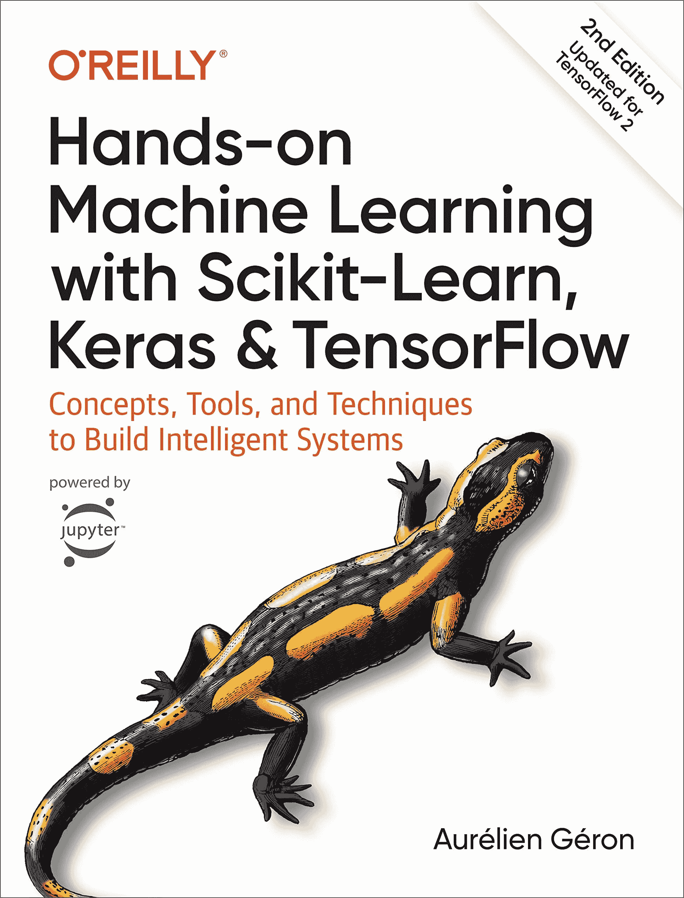
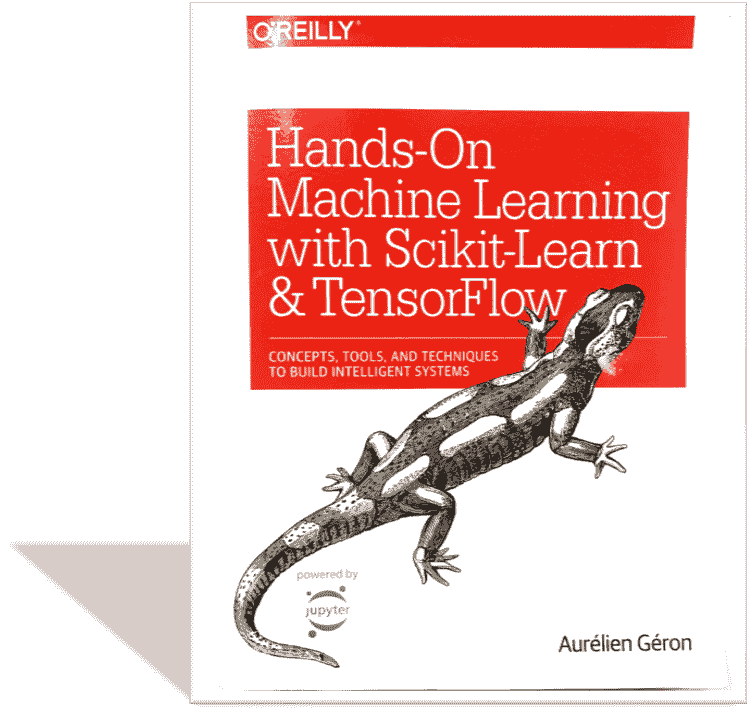
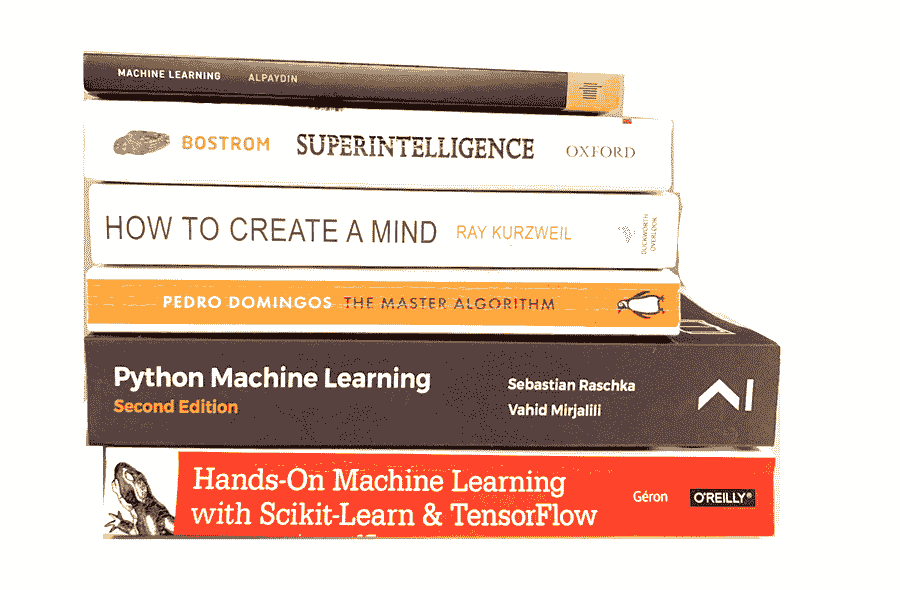

# 启动机器学习的书籍

> 原文：[`www.kdnuggets.com/2020/01/book-start-machine-learning.html`](https://www.kdnuggets.com/2020/01/book-start-machine-learning.html)

评论

**由 [Jaime Zornoza](https://www.linkedin.com/in/jaime-zornoza/)，马德里理工大学**

书籍封面。

* * *

## 我们的前三大课程推荐

 1\. [Google 网络安全证书](https://www.kdnuggets.com/google-cybersecurity) - 快速进入网络安全职业生涯。

 2\. [Google 数据分析专业证书](https://www.kdnuggets.com/google-data-analytics) - 提升你的数据分析技能

 3\. [Google IT 支持专业证书](https://www.kdnuggets.com/google-itsupport) - 支持你的组织的 IT

* * *

许多机器学习从业者经常被问到一个问题：*“我该如何开始实际构建机器学习项目和解决方案？”*

这里有太多的信息——既有好的也有不好的——让人很难知道从哪里开始。此外，人们的背景差异很大，因此起点可能差异很大。例如，对我而言，我通过观看计算机科学频道关于神经网络的理论视频进入了机器学习世界，随着兴趣的增加，我开始阅读有关该主题的文章、新闻和博客。

然而，通过这样做，我只是对机器学习最表面部分有了模糊的理解，离能够独立处理一个项目还远着呢。了解到这一点后，我决定参加一些实惠的 [Udemy 机器学习课程](https://www.udemy.com/course/python-for-data-science-and-machine-learning-bootcamp/)。这些课程对我有帮助，因为它们稍微丰富和改善了我的知识，也涵盖了一些不同算法和模型的 Python 实现。

尽管如此，这些课程并没有让我对我所知道的感到满意，我想深入了解，理解每个对话，了解算法的核心内容，并自己构建一个端到端的机器学习项目。我希望能够有一个想法，构建或下载数据集，并执行它。

***这就是我要谈论的书籍的作用。***

*— 提醒：本文包含附属链接，您可以通过这些链接舒适地购买任何书籍，而无需额外费用，同时支持更多类似文章的创作 —*

我之前读过这本书，但随着新版的出版，我觉得分享一下我的想法是个好主意。

旧版书籍。

本书是“[***《动手学深度学习》***](https://www.amazon.com/gp/product/1492032646/ref=as_li_tl?ie=UTF8&tag=jaimezorno0e-20&camp=1789&creative=9325&linkCode=as2&creativeASIN=1492032646&linkId=d6dc8b9b840a16359f928f02d6d69785)***”***。这是一本最初于 2017 年出版的书籍，在我看来，每次修订后都变成了更好的版本，是学习机器学习的最佳深入资源之一。

### 这本书适合谁？

本书为机器学习的初学者设计，适合那些希望通过构建项目和在特定背景下学习不同机器学习算法来获得实践经验的人。在完成整本书后，你应该能够独立面对一个项目，并对这个过程中的不同步骤感到自如。

尽管这是一本相当基础的书籍，它也会为中级机器学习从业者提供一些工具。

这本书假设你有一定的 Python 编程经验，并且知道如何使用主要的科学库：*Numpy、Pandas 和 Matplotlib*。

此外，如果你想从中获得最大的收益，建议具备一些基础的数学、代数和统计知识。除此之外，即使你对机器学习几乎没有或完全没有初步理解，只要愿意付出努力，也可以轻松完成本书。

一切都讲解得非常清楚，配有代码片段、注释和示例。

### 包含哪些内容？

正如我之前提到的，这本书非常实用，早在第二章就让你开始动手编码一个项目。在此之前，它描述了什么是机器学习，什么不是，它的基本原理，以及它的主要应用和优势。

书中展示了如何实现不同的机器学习算法，并涵盖了你需要了解的理论，而不是深入复杂的方程式。最新的版本由 19 章组成，这些章节分为两个部分：

+   **第一部分**，解释了分类、回归、降维和无监督学习技术的主要概念，以及传统的机器学习算法，如线性回归、逻辑回归、支持向量机、决策树或集成模型。

+   **第二部分**，专注于使用 Tensorflow 和 Keras 进行人工神经网络和深度学习。解释了卷积神经网络和递归神经网络，以及自编码器，并且还有一章关于强化学习。

每章都进一步分解成更详细的结构，逐步讲解，书中还包含了各种附录。

章节如下：

+   **第一部分**：1\. 机器学习概况，2\. 从头到尾的机器学习项目，3\. 分类，4\. 训练模型，5\. 支持向量机，6\. 决策树，7\. 集成学习和随机森林，8\. 降维，9\. 无监督学习技术。

+   **第二部分**：10\. 使用 Keras 介绍人工神经网络，11\. 训练深度神经网络，12\. 使用 Tensorflow 自定义模型和训练，13\. 使用 Tensorflow 加载和预处理数据，14\. 使用卷积神经网络进行深度计算机视觉，15\. 使用 RNN 和 CNN 处理序列，16\. 使用 RNN 和注意力机制进行自然语言处理，17\. 使用自编码器和 GAN 进行表示学习和生成学习，18\. 强化学习，19\. 训练和部署大规模 Tensorflow 模型。

正如我之前提到的，每章都有代码片段和附注来补充解释，并配有图形、图片和图表，每章末尾还有一组问题和练习，这些问题和练习在附录中得到了解答。

此外，非常有用的补充是一个逐步完成常见机器学习项目的检查清单。

### 如何阅读这本书？

每个人都不同，但对我来说，最有效的方法是边阅读纸质书边做笔记。同时，我会尝试阅读代码，每章末尾花时间回答问题和完成迷你练习。如果遇到困惑或不知道如何做某事，我会重读章节的某些部分或在线查找信息。

### 这本书会对我产生什么影响？

如果你刚刚开始学习机器学习，这本书将提升你现有的理论知识，并将其应用于一些实际项目中。很多时候，直到我们尝试将理论付诸实践，我们才会测试自己对某一事物的了解程度。通过阅读这本书，你将完全准备好在你感兴趣的项目中工作。

如果你已经了解机器学习并且参与过一些项目，这本书将完善你的理论知识，教你一些你可能不知道的实用技巧，并建议你如何以最佳方式构建项目。这是一本在日常工作中回答特定问题的极好参考书。

### 接下来做什么？

在你读完这本书后，我鼓励你考虑几个你希望用机器学习完成的项目，拿着这本书尝试执行它们。这将让你在现实世界问题上进行测试，面对一些机器学习项目的难题，并且你将建立一个解决问题的作品集，这在你的学习和未来作为机器学习工程师或数据科学家时将具有很高的价值。

我书库中的其他机器学习书籍

一旦你觉得自己可以舒适地处理这些项目，如果你想进一步接近专家，你可以尝试用同样的方法阅读一本更高级的书，例如以下之一：

+   [*《Python 机器学习》 by Sebastian Raschka.*](https://amzn.to/2Q3KFjg)

+   [*《用 Python 深度学习》 by Francois Chollet.*](https://amzn.to/2t8ndbJ)

或者，如果你对不那么技术性的书籍感兴趣，并想探讨人工智能的好奇心、危险和影响，你可以阅读以下描述的书籍之一：

[**关于人工智能和机器学习的三本顶级书籍**](https://towardsdatascience.com/three-top-books-about-artificial-intelligence-and-machine-learning-b48ff2fa3548)

三本令人惊叹的人工智能书籍，让你的思维翱翔，思想蓬勃发展。

同样，如果你希望专注于机器学习的特定领域，你可以寻找相关书籍，甚至是更专业的在线课程。

### 结束语

一如既往，希望你**喜欢这篇帖子**，并且我已经说服你**阅读这本书**。

这里你可以找到最新版本的链接：

+   [***实用机器学习：Scikit-Learn 和 Tensorflow 实战***](https://www.amazon.com/gp/product/1492032646/ref=as_li_tl?ie=UTF8&tag=jaimezorno0e-20&camp=1789&creative=9325&linkCode=as2&creativeASIN=1492032646&linkId=d6dc8b9b840a16359f928f02d6d69785)

*如果你喜欢这篇帖子，请随时关注我在*[*Twitter 上的 @jaimezorno*](https://twitter.com/Jaimezorno)*。此外，你还可以查看我在数据科学和机器学习方面的其他帖子*[*在这里*](https://medium.com/@jaimezornoza?source=post_page---------------------------)*。祝你阅读愉快！*

*如果你想深入了解机器学习和人工智能，****请关注我在 Medium 的文章****，并关注我的下一篇帖子！*

*在那之前，保重，享受人工智能！*

**简介：[Jaime Zornoza](https://www.linkedin.com/in/jaime-zornoza/)** 是一位工业工程师，拥有电子学本科学位和计算机科学硕士学位。

[原文](https://towardsdatascience.com/the-book-to-really-start-you-on-machine-learning-47632059fd0e)。经许可转载。

**相关：**

+   10 本免费必读的人工智能书籍

+   贝叶斯背后的数学

+   NLP 深度学习：ANNs、RNNs 和 LSTMs 解析！

### 相关话题

+   [成为优秀数据科学家所需的 5 项关键技能](https://www.kdnuggets.com/2021/12/5-key-skills-needed-become-great-data-scientist.html)

+   [每个初学者数据科学家应掌握的 6 种预测模型](https://www.kdnuggets.com/2021/12/6-predictive-models-every-beginner-data-scientist-master.html)

+   [2021 年最佳 ETL 工具](https://www.kdnuggets.com/2021/12/mozart-best-etl-tools-2021.html)

+   [每个数据科学家都应该知道的三个 R 库（即使你使用 Python）](https://www.kdnuggets.com/2021/12/three-r-libraries-every-data-scientist-know-even-python.html)

+   [停止学习数据科学，找到目标，再找到目标…](https://www.kdnuggets.com/2021/12/stop-learning-data-science-find-purpose.html)

+   [学习数据科学统计的顶级资源](https://www.kdnuggets.com/2021/12/springboard-top-resources-learn-data-science-statistics.html)
