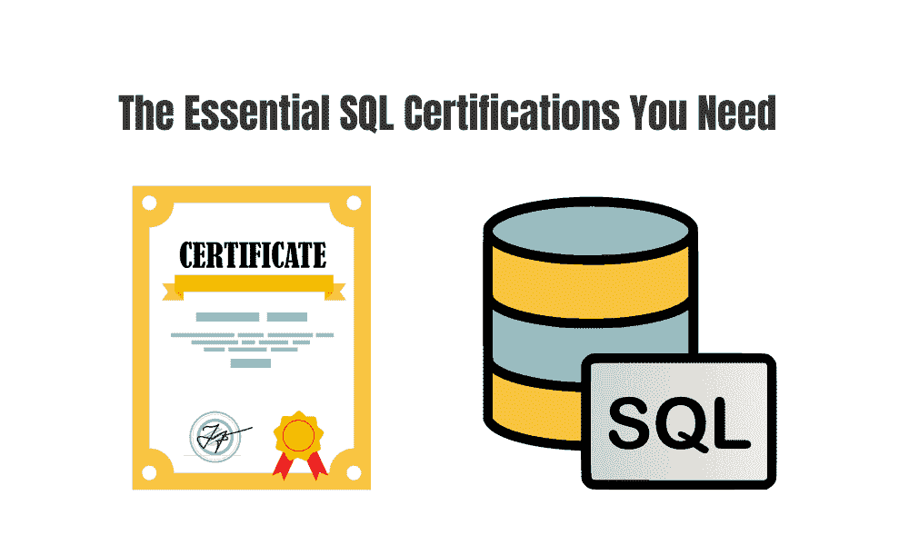

# 提升你的数据科学技能：必备的 SQL 认证

> 原文：[`www.kdnuggets.com/boost-your-data-science-skills-the-essential-sql-certifications-you-need`](https://www.kdnuggets.com/boost-your-data-science-skills-the-essential-sql-certifications-you-need)

编辑者图片

SQL，即结构化查询语言，通常发音为 s-q-l 或 sequel，是一种用于访问和操作数据库的编程语言。在处理大型数据集时，一个问题可能是从中提取确切需要的信息。

* * *

## 我们的 3 个最佳课程推荐

 1\. [谷歌网络安全证书](https://www.kdnuggets.com/google-cybersecurity) - 快速进入网络安全职业道路

 2\. [谷歌数据分析专业证书](https://www.kdnuggets.com/google-data-analytics) - 提升你的数据分析技能

 3\. [谷歌 IT 支持专业证书](https://www.kdnuggets.com/google-itsupport) - 支持你在 IT 领域的组织

* * *

SQL 可以帮助解决这个问题。专业人士可以通过清理、排序、提取和处理大型数据集与关系数据库系统进行沟通。由于大数据的宝贵资产以及需要处理、评估和分析数据的专业人士，SQL 专家的需求仍在上升。

SQL 认证有不同类型，针对特定平台。根据你感兴趣的数据库技术来确定最适合你的认证。

# Microsoft 认证：Azure 数据基础

链接：[Microsoft Azure 数据基础](http://imp.i384100.net/eKXE6D)

这个课程针对初学者，可以在 1 个月内完成，每周投入 10 小时。

在这个 5 门课程系列中，学习云环境中数据库概念的基础知识。你将获得云数据服务的基本技能，并建立对 Microsoft Azure 中云数据服务的基础知识。

这 5 门课程包括：

+   探索 Microsoft Azure 中的核心数据概念

+   Microsoft Azure SQL

+   Microsoft Azure Cosmos DB

+   Microsoft Azure 中的现代数据仓库分析

+   为 DP-900：Microsoft Azure 数据基础考试做准备

# Oracle SQL 数据库

链接：[Oracle SQL 数据库专业化](http://imp.i384100.net/dagVQM)

这个课程针对初学者，可以在 1 个月内完成，每周投入 10 小时。

Oracle SQL 数据库专业化认证包括 4 门课程，你将学习如何创建 Oracle SQL 数据库，并了解如何在 Oracle SQL 数据库中插入、修改和删除数据。

这 4 门课程包括：

+   Oracle 数据库基础

+   Oracle 数据库平台

+   Oracle SQL 基础

+   Oracle SQL 熟练度

# IBM 数据仓库工程师

链接: [IBM 数据仓库工程师](http://imp.i384100.net/LXBmbj)

该课程面向初学者，预计可以在 3 个月内完成，每周投入 10 小时。

IBM 数据仓库工程师认证由 8 门课程组成，您将学习数据仓库工程师使用的最新实践技能和知识，如何部署、管理、安全、监控和优化 MySQL 和 PostgreSQL 等关系型数据库系统。您还将了解各种 SQL 类型和查询，以访问和操作数据库中的数据。

8 门课程包括：

+   数据工程简介

+   关系型数据库（RDBMS）简介

+   SQL：查询数据库的实用入门

+   Linux 命令和 Shell 脚本的实操介绍

+   关系型数据库管理（DBA）

+   使用 Shell、Airflow 和 Kafka 进行 ETL 和数据管道

+   数据仓库与商业智能分析入门

+   数据仓库顶点项目

# IBM 商业智能（BI）分析师

链接: [IBM 商业智能（BI）分析师专业证书](http://imp.i384100.net/vNkjLe)

该课程面向初学者，预计可以在 4 个月内完成。

获得 IBM 商业智能分析师认证后，您可以在不到 4 个月的时间内启动您的商业智能职业生涯。

该认证包含 10 门课程，您将学习 SQL 查询、关系型数据库、数据仓库、数据分析以及报告技术。您将学习如何应用统计分析方法来识别趋势、创建可视化并生成有价值的洞察，从而促进明智决策和过程改进。

10 门课程包括：

+   商业智能（BI）基础

+   数据分析的 Excel 基础

+   使用 Excel 和 Cognos 进行数据可视化和仪表板制作

+   关系型数据库（RDBMS）简介

+   SQL：查询数据库的实用入门

+   数据仓库与商业智能分析入门

+   使用 Excel 的统计基础

+   入门 Tableau

+   高级数据可视化与 Tableau

+   BI 分析师顶点项目

# 面向所有人的 PostgreSQL

链接: [面向所有人的 PostgreSQL 专项课程](http://imp.i384100.net/EK1ek4)

该课程面向中级水平，预计可以在 1 个月内完成，每周投入 10 小时。

面向所有人的 PostgreSQL 认证包含 4 门课程。在这些课程中，您将学习 SQL 的基础知识到高级内容。您将深入了解如何有效使用 PostgreSQL 数据库，探索数据库设计原则、数据库架构和部署策略，并能够比较和对比 SQL 和 NoSQL 数据库设计方法。

4 门课程包括：

+   PostgreSQL 数据库设计与基础 SQL

+   中级 PostgreSQL

+   PostgreSQL 中的 JSON 和自然语言处理

+   数据库架构、规模与 NoSQL（使用 Elasticsearch）

# 总结

虽然知识和经验比认证更为重要，但招聘经理确实倾向于优先考虑有认证的申请者。在选择合适的 SQL 认证时，确保考虑到你所希望的工作的特定供应商或平台。

**[Nisha Arya](https://www.linkedin.com/in/nisha-arya-ahmed/)**是一名数据科学家、自由技术作家、KDnuggets 的编辑及社区经理。她特别关注提供数据科学职业建议、教程和理论知识。Nisha 涉及广泛的话题，并希望探索人工智能如何有益于人类寿命的不同方式。作为一个热衷学习的人，Nisha 寻求扩展她的技术知识和写作技能，同时帮助指导他人。

### 更多相关话题

+   [数据科学入门：你需要掌握的 10 项基础技能](https://www.kdnuggets.com/2020/10/data-science-minimum-10-essential-skills.html)

+   [2024 年能提升你数据科学职业的认证](https://www.kdnuggets.com/certifications-that-can-boost-your-data-science-career-in-2024)

+   [数据科学家分析：技能、认证和薪资](https://www.kdnuggets.com/data-scientist-breakdown-skills-certifications-and-salary)

+   [你需要具备的数据分析技能，以获得下一个晋升机会](https://www.kdnuggets.com/2022/09/data-analyst-skills-need-next-promotion.html)

+   [想利用你的数据技能解决全球问题？这儿有些建议……](https://www.kdnuggets.com/2022/04/jhu-want-data-skills-solve-global-problems.html)

+   [在 NVIDIA 会议上免费提升你的 AI 和 ML 技能](https://www.kdnuggets.com/2022/03/nvidia-fourday-conference-offers-hundreds-learning-development-opportunities.html)
