# 提升您的图像分类模型

> 原文：[`www.kdnuggets.com/2019/05/boost-your-image-classification-model.html`](https://www.kdnuggets.com/2019/05/boost-your-image-classification-model.html)

 评论

**由 [Aditya Mishra](https://www.linkedin.com/in/aditya-mishra-b50623138/)，来自 difference-engine.ai 的机器学习工程师**

图像分类被认为是一个几乎解决的问题。有趣的部分是当你必须发挥全部聪明才智来获得额外的 1% 准确度时。我遇到了这样的情况，当我参加了[*Intel 场景分类挑战赛（由 Analytics Vidhya 主办）*](https://datahack.analyticsvidhya.com/contest/practice-problem-intel-scene-classification-challe/)。我非常享受这次比赛，因为我尽力从我的深度学习模型中提取所有精华。下面的技术通常可以应用于任何图像分类问题。

### 问题

问题是将给定的图像分类为 6 个类别

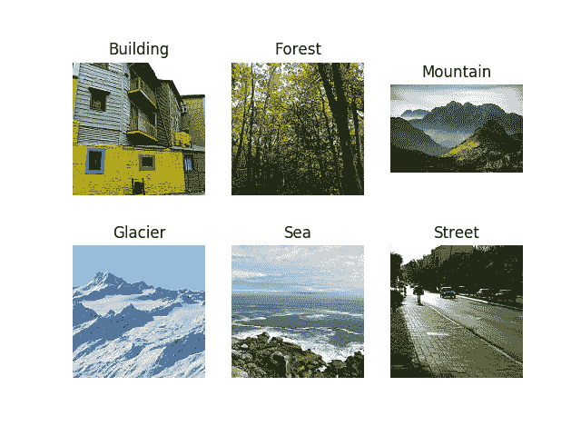

数据类别

我们获得了**约 25K** 张来自全球各地自然场景的图像

### 渐进式调整图像大小

这是一个在训练 CNN 时按顺序调整所有图像大小的技术。渐进式调整图像大小在他出色的*fastai* 课程“*实用深度学习课程*”中简要描述了。使用这种技术的一个很好的方法是用较小的图像大小（如 64x64）训练模型，然后使用该模型的权重来训练另一个图像大小为 128x128 的模型，依此类推。每个更大规模的模型都在其架构中包含了之前较小规模模型的层和权重。

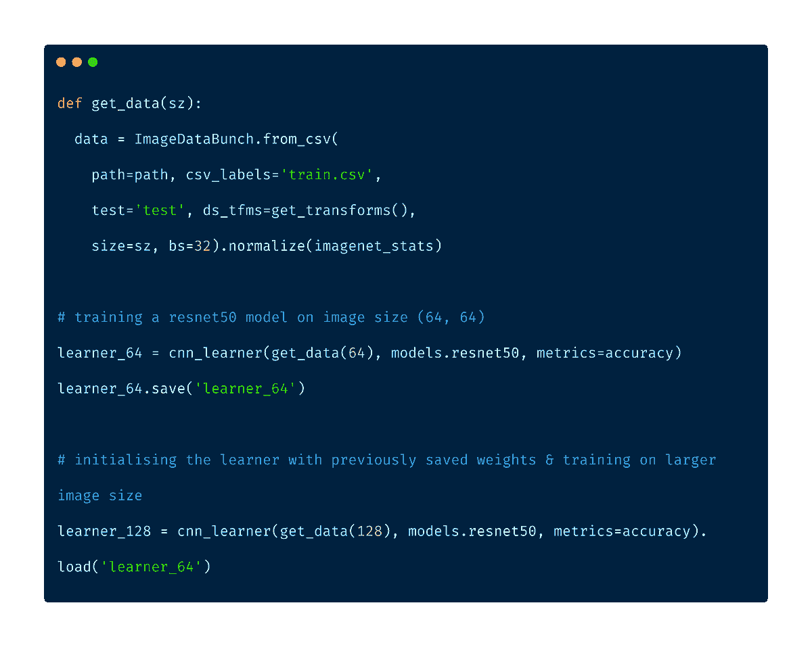

渐进式调整图像大小

### FastAI

*fastai* 库是一个强大的深度学习库。如果 FastAI 团队发现一篇特别有趣的论文，他们会在不同的数据集上进行测试，并研究如何调整它。一旦成功，它就会被纳入他们的库中，用户可以方便地使用。该库包含了许多最先进（SOTA）的技术。基于 PyTorch 类型，*fastai* 为大多数（如果不是全部的话）任务提供了出色的默认参数。以下是一些技术：

1.  循环学习率

1.  一周期学习

1.  结构化数据上的深度学习

### 合理的权重初始化

在查看可用的标准数据集时，我偶然发现了 Places365 数据集。Places365 数据集包含了来自 365 个场景类别的 180 万张图像。挑战中提供的数据集与这个数据集非常相似，因此在这个数据集上训练的模型已经学到了与我们分类问题相关的特征。由于我们问题中的类别是 Places365 数据集的一个子集，我使用了一个用 Places365 权重初始化的 ResNet50 模型。

模型权重可以通过 [pytorch weights](https://github.com/CSAILVision/places365) 获得。下面的实用函数帮助我们将数据正确加载到 *fastai* 的 CNN Learner 中。

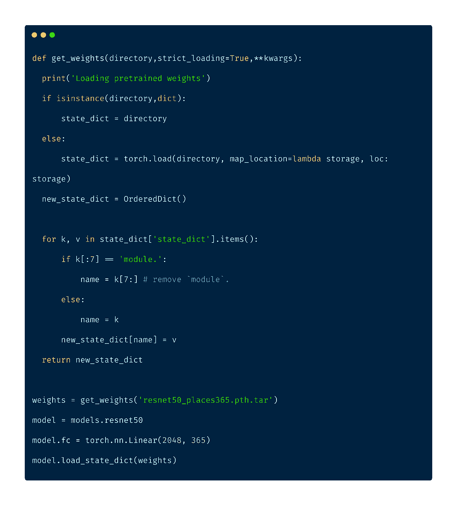

### Mixup 数据增强

Mixup 数据增强是一种数据增强类型，通过对两个现有图像进行加权线性插值来形成新的图像。我们取两个图像并对它们进行张量的线性组合。

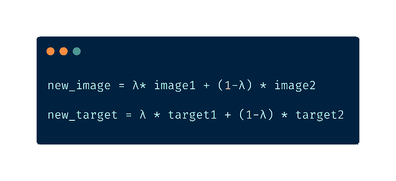

Mixup 数据增强

λ 是从贝塔分布中随机采样的。尽管[论文](https://arxiv.org/abs/1710.09412)的作者建议使用 λ=0.4，但 *fastai* 库中的默认值设置为 0.1

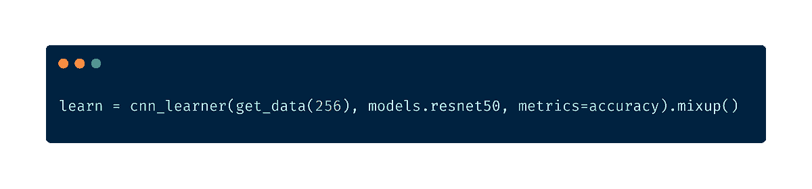

*fastai*中的 Mixup 数据增强

### **学习率调整**

学习率是训练神经网络最重要的超参数之一。*fastai* 提供了一种方法来找到适当的初始学习率。这种技术叫做*循环学习率*，我们通过较低的学习率进行试验并以指数方式增加，记录过程中损失值。然后我们将损失值与学习率绘制成图，并选择损失最陡的学习率。

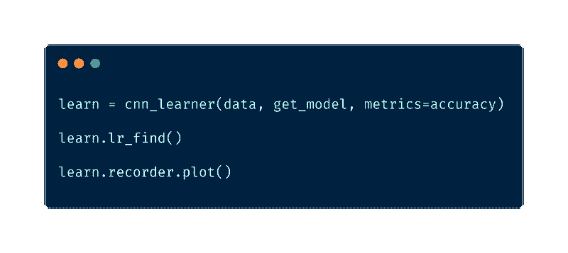

学习率查找器在 *fastai* 中 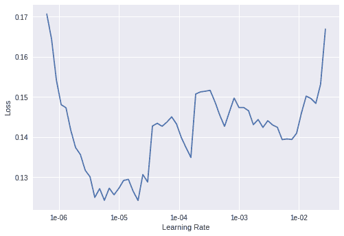

损失在 1e-06 时最陡

该库还自动处理了带重启的随机梯度下降（SGDR）。在 SGDR 中，学习率在每个纪元开始时被重置为原始选择值，该值会随着纪元的进行而降低，类似于*余弦退火*。这样做的主要好处是，由于学习率在每个纪元开始时都会重置，学习者能够跳出可能卡住的局部最小值或鞍点。

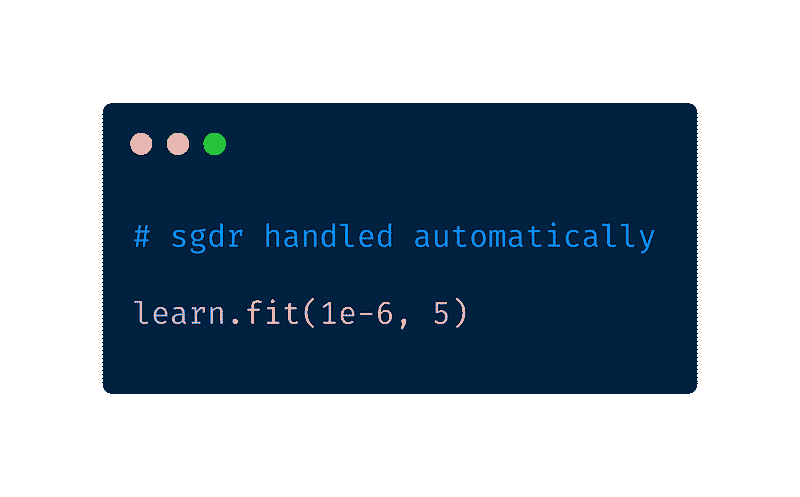

*fastai*中的 SGDR

### 生成对抗网络

GANs 是由 Ian Goodfellow 在 2014 年引入的。GANs 是由两个网络组成的深度神经网络架构，相互对抗。GANs 可以模拟任何数据分布。它们可以学习生成与原始数据相似的数据，适用于任何领域——图像、语音、文本等。我们使用了 fast.ai 的 Wasserstein GAN 实现来生成更多的训练图像。

GANs 涉及训练两个神经网络，一个称为*生成器*，生成新的数据实例，而另一个称为*判别器*，评估这些实例的真实性，它决定每个数据实例是否属于实际的训练数据集。你可以在 [这里](https://github.com/fastai/course-v3/blob/master/nbs/dl1/lesson7-wgan.ipynb) 找到更多信息。

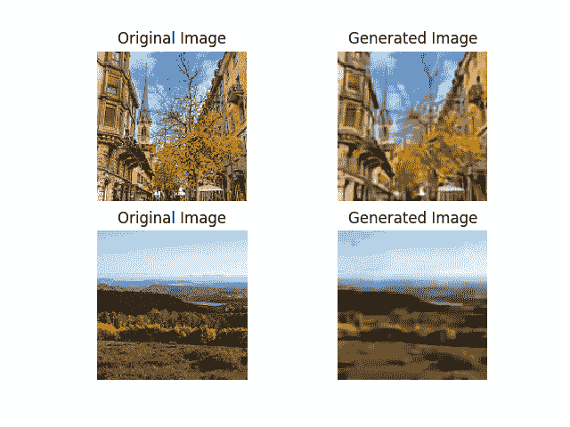

GAN 生成的样本图像

### **移除混淆图像**

> 训练神经网络的第一步是不接触任何神经网络代码，而是开始彻底检查你的数据。这一步是至关重要的。我喜欢花费大量时间（以小时为单位）浏览成千上万的样本，理解它们的分布并寻找模式。
> 
> - Andrej Karpathy

正如 Andrej Karpathy 所说，“数据调查”是一个重要的步骤。在数据调查中，我发现有一些图像包含了两个或更多类别。

**方法 1**

使用之前训练的模型，我对整个训练数据进行了预测。然后丢弃了那些预测结果不正确但概率分数大于 0.9 的图像。这些是模型明显错误分类的图像。深入分析后，我发现这些图像被标注者错误标记了。

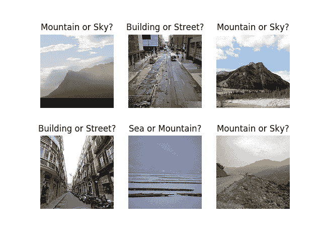

令人困惑的图像

我还从训练集中删除了那些预测概率在 0.5 到 0.6 范围内的图像，理论是图像中可能存在多个类别，因此模型对每个类别分配了大致相等的概率。查看这些图像后，理论最终被证明是正确的。

**方法 2**

fast.ai 提供了一个方便的小工具“图像清理小工具”，允许你清理和准备数据以供模型使用。ImageCleaner 用于清理不属于你的数据集的图像。它以一行的形式渲染图像，并给你机会从文件系统中删除文件。

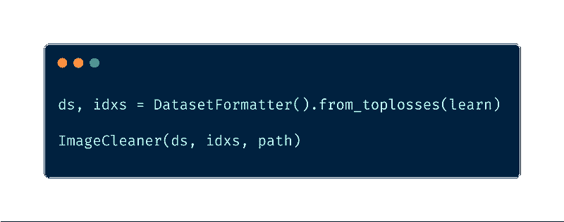

### **测试时间增强**

测试时间增强涉及对原始图像进行一系列不同版本的处理，并将它们通过模型。然后计算这些不同版本的平均输出，并将其作为图像的最终输出。

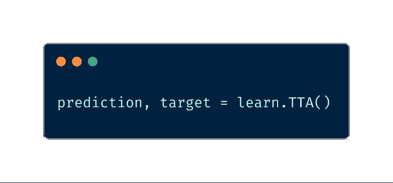

在 fastai 中的测试时间增强

之前使用过一种类似的技术叫做 10-crop 测试。我第一次在[ResNet](https://arxiv.org/pdf/1512.03385.pdf)论文中了解到 10-crop 技术。10-crop 技术涉及将原始图像裁剪到四个角落，并在中心裁剪一次，总共得到 5 张图像。对其反向操作重复相同的步骤，再得到另外 5 张图像，总共 10 张图像。然而，测试时间增强的速度比 10-crop 技术要快。

### 集成学习

在机器学习中，集成学习是一种使用多种学习算法来获得比单一算法更好的预测性能的技术。集成学习效果最佳

1.  组成模型具有不同的性质。例如，将 ResNet50 和 InceptionNet 进行集成比将 ResNet50 和 ResNet34 进行组合要有用得多，因为它们的性质不同。

1.  组成模型之间的相关性较低

1.  为每个模型更改训练集，以增加变化性。

在这种情况下，我通过选择出现次数最多的类别来集成所有模型的预测。如果有多个类别出现次数相同，我会随机选择其中一个类别。

### **结果**

> 公共排行榜 — 第 29 名 (0.962)
> 
> 私有排行榜 — 第 22 名 (0.9499)

### **结论**

1.  渐进式调整大小是一个很好的入门主意。

1.  花时间理解和可视化你的数据是必要的。

1.  像 fastai 这样的优秀深度学习库，具有合理初始化的参数，绝对是有帮助的。

1.  在任何可能的地方和情况下使用迁移学习，因为它通常会给出良好的结果。最近，深度学习和迁移学习甚至已应用于结构化数据，因此迁移学习绝对应该是首选尝试的方案。

1.  先进的技术如 Mixup 数据增强、TTA、循环学习率一定能帮助你将准确率提高额外的 1%或 2%。

1.  始终寻找与你的问题相关的数据集，并尽可能将其包含在训练数据中。如果存在针对这些数据集训练的深度学习模型，使用它们的权重作为你的模型的初始权重。

**简介： [Aditya Mishra](https://www.linkedin.com/in/aditya-mishra-b50623138/)** 是 difference-engine.ai 的机器学习工程师。

[原文](https://towardsdatascience.com/boost-your-image-classifier-e1cc7a56b59c)。经许可转载。

**相关：**

+   大规模图像分类器演变

+   通过迁移学习和弱监督廉价构建 NLP 分类器

+   如何在计算机视觉中做一切

### 更多相关话题

+   [使用 Tensorflow 训练图像分类模型指南](https://www.kdnuggets.com/2022/12/guide-train-image-classification-model-tensorflow.html)

+   [理解分类指标：评估模型准确性的指南](https://www.kdnuggets.com/understanding-classification-metrics-your-guide-to-assessing-model-accuracy)

+   [使用卷积神经网络（CNNs）进行图像分类](https://www.kdnuggets.com/2022/05/image-classification-convolutional-neural-networks-cnns.html)

+   [Segment Anything 模型：图像分割的基础模型](https://www.kdnuggets.com/2023/07/segment-anything-model-foundation-model-image-segmentation.html)

+   [适合您的文本分类任务的最佳架构：基准测试…](https://www.kdnuggets.com/2023/04/best-architecture-text-classification-task-benchmarking-options.html)

+   [提升你的机器学习模型表现！](https://www.kdnuggets.com/2023/04/manning-boost-machine-learning-model-performance.html)
