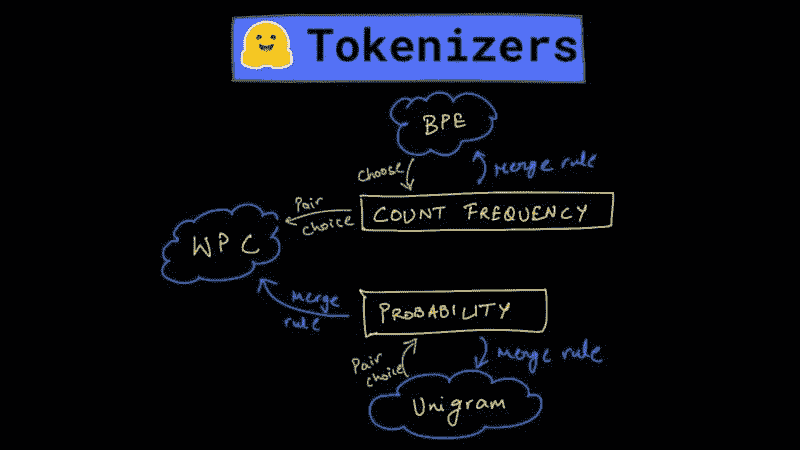

# 使用 Hugging Face 从零开始训练 BPE、WordPiece 和 Unigram 分词器

> 原文：[`www.kdnuggets.com/2021/10/bpe-wordpiece-unigram-tokenizers-using-hugging-face.html`](https://www.kdnuggets.com/2021/10/bpe-wordpiece-unigram-tokenizers-using-hugging-face.html)

评论

**由 [Harshit Tyagi](https://www.linkedin.com/in/tyagiharshit/)，数据科学讲师 | 导师 | YouTuber**

在深入探讨 NLP 的海洋时，这篇文章全部关于通过利用 **Hugging Face 的 tokenizers 包** 从零开始训练分词器。

分词通常被视为自然语言处理（NLP）的一个子领域，但它有其自身的 [演变故事](https://dswharshit.substack.com/p/the-evolution-of-tokenization-byte) 以及如何发展到目前的阶段，支撑了最先进的 NLP 模型。

在我们进入训练和比较不同分词器的有趣部分之前，我想简要总结一下这些算法之间的主要区别。

主要区别在于 **字符对的选择** 和 **每种算法使用的合并策略**，这些算法用于生成最终的令牌集合。



## BPE - 基于频率的模型

+   字节对编码（Byte Pair Encoding）利用子词模式的频率来筛选它们进行合并。

+   使用频率作为驱动因素的缺点是，最终编码可能会产生模糊的结果，这对新输入文本可能没有用处。

+   在生成明确的令牌方面仍有改进的空间。

## Unigram - 基于概率的模型

+   作为 Unigram 模型的一部分，它通过计算每个子词组合的可能性来解决合并问题，而不是选择最频繁的模式。

+   它计算每个子词令牌的概率，然后根据在 [这篇研究论文](https://arxiv.org/pdf/1804.10959.pdf)中解释的损失函数来舍弃。

+   根据损失值的某个阈值，你可以触发模型丢弃底部 20-30% 的子词令牌。

+   Unigram 是一种完全基于概率的算法，它在每次迭代中基于概率选择字符对和最终的合并决定（或不合并）。

## WordPiece

+   随着 2018 年 BERT 的发布，出现了一种新的子词分词算法，称为 WordPiece，它可以被视为 BPE 和 Unigram 算法之间的中介。

+   WordPiece 也是一种贪婪算法，它利用似然而不是计数频率来在每次迭代中合并最佳的对，但字符配对的选择基于计数频率。

+   因此，它在选择配对字符方面类似于 BPE，在选择最佳配对进行合并方面类似于 Unigram。

介绍完算法差异后，我尝试实现每种算法（不是从零开始），以比较它们生成的输出。

## 训练 BPE、Unigram 和 WordPiece 算法

现在，为了对输出进行无偏比较，我不想使用预训练算法，因为那样会将模型的大小、质量和数据集的内容考虑在内。

一种方法是从头编写这些算法，使用研究论文，然后进行测试，这是一种真正理解每种算法工作原理的好方法，但你可能会花费数周的时间来完成这个过程。

我则使用了[Hugging Face 的 tokenizers](https://huggingface.co/docs/tokenizers/python/latest/quicktour.html)包，它提供了今天最常用的所有分词器的实现。它还允许我在选择的数据集上从头开始训练这些模型，然后对我们选择的输入字符串进行分词。

### **训练数据集**

我选择了两个不同的数据集来训练这些模型，一个是来自 Gutenberg 的免费书籍，作为一个小数据集，另一个是[wikitext-103](https://blog.einstein.ai/the-wikitext-long-term-dependency-language-modeling-dataset/)，它包含 516M 的文本。

在 Colab 中，你可以先下载数据集并解压（如果需要的话），

```py
!wget http://www.gutenberg.org/cache/epub/16457/pg16457.txt
```

```py
!wget https://s3.amazonaws.com/research.metamind.io/wikitext/wikitext-103-raw-v1.zip
```

```py
!unzip wikitext-103-raw-v1.zip
```

### **导入所需的模型和训练器**

通过文档，你会发现包的主要 API 是`Tokenizer`类。

然后，你可以用你选择的模型（BPE/Unigram/WordPiece）实例化任何分词器。

在这里，我导入了主类、所有我想要测试的模型以及它们的训练器，因为我希望从头开始训练这些模型。

```py
## importing the tokenizer and subword BPE trainer
from tokenizers import Tokenizer
from tokenizers.models import BPE, Unigram, WordLevel, WordPiece
from tokenizers.trainers import BpeTrainer, WordLevelTrainer, \
                                WordPieceTrainer, UnigramTrainer

## a pretokenizer to segment the text into words
from tokenizers.pre_tokenizers import Whitespace
```

### **自动化训练和分词的 3 步过程**

由于我需要对三种不同的模型执行类似的过程，我将这些过程分解为 3 个函数。我只需要为每个模型调用这些函数，我的工作就完成了。

那么，这些函数是什么样的呢？

### **第 1 步 - 准备分词器**

准备分词器要求我们用我们选择的模型实例化`Tokenizer`类，但由于我们有四个模型（还添加了一个简单的词级算法）需要测试，我们将编写 if/else 语句来用正确的模型实例化分词器。

为了在小数据集和大数据集上训练实例化的分词器，我们还需要实例化一个训练器，在我们的案例中，这些将是**[`BpeTrainer`](https://huggingface.co/docs/tokenizers/python/latest/api/reference.html#tokenizers.trainers.BpeTrainer)`、WordLevelTrainer、WordPieceTrainer 和 UnigramTrainer`**。

实例化和训练将需要我们指定一些特殊的标记。这些标记用于未知词汇以及我们以后需要添加到词汇表中的其他特殊标记。

你也可以在这里指定其他训练参数，如词汇表大小或最小频率。

```py
unk_token = "<UNK>"  # token for unknown words
spl_tokens = ["<UNK>", "<SEP>", "<MASK>", "<CLS>"]  # special tokens

def prepare_tokenizer_trainer(alg):
    """
    Prepares the tokenizer and trainer with unknown & special tokens.
    """
    if alg == 'BPE':
        tokenizer = Tokenizer(BPE(unk_token = unk_token))
        trainer = BpeTrainer(special_tokens = spl_tokens)
    elif alg == 'UNI':
        tokenizer = Tokenizer(Unigram())
        trainer = UnigramTrainer(unk_token= unk_token, special_tokens = spl_tokens)
    elif alg == 'WPC':
        tokenizer = Tokenizer(WordPiece(unk_token = unk_token))
        trainer = WordPieceTrainer(special_tokens = spl_tokens)
    else:
        tokenizer = Tokenizer(WordLevel(unk_token = unk_token))
        trainer = WordLevelTrainer(special_tokens = spl_tokens)

    tokenizer.pre_tokenizer = Whitespace()
    return tokenizer, trainer
```

我们还需要添加一个预分词器，以将输入拆分为单词，因为没有预分词器，我们可能会得到重叠多个单词的标记：例如，我们可能会得到**`"there is"`**标记，因为这两个词经常出现在一起。

> *使用预分词器将确保没有标记比预分词器返回的单词更长。*

该函数将返回分词器及其训练器对象，这些对象可以用于在数据集上训练模型。

在这里，我们对所有模型使用相同的预分词器（`Whitespace`）。你可以选择用 [其他](https://huggingface.co/docs/tokenizers/python/latest/api/reference.html#module-tokenizers.pre_tokenizers) 进行测试。

### **步骤 2 - 训练分词器**

准备好分词器和训练器后，我们可以开始训练过程。

这是一个函数，将接受我们打算训练分词器的文件（们）以及算法标识符。

+   `‘WLV’` - Word Level Algorithm

+   `‘WPC’` - WordPiece Algorithm

+   `‘BPE’` - Byte Pair Encoding

+   `‘UNI’` - Unigram

```py
def train_tokenizer(files, alg='WLV'):
    """
    Takes the files and trains the tokenizer.
    """
    tokenizer, trainer = prepare_tokenizer_trainer(alg)
    tokenizer.train(files, trainer) # training the tokenzier
    tokenizer.save("./tokenizer-trained.json")
    tokenizer = Tokenizer.from_file("./tokenizer-trained.json")
    return tokenizer
```

这是我们需要调用的主要函数，用于训练分词器，它将首先准备分词器和训练器，然后开始使用提供的文件训练分词器。

训练后，它将模型保存在 JSON 文件中，从文件中加载模型，并返回训练好的分词器以开始对新输入进行编码。

### **步骤 3 - 对输入字符串进行分词**

最后一步是开始对新输入字符串进行编码，并比较每种算法生成的标记。

在这里，我们将编写一个嵌套的 for 循环，先在较小的数据集上训练每个模型，然后在较大的数据集上训练，并对输入字符串进行分词。

**输入字符串 - **“这是一个深度学习分词教程。分词是深度学习 NLP 流程中的第一步。我们将比较各个分词模型生成的标记。很兴奋吗？！????”

```py
small_file = ['pg16457.txt']
large_files = [f"./wikitext-103-raw/wiki.{split}.raw" for split in ["test", "train", "valid"]]

for files in [small_file, large_files]:
    print(f"========Using vocabulary from {files}=======")
    for alg in ['WLV', 'BPE', 'UNI', 'WPC']:
        trained_tokenizer = train_tokenizer(files, alg)
        input_string = "This is a deep learning tokenization tutorial. Tokenization is the first step in a deep learning NLP pipeline. We will be comparing the tokens generated by each tokenization model. Excited much?!????"
        output = tokenize(input_string, trained_tokenizer)
        tokens_dict[alg] = output.tokens
        print("----", alg, "----")
        print(output.tokens, "->", len(output.tokens))
```

**##输出：**


## 输出分析：

查看输出，你将看到标记生成方式的差异，这反过来导致生成的标记数量不同。

+   一个简单的 **word-level algorithm** 无论在什么数据集上训练都会生成 35 个标记。

+   **BPE** 算法在较小的数据集上生成了 55 个标记，在较大的数据集上生成了 47 个标记。这表明在较大的数据集上，它能够合并更多的字符对。

+   **Unigram 模型** 在两个数据集上生成了相似（68 和 67）的标记。但你可以看到生成的标记之间的差异：


使用较大的数据集时，合并更接近生成更适合编码我们常用的真实世界英语的标记。


+   **WordPiece**在较小的数据集上生成了 52 个令牌，在较大的数据集上生成了 48 个令牌。生成的令牌有双##以表示将令牌用作前缀/后缀。

+   所有三种算法在较大的数据集上生成了更少的子词令牌和更好的子词令牌。

## 比较令牌

为了比较令牌，我将每种算法的输出存储在一个字典中，并将其转化为数据框，以更好地查看令牌之间的差异。

由于每个模型生成的令牌数量不同，我已添加了一个<PAD>令牌，以使数据矩形并适配数据框。

<PAD>在数据框中基本上是 nan。

```py
import pandas as pd

max_len = max(len(tokens_dict['UNI']), len(tokens_dict['WPC']), len(tokens_dict['BPE']))
diff_bpe = max_len - len(tokens_dict['BPE'])
diff_wpc = max_len - len(tokens_dict['WPC'])

tokens_dict['BPE'] = tokens_dict['BPE'] + ['<PAD>']*diff_bpe
tokens_dict['WPC'] = tokens_dict['WPC'] + ['<PAD>']*diff_wpc

del tokens_dict['WLV']

df = pd.DataFrame(tokens_dict)
df.head(10)
```

**##输出：**


你还可以使用集合查看令牌的差异：


所有代码可以在这个[Colab 笔记本](https://colab.research.google.com/drive/10gwzRY55JqzgeEQOX6nwFs6bQ84-mB9f?usp=sharing)中找到。

## 结束思考和下一步！

基于生成的令牌类型，WPC 确实似乎生成了更常见于英语中的子词令牌，但不要对这一观察结果负责。

这些算法彼此略有不同，并且在开发一个不错的 NLP 模型时做了些类似的工作。但性能在很大程度上取决于语言模型的使用场景、词汇量、速度以及其他因素。

对这些算法的进一步改进是 [SentencePiece 算法](https://arxiv.org/pdf/1808.06226.pdf)，它是对整个分词问题的全面方法，但 HuggingFace 已经缓解了大部分问题，更棒的是，他们在一个 GitHub 仓库中实现了所有这些算法。

这部分介绍了分词算法，下一步是理解什么是嵌入，分词在创建这些嵌入中的关键作用，以及它们如何影响模型的性能。

## 参考文献和注释

如果你不同意我的分析或本文中的任何工作，我强烈鼓励你查看这些资源，以准确理解每个算法的工作原理：

1.  [子词正则化：通过多个子词候选改善神经网络翻译模型](https://arxiv.org/pdf/1804.10959.pdf) 由 Taku Kudo 发表

1.  [用子词单元的稀有词神经机器翻译](https://arxiv.org/pdf/1508.07909.pdf) - 研究论文讨论了基于 BPE 压缩算法的不同分割技术。

1.  [Hugging Face 的分词器包。](https://huggingface.co/docs/tokenizers/python/latest/quicktour.html)

如果你想开始数据科学或机器学习领域的学习，可以查看我关于 [数据科学与机器学习基础](https://www.wiplane.com/p/foundations-for-data-science-ml) 的课程。

如果你希望查看更多类似内容而又不是订阅者，可以通过下面的按钮订阅我的通讯。

有什么要补充或建议的，可以回复此邮件或在 Substack 上的帖子中评论。

**个人简介: [Harshit Tyagi](https://www.linkedin.com/in/tyagiharshit/)** 是一名在网络技术和数据科学（即全栈数据科学）方面具有丰富经验的工程师。他指导了超过 1000 名人工智能/网络/数据科学的学员，并正在设计数据科学和机器学习工程学习路径。此前，Harshit 曾与耶鲁大学、麻省理工学院和加州大学洛杉矶分校的研究科学家共同开发数据处理算法。

[原始](https://dswharshit.substack.com/p/ecde3224-cb0f-425b-97a2-853ea873d279)。经许可转载。

**相关：**

+   使用 HuggingFace 管道的简单问答网络应用

+   分词的演变 – 自然语言处理中的字节对编码

+   深度学习的文本预处理方法

* * *

## 我们的前三大课程推荐

 1\. [谷歌网络安全证书](https://www.kdnuggets.com/google-cybersecurity) - 快速入门网络安全职业。

 2\. [谷歌数据分析专业证书](https://www.kdnuggets.com/google-data-analytics) - 提升你的数据分析技能

 3\. [谷歌 IT 支持专业证书](https://www.kdnuggets.com/google-itsupport) - 支持你在 IT 方面的组织

* * *

### 更多相关主题

+   [如何使用 Hugging Face Tokenizers 库来预处理文本数据](https://www.kdnuggets.com/how-to-use-the-hugging-face-tokenizers-library-to-preprocess-text-data)

+   [如何从头开始构建和训练一个 Transformer 模型，使用…](https://www.kdnuggets.com/how-to-build-and-train-a-transformer-model-from-scratch-with-hugging-face-transformers)

+   [使用 Hugging Face Transformers 进行文本情感检测](https://www.kdnuggets.com/using-hugging-face-transformers-for-emotion-detection-in-text)

+   [使用 Hugging Face 和 Gradio 在 5 分钟内构建 AI 聊天机器人](https://www.kdnuggets.com/2023/06/build-ai-chatbot-5-minutes-hugging-face-gradio.html)

+   [如何使用 MarianMT 和 Hugging Face Transformers 翻译语言](https://www.kdnuggets.com/how-to-translate-languages-with-marianmt-and-hugging-face-transformers)

+   [前 10 大机器学习演示：Hugging Face Spaces 版](https://www.kdnuggets.com/2022/05/top-10-machine-learning-demos-hugging-face-spaces-edition.html)
