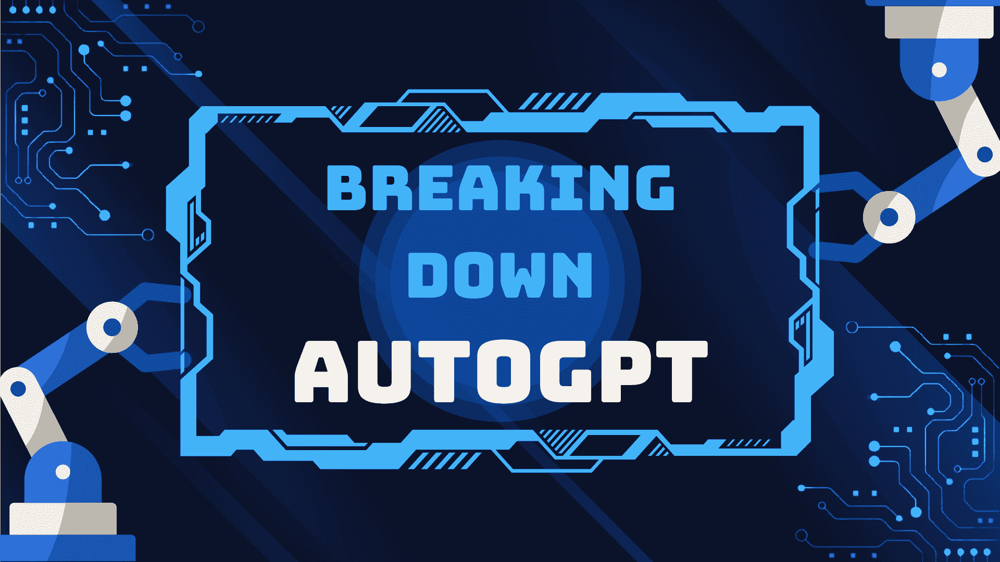
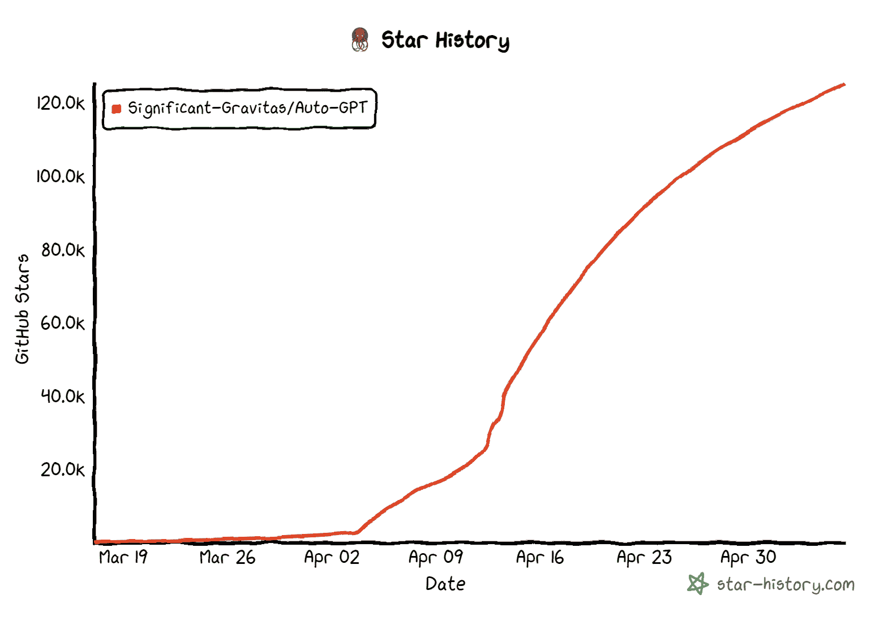
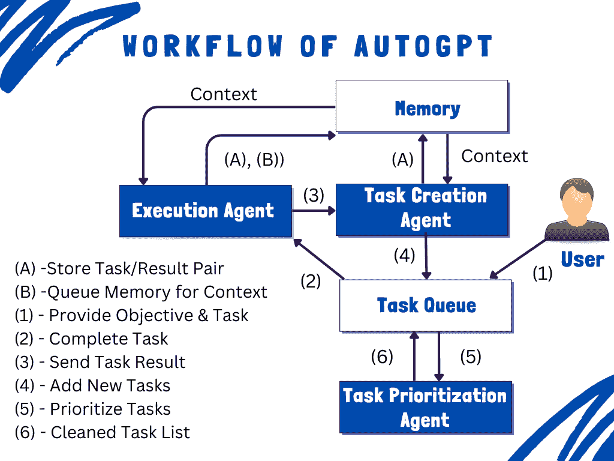

# 解构 AutoGPT

> 原文：[`www.kdnuggets.com/2023/05/breaking-autogpt.html`](https://www.kdnuggets.com/2023/05/breaking-autogpt.html)



图片来源：作者

ChatGPT 在 AI 世界中引起了很大的关注。我们看到许多其他模型进行渐进改进。但其中没有一个专注于改善人类与 AI 之间的互动。你仍然需要给出一个优秀的提示才能获得所需的结果。这就是 AutoGPT 的突出之处。它可以“**自我提示**”并对其工作进行批判性审查。你想了解更多吗？它是如何工作的，是什么使它与众不同？也许最重要的是，它有哪些局限性？别担心，我们会为你解答。让我们一起深入探讨这个话题。

* * *

## 我们的三大课程推荐

 1\. [谷歌网络安全证书](https://www.kdnuggets.com/google-cybersecurity) - 快速进入网络安全职业领域。

 2\. [谷歌数据分析专业证书](https://www.kdnuggets.com/google-data-analytics) - 提升你的数据分析能力。

 3\. [谷歌 IT 支持专业证书](https://www.kdnuggets.com/google-itsupport) - 支持组织的 IT 需求。

* * *

# 什么是 AutoGPT？

AutoGPT 是一个由 Toran Bruce Richards（游戏开发者及 Significant Gravitas 创始人）开发的开源应用程序。它利用 GPT-3.5 或 GPT-4 API 创建完全自主的 AI 代理。它的亮点在于你不需要根据理解来操控模型。你只需提供任务和目标列表，其余由它处理。与 ChatGPT 不同，它还可以访问外部资源来做出决策。你知道吗？在发布几周内，它获得的星数比 Pytorch（一个著名的开源机器学习库）还多。这里有一张显示其星数历史的图表。



图片由 [Star-History](https://star-history.com/) 生成

# AutoGPT 如何工作？



图片来源：作者

AutoGPT 结合了 GPT-4 的强大功能和个人助理的能力，以自主生成、执行和优先排序任务。作为一个自主系统，它创建 AI 代理来执行特定任务。这些代理也相互沟通。以下是描述 AutoGPT 工作原理的步骤：

## 步骤 01：用户输入

首先，用户需要输入以下三个内容：AI 名称、AI 角色和最多 5 个目标。例如，我可以创建一个名为 MarketResearchGPT 的 AI，它的角色是进行不同项目的市场分析。我可以设定目标，例如对不同手机进行市场调研、获取前 5 名及其优缺点、按价格升序排列、总结用户评论，并在完成时终止过程。

## 步骤 02：任务创建代理

一旦用户输入了信息，任务创建代理将理解目标，生成任务列表，并提及实现这些目标的步骤。然后，将结果任务集传递给任务优先级代理。

## 步骤 03：任务优先级代理

任务优先级代理审查任务的顺序，以确保逻辑上的合理性。因为我们不希望进入死锁情况，即当前任务依赖于尚未执行的任务结果。

## 步骤 04：任务执行代理

任务执行代理顾名思义，利用 GPT-4、互联网和其他资源来执行这些任务。

## 步骤 05：代理之间的通信

代理之间可以相互沟通以实现用户定义的目标。例如，如果生成了不满意的结果，它可以与任务创建代理沟通以生成新的任务列表。因此，它成为一个迭代过程。

## 步骤 06：最终结果

这些代理的操作在用户端以以下形式可见：

**思考：** AI 代理在完成操作后分享他们的想法

**推理：** 解释其选择的原因，即为什么选择特定的行动方案

**计划：** 计划包括新的任务集

**批评：** 通过识别局限性或关注点来批判性地审查选择

它还使用外部内存来跟踪历史记录并从过去的经验中学习，以生成更精确的结果。

# 它与 ChatGPT 有何不同？

尽管 AutoGPT 和 ChatGPT 都建立在相同的 GPT API 技术之上，但我们可以指出一些关键差异如下：

## 访问实时数据

ChatGPT 使用的是最新的 GPT-4 模型，该模型的训练截止至 2021 年 9 月，这意味着我们无法提取实时洞见。AutoGPT 具有访问外部资源的能力，并将最新趋势融入其响应中。

## 自主功能

与需要用户持续提示的 ChatGPT 不同，AutoGPT 在这方面是自主的，不需要不断提示。这对创意生成非常有帮助。

## 内存管理

ChatGPT 在 LLMs（如 GPT-4）的上下文窗口中存在内存限制，而 AutoGPT 使用向量数据库，适合短期和长期的内存管理。

## 图像和语音功能

ChatGPT 仅限于文本数据，而使用 AutoGPT 可以生成图像并将文本转换为语音。

# 如何使用 AutoGPT？

你将需要一个 OpenAI API 密钥，因为 AutoGPT 是建立在 GPT 之上的。如果你没有，可以注册一个免费账户以获得一些免费积分。按照下面的步骤在本地计算机上设置 AutoGPT。

## 要求

+   [Python 3.8 或更高版本](https://www.python.org/downloads/)

+   [OpenAI API 密钥](https://platform.openai.com/account/api-keys)

+   [Git](https://github.com/git-guides/install-git)

+   [GPT-4 API 访问](https://openai.com/waitlist/gpt-4-api)

+   [PINECONE API 密钥](https://app.pinecone.io/)

+   [ElevenLabs API（可选）](https://beta.elevenlabs.io/)

## 设置方法

使用以下命令在本地目录中克隆 GitHub 存储库：

```py
git clone https://github.com/Significant-Gravitas/Auto-GPT.git
```

使用以下命令导航到项目目录：

```py
cd Auto-GPT
```

运行以下命令以下载所需的依赖项：

```py
pip install -r requirements.txt
```

在你的 Auto-GPT 文件夹中找到“.env.template”文件。如果找不到，请检查隐藏文件。使用以下命令创建此文件的副本：

```py
cp .env.template .env
```

打开 .env 文件，将 OPENAI_API_KEY 替换为你从账户中生成的密钥。保存并关闭 .env 文件。

运行以下命令以启动 AutoGPT：

```py
python -m autogpt
```

如果你使用的是 GPT-3.5，可以运行：

```py
python -m autogpt --gpt3only
```

你现在可以开始了。如果有任何问题，请参考官方文档：[Auto-GPT 设置](https://significant-gravitas.github.io/Auto-GPT/setup/)

# 限制

虽然 AutoGPT 可以在最小化人工干预的情况下生成内容，但它有一些主要缺点，如高成本、功能有限、对上下文的理解不足、数据偏差、创意有限和安全风险。由于数据质量、泛化和解释性问题，它尚未能够实现 AGI（通用人工智能）。尽管存在这些不足，但它有巨大的潜力来彻底改变我们的日常生活和工作方式。希望你喜欢阅读这篇文章，也请在评论区告诉我你对 AutoGPT 的看法。

**[Kanwal Mehreen](https://www.linkedin.com/in/kanwal-mehreen1)** 是一位有抱负的软件开发者，对数据科学和人工智能在医学中的应用充满兴趣。Kanwal 被选为 2022 年 APAC 区域的 Google Generation Scholar。Kanwal 喜欢通过撰写有关趋势话题的文章分享技术知识，并且对提高女性在科技行业中的代表性充满热情。

### 更多相关话题

+   [深入解析量子计算：对数据科学和人工智能的影响](https://www.kdnuggets.com/breaking-down-quantum-computing-implications-for-data-science-and-ai)

+   [深入解析 DENSE_RANK()：SQL 爱好者的逐步指南](https://www.kdnuggets.com/breaking-down-denserank-a-step-by-step-guide-for-sql-enthusiasts)

+   [AutoGPT：你需要知道的一切](https://www.kdnuggets.com/2023/04/autogpt-everything-need-know.html)

+   [通过集成 Jupyter 和 KNIME 缩短实施时间](https://www.kdnuggets.com/2021/12/cutting-implementation-time-integrating-jupyter-knime.html)

+   [打破数据障碍：零样本、单样本和少样本学习如何变革机器学习](https://www.kdnuggets.com/2023/08/breaking-data-barrier-zeroshot-oneshot-fewshot-learning-transforming-machine-learning.html)

+   [进入数据科学：必备技能及学习方法](https://www.kdnuggets.com/breaking-into-data-science-essential-skills-and-how-to-learn-them)
