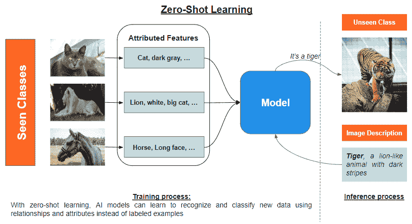
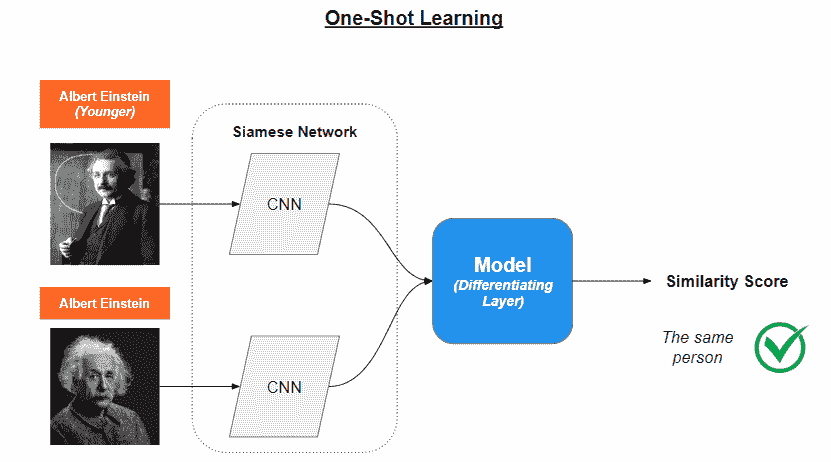
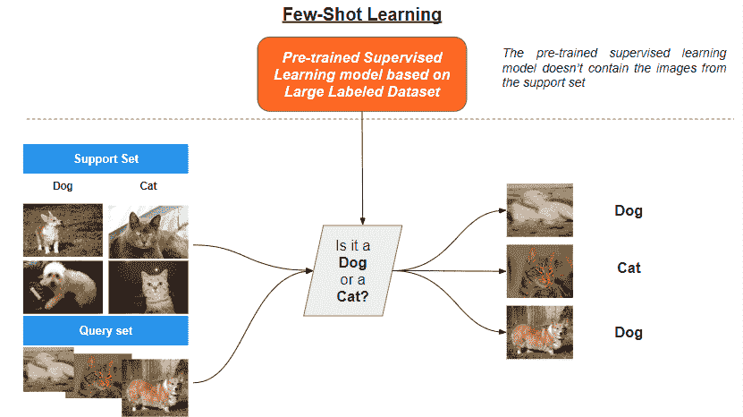

# 打破数据障碍：**零样本学习**、**单样本学习**和**少样本学习**如何改变机器学习

> 原文：[`www.kdnuggets.com/2023/08/breaking-data-barrier-zeroshot-oneshot-fewshot-learning-transforming-machine-learning.html`](https://www.kdnuggets.com/2023/08/breaking-data-barrier-zeroshot-oneshot-fewshot-learning-transforming-machine-learning.html)

图片来源：Allison Saeng via Unsplash

# 介绍

在当今快速变化的世界中，技术每天都在进步，[机器学习](https://saturncloud.io/glossary/machine-learning/)和[人工智能](https://saturncloud.io/glossary/artificial-intelligence/)利用过程自动化和提高效率的力量彻底改变了各种行业。然而，人类仍然在传统机器学习算法面前具有明显优势，因为这些算法需要数千个样本来响应潜在的关联和识别对象。

*想象一下，在解锁你的智能手机时，需要通过进行 100 次扫描才让算法工作，这种挫败感。如果这种功能被推出市场，它绝不会成功。*

然而，自 2005 年以来，机器学习专家们开发出了可能彻底改变游戏规则的新算法。在过去近二十年中取得的改进，产生了可以从最少（零、单或少量）样本中学习的算法。

在这篇文章中，我们深入探讨了这些算法背后的概念，并提供了对这些学习技术如何运作的全面理解，同时揭示了在实现它们时面临的一些挑战。

# **零样本学习**是如何工作的？

**零样本学习**的核心概念是训练一个模型来分类它从未见过的对象。核心思想是利用另一个模型的现有知识，获得新类别的有意义表示。

它利用**语义嵌入**或**基于属性的学习**，以有意义的方式利用先验知识，从而提供对已知和未知类别之间关系的高层次理解。这两者可以一起使用，也可以单独使用。

**语义嵌入**是单词、短语或文档的向量表示，捕捉它们在连续向量空间中的基本意义和关系。这些嵌入通常使用[无监督学习](https://saturncloud.io/glossary/unsupervised-learning)算法生成，例如 Word2Vec、GloVe 或[BERT](https://saturncloud.io/glossary/bert)。目标是创建语言信息的紧凑表示，其中相似的意义通过相似的向量进行编码。通过这种方式，语义嵌入允许对文本数据进行高效准确的比较和操作，并通过将实例投影到一个连续的、共享的语义空间来对未见类别进行概括。

**基于属性的学习**使得在没有任何这些类别标记示例的情况下对未见类别的对象进行分类成为可能。它将对象分解为其有意义和显著的属性，这些属性作为中间表示，使模型能够建立已见类别和未见类别之间的对应关系。这个过程通常包括**属性提取**、**属性预测**和**标签推断**。

1.  **属性提取**涉及为每个对象类别导出有意义和区分性的属性，以弥合低级特征与高级概念之间的差距。

1.  **属性预测**涉及学习实例的低级特征与高级属性之间的对应关系，利用机器学习技术识别特征之间的模式和关系，从而对新类别进行概括。

1.  **标签推断**涉及使用预测的属性和属性与未见类别标签之间的关系来预测新实例的类别标签，而无需依赖标记示例。

尽管零-shot 学习具有令人鼓舞的潜力，但仍然存在一些挑战，例如：

+   **领域适应**：目标领域中的实例分布可能与源领域中的分布显著不同，从而导致对已见类别和未见类别的语义嵌入之间的差异。这种领域偏移可能会损害性能，因为模型可能无法在领域之间建立实例和属性之间的有意义的对应关系。为克服这一挑战，提出了各种领域适应技术，例如对抗学习、特征解缠结和自监督学习，旨在对齐源领域和目标领域中实例和属性的分布。

# 一次性学习如何工作？

在开发传统神经网络的过程中，例如识别汽车，模型需要数千个样本，这些样本从不同角度和对比度拍摄，以有效地区分它们。**单样本学习采取了不同的方法**。该方法不是识别问题中的汽车，而是确定图像 A 是否等同于图像 B。这是通过概括模型从先前任务中获得的经验信息来实现的。单样本学习主要用于 [计算机视觉](https://saturncloud.io/glossary/computer-vision)。

实现这一点的技术包括 **记忆增强型神经网络 (MANNs) 和 Siamese 网络**。通过独立利用这些技术，单样本学习模型可以迅速适应新任务，即使在数据非常有限的情况下也能表现良好，使其适合在获取标注数据可能昂贵或耗时的实际场景中使用。

**记忆增强型 [神经网络](https://saturncloud.io/glossary/Neural-Networks) (MANNs)** 是一种高级神经网络，旨在从极少的样本中学习，类似于人类如何从一个新对象的实例中学习。MANNs 通过具备额外的记忆组件来实现这一点，该组件可以存储和访问信息。

> 想象 MANN 是一个聪明的机器人，手里拿着一本笔记本。机器人可以使用它的笔记本记住之前见过的事物，并利用这些信息理解它遇到的新事物。这帮助机器人比普通的 AI 模型学习得更快。

**Siamese 网络** 则旨在通过使用两个或更多具有共享权重的相同子网络来比较数据样本。这些网络学习一种特征表示，捕捉数据样本之间的关键差异和相似性。

> 想象 Siamese 网络是成对的侦探，他们总是一起工作。他们共享相同的知识和技能，任务是比较两个项目并决定它们是否相同或不同。这些侦探查看每个项目的重要特征，然后比较他们的发现以做出决定。

Siamese 网络的训练分为两个阶段：验证阶段和泛化阶段。

+   **在验证阶段**，网络确定两个输入图像或数据点是否属于同一类别。网络通过使用双胞胎子网络分别处理两个输入。

+   **在泛化阶段**，模型通过有效学习特征表示来概括对输入数据的理解，从而区分不同类别。

一旦两个阶段完成，模型就能够确定图像 A 是否对应于图像 B。

单样本学习非常有前景，因为它不需要重新训练来检测新类别。然而，它面临挑战，例如高内存需求和巨大的计算能力需求，因为学习需要进行两倍的操作。

# 少样本学习是如何工作的？

需要介绍的最后一种学习方法是**少样本学习**，这是元学习的一个子领域，旨在开发能够从少量标记样本中学习的算法。

在这种情况下，**原型网络和模型无关元学习（MAML）**是两种突出的替代技术，已在少样本学习场景中取得了成功。

### 原型网络

原型网络是一类设计用于少样本分类任务的神经网络。核心思想是在特征空间中为每个类别学习一个原型或代表性示例。原型通过比较新输入与学习到的原型之间的距离来作为分类的基础。

主要涉及三个步骤：

1.  **嵌入**：网络使用神经网络编码器（如卷积神经网络（CNN）或递归神经网络（RNN））计算每个输入的嵌入。嵌入是捕捉输入数据显著特征的高维表示。

1.  **原型计算**：对于每个类别，网络通过计算支持集（这是每个类别的一小部分标记样本）的嵌入均值来计算原型。原型表示特征空间中类别的“中心”。

1.  **分类**：给定一个新输入，网络计算其嵌入并计算输入嵌入与原型之间的距离（例如欧氏距离）。然后将输入分配给最近原型的类别。

学习过程涉及最小化一个损失函数，该函数鼓励原型与其各自类别的嵌入更接近，并与其他类别的嵌入距离更远。

### 模型无关元学习（MAML）

MAML 是一个元学习[算法](https://saturncloud.io/glossary/algorithm)，旨在为模型的参数找到最佳初始化，使其能够通过少量梯度步骤快速适应新任务。MAML 是模型无关的，这意味着它可以应用于任何使用梯度下降进行训练的模型。

MAML 包括以下步骤：

1.  **任务采样**：在元训练过程中，从任务的分布中采样任务，每个任务是一个少样本学习问题，具有少量标记样本。

1.  **任务特定学习**：对于每个任务，模型的参数使用任务的训练数据（支持集）通过几步梯度更新进行微调。这会生成具有更新参数的任务特定模型。

1.  **元学习**：元目标是最小化所有任务在验证数据（查询集）上的任务特定损失的总和。模型的初始参数通过 [梯度下降](https://saturncloud.io/glossary/gradient-descent) 进行更新，以实现这一目标。

1.  **元测试**：在元训练后，模型可以通过少量的梯度步骤迅速在新任务上进行微调，利用已学习的初始化。

MAML 需要大量的计算资源，因为它涉及多次嵌套的梯度更新，这带来了挑战。其中一个挑战是**任务多样性**。在许多少样本学习场景中，模型必须适应广泛的任务或类别，每个类别只有少量示例。这种多样性使得开发一个能够有效处理不同任务或类别的单一模型或方法变得具有挑战性，而无需大量的微调或适应。

# 结论

机器学习的奇妙世界为我们带来了开创性的技术，如零样本、单样本和少样本学习。这些方法允许人工智能模型仅通过少量示例来学习和识别对象或模式，类似于人类的学习方式。这为医疗保健、零售和制造等各个行业开辟了广阔的可能性，因为在这些行业中，获得大量标记数据并非总是一种奢侈。

**[Christophe Atten](https://www.linkedin.com/in/christophe-atten-331a8ab9/)** 领导着一个充满活力的数据科学团队，并自 2022 年起成为中等人工智能作者，专注于将原始数据转化为有洞察力的解决方案。

[原文](https://saturncloud.io/blog/breaking-the-data-barrier-how-zero-shot-one-shot-and-few-shot-learning-are-transforming-machine-learning/)。转载授权。

* * *

## 我们的前三大课程推荐

 1\. [Google 网络安全证书](https://www.kdnuggets.com/google-cybersecurity) - 快速进入网络安全职业生涯。

 2\. [Google 数据分析专业证书](https://www.kdnuggets.com/google-data-analytics) - 提升您的数据分析水平

 3\. [Google IT 支持专业证书](https://www.kdnuggets.com/google-itsupport) - 支持您的组织的 IT 需求

* * *

### 更多相关话题

+   [AIoT 革命：人工智能与物联网如何改变我们的世界](https://www.kdnuggets.com/2022/07/aiot-revolution-ai-iot-transforming-world.html)

+   [KDnuggets 新闻，7 月 27 日：AIoT 革命：人工智能与物联网如何…](https://www.kdnuggets.com/2022/n30.html)

+   [用 LangChain 改变人工智能：文本数据的游戏规则改变者](https://www.kdnuggets.com/2023/08/transforming-ai-langchain-text-data-game-changer.html)

+   [人工智能如何改变零售行业](https://www.kdnuggets.com/how-ai-is-transforming-the-retail-industry)

+   [拆解量子计算：对数据科学和人工智能的影响](https://www.kdnuggets.com/breaking-down-quantum-computing-implications-for-data-science-and-ai)

+   [进入数据科学领域：必备技能及学习方法](https://www.kdnuggets.com/breaking-into-data-science-essential-skills-and-how-to-learn-them)
