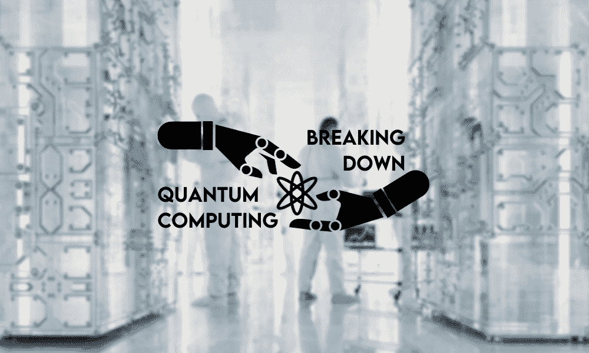

# 解读量子计算：对数据科学和 AI 的影响

> 原文：[`www.kdnuggets.com/breaking-down-quantum-computing-implications-for-data-science-and-ai`](https://www.kdnuggets.com/breaking-down-quantum-computing-implications-for-data-science-and-ai)

编辑提供的图片

量子计算对数据科学和 AI 产生了深远的影响，在这篇文章中，我们将深入探讨超越基础知识的内容。

* * *

## 我们的三大课程推荐

 1\. [谷歌网络安全证书](https://www.kdnuggets.com/google-cybersecurity) - 快速进入网络安全职业。

 2\. [谷歌数据分析专业证书](https://www.kdnuggets.com/google-data-analytics) - 提升您的数据分析能力

 3\. [谷歌 IT 支持专业证书](https://www.kdnuggets.com/google-itsupport) - 支持您的组织 IT

* * *

我们将探索量子算法的前沿进展及其解决复杂问题的潜力，这些问题目前用现有技术是无法想象的。此外，我们还将讨论量子计算面临的挑战以及如何克服这些挑战。

这是对一个未来的迷人一瞥，在这个未来，技术的边界被推向新的前沿，大大加速了 AI 和数据科学的能力。

# 什么是量子计算？

量子计算涉及专门的计算机，这些计算机解决数学问题并运行量子模型，这些模型基于量子理论原则。这项强大的技术使数据科学家能够构建与复杂过程相关的模型，例如分子形成、光合作用和超导性。

信息处理方式不同于常规计算机，[使用量子比特](https://www.intechopen.com/chapters/73811)（量子位）而非二进制形式传输数据。量子比特在量子计算中至关重要，因为它们可以保持在叠加态 - 我们将在下一部分中详细解释这一点。

通过使用广泛的算法，量子计算机可以测量和观察大量数据。用户输入必要的算法后，量子计算机将创建一个多维环境，以解读各种数据点，从而发现模式和联系。

## 量子计算：重要术语

为了更好地理解计算，重要的是要掌握四个关键术语：量子比特、叠加态、纠缠和量子干涉。

**量子比特**

量子位（Qubits）是量子计算中的标准信息单元，类似于传统计算中使用的二进制位。量子位利用一种称为叠加（superposition）的原理，使其可以同时处于多种状态。二进制位只能是 0 或 1，而量子位可以是 0 或 1、0 或 1 的部分，或者是 0 和 1 的同时存在。

虽然二进制位通常是基于硅的微芯片，但量子位可以由光子、受困离子以及真实或人工的原子或准粒子组成。因此，大多数量子计算机需要极其复杂的冷却设备以在非常低的温度下工作。

**叠加（Superposition）**

叠加（Superposition）指的是[量子粒子是所有可能状态的组合](https://www.quantum-inspire.com/kbase/superposition-and-entanglement/)，这些粒子可以在量子计算机观察和单独测量时发生变化和移动。解释叠加的一个好比喻是掷硬币时，硬币在空中的不同瞬间。

这使得量子计算机可以以多种方式评估每个粒子，从而找到不同的结果。与传统的顺序处理不同，量子计算可以利用叠加一次运行大量的并行计算。

**纠缠（Entanglement）**

量子粒子可以在其测量方面相互关联，形成一种称为纠缠（entanglement）的网络。在这种纠缠过程中，一个量子位的测量可以被用于其他量子位的计算。因此，量子计算能够解决极其复杂的问题，并处理大量数据。

**量子干涉（Quantum Interference）**

在叠加过程中，量子位有时可能会经历量子干涉，导致量子位变得不可用。量子计算机设有措施以减少这种干涉，以确保结果尽可能准确。量子干涉越多，结果的准确性就越低。

# 量子计算如何在人工智能和数据科学中发挥作用？

量子机器学习（QML）和量子人工智能（QAI）是数据科学中两个被低估但快速增长的领域。这是因为机器学习算法正变得过于复杂，传统计算机无法有效处理，需要量子计算的能力。最终，这预计将推动人工智能的重大进展。

量子计算机可以像神经网络一样有效地进行训练，调整物理控制参数来解决问题，例如电磁场的强度或激光脉冲的频率。

一个容易理解的用例是可以训练的机器学习模型，用于对文档内容进行分类，通过将文档编码为设备的物理状态进行测量。借助量子计算和 AI，数据科学工作流将在毫秒级别内进行测量，因为量子 AI 模型能够处理 PB 级数据，并[在语义上比较文档](https://apryse.com/blog/document-comparison/compare-pdf-word-documents-with-semantic-comparison)，为用户提供超出其想象的可操作见解。

## 量子机器学习研究

像谷歌、IBM 和英特尔这样的主要参与者在量子计算上投入了大量资金，但目前该技术在商业层面仍未被认为是可行的解决方案。然而，该领域的研究正在加速，涉及量子计算的技术挑战肯定会被通过机器学习解决，不会太久。

IBM 和麻省理工学院（MIT）可以被归功于揭示了 2019 年结合机器学习和量子计算的实验研究。在一项研究中，使用了一个两比特量子计算机来演示量子计算如何利用实验室生成的数据集提升分类监督学习。这为进一步研究铺平了道路，以勾勒出这种技术合作的全部潜力。

## 量子机器学习实践

在本节中，我们将详细介绍谷歌和 IBM 启动的量子计算项目，并洞察这项技术的巨大潜力。

+   **谷歌的 TensorFlow Quantum** **(TFQ)** - 在这个项目中，谷歌旨在克服[将现有机器模型转移到量子架构](https://arxiv.org/abs/2003.02989)的挑战。为了加速这一进程，TensorFlow Quantum 现在是开源的，允许开发人员使用 Python 和谷歌的量子计算框架来构建量子机器学习模型。这意味着量子算法和机器学习应用的研究拥有一个更活跃、更具备条件的社区，从而促进进一步的创新。

+   **IBM 的量子挑战** - 连接传统软件开发与量子计算应用开发之间的差距，[IBM 的量子挑战](https://challenges.quantum.ibm.com/)是一个年度多日活动，专注于量子编程。活动吸引了近 2000 名参与者，旨在教育开发者和研究人员，以确保他们为量子计算革命做好准备。

+   **剑桥量子计算（CQC）和 IBM** - [CQC](http://www.quantum.cam.ac.uk/) 和 IBM 于 2021 年 9 月推出了一款基于云的量子随机数生成器（QRNG）。这一开创性的应用能够生成可测量的熵（完全随机性）。这不仅是数据加密领域的一个宝贵突破，也可能在开发能够应对意外情况的高级人工智能系统中发挥作用。

多亏了持续的研究和教育，量子计算有可能推动机器学习模型的应用，这些模型可以用于各种现实世界场景。例如，在金融领域，股票投资和 [利用 AI 信号进行期权交易](https://thetradinganalyst.com/human-vs-ai-trading-signals/) 等活动将因量子 AI 的预测能力而得到极大增强。同样，物理量子计算机的出现将引发在 [使用核方法](https://www.nature.com/articles/s41598-023-38558-z) 进行复杂数据线性分类方面的革命。

# 结论 - 量子机器学习的未来

在量子机器学习能够进入主流之前，还有许多重要步骤需要完成。幸运的是，像 Google 和 IBM 这样的科技巨头正在提供开源软件和 数据科学教育资源，以便访问它们的量子计算架构，为该领域培养新的专家铺平道路。

通过加速量子计算的采用，人工智能和机器学习预计将取得巨大的进展，解决传统计算无法解决的问题。甚至可能是全球性问题，如气候变化。

尽管这一研究仍处于非常早期的阶段，但技术的潜力正迅速显现，人工智能的新篇章即将开启。

****[纳赫拉·戴维斯](http://nahlawrites.com/)**** 是一名软件开发人员和技术作家。在全职从事技术写作之前，她曾管理——包括其他有趣的事情——担任一家 Inc. 5,000 体验式品牌组织的首席程序员，该组织的客户包括三星、时代华纳、Netflix 和索尼。

### 更多相关信息

+   [解读 AutoGPT](https://www.kdnuggets.com/2023/05/breaking-autogpt.html)

+   [解读 DENSE_RANK()：SQL 爱好者的逐步指南](https://www.kdnuggets.com/breaking-down-denserank-a-step-by-step-guide-for-sql-enthusiasts)

+   [探索人工智能/深度学习的最新趋势：从元宇宙到量子计算](https://www.kdnuggets.com/2023/07/exploring-latest-trends-aidl-metaverse-quantum-computing.html)

+   [辛普森悖论及其在数据科学中的影响](https://www.kdnuggets.com/2023/03/simpson-paradox-implications-data-science.html)

+   [生成型人工智能的新伦理影响](https://www.kdnuggets.com/the-new-ethical-implications-of-generative-artificial-intelligence)

+   [通过整合 Jupyter 和 KNIME 来缩短实施时间](https://www.kdnuggets.com/2021/12/cutting-implementation-time-integrating-jupyter-knime.html)
