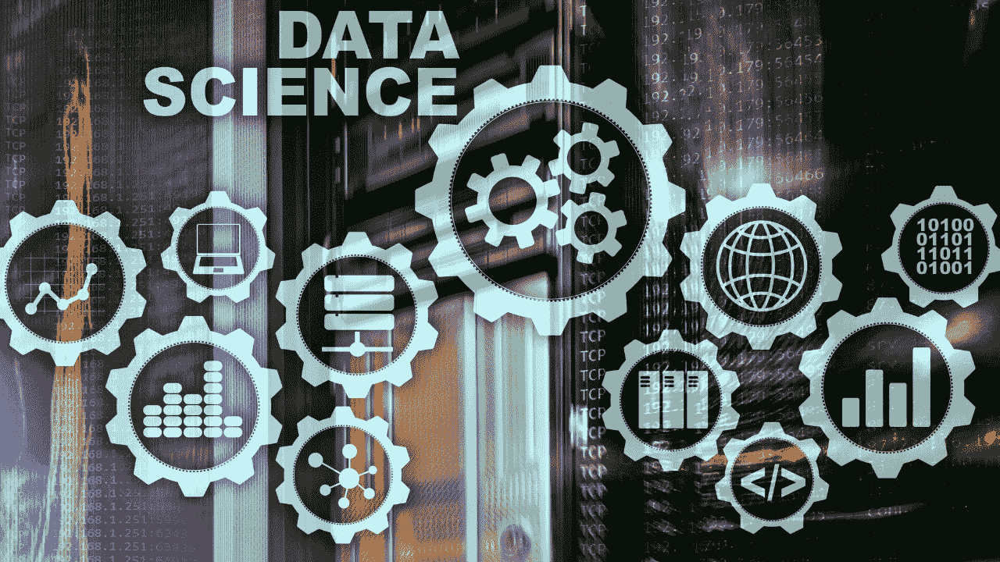
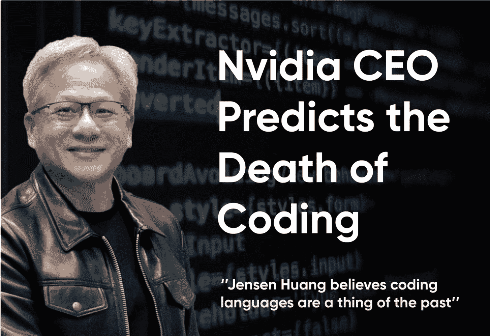
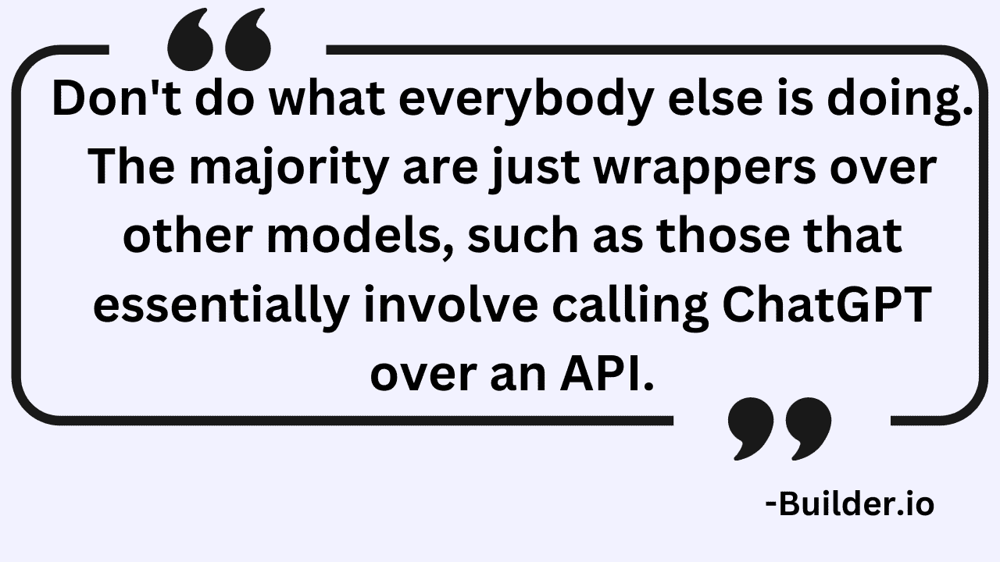

# 进入数据科学领域：必要技能及其学习方法

> 原文：[`www.kdnuggets.com/breaking-into-data-science-essential-skills-and-how-to-learn-them`](https://www.kdnuggets.com/breaking-into-data-science-essential-skills-and-how-to-learn-them)

来源：Canva

数据科学已经需求了相当长一段时间。幸运的是，教育的民主化使得建立学习必要技术技能的路线图变得相对容易。

* * *

## 我们的前三大课程推荐

 1\. [谷歌网络安全证书](https://www.kdnuggets.com/google-cybersecurity) - 快速进入网络安全职业生涯。

 2\. [谷歌数据分析专业证书](https://www.kdnuggets.com/google-data-analytics) - 提升你的数据分析水平

 3\. [谷歌 IT 支持专业证书](https://www.kdnuggets.com/google-itsupport) - 支持组织的 IT 工作

* * *

通常，学习路径包括建立线性代数、数学、概率、统计等基础，并掌握至少一种编程语言，如 Python。

## 技术细节

具备这些基础知识后，学习者对机器学习基础知识变得更加熟悉，理解关键算法——决策树、随机森林、集成方法和时间序列，并最终掌握复杂的深度学习算法。

在这个过程中，你还需要很好地掌握涉及偏差-方差权衡、泛化能力、算法假设等概念。这份清单绝非完整（也永远不会完整），因为数据科学领域涉及持续学习——这通常通过实际操作或学习行业专家的做法来实现。

在这种情况下，像 Kaggle 这样的平台为理解构建高性能模型的复杂细节提供了良好的练习场。此外，接触 Kaggle 上的获胜解决方案不仅增加了知识储备，还使学习者能够培养开发稳健模型的思维方式。

## 超越技术技能

到目前为止，一切顺利。但是，你注意到一件事了吗？

我所概述的技能和路径没有秘密；它们大多公开可得。每个人都在学习相同的方法，以建立技能，争取在数据科学领域获得理想的角色。

这时，现实检查是必要的。

不仅仅是关于可用的 AI 人才，还有市场对这些技能的需求。AI 进展迅速，尤其是自生成 AI 时代开始以来，这促使许多组织减少了员工。即使是 Nvidia 的首席执行官**黄仁勋**也分享了他对未来劳动力和技能的看法，他强调“AI 将接管编码，使学习变得可选。AI 将使编码对每个人都变得可及，重新塑造我们学习编程的方式。”

来源：Immigration & Jobs Talk Show YT 频道

## 你能做什么？

行业格局的变化突显了一个真理——变化的时代需要变化的措施。

鉴于行业技能期望的变化，以下是你应该关注的，以建立出色的数据科学职业：

+   打磨那些经常被忽视的决策技能，这对构建可扩展的机器学习系统中的权衡至关重要。

+   即使在缺乏完整信息的情况下，也要具备做出明智决策的能力，展示快速思维和适应能力。

+   构建 ML 模型需要广泛的利益相关者管理，这意味着可能会出现摩擦。掌握利益相关者管理的艺术，以应对潜在的冲突，并以有说服力的理由推动决策。

来源：Canva

+   与跨职能团队合作也意味着你的受众可能来自不同的背景，因此建立量身定制的沟通方式是一个很大的优势。

+   大多数 AI 项目在概念验证（PoC）阶段失败，甚至无法进入生产阶段，而在生产中的项目也难以展示结果。简而言之，组织在等待 AI 投资的回报。因此，成为那个人，做好事情并展示结果，同时取得进展。

+   确保业务问题与统计 ML 解决方案的对齐，以引导给定的 AI 项目成功。如果这一步骤出现问题，后续的任何东西都不会有用。

+   创新是必须的——不仅对企业，对我们所有人也是如此。跳出框框思考，设计创新解决方案。这是建立你作为专家数据科学家声誉的可靠途径。

### 软技能

随机解决问题是一门艺术，课堂上很少教授。然而，关键的问题仍然是——如何学习这些技能？

没有单一的精通路径，但这里有一些起点来培养这种视角：

+   不要害怕失败，而是将挑战视为学习新事物的机会。将每一个问题陈述视为在 AI 中学习新事物的入口。这类似于在大学学习，唯一的不同是你是被付费去学习以实现创新，而不是支付学费。数据科学涉及“科学”，即实验性，涉及多个迭代以提供有意义的结果（有时甚至没有成功，只是学习）。这些学习随着时间的推移积累，帮助你建立知识库，随着经验的增加，这成为你的差异化优势。

+   克服恐惧也意味着提出问题。例如，始终“从为什么开始？”我们为什么要构建这个？我们的客户/利益相关者为什么关心？为什么是现在？

+   一旦问题陈述背后的“为什么”明确了，“什么”和“如何”自然会随之而来，从而简化创建卓越 AI 产品的过程。

+   简而言之，在这个“构建 AI 产品只是调用 API”的新世界中，选择正确的问题，或者说，发明正确的问题，可以为你开辟一条极具回报的职业道路。

来源：builder.io

掌握这些技能可以在面试过程中脱颖而出，并构建出世界期待的卓越 ML 产品。

****[Vidhi Chugh](https://vidhi-chugh.medium.com/)**** 是一位 AI 策略师和数字化转型领导者，在产品、科学和工程的交汇处工作，致力于构建可扩展的机器学习系统。她是一位获奖的创新领导者、作者和国际演讲者。她的使命是让机器学习普及化，并将行业术语打破，使每个人都能参与这场变革。

### 相关阅读

+   [逐步解析量子计算：对数据科学和 AI 的影响](https://www.kdnuggets.com/breaking-down-quantum-computing-implications-for-data-science-and-ai)

+   [打破数据壁垒：零样本、单样本和少样本学习如何改变机器学习](https://www.kdnuggets.com/2023/08/breaking-data-barrier-zeroshot-oneshot-fewshot-learning-transforming-machine-learning.html)

+   [逐步解析 AutoGPT](https://www.kdnuggets.com/2023/05/breaking-autogpt.html)

+   [逐步解析 DENSE_RANK()：SQL 爱好者的指南](https://www.kdnuggets.com/breaking-down-denserank-a-step-by-step-guide-for-sql-enthusiasts)

+   [数据科学基础：开始需要了解的 10 项关键技能…](https://www.kdnuggets.com/2020/10/data-science-minimum-10-essential-skills.html)

+   [提升你的数据科学技能：你需要的 SQL 认证](https://www.kdnuggets.com/boost-your-data-science-skills-the-essential-sql-certifications-you-need)
