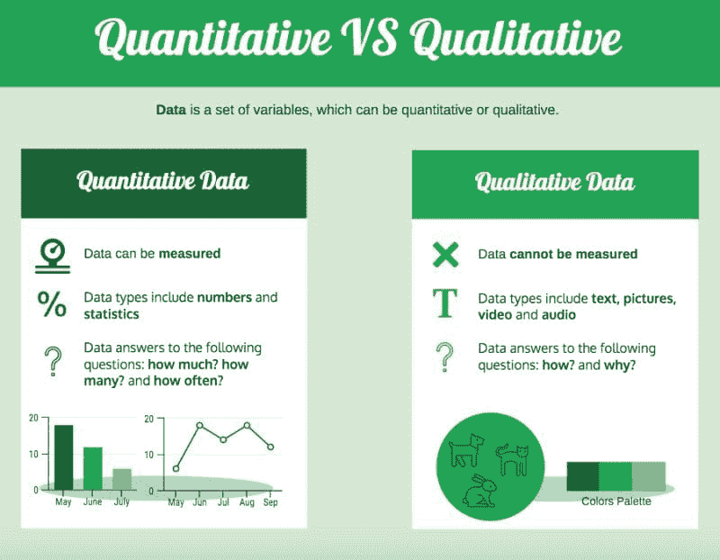
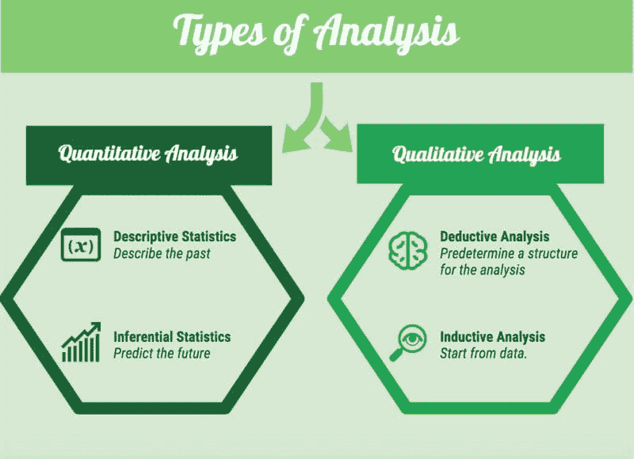

# 数据概念简介

> 原文：[`www.kdnuggets.com/2021/07/brief-introduction-concept-data.html`](https://www.kdnuggets.com/2021/07/brief-introduction-concept-data.html)

评论

**由 [Angelica Lo Duca](https://twitter.com/alod83) 提供，国家研究委员会信息学与电信研究所**

根据剑桥词典[1]，数据是**信息，特别是收集以供检查和考虑的信息或帮助决策的数字，或以电子形式存储并由计算机使用的信息**。换句话说，数据是一组变量，可以是定量的或定性的[2,3]。

* * *

## 我们的三大课程推荐

 1\. [Google 网络安全证书](https://www.kdnuggets.com/google-cybersecurity) - 快速进入网络安全职业生涯。

 2\. [Google 数据分析专业证书](https://www.kdnuggets.com/google-data-analytics) - 提升您的数据分析技能

 3\. [Google IT 支持专业证书](https://www.kdnuggets.com/google-itsupport) - 支持您组织的 IT

* * *

## 数据类型

数据可以是定量的也可以是定性的。理解定量数据和定性数据之间的区别非常重要，因为它们的处理和分析方式不同：例如，您不能对定性数据计算统计数据，或无法对定量数据应用自然语言处理技术。

## 定量数据

定量数据包括可以用数字表示的数据，因此它们可以被测量、计数并通过统计计算进行分析。定量数据可以用来描述和分析现象，以发现趋势、比较差异并进行预测。通常，定量数据已经是**结构化的**，因此进一步分析相对容易。

定量数据包括：

**1\. 连续数据**，它可以取任何数值。

连续数据的例子包括：

+   多年的平均温度（例如 35°C 或 84.2 °F）

+   一个月内的产品价格（例如 $ 23.50 或 45.00 €）

通常，连续数据分布在一个区间内，该区间可以包含负值和正值（**区间数据**）。

**2\. 离散数据**，它只能取某些特定的数值。

离散数据的例子包括：

+   考试成绩，例如 18 或 30

+   鞋码，例如 42 EU

通常，离散数据是等距且非负的（**比率数据**）。

## 定性数据

定性数据无法通过标准计算技术进行测量，因为它们表达的是感受、感觉和经验。定性数据可以用于理解给定现象周围的背景和发现新方面。通常，定性数据是**非结构化**的，因此需要额外的技术来提取有意义的信息。

定量数据包括：

**1\. 名义数据**，用于标记无法测量的数量，而不按照特定顺序排列。通常，名义数据将相似的对象分组。

名义数据的示例包括：

+   个人所讲的语言（例如，英语，意大利语，法语）

+   色彩调色板（例如，红色，绿色）

**2\. 顺序数据**，与名义数据不同的是，它们可以被排序。

名义数据的示例包括：

+   对于给定产品的意见（例如，低质量，中等质量，高质量）

+   一天中的时间（例如，早晨，下午，夜晚）

## 数据分析类型

数据分析的目标是发现数据中隐藏的趋势、模式和关系。

根据数据类型，可以执行不同的分析：定量数据和定性数据的定量和定性分析。

## 定量分析

定量分析[4]指的是定量数据，包括经典的统计技术：

**1\. 描述性统计**

描述性统计[5]分析过去，通过描述数据的基本特征。

描述性统计基于一些测量的计算：

+   频率（计数，百分比）

+   中央趋势（均值，中位数，众数）

+   变异性（最大值，最小值，范围，四分位数，方差）

**2\. 推论统计**

推论统计旨在建立预测模型以理解给定现象的趋势。

推论统计包括以下类型的分析：

+   假设检验（ANOVA，t 检验，Box-Cox，…）

+   置信区间估计

## 定性分析

定性分析[6]利用定性数据并尝试理解数据背景。由于无法测量数据，因此可以采用以下策略来分析定性数据：

**1\. 演绎分析**

在演绎分析中，研究人员制定一些先验结构或问题来调查数据。当研究者对数据有至少一个基本的概述时，可以使用这种方法。

**2\. 归纳分析**

归纳分析开始时查看数据，希望提取一些有用的信息。这种分析相当耗时，因为它需要对数据进行深入调查。归纳分析用于当研究者对数据一无所知时。

### 结论

这篇文章介绍了数据的基本概念，包括定量数据和定性数据。定量分析关注数字，而定性分析关注类别。两种类型的分析都做了大量工作，但研究仍在进行中。

### 参考资料

[1] 剑桥词典：数据的定义：

[`dictionary.cambridge.org/dictionary/english/data`](https://dictionary.cambridge.org/dictionary/english/data)

[2] 定性与定量数据：定义、分析、示例：

[`www.intellspot.com/qualitative-vs-quantitative-data/`](https://www.intellspot.com/qualitative-vs-quantitative-data/)

[3] 如何理解您业务中的定量和定性数据：

[`laconteconsulting.com/2020/02/14/quantitative-qualitative-data/`](https://laconteconsulting.com/2020/02/14/quantitative-qualitative-data/)

[4] 定量数据：定义、类型、分析和示例：

[`www.questionpro.com/blog/quantitative-data/`](https://www.questionpro.com/blog/quantitative-data/)

[5] 直观介绍描述性分析：

[`medium.com/analytics-vidhya/a-gentle-introduction-to-descriptive-analytics-8b4e8e1ad238`](https://medium.com/analytics-vidhya/a-gentle-introduction-to-descriptive-analytics-8b4e8e1ad238)

[6] 定性数据 – 定义、类型、分析和示例：

[`www.questionpro.com/blog/qualitative-data/`](https://www.questionpro.com/blog/qualitative-data/)

**简介：[Angelica Lo Duca](https://twitter.com/alod83)**（[Medium](https://alod83.medium.com/)）在意大利比萨的国家研究委员会（IIT-CNR）信息学与远程通信研究所担任博士后研究员。她是比萨大学数字人文学科硕士课程中“数据新闻学”教授。她的研究兴趣包括数据科学、数据分析、文本分析、开放数据、网络应用程序和数据新闻学，应用于社会、旅游和文化遗产领域。她曾从事数据安全、语义网和关联数据的工作。Angelica 也是一位热情的技术写作者。

**相关：**

+   数据科学的残酷真相

+   你为什么以及如何学习“高效数据科学”？

+   初学者的前 10 个数据科学项目

### 更多相关内容

+   [停止学习数据科学以寻找目的，并找到目的去…](https://www.kdnuggets.com/2021/12/stop-learning-data-science-find-purpose.html)

+   [学习数据科学统计的顶级资源](https://www.kdnuggets.com/2021/12/springboard-top-resources-learn-data-science-statistics.html)

+   [成功数据科学家的 5 个特征](https://www.kdnuggets.com/2021/12/5-characteristics-successful-data-scientist.html)

+   [每位数据科学家都应该知道的三个 R 库（即使你使用 Python）](https://www.kdnuggets.com/2021/12/three-r-libraries-every-data-scientist-know-even-python.html)

+   [一个 90 亿美元的 AI 失败，经过审视](https://www.kdnuggets.com/2021/12/9b-ai-failure-examined.html)

+   [是什么让 Python 成为初创公司的理想编程语言](https://www.kdnuggets.com/2021/12/makes-python-ideal-programming-language-startups.html)
