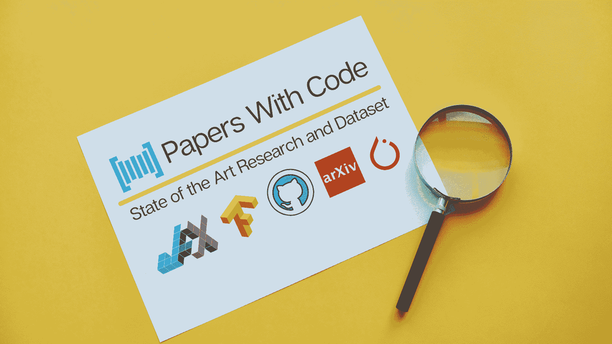
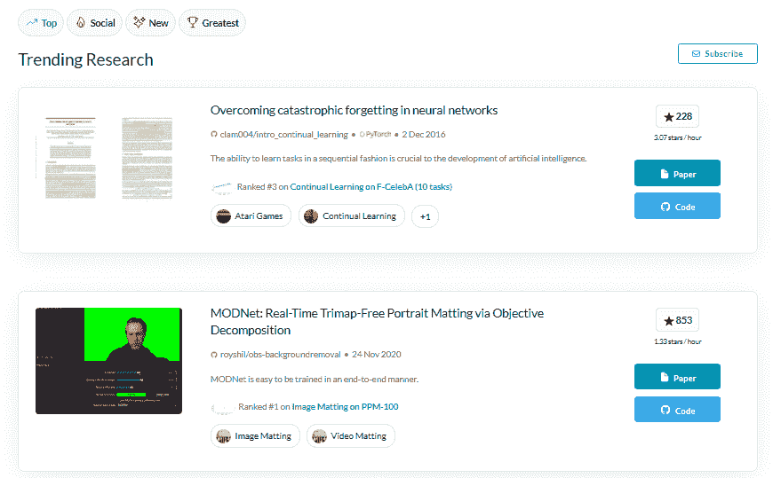
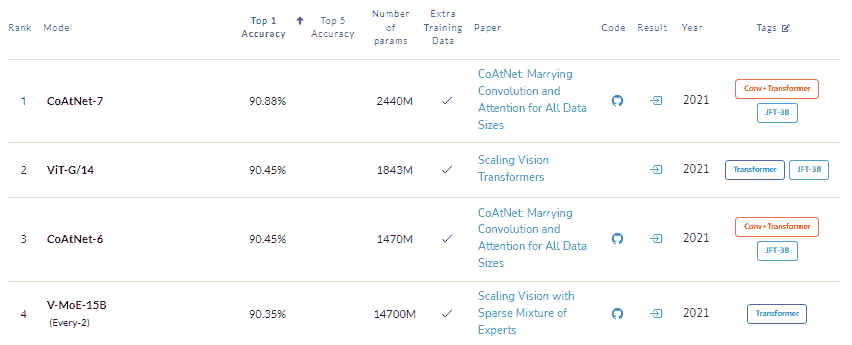
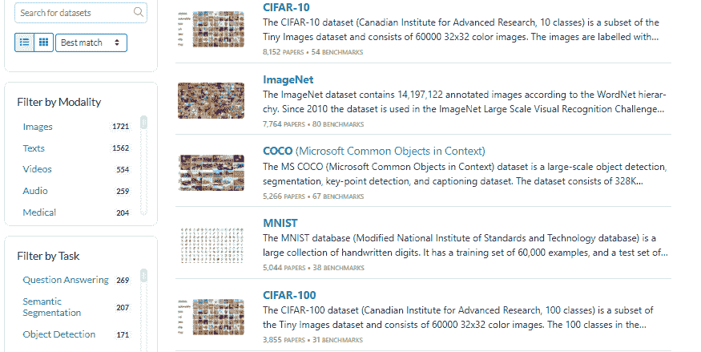
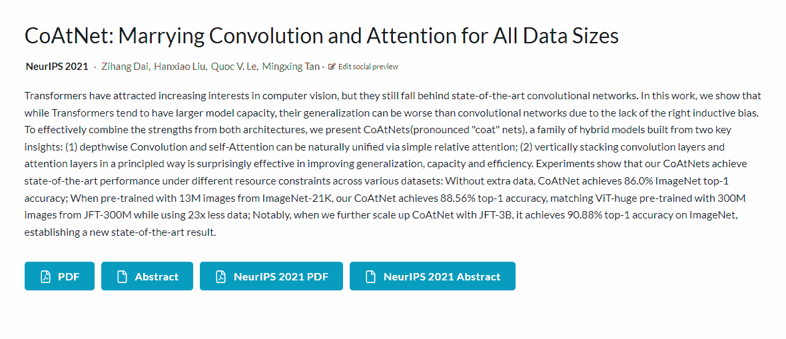

# 《带代码的论文》简要介绍

> 原文：[`www.kdnuggets.com/2022/04/brief-introduction-papers-code.html`](https://www.kdnuggets.com/2022/04/brief-introduction-papers-code.html)

作者提供的图片

这个名称说明了一切。[带代码的论文](https://paperswithcode.com/)是一个包含作者或社区提供的代码实现的研究论文的平台。最近，《带代码的论文》在流行度和提供机器学习研究完整生态系统方面都得到了增长。

你可以通过使用代码、检查所有先前的实现与模型性能指标、查看数据集、模型和研究论文中使用的方法来再现结果。这是一个下一代知识共享平台，由社区驱动，开放编辑，类似于维基百科，采用 CC-BY-SA 许可证。

* * *

## 我们的前三个课程推荐

 1\. [谷歌网络安全证书](https://www.kdnuggets.com/google-cybersecurity) - 快速开启网络安全职业之路。

 2\. [谷歌数据分析专业证书](https://www.kdnuggets.com/google-data-analytics) - 提升你的数据分析能力

 3\. [谷歌 IT 支持专业证书](https://www.kdnuggets.com/google-itsupport) - 支持你所在组织的 IT 工作

* * *

除了机器学习，该平台还有针对天文学、物理学、计算机科学、数学和统计学的[专业门户](https://portal.paperswithcode.com/)。你还可以查看关于热门论文、框架和代码覆盖率的所有统计数据。

图片来自 [带代码的论文](https://paperswithcode.com/)

任何人都可以通过点击编辑按钮进行贡献。如果你想向论文、评估表、任务或数据集添加代码，可以在特定页面找到编辑按钮进行修改。用户界面非常友好，因此找到论文或添加资源都很容易。所有提交的代码和结果都在免费的[CC BY-SA](https://creativecommons.org/licenses/by-sa/4.0/)许可证下。

# 最新技术

最新技术部分包含 6434 个基准机器学习模型，2735 个任务和子任务（知识蒸馏，少样本图像分类），65,649 篇带代码的论文。这些机器学习模型按照计算机视觉、自然语言处理和时间序列等不同研究领域进行子分类。

选择一个研究领域后，你可以探索各种子领域和结果。例如，计算机视觉子类别**图像分类**使用[CoAtNet-7](https://paperswithcode.com/paper/coatnet-marrying-convolution-and-attention)模型达到最佳准确率 90.88%。你可以查看代码实现、阅读论文、查看神经网络中使用的参数，以及类似数据集的详细比较结果。

图片来自[ImageNet 基准](https://paperswithcode.com/sota/image-classification-on-imagenet)

# 数据集

数据集部分包含 5,628 个机器学习数据集，你可以直接搜索数据集或根据模态、任务和语言进行筛选。你不仅能访问数据集，还能获得基于基准结果和研究论文的热门数据集的完整统计信息。

每个数据集都包含指向原始数据集论文或网站的链接。数据页面易于导航，几分钟内你可以了解模态、许可证信息、发表的论文和基于子类别的基准。例如，**自监督图像分类**在**ImageNet**上的基准是[iBOT](https://paperswithcode.com/paper/ibot-image-bert-pre-training-with-online)，其准确率为 82.3%。

要与 ML 社区分享你的数据集，你需要填写表单[添加数据集](https://paperswithcode.com/contribute/dataset/new)，并提供数据集的链接和详细信息。

图片来源于[机器学习数据集](https://paperswithcode.com/datasets)。

# 方法

该平台结构良好，组织有序，将各个部分划分为较小的子部分。最先进的模型按各种机器学习领域（计算机视觉、语音）组织，每个研究领域包含任务（目标检测、图像生成）和子任务（无监督图像分类、细粒度图像分类）。最后，这些子任务是使用各种方法（随机优化、卷积神经网络）构建的。

方法部分按类型划分，每种类型包含各种方法。例如，通用类型包括**注意力机制**和**激活函数**。每种方法都有某种变体，用于创建模型或处理数据。如果你想改善当前的机器学习系统，那么方法部分是寻找解决方案的最佳地方。

# 示例

让我们来发现 [CoAtNet](https://paperswithcode.com/paper/coatnet-marrying-convolution-and-attention) 页面上获取了哪些信息。该页面包含完整的研究论文名称和作者姓名以及社交媒体链接。你可以阅读摘要或从 [arxiv](https://arxiv.org/) 或一般出版物下载完整论文。如果你喜欢这篇研究论文并想了解代码实现和结果，请开始向下滚动页面，以发现多个 GitHub 存储库链接、任务、数据集、结果和方法。该平台通过连接机器学习生态系统的各种组件来提升研究人员的体验。

Gif 来自 [CoAtNet](https://paperswithcode.com/paper/coatnet-marrying-convolution-and-attention)

# 结论

Papers with Code 拥有多个功能，使机器学习从业者和研究人员能够学习和贡献前沿技术。该平台还提供了与 [Hugging Face Spaces](https://huggingface.co/spaces) 的链接，并附有 GitHub 存储库，以便你体验模型的工作方式。除此之外，你还可以 [镜像结果](https://github.com/paperswithcode/paperswithcode-client) 到 Papers with Code。例如，你可以将结果添加到 Hugging Face 模型中，它将显示在 Papers with Code 上，包括数据集、模型和模型指标。

在这篇博客中，我们探索了平台的各个部分以及它如何帮助全球研究人员了解顶级研究论文。我们了解到，最先进的模型、数据集、任务、子任务和方法是如何互相连接以改善阅读体验的。由于集成和通用包容性，这是机器学习社区中最受欢迎的平台。

**[Abid Ali Awan](https://www.polywork.com/kingabzpro)** ([@1abidaliawan](https://twitter.com/1abidaliawan)) 是一位认证的数据科学专业人士，热衷于构建机器学习模型。目前，他专注于内容创作，并撰写关于机器学习和数据科学技术的技术博客。Abid 拥有技术管理硕士学位和电信工程学士学位。他的愿景是使用图神经网络构建一个人工智能产品，以帮助那些正在与心理健康问题作斗争的学生。

### 更多相关内容

+   [KDnuggets 新闻，4 月 27 日：对 Papers With Code 的简要介绍；…](https://www.kdnuggets.com/2022/n17.html)

+   [卡尔曼滤波器简介](https://www.kdnuggets.com/2022/12/brief-introduction-kalman-filters.html)

+   [神经网络简史](https://www.kdnuggets.com/a-brief-history-of-the-neural-networks)

+   [关于 MLOps 的一切：KDnuggets 技术简报](https://www.kdnuggets.com/tech-brief-everything-you-need-to-know-about-mlops)

+   [鸭子、鸭子、代码：Python 鸭子类型的介绍](https://www.kdnuggets.com/duck-duck-code-an-introduction-to-pythons-duck-typing)

+   [过去 12 个月必读的 NLP 论文](https://www.kdnuggets.com/2023/03/must-read-nlp-papers-last-12-months.html)
