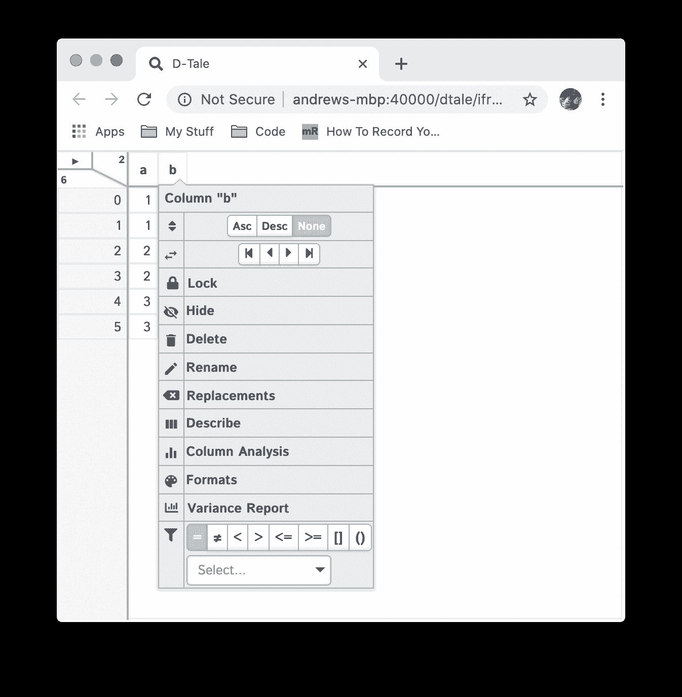
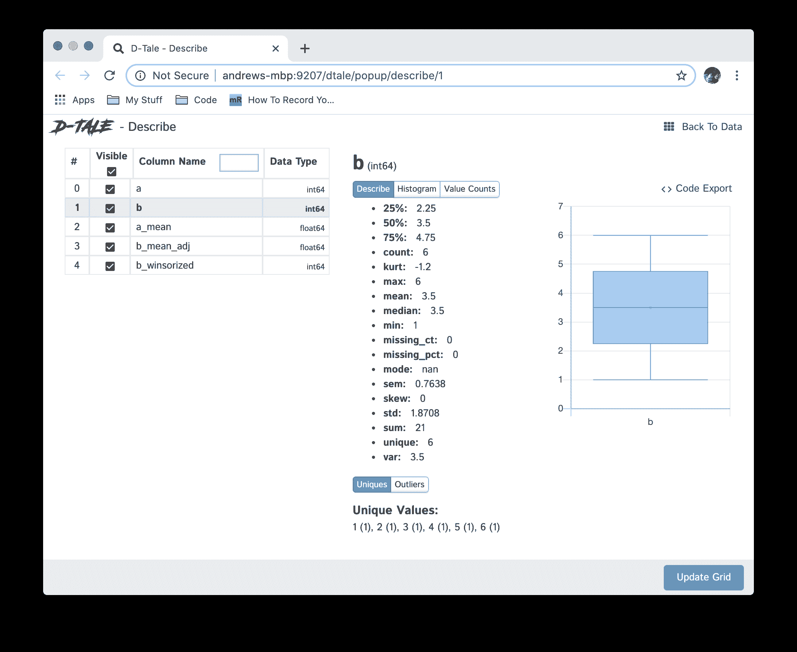
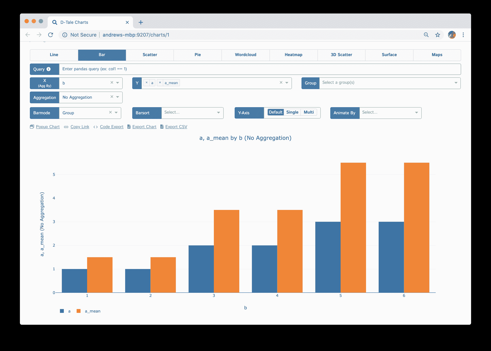
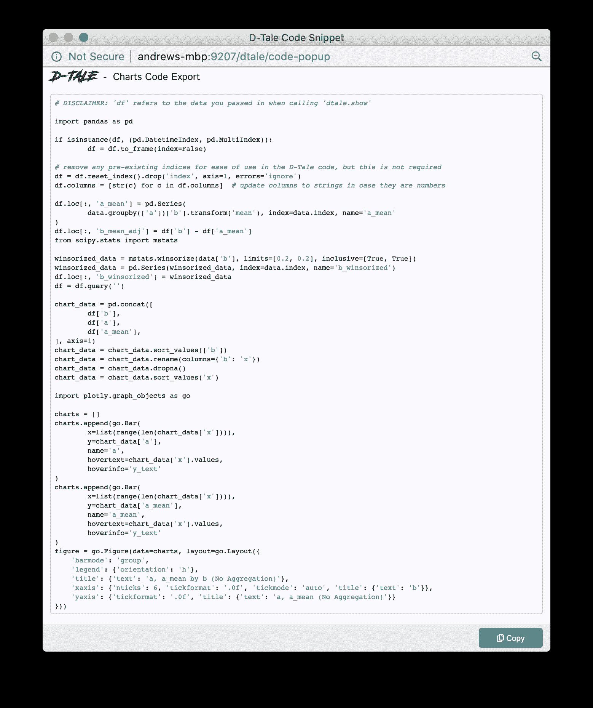

# 让你的 Pandas Dataframes 变得生动活泼，使用 D-Tale

> 原文：[`www.kdnuggets.com/2020/08/bring-pandas-dataframes-life-d-tale.html`](https://www.kdnuggets.com/2020/08/bring-pandas-dataframes-life-d-tale.html)

评论

**作者 [Andrew Schonfeld](https://www.linkedin.com/in/andrew-schonfeld-b6113233/)，全栈开发者 & [D-Tale](https://github.com/man-group/dtale) 创始人**


* * *

## 我们的前三名课程推荐

 1\. [Google 网络安全证书](https://www.kdnuggets.com/google-cybersecurity) - 快速进入网络安全职业生涯。

 2\. [Google 数据分析专业证书](https://www.kdnuggets.com/google-data-analytics) - 提升你的数据分析技能

 3\. [Google IT 支持专业证书](https://www.kdnuggets.com/google-itsupport) - 支持你的组织进行 IT 工作

* * *

厌倦了在你的 dataframes 上运行 `df.head()`？在本教程中，我们将探索开源 Pandas 数据框可视化工具 D-Tale。我们将涉及的功能包括安装、启动、导航网格、查看列统计数据、构建图表和代码导出。

### 这是什么？

D-Tale 是一个结合了 Flask 后端和 React 前端的工具，为你提供了一种简单的方式来查看和分析 Pandas 数据结构。它与 ipython notebooks 和 python/ipython 终端无缝集成。目前，该工具支持 DataFrame、Series、MultiIndex、DatetimeIndex 和 RangeIndex 等 Pandas 对象。

### 第 1 步：安装

安装可以通过 pip 或 conda 完成

```py
 # conda
conda install dtale -c conda-forge

# pip
pip install -U dtale
```

源代码可以在 [这里](https://github.com/man-group/dtale) 获取

### 第 2 步：打开网格

在你的 Python 控制台或 jupyter notebook 中执行以下代码

```py
 import pandas as pd
import dtale

df = pd.DataFrame(dict(a=[1,1,2,2,3,3], b=[1,2,3,4,5,6]))
dtale.show(df)
```

你将看到以下之一：

+   Python 控制台：一个链接，根据你的终端设置，你可以点击或复制到浏览器中，这将带你到 D-Tale 网格。

+   jupyter notebook：一个包含 D-Tale 网格的输出单元格

**示例**

| PyCharm | jupyter |
| :-: | :-: |
|  |  |

### 第 3 步：导航网格

一旦进入网格，你可以通过点击列标题来使用所有标准网格功能。如果你还在 jupyter notebook 的输出单元格中，可以点击左上角的三角形，打开主菜单，然后点击“在新标签页中打开”，以便获得更大的工作空间。

|

+   排序

+   重命名

+   过滤

+   将列锁定在左侧（如果你的 dataframe 很宽，这非常方便）

|  |
| --- |

### 步骤 4：构建列

如果你通过点击左上角的三角形打开主菜单，你会看到许多选项，其中之一是“构建列”。点击该选项，你会看到许多基于现有数据构建新列的不同方法。以下是一些例子：

| 构建器 | 主菜单 | 列构建菜单 | 输出 |
| --- | --- | --- | --- |
| 转换（按组均值） |  |  |  |
| 均值调整（减去列） |  |  |  |
| 威布尔化 |  |  |  |

### 步骤 5：查看列统计信息

许多时候，你可能希望快速查看数据框的内容概述。一个方法是运行`df.describe()`。我们通过“描述”菜单选项实现了这个功能。你可以通过打开主菜单或点击列标题然后点击“描述”按钮来查看（从列标题点击将为你预选该列）。



如果你查看一下，你会注意到不同统计信息的列表（这些统计信息将根据所选列的数据类型而变化）。这些统计信息是调用`df.describe()`对该列进行处理的结果，以及一些其他有用的统计数据，比如缺失值的百分比和峰度。你还可以查看其他有用的信息：

+   最小值、q1、 медиан、均值、q3、最大值的箱线图

+   列值的直方图

+   唯一值的计数

+   使用左侧网格切换列的可见性

### 步骤 6：使用你的数据构建图表

通过再次打开主菜单并点击“图表”按钮，你将进入一个新标签页，在那里你可以使用 Plotly Dash 构建以下图表：

+   线图

+   条形图

+   散点图

+   饼图

+   词云（这是一个特定于 D-Tale 的自定义插件，因此一些功能如导出可能无法使用）

+   热力图

+   3D 散点图

+   表面图

+   地图（Choropleth、Scattergeo 和 Mapbox）

这是一个示例，展示了比较原始值（a）与其分组均值（b_mean）的条形图。



现在你还会注意到图表顶部的一些链接：

+   弹出图表：在新标签页中打开图表，以便构建另一个图表并进行比较。

+   复制链接：将图表的链接复制到剪贴板，以便与他人分享。

+   导出图表：将图表导出为静态 HTML，并以附件形式发送到电子邮件中。

+   导出 CSV：将图表的底层数据导出为 CSV。

+   代码导出：导出构建图表的底层代码，以便进行自定义或了解其构建方式。

### 第 7 步：代码导出

让我们看看点击图表中“代码导出”链接后的输出结果，该图表是在第 6 步中构建的。



目前代码导出的目标是帮助用户了解生成图表所运行的代码，但这绝不是绝对的标准。因此，欢迎在[问题页面](https://github.com/man-group/dtale/issues)提交建议或报告错误。

这里是一些与 D-Tale 竞争的其他工具：

+   [Bamboolib](https://bamboolib.8080labs.com/)（这个不是免费的）

+   [qgrid](https://github.com/quantopian/qgrid)

感谢阅读本教程，希望它对你的数据探索有所帮助。这里还有许多其他功能我没有涉及，所以我鼓励你查看[README](https://github.com/man-group/dtale#contents)，特别是不同的 UI 功能。如果你喜欢这个，请支持开源并给[仓库](https://github.com/man-group/dtale)点赞。:)

**个人简介： [安德鲁·肖恩费尔德](https://www.linkedin.com/in/andrew-schonfeld-b6113233/)** 作为全栈开发人员已有 14 年以上的经验。直到大约 3 个月前，他一直在波士顿从事金融工作。与数据科学团队合作并完全沉浸在 Python 中，他开始利用 Flask、Pandas 和 React 在前端构建工具套件。最终，寻找可视化 Pandas 数据框的方法成为了问题，结果便是 D-Tale。在当时公司支持下，他能够开源这个软件，并且它在数据科学社区中获得了大量关注。在过去的 15 个月里，他主要在空闲时间继续开发 D-Tale，并在波士顿和圣地亚哥的 Python 用户组以及今年 7 月的 FlaskCon 上做了演讲。

**相关内容：**

+   数据科学中的 Pandas 介绍

+   强化的探索性数据分析

+   使用 NumExpr 包加速你的 Numpy 和 Pandas

### 更多相关内容

+   [往返旅行…… RAPIDS 的故事](https://www.kdnuggets.com/2023/06/back-again-rapids-tale.html)

+   [使用 SQL 查询 Pandas 数据框](https://www.kdnuggets.com/2021/10/query-pandas-dataframes-sql.html)

+   [Web LLM：将 LLM 聊天机器人带到浏览器](https://www.kdnuggets.com/2023/05/webllm-bring-llm-chatbots-browser.html)

+   [使用 apply() 方法与 Pandas 数据框](https://www.kdnuggets.com/2022/07/apply-method-pandas-dataframes.html)

+   [简化 Pandas 数据框的合并](https://www.kdnuggets.com/2022/09/combining-pandas-dataframes-made-simple.html)

+   [如何合并 Pandas 数据框](https://www.kdnuggets.com/2023/01/merge-pandas-dataframes.html)
