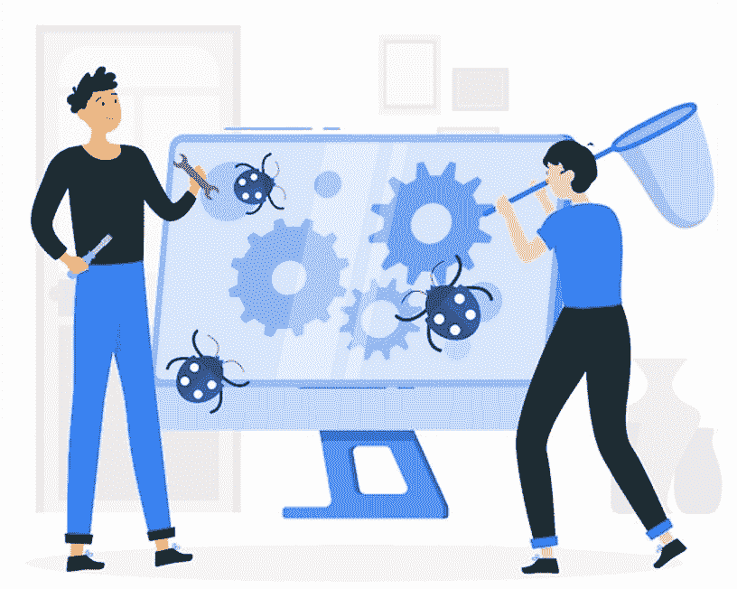
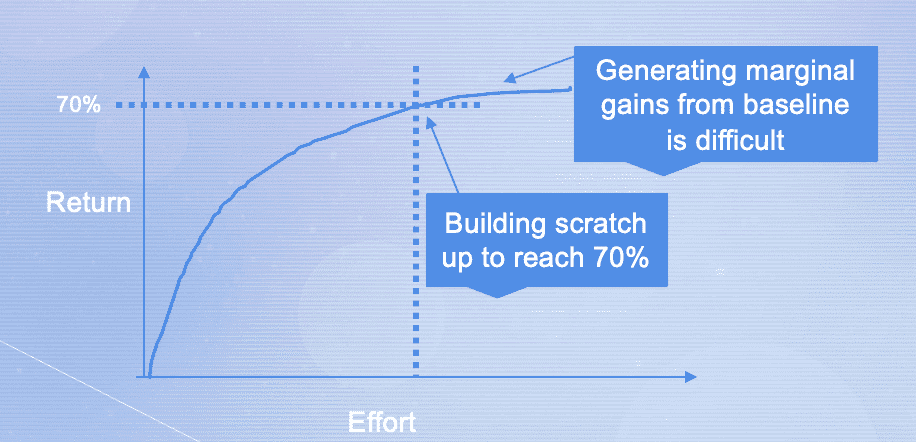
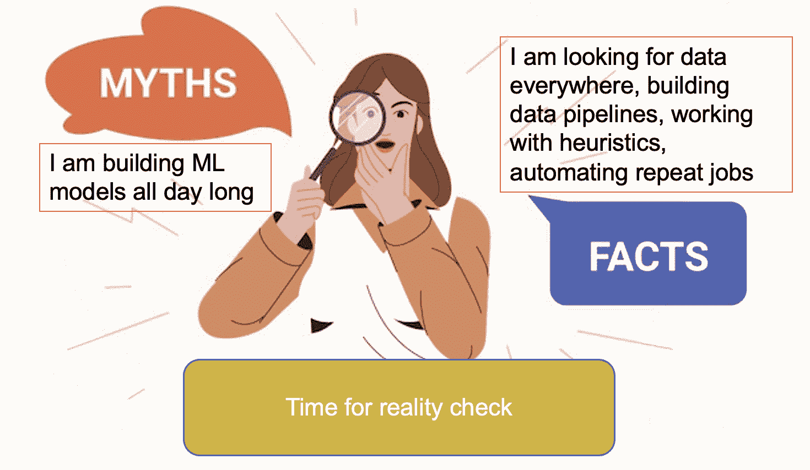

# 一种能让你成为数据科学英雄的错误

> 原文：[`www.kdnuggets.com/2022/03/bug-make-data-science-hero.html`](https://www.kdnuggets.com/2022/03/bug-make-data-science-hero.html)

# 一种有用的错误？！？ 

“Bug”（错误）通常不是一个积极的词，我们通常会避免它。问问软件开发者，他们会对错误感到害怕。

* * *

## 我们的前三名课程推荐

 1\. [Google 网络安全证书](https://www.kdnuggets.com/google-cybersecurity) - 快速进入网络安全职业

 2\. [Google 数据分析专业证书](https://www.kdnuggets.com/google-data-analytics) - 提升你的数据分析技能

 3\. [Google IT 支持专业证书](https://www.kdnuggets.com/google-itsupport) - 支持你所在组织的 IT

* * *

来源：Web vector created by storyset - [www.freepik.com](https://www.freepik.com)

但如果我告诉你，有一种错误可以带你进入数据科学的世界呢？是的，如果你有好奇心这种“错误”，那你就是数据科学职业的最佳人选。

如果你不接受现状，且对了解当前一切的做法有敏锐的兴趣，你可能会最终构建出比现在更好的东西。

不是每个人都有询问“什么、为什么和怎么做”的好奇心，而不担心被评判。我们都被这种假设所塑造，认为每个人都已经考虑过我在思考的内容。

> “如果我提出问题，却被贴上不合格、无能、缺乏经验和竞争力的标签怎么办？如果我没有足够的技能来提供合适的数据科学解决方案怎么办？”
> 
> 这些感觉有一个名字：冒名顶替综合症。

这种情况在每个领域都存在，但在数据科学界更为普遍。考虑到机器学习概念和算法的广度和深度，冒名顶替者有其自身存在的理由。

你被期望戴上魔术师的帽子，挥动魔杖，创造出始终忠实于开发者的模型，即那个赋予它生命的人。

但这从未发生过。与人们对数据科学家的想法相反，魔法（如果存在的话）来自于数据本身。你不能随便拿任何数据集开始构建模型。

说“天下没有免费的午餐”的人并不是在开玩笑。这是真的——每一个商业问题都是不同的，它的目标、数据、特征和生命周期也是如此。

回到我们最初关于好奇心的讨论，嗅探的数据科学家对这种虚假的感觉免疫，不会被“如果我不行怎么办”的思想困扰。

好奇的数据科学家会抓住每一个机会，通过解决给定的问题留下足迹。

# **这并不容易**

拥有天生的好奇心听起来像是一个容易培养的特质，但相信我，这并非如此。

像其他力量一样，若使用不当，会产生低效回报，同样在这里也适用。你不能忽视论坛中大多数人讨论的内容，也不能反复提问。

为了挑战现状，即当前解决方案的状态，你需要展示范围并执行差距分析。这被称为机会评估。

你不能仅仅靠直觉开始工作。首先，它需要有进一步改进的空间。

# **触手可及的成果**

从 0 到 70%的进展相对容易，通过从零开始并获得巨大的回报。但一旦生成了基线，在此基础上进行边际改进并不容易。

来源：作者

你可以列出若干具有潜在改进空间的事项，但这完全不在你控制之中。业务必须采纳你的建议，并决定哪个问题有更高的时间和资源回报率，可以被视作快速胜利。

由于你无法一次性处理所有业务问题，你需要与业务部门商讨优先级，确定哪些更能增值。

# **在承诺之前请注意**

数据科学的核心是发现业务问题并构建数据驱动的解决方案。首先，数据需要到位，并且必须有可学习的模式。

模式识别，[根据定义](https://en.wikipedia.org/wiki/Pattern_recognition)，包括利用机器学习，借助大数据的日益普及和新的计算能力。

请注意，一旦你加入，事情并非一成不变。你可能会发现自己在从事自动化工作，设计简单的启发式方法以获得早期业务收益，尽管没人会明确告诉你这是工作的一部分。

因此，准备好接受这样的事实：并非所有数据科学家都会一直从事所有‘优质’建模工作。

# **现实检查时间**

来源：背景矢量由 redgreystock 创建 - [www.freepik.com](https://www.freepik.com)

私下里说，他们负责所有与数据相关的事务，以实现业务目标。

一般来说，业务对使用哪种算法和如何解决问题并不特别关注。他们期望你理解他们的痛点，并利用数据来克服这些问题。你有责任向高管和利益相关者展示机器学习可以解决哪些问题，哪些仅是装饰。

提出问题以理解你的解决方案如何增值。识别并解释使用机器学习解决问题的利弊。

简而言之，如果你专注于提升业务数字的最终目标，那么所有使用的工具和技术都会成为你的盟友。

# **保持那份孩子般的好奇心**

儿童在提问时没有任何偏见——无论相关与否。尽管我们专业人士不能在公开场合提出不相关的问题，但谁知道什么是相关的，什么不是？如果你需要这些信息来交付解决方案——就问吧。数据科学是一个迭代过程，需要频繁地发现“为什么”。

没有一个人能够完全掌握所有知识并单独完成所有任务，因此需要强大的团队合作。如果大家能共同头脑风暴并识别行动项，旅程将变得更加轻松。

但你不能等待其他人与你达成共识，因此，你有责任保持好奇心，成为你数据科学解决方案的英雄。

**[Vidhi Chugh](https://vidhi-chugh.medium.com/)** 是一位获奖的 AI/ML 创新领导者和 AI 伦理学家。她在数据科学、产品和研究的交叉点工作，以提供业务价值和洞察。她是数据驱动科学的倡导者，并且在数据治理领域是领先的专家，致力于构建值得信赖的 AI 解决方案。

### 更多相关内容

+   [从零到英雄：使用 PyTorch 创建你的第一个机器学习模型](https://www.kdnuggets.com/from-zero-to-hero-create-your-first-ml-model-with-pytorch)

+   [9 种职业证书可以带你获得学位... 如果...](https://www.kdnuggets.com/9-professional-certificates-that-can-take-you-onto-a-degree-if-you-really-want-to)

+   [伪装直到成功：生成逼真的合成客户数据集](https://www.kdnuggets.com/2022/01/fake-realistic-synthetic-customer-datasets-projects.html)

+   [让你脱颖而出的不那么性感的 SQL 概念](https://www.kdnuggets.com/2022/02/not-so-sexy-sql-concepts-stand-out.html)

+   [可以帮助你解决现实世界问题的数据科学项目](https://www.kdnuggets.com/2022/11/data-science-projects-help-solve-real-world-problems.html)

+   [5 种方法使用 ChatGPT 的代码解释器进行数据科学](https://www.kdnuggets.com/2023/08/5-ways-chatgpt-code-interpreter-data-science.html)
