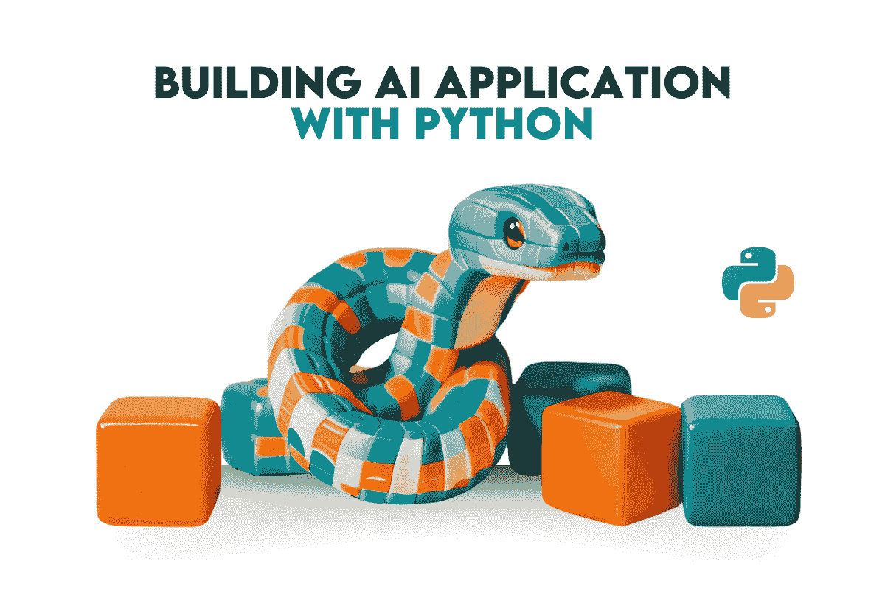
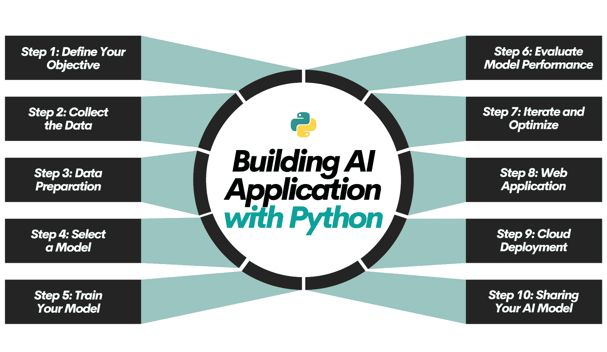

# 用 Python 构建 AI 应用的 10 个简单步骤

> 原文：[`www.kdnuggets.com/build-an-ai-application-with-python-in-10-easy-steps`](https://www.kdnuggets.com/build-an-ai-application-with-python-in-10-easy-steps)



机器学习之所以如此受欢迎，有其充分的理由。许多企业选择利用这一机会来创建产品。

* * *

## 我们的三大课程推荐

 1\. [谷歌网络安全证书](https://www.kdnuggets.com/google-cybersecurity) - 快速开启网络安全职业生涯。

 2\. [谷歌数据分析专业证书](https://www.kdnuggets.com/google-data-analytics) - 提升你的数据分析能力

 3\. [谷歌 IT 支持专业证书](https://www.kdnuggets.com/google-itsupport) - 支持你的组织 IT 部门

* * *

你必须遵循一些步骤，以使你的应用程序不同于普通的应用，并选择最适合你项目的选项。

本文将探讨创建成功的 AI 应用程序的基本步骤和选项，使用 Python 和其他工具。



# 步骤 1：定义目标

首先，定义你希望用 AI 模型解决的问题。这可以是预测客户行为，也可以是自动化某项日常任务。如果你难以找到一个创意，可以使用 ChatGPT 或 Bard，输入以下提示。

```py
Generate 5 ideas about AI Applications that I'll build with Python.
```

现在，让我们看看 ChatGPT 的回答。


# 步骤 2：收集数据

现在我们有了选项。下一步是收集数据。这一步包括从不同的仓库获取数据集或使用不同的 API 或网页抓取来寻找数据。如果你考虑使用干净且处理过的数据集，可以使用以下资源来收集数据集：

1.  **GitHub 仓库：** [它](https://github.com/)是一个开发者平台，数百万开发者在这里协作完成项目。

1.  **Kaggle 数据集：** 一个机器学习和数据科学的[网站](https://kaggle.com)，提供数据集、竞赛和学习资源。

1.  **UCL Irvine 数据集：** 这是一个用于机器学习研究的数据集集合。

1.  **谷歌数据集搜索：** 它是一个数据集搜索引擎，可以按关键词或位置搜索。这里是[链接](https://datasetsearch.research.google.com/)。

1.  **AWS 开放数据：** [这个](https://aws.amazon.com/opendata/)计划提供对 AWS 上开放数据的访问。

# 步骤 3：数据准备

现在你已经有了目标，数据也准备好了。是时候进行实际操作了。接下来的步骤是准备数据以应用你想要的模型。这个模型可以是机器学习模型或深度学习模型。无论是哪种，数据需要具备特定的特征：

1.  **清理**：如果你通过网络爬取或使用 API 收集数据，这一步会更加复杂。你应该删除重复项、无关条目、纠正类型、处理缺失值等，使用的方法可以包括填补或删除。[`www.stratascratch.com/blog/data-cleaning-101-avoid-these-5-traps-in-your-data/`](https://www.stratascratch.com/blog/data-cleaning-101-avoid-these-5-traps-in-your-data/?utm_source=blog&utm_medium=click&utm_campaign=kdn+python+ai+application)

1.  **正确格式化**：现在，为了应用你的模型，特征应该是一致和适当的。如果你有分类数据，它们需要被编码以应用机器学习。你的数值特征应该被缩放和标准化，以便获得更好的模型。

1.  **平衡**：机器学习需要迭代，这要求你采取一些步骤，比如[这个](https://towardsdatascience.com/how-to-balance-a-dataset-in-python-36dff9d12704#:~:text=A%20balanced%20dataset%20is%20a,class%20weight)。你的数据集应该是平衡的，这意味着你必须确保数据集不会偏向某一类，以确保你的预测不会有偏差。

1.  **特征工程**：有时，你需要调整特征以提高模型的性能。你可能会移除一些影响模型性能的特征，或者将它们组合起来以改善性能。[`www.linkedin.com/posts/stratascratch_feature-selection-for-machine-learning-in-activity-7082376269958418432-iZWb`](https://www.linkedin.com/posts/stratascratch_feature-selection-for-machine-learning-in-activity-7082376269958418432-iZWb)

1.  **拆分**：如果你对机器学习不熟悉，并且你的模型表现得特别好，要小心。在机器学习中，一些模型可能表现得过于完美，这可能表示过拟合问题。为了解决这个问题，一种方法是将数据拆分为训练集、测试集，有时甚至是验证集。

[`platform.stratascratch.com/technical/2246-overfitting-problem`](https://platform.stratascratch.com/technical/2246-overfitting-problem?utm_source=blog&utm_medium=click&utm_campaign=kdn+python+ai+application)

# 步骤 4: 选择模型。

好了，在这一步，一切都准备就绪。现在，你将应用哪个模型？你能猜出哪个模型最好吗？还是你应该考虑一下？当然，你应该有一个初步的建议，但你需要做的事情之一是测试不同的模型。

你可以从以下 Python 库中选择一个模型：

1.  **Scikit-learn:** 这对于初学者来说非常理想。你可以用最少的代码实现机器学习代码。这里是官方文档：[`scikit-learn.org/stable/`](https://scikit-learn.org/stable/)

1.  **Tensorflow**：Tensorflow 非常适合于扩展性和深度学习。它允许你开发复杂的模型。以下是官方文档：[`www.tensorflow.org/`](https://www.tensorflow.org/)

1.  **Keras**：它在 TensorFlow 之上运行，使深度学习变得更加简单。以下是官方文档：[`keras.io/`](https://keras.io/)

1.  **PyTorch**：它通常更适合用于研究和开发，因为它可以轻松地动态修改模型。以下是官方文档：[`pytorch.org/`](https://pytorch.org/)

# 步骤 5：训练你的模型

现在是训练你的模型的时候了。这涉及将数据输入模型，从而使我们能够从模式中学习，并随后调整其参数。这一步骤非常直接。

# 步骤 6：评估模型性能

你已经训练了你的模型，但如何判断它是好是坏呢？当然，有多种方法来评估不同的模型。让我们探索一系列模型评估指标。

1.  **回归** - MAE 衡量的是预测值和实际值之间的误差的平均大小，而不考虑其方向。此外，还可以使用 R2 分数。

1.  **分类** - 精确度、召回率和 F1 分数用于评估分类模型的性能。

1.  **聚类：** 评估指标在这里不那么直接，因为我们通常需要真实标签进行比较。然而，像轮廓系数、戴维斯-鲍丁指数和卡林斯基-哈拉巴斯指数等指标被常用来评估。

# 步骤 7：迭代和优化

根据第 6 步收集的结果，你可以采取多种措施。这些措施可能会影响你模型的性能。让我们来看看。

1.  **调整超参数：** 调整模型的超参数可以显著改变其性能。它控制着模型的学习过程和结构。

1.  **选择不同的算法**：有时候，可能会有比你初始模型更好的选择。这就是为什么即使你已经进行到一半，探索不同的算法可能也是一个更好的主意。

1.  **增加数据量**：更多的数据通常能导致更好的模型。因此，如果你需要提高模型的性能并且有数据收集的预算，增加数据量将是一个明智的选择。

1.  **特征工程：** 有时候，解决问题的方案可能就在外面，等待你去发现。特征工程可能是最具成本效益的解决方案。

# 步骤 8：网络应用

你的模型已经准备好了，但它需要一个接口。目前它在 Jupyter Notebook 或 PyCharm 上，但缺少一个用户友好的前端。为此，你需要开发一个网络应用程序，这里有几个选项。

1.  **Django**：它功能全面且可扩展，但对于初学者来说不够友好。

1.  **Flask**：Flask 是一个适合初学者的微型网络框架。

1.  **FastAPI**：这是一种现代且快速的构建网络应用的方法。

# 步骤 9：云部署

你的模型可能是有史以来开发的最佳模型。然而，如果它仅停留在你的本地驱动器上，你无法确定它是否有效。与世界分享你的模型并上线将是获取反馈、观察实际影响以及更高效地发展的好选择。

为了实现这一点，以下是你的选项。

1. **AWS**：AWS 提供更大规模的应用程序，并且为每个操作提供多种选项。例如，在数据库方面，他们提供了可以选择和扩展的选项。

1.  **Heroku**：Heroku 是一个平台即服务（PaaS），允许开发者在云端完全构建、运行和操作应用程序。

1.  **Pythonanywhere.com**：Pythonanywhere 是一个针对 Python 特定应用的云服务，非常适合初学者。

# 第 10 步：分享你的 AI 模型

分享你的 AI 模型的方式有很多，但如果你喜欢写作，我们来讨论一种著名且简单的方法。

1.  内容营销：内容营销包括创建有价值的内容，如博客文章或视频，以展示你的 AI 模型的能力并吸引潜在用户。要了解更多关于有效内容营销策略的信息，请查看 [此处](https://www.simplilearn.com/free-content-marketing-training-course-skillup)。

1.  社区参与：像 [Reddit](https://www.reddit.com/) 这样的在线社区允许你分享关于你的 AI 模型的见解，建立信誉，并与潜在用户建立联系。

1.  合作与协作：与该领域的其他专业人士合作可以帮助扩大你的 AI 模型的影响力并进入新市场。如果你在 [Medium](https://medium.com/) 上撰写关于你的应用程序的文章，可以尝试与那些在相同领域撰写文章的作者进行合作。

1.  付费广告和推广：付费广告渠道，如 [Google Ads](https://ads.google.com/) 或其他社交媒体广告，可以帮助增加可见性并吸引用户关注你的 AI 模型。

# 结论

完成上述所有十个步骤后，是时候保持一致性并维护你开发的应用程序了。

在这篇文章中，我们介绍了构建和部署 AI 应用程序的十个终极步骤。

[](https://twitter.com/StrataScratch) **[Nate Rosidi](https://twitter.com/StrataScratch)** 是一名数据科学家和产品策略专家。他还是一名兼职教授，教授分析学，并且是 StrataScratch 的创始人，这个平台帮助数据科学家准备面试，提供来自顶级公司的真实面试问题。Nate 关注职业市场的最新趋势，提供面试建议，分享数据科学项目，并涵盖 SQL 相关内容。

### 更多相关主题

+   [用 Python 轻松构建命令行应用的 7 个步骤](https://www.kdnuggets.com/build-a-command-line-app-with-python-in-7-easy-steps)

+   [用 Docker 轻松容器化 Python 应用的 5 个步骤](https://www.kdnuggets.com/containerize-python-apps-with-docker-in-5-easy-steps)

+   [创建一个用 Python 从音频中提取主题的 Web 应用程序](https://www.kdnuggets.com/2023/01/creating-web-application-extract-topics-audio-python.html)

+   [使用 Google Earth 构建 Python 中的地理空间应用程序…](https://www.kdnuggets.com/2022/03/building-geospatial-application-python-google-earth-engine-greppo.html)

+   [数据科学的基本数学：特征向量及其在 PCA 中的应用](https://www.kdnuggets.com/2022/06/essential-math-data-science-eigenvectors-application-pca.html)

+   [本周提升搜索应用的 8 种方法](https://www.kdnuggets.com/2022/09/corise-8-ways-improve-search-application-week.html)
