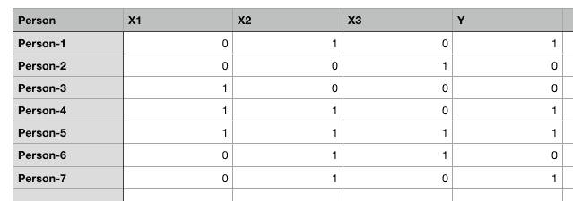
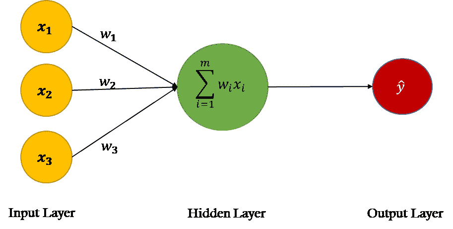
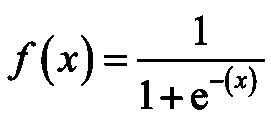
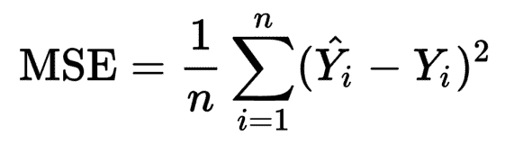
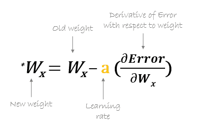
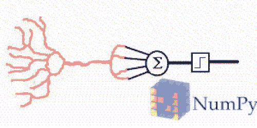

# 从头开始构建人工神经网络：第一部分

> 原文：[`www.kdnuggets.com/2019/11/build-artificial-neural-network-scratch-part-1.html`](https://www.kdnuggets.com/2019/11/build-artificial-neural-network-scratch-part-1.html)

评论

在我之前的文章[**人工神经网络（ANN）简介**](https://towardsdatascience.com/introduction-to-artificial-neural-networks-ann-1aea15775ef9)**中，**我们学习了与 ANN 相关的各种概念，因此我建议在继续之前先阅读它，因为在这里我将只关注实现部分。在这个系列文章中，我们将仅使用[numpy](https://www.guru99.com/numpy-tutorial.html) Python 库从头开始构建 ANN。

在第一部分中，我们将构建一个相当简单的 ANN，只包含 1 个输入层和 1 个输出层，没有隐藏层。

* * *

## 我们的前三个课程推荐

 1\. [谷歌网络安全证书](https://www.kdnuggets.com/google-cybersecurity) - 快速进入网络安全职业生涯

 2\. [谷歌数据分析专业证书](https://www.kdnuggets.com/google-data-analytics) - 提升你的数据分析技能

 3\. [谷歌 IT 支持专业证书](https://www.kdnuggets.com/google-itsupport) - 支持你的组织进行 IT 管理

* * *

在第二部分中，我们将构建一个具有 1 个输入层、1 个隐藏层和 1 个输出层的 ANN。

**为什么从头开始？**

好吧，市面上有许多深度学习库（[Keras](https://keras.io/)、[TensorFlow](https://www.tensorflow.org/)、[PyTorch](https://pytorch.org/)等），可以用几行代码创建一个神经网络。然而，如果你真的想深入理解神经网络的工作原理，我建议你学习如何使用 Python 或其他编程语言从头开始编写代码。让我们开始吧。

我们来创建一些随机数据集：



为了简化起见，使用二进制值的随机数据集

在上面的表格中，我们有五列：`Person, X1, X2, X3 和 Y`。其中 1 表示真，0 表示假。我们的任务是创建一个能够根据`X1, X2 和 X3`的值预测`Y`值的人工神经网络。

我们将创建一个只有一个输入层和一个输出层，没有隐藏层的人工神经网络。在开始编码之前，让我们首先看看我们的神经网络在理论上是如何运行的：

**人工神经网络理论**

人工神经网络是一种监督学习算法，这意味着我们提供给它包含自变量的输入数据和包含因变量的输出数据。例如，在我们的例子中，自变量是`X1, X2 和 X3`。因变量是`Y`。

一开始，人工神经网络（ANN）会做一些随机预测，这些预测与正确输出进行比较，计算误差（预测值与实际值之间的差异）。找到实际值与传播值之间差异的函数称为成本函数。这里的成本指的是误差。我们的目标是最小化成本函数。训练神经网络基本上就是指最小化成本函数。我们将看到如何执行这一任务。

神经网络分为两个阶段执行：**前向传播**阶段和**反向传播**阶段。让我们详细讨论这两个步骤。

### **前向传播**



来源：[单层神经网络，也称为感知器](https://towardsdatascience.com/single-neuron-training-3fc7f84d67d)

在 ANN 的前向传播阶段，基于输入节点的值和权重进行预测。如果你查看上图中的神经网络，你会看到数据集中有三个特征：X1、X2 和 X3，因此在第一层，也称为输入层，有三个节点。

神经网络的权重基本上是我们必须调整的参数，以便能够正确预测输出。目前只需记住，对于每个输入特征，我们有一个权重。

以下是 ANN 前向传播阶段执行的步骤：

**步骤 1：计算输入与权重之间的点积**

输入层的节点通过三个权重参数与输出层相连。在输出层，输入节点中的值与其对应的权重相乘后相加。最后，将偏置项`b`添加到总和中。

> ***我们为什么需要偏置项？***

假设我们有一个输入值为 (0,0,0) 的人，输入节点和权重的乘积之和将为零。在这种情况下，无论我们如何训练算法，输出将始终为零。因此，为了能够进行预测，即使我们对该人的信息没有任何非零值，我们也需要一个偏置项。偏置项对于构建一个稳健的神经网络是必要的。

数学上，点积的总和：

`X.W=x1.w1 + x2.w2 + x3.w3 + b`

**步骤 2：将点积的总和 (X.W) 通过激活函数**

点积 XW 可以产生任何一组值。然而，在我们的输出中，我们有 1 和 0 的形式。我们希望输出也以相同格式呈现。为此，我们需要一个[A[ctivation Function](https://en.wikipedia.org/wiki/Activation_function)]，它将输入值限制在 0 和 1 之间。所以我们当然会选择 Sigmoid 激活函数。


[Sigmoid 激活函数](https://towardsdatascience.com/activation-functions-neural-networks-1cbd9f8d91d6)

当输入为 0 时，sigmoid 函数返回 0.5。如果输入是一个大的正数，它返回接近 1 的值。在负输入的情况下，sigmoid 函数输出接近零的值。

因此，它特别用于需要**预测概率**作为输出的模型。由于概率值仅在**0 和 1**之间，sigmoid 是解决我们问题的正确选择。

在上图中，`z` 是点积 X.W 的总和。

从数学上讲，sigmoid 激活函数是：



[Sigmoid 激活函数](https://analyticsindiamag.com/most-common-activation-functions-in-neural-networks-and-rationale-behind-it/)

让我们总结一下到目前为止的工作。首先，我们需要计算输入特征（自变量矩阵）与权重的点积。接下来，将点积的总和通过激活函数。**激活函数的结果基本上是输入特征的预测输出。**

### **反向传播**

在开始时，在进行任何训练之前，神经网络会做出随机的预测，这些预测显然是错误的。

我们开始时让网络进行随机输出预测。然后，我们将神经网络的预测输出与实际输出进行比较。接下来，我们以使预测输出更接近实际输出的方式更新权重和偏置。在这个阶段，我们训练我们的算法。让我们看看反向传播阶段涉及的步骤。

**第 1 步：计算成本**

此阶段的第一步是计算预测的成本。预测成本可以通过计算预测输出值和实际输出值之间的差异来得到。如果差异很大，则成本也会很高。

我们将使用[均方误差](https://en.wikipedia.org/wiki/Mean_squared_error)或 MSE 成本函数。成本函数是一个计算给定输出预测成本的函数。



[均方误差](https://stackoverflow.com/questions/44038581/mse-cost-function-for-training-neural-network)

*这里，*`*Yi 是实际输出值*`* 和 *`*Ŷi 是预测输出值*`* 以及 *`*n 是观察数量。*`

**第 2 步：最小化成本**

我们的终极目标是调整神经网络的权重，以使成本达到最低。如果你仔细观察，你会发现我们只能控制权重和偏置。其他一切都超出了我们的控制范围。我们不能控制输入，不能控制点积，也不能操控 sigmoid 函数。

为了最小化成本，我们需要找到使成本函数返回最小值的权重和偏置值。成本越小，我们的预测就越准确。

要找到一个函数的极小值，我们可以使用 [梯度下降](https://en.wikipedia.org/wiki/Optimization_problem) 算法。梯度下降可以用数学公式表示为：



[使用梯度下降更新权重](http://hmkcode.com/ai/backpropagation-step-by-step/)

**????错误** 是成本函数。上述方程告诉我们要计算成本函数相对于每个权重和偏置的偏导数，并将结果从现有权重中减去，以获得新的权重。

函数的导数给我们在任何给定点的斜率。为了找到成本是否增加或减少，给定权重值，我们可以在该特定权重值处找到函数的导数。如果成本随着权重的增加而增加，导数将返回一个正值，然后从现有值中减去。

另一方面，如果成本随着权重的增加而减少，则会返回一个负值，该负值会被添加到现有的权重值中，因为负数加负数是正数。

在上述方程中 `**a**` 被称为学习率，它与导数相乘。学习率决定了我们的算法学习的速度。

我们需要对所有的权重和偏置重复执行梯度下降，直到成本最小化，并且成本函数返回的值接近零。

现在是时候实现我们到目前为止学习的内容了。我们将在 Python 中创建一个简单的神经网络，包含一个输入层和一个输出层。

### 使用 numpy 实现人工神经网络



图片来源：[hackernoon.com](https://hackernoon.com/building-a-neural-network-only-using-numpy-7ba75da60ec0)

**要遵循的步骤：

1\. 定义自变量和因变量

2\. 定义超参数

3\. 定义激活函数及其导数

4\. 训练模型

5\. 进行预测**

**步骤-1：首先创建我们的自变量或输入特征集以及对应的因变量或标签。**

```py
#Independent variables
input_set = np.array([[0,1,0],
                      [0,0,1],
                      [1,0,0],
                      [1,1,0],
                      [1,1,1],
                      [0,1,1],
                      [0,1,0]])#Dependent variable
labels = np.array([[1,
                    0,
                    0,
                    1,
                    1,
                    0,
                    1]])
labels = labels.reshape(7,1) #to convert labels to vector
```

我们的输入集包含七条记录。类似地，我们还创建了一个 `labels` 集，其中包含输入集中每条记录的对应标签。这些标签是我们希望 ANN 预测的值。

**步骤-2：定义超参数**

我们将使用 `random.seed` 函数，以便每次执行下面的代码时都能获得相同的随机值。

接下来，我们用正态分布的随机数初始化权重。由于输入中有三个特征，我们有一个包含三个权重的向量。然后，我们用另一个随机数初始化偏置值。最后，我们将学习率设置为 0.05。

```py
np.random.seed(42)
weights = np.random.rand(3,1)
bias = np.random.rand(1)
lr = 0.05 #learning rate
```

**步骤-3：定义激活函数及其导数：我们的激活函数是 sigmoid 函数。**

```py
def sigmoid(x):
    return 1/(1+np.exp(-x))
```

现在定义一个计算 sigmoid 函数导数的函数。

```py
def sigmoid_derivative(x):
    return sigmoid(x)*(1-sigmoid(x))
```

**步骤-4：是时候训练我们的 ANN 模型了**

我们将从定义 epoch 数量开始。一个 epoch 是我们希望在数据集上训练算法的次数。我们将对数据训练 25,000 次，因此我们的 epoch 将是 25000。你可以尝试不同的数量以进一步降低成本。

```py
for epoch in range(25000):
    inputs = input_set
    XW = np.dot(inputs, weights)+ bias
    z = sigmoid(XW)
    error = z - labels
    print(error.sum())
    dcost = error
    dpred = sigmoid_derivative(z)
    z_del = dcost * dpred
    inputs = input_set.T
    weights = weights - lr*np.dot(inputs, z_del)

    for num in z_del:
        bias = bias - lr*num
```

让我们一步一步地理解每一个步骤，然后我们将进入最后一步：做预测。

我们将从输入 `input_set` 中存储的值保存在 `inputs` 变量中，以确保 `input_set` 的值在每次迭代中保持不变，所有的修改都必须应用到 `inputs` 变量中。

```py
inputs = input_set
```

接下来，我们找到输入和权重的点积并加上偏置。 (**前向传播阶段的步骤-1)**

```py
XW = np.dot(inputs, weights)+ bias
```

接下来，我们将点积通过 sigmoid 激活函数。 (**前向传播阶段的步骤-2)**

```py
z = sigmoid(XW)
```

这完成了我们算法的前向传播部分，现在是开始反向传播的时候了。

变量`z`包含了预测输出。反向传播的第一步是找到误差。

```py
error = z - labels
print(error.sum())
```

我们知道我们的成本函数是：


我们需要对这个函数进行关于每个权重的导数，这可以通过使用 [链式法则](https://en.wikipedia.org/wiki/Chain_rule) 来轻松完成。我会跳过推导部分，但如果有人感兴趣，请告诉我，我会在评论区发布。

所以我们对任何权重的成本函数的最终导数是：

```py
slope = input x dcost x dpred
```

现在，斜率可以简化为：

```py
dcost = error
dpred = sigmoid_derivative(z)
z_del = dcost * dpred
inputs = input_set.T
weights = weight-lr*np.dot(inputs, z_del)
```

我们有 `z_del` 变量，它包含 `dcost` 和 `dpred` 的乘积。我们不是对每条记录进行循环，将输入与对应的 `z_del` 相乘，而是取输入特征矩阵的转置，并将其与 `z_del` 相乘。

最后，我们将学习率变量 `lr` 与导数相乘，以提高学习速度。

除了更新权重，我们还需要更新偏置项。

```py
for num in z_del:
        bias = bias - lr*num
```

一旦循环开始，你会看到总误差开始减少，并且在训练结束时，误差会剩下一个非常小的值。

```py
-0.001415035616137969
-0.0014150128584959256
-0.0014149901015685952
-0.0014149673453557714
-0.0014149445898578358
-0.00141492183507419
-0.0014148990810050437
-0.0014148763276499686
-0.0014148535750089977
-0.0014148308230825385
-0.0014148080718707524
-0.0014147853213728624
-0.0014147625715897338
-0.0014147398225201734
-0.0014147170741648386
-0.001414694326523502
-0.001414671579597255
-0.0014146488333842064
-0.0014146260878853782
-0.0014146033431002465
-0.001414580599029179
-0.0014145578556723406
-0.0014145351130293877
-0.0014145123710998
-0.0014144896298846701
-0.0014144668893831067
-0.001414444149595611
-0.0014144214105213174
-0.0014143986721605849
-0.0014143759345140276
-0.0014143531975805163
-0.001414330461361444
-0.0014143077258557749
-0.0014142849910631708
-0.00141426225698401
-0.0014142395236186895
-0.0014142167909661323
-0.001414194059027955
-0.001414171327803089
-0.001414148597290995
-0.0014141258674925626
-0.0014141031384067547
-0.0014140804100348098
-0.0014140576823759854
-0.0014140349554301636
-0.0014140122291978665
-0.001413989503678362
-0.001413966778871751
-0.001413944054778446
-0.0014139213313983257
-0.0014138986087308195
-0.0014138758867765552
-0.0014138531655347973
-0.001413830445006264
-0.0014138077251906606
-0.001413785006087985
-0.0014137622876977014
-0.0014137395700206355
-0.0014137168530558228
-0.0014136941368045382
-0.0014136714212651114
-0.0014136487064390219
-0.0014136259923249635
-0.001413603278923519
-0.0014135805662344007
-0.0014135578542581566
-0.0014135351429944293
-0.0014135124324428719
-0.0014134897226037203
-0.0014134670134771238
-0.0014134443050626295
-0.0014134215973605428
-0.0014133988903706311
```

**步骤-5：做预测**

现在是做一些预测的时候了。让我们试试 [1,0,0]

```py
single_pt = np.array([1,0,0])
result = sigmoid(np.dot(single_pt, weights) + bias)
print(result)
```

`输出 : [0.01031463]`

如你所见，输出值更接近 0 而不是 1，因此它被分类为 0。

让我们再试一次 [0,1,0]

```py
single_pt = np.array([0,1,0])
result = sigmoid(np.dot(single_pt, weights) + bias)
print(result)
```

`输出 : [0.99440207]`

如你所见，输出值更接近 1 而不是 0，因此它被分类为 1。

### 结论

在这篇文章中，我们学习了如何使用 numpy python 库从零开始创建一个非常简单的人工神经网络，它包含一个输入层和一个输出层。这个人工神经网络能够对线性可分的数据进行分类。

如果我们有非线性分隔的数据，我们的人工神经网络将无法对这种数据进行分类。这是我们将在本系列文章的第二部分中构建的内容。

好了，就这些。我希望你们喜欢阅读这篇文章。请在评论区分享你的想法或疑问。

如有任何问题，可以通过[LinkedIn](https://www.linkedin.com/in/nagesh-singh-chauhan-6936bb13b/?source=post_page---------------------------)联系我。


[图片来源](https://gifer.com/en/7DFc)

感谢阅读!!!

**简介：[Nagesh Singh Chauhan](https://www.linkedin.com/in/nagesh-singh-chauhan-6936bb13b/)** 是 CirrusLabs 的大数据开发者。他在电信、分析、销售和数据科学等多个领域拥有超过 4 年的工作经验，专注于各种大数据组件。

[原文](https://towardsdatascience.com/build-an-artificial-neural-network-ann-from-scratch-part-1-a21988497962)。经许可转载。

**相关内容：**

+   人工神经网络简介

+   支持向量机友好介绍

+   使用 K-Nearest Neighbors 分类心脏病

### 了解更多相关主题

+   [如何从零开始构建和训练一个变换器模型](https://www.kdnuggets.com/how-to-build-and-train-a-transformer-model-from-scratch-with-hugging-face-transformers)

+   [通过构建 15 个神经网络项目来学习深度学习（2022）](https://www.kdnuggets.com/2022/01/15-neural-network-projects-build-2022.html)

+   [使用 AIMET 进行神经网络优化](https://www.kdnuggets.com/2022/04/qualcomm-neural-network-optimization-aimet.html)

+   [使用 TensorFlow 和 Keras 构建和训练你的第一个神经网络](https://www.kdnuggets.com/2023/05/building-training-first-neural-network-tensorflow-keras.html)

+   [使用 PyTorch 构建卷积神经网络](https://www.kdnuggets.com/building-a-convolutional-neural-network-with-pytorch)

+   [神经网络预测中排列的重要性](https://www.kdnuggets.com/2022/12/importance-permutation-neural-network-predictions.html)
