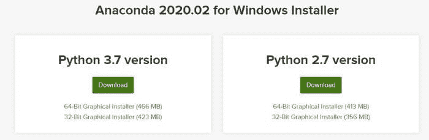
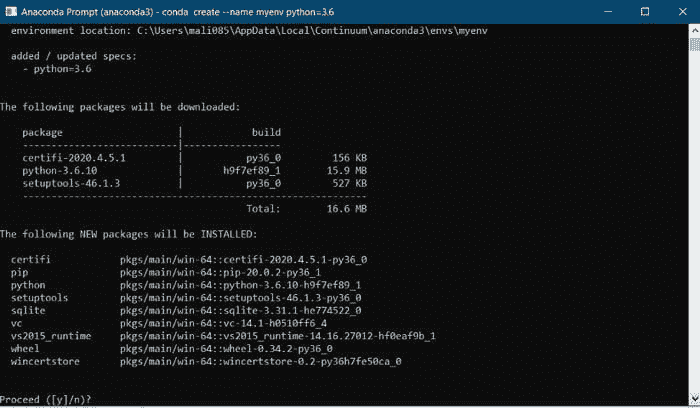
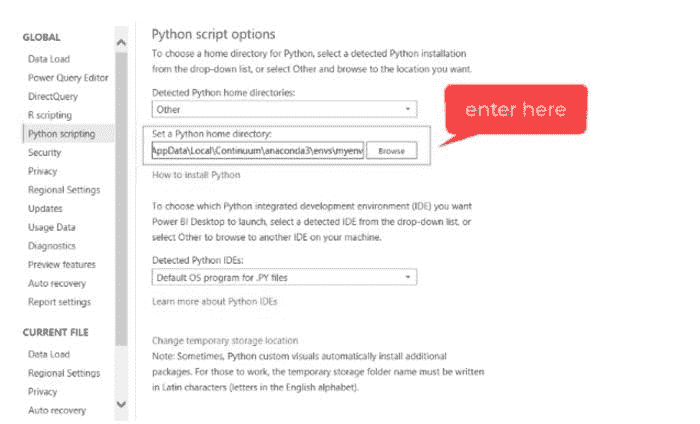
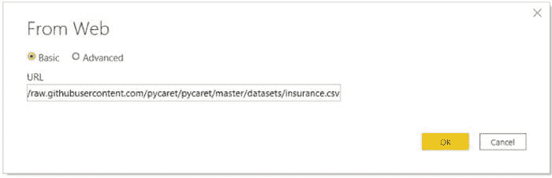
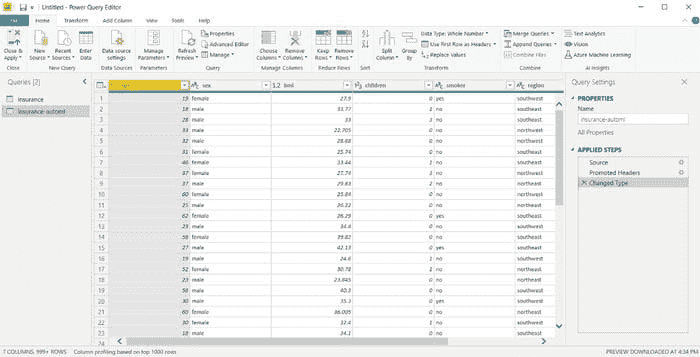
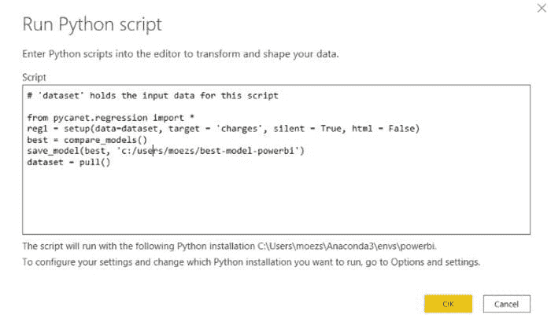
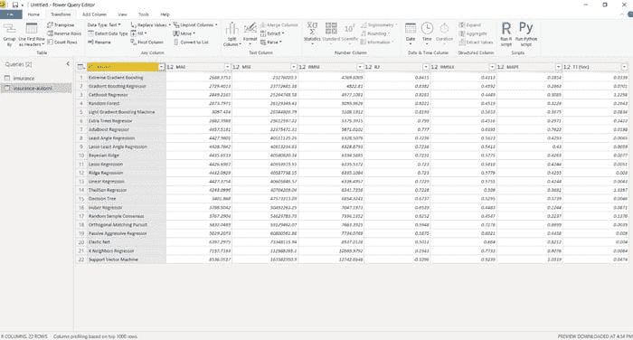
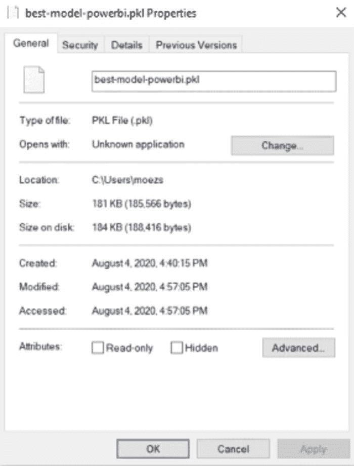
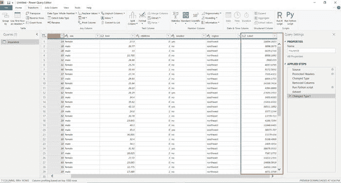

# 使用 PyCaret 2.0 构建你自己的 AutoML

> 原文：[`www.kdnuggets.com/2020/08/build-automl-pycaret.html`](https://www.kdnuggets.com/2020/08/build-automl-pycaret.html)

评论

**由 [Moez Ali](https://www.linkedin.com/in/profile-moez/)，PyCaret 的创始人和作者**


PyCaret — 一个开源的低代码 Python 机器学习库

### **PyCaret 2.0**

上周我们宣布了 [PyCaret 2.0](https://towardsdatascience.com/announcing-pycaret-2-0-39c11014540e)，这是一个开源的**低代码** Python 机器学习库，自动化机器学习工作流。它是一个端到端的机器学习和模型管理工具，加快了机器学习实验周期，并帮助数据科学家提高效率和生产力。

在这篇文章中，我们展示了一个**逐步教程**，讲解如何在 [Power BI](https://powerbi.microsoft.com/en-us/) 中使用 PyCaret 构建自动化机器学习解决方案，从而让数据科学家和分析师可以在他们的仪表板上添加机器学习层，而无需额外的许可或软件成本。PyCaret 是一个开源的**免费使用**的 Python 库，提供了多种在 Power BI 中工作的功能。

在本文结束时，你将学会如何在 Power BI 中实现以下内容：

+   设置 Python conda 环境并安装 pycaret==2.0。

+   将新创建的 conda 环境与 Power BI 连接起来。

+   在 Power BI 中构建你的第一个 AutoML 解决方案，并在仪表板上展示性能指标。

+   在 Power BI 中生产化/部署你的 AutoML 解决方案。

### Microsoft Power BI

Power BI 是一个商业分析解决方案，让你能够可视化数据并在组织内部共享见解，或将其嵌入到应用程序或网站中。在本教程中，我们将通过将 PyCaret 库导入 Power BI 来使用 [Power BI Desktop](https://powerbi.microsoft.com/en-us/downloads/) 进行机器学习。

### 什么是自动化机器学习？

自动化机器学习（AutoML）是自动化机器学习中耗时的迭代任务的过程。它允许数据科学家和分析师高效地构建机器学习模型，同时保持模型质量。任何 AutoML 解决方案的最终目标是根据某些性能标准确定最佳模型。

传统的机器学习模型开发过程资源消耗大，需要大量领域知识和时间来生成和比较多个模型。使用自动化机器学习，你可以更轻松、高效地加快获得生产就绪的机器学习模型的时间。

### **PyCaret 是如何工作的？**

PyCaret 是一个用于监督学习和无监督学习的工作流自动化工具。它分为六个模块，每个模块都有一组函数，用于执行特定操作。每个函数接收输入并返回输出，在大多数情况下是一个训练好的机器学习模型。第二版发布时可用的模块有：

+   [分类](https://www.pycaret.org/classification)

+   [回归](https://www.pycaret.org/regression)

+   [聚类](https://www.pycaret.org/clustering)

+   [异常检测](https://www.pycaret.org/anomaly-detection)

+   [自然语言处理](https://www.pycaret.org/nlp)

+   [关联规则挖掘](https://www.pycaret.org/association-rules)

PyCaret 中的所有模块支持数据准备（超过 25 种基本预处理技术，配有大量未训练的模型以及对自定义模型的支持，自动超参数调优，模型分析和可解释性，自动模型选择，实验记录和简单的云部署选项）。


https://www.pycaret.org/guide

要了解更多关于 PyCaret 的信息，[点击这里](https://towardsdatascience.com/announcing-pycaret-2-0-39c11014540e) 阅读我们的官方发布公告。

如果你想开始学习 Python，[点击这里](https://github.com/pycaret/pycaret/tree/master/examples) 查看示例笔记本的图库。

> “PyCaret 通过提供免费的开源低代码机器学习解决方案，正在推动机器学习和高级分析的普及，适用于业务分析师、领域专家、普通数据科学家以及经验丰富的数据科学家。”

### 开始之前

如果你是第一次使用 Python，安装 Anaconda Distribution 是开始的最简单方式。 [点击这里](https://www.anaconda.com/distribution/) 下载包含 Python 3.7 或更高版本的 Anaconda Distribution。



[`www.anaconda.com/products/individual`](https://www.anaconda.com/products/individual)

### 设置环境

在我们开始使用 PyCaret 在 Power BI 中的机器学习功能之前，需要创建一个虚拟环境并安装 pycaret。这是一个三步过程：

[✅](https://fsymbols.com/signs/tick/) **步骤 1 — 创建 anaconda 环境**

从开始菜单中打开 **Anaconda Prompt** 并执行以下代码：

```py
conda create --name **myenv** python=3.7
```



Anaconda Prompt — 创建环境

[✅](https://fsymbols.com/signs/tick/) **步骤 2 — 安装 PyCaret**

在 Anaconda Prompt 中执行以下代码：

```py
pip install **pycaret==2.0**
```

安装可能需要 15–20 分钟。如果你遇到安装问题，请查看我们的 [GitHub](https://www.github.com/pycaret/pycaret) 页面以获取已知问题和解决方案。

[✅](https://fsymbols.com/signs/tick/)**步骤 3 — 在 Power BI 中设置 Python 目录**

创建的虚拟环境必须与 Power BI 关联。这可以通过 Power BI Desktop 中的全局设置完成（文件 → 选项 → 全局 → Python 脚本）。Anaconda 环境默认安装在：

`C:\Users\***username***\AppData\Local\Continuum\anaconda3\envs\myenv`



文件 → 选项 → 全局 → Python 脚本

### **???? 开始吧**

### 设定业务背景

一家保险公司希望通过更好地预测患者费用来改善现金流预测，使用住院时的基本人口统计数据和患者健康风险指标。


*(*[*数据源*](https://www.kaggle.com/mirichoi0218/insurance#insurance.csv)*)*

### 目标

训练和选择最佳性能的回归模型，该模型根据数据集中其他变量（即年龄、性别、BMI、子女数、吸烟者和地区）预测患者费用。

### ???? 步骤 1 — 加载数据集

你可以直接从我们的 GitHub 上加载数据集，方法是：Power BI Desktop → 获取数据 → Web

数据集链接：[`raw.githubusercontent.com/pycaret/pycaret/master/datasets/insurance.csv`](https://raw.githubusercontent.com/pycaret/pycaret/master/datasets/insurance.csv)



Power BI Desktop → 获取数据 → Web

在 Power Query 中创建一个重复的数据集：



Power Query → 创建一个重复的数据集

### ???? 步骤 2— 运行 AutoML 作为 Python 脚本

在 Power Query 中运行以下代码（转换 → 运行 Python 脚本）：

```py
**# import regression module**
from pycaret.regression import ***# init setup**
reg1 = setup(data=dataset, target = 'charges', silent = True, html = False)**# compare models**
best_model = compare_models()**# finalize best model** best = finalize_model(best_model)**# save best model**
save_model(best, 'c:/users/moezs/best-model-power')**# return the performance metrics df** dataset = pull()
```



Power Query 中的脚本

前两行代码用于导入相关模块并初始化设置函数。设置函数执行机器学习中所需的几个重要步骤，例如清理缺失值（如果有）、将数据拆分为训练集和测试集、设置交叉验证策略、定义指标、执行特定算法的转换等。

训练多个模型、比较和评估性能指标的魔法函数是**compare_models**。它根据可以在 `compare_models` 中定义的‘**sort**’参数返回最佳模型。默认情况下，它对回归用例使用‘R2’，对分类用例使用‘Accuracy’。

剩下的几行代码用于最终确定通过 `compare_models` 返回的最佳模型，并将其保存为本地目录中的 pickle 文件。最后一行返回包含训练模型及其性能指标详细信息的数据框。

输出：



Python 脚本的输出

仅用几行代码我们就训练了超过 20 个模型，表格展示了基于 10 折交叉验证的性能指标。

表现最佳的模型**梯度提升回归器**将与整个转换管道一起作为 pickle 文件保存在你的本地目录中。此文件稍后可以用来对新的数据集生成预测（见下方步骤 3）。



转换管道和模型保存为 pickle 文件

PyCaret 基于模块化自动化的理念。因此，如果你有更多的资源和时间用于训练，你可以扩展脚本以进行超参数调整、集成和其他可用建模技术。请参见以下示例：

```py
**# import regression module**
from pycaret.regression import ***# init setup**
reg1 = setup(data=dataset, target = 'charges', silent = True, html = False)**# compare models**
top5 = compare_models(n_select = 5)
results = pull()**# tune top5 models** tuned_top5 = [tune_model(i) for i in top5]**# select best model** best = automl()**# save best model**
save_model(best, 'c:/users/moezs/best-model-power')**# return the performance metrics df** dataset = results
```

我们现在返回了前 5 个模型，而不是仅返回表现最好的一个模型。然后，我们创建了一个列表推导（循环）来调整前候选模型的超参数，最后**automl 函数**选择了表现最好的单一模型，该模型然后被保存为 pickle 文件（注意，我们这次没有使用**finalize_model**，因为 automl 函数返回的是最终模型）。

### **示例仪表板**

示例仪表板已创建。PBIX 文件[已上传到这里](https://github.com/pycaret/pycaret-powerbi-automl)。


使用 PyCaret AutoML 结果创建的仪表板

### ???? 步骤 3 — 部署模型以生成预测

一旦我们将最终模型保存为 pickle 文件，我们可以使用它对新的数据集进行费用预测。

### **加载新数据集**

为了演示目的，我们将再次加载相同的数据集并从数据集中删除‘charges’列。请在 Power Query 中执行以下 Python 脚本以获取预测：

```py
**# load functions from regression module**
from pycaret.regression import load_model, predict_model**# load model in a variable** model = load_model(‘c:/users/moezs/best-model-powerbi’)**# predict charges** dataset = predict_model(model, data=dataset)
```

输出：



`predict_model` 函数在 Power Query 中的输出

### **在 Power BI 服务上部署**

当你将包含 Python 脚本的 Power BI 报告发布到服务时，这些脚本也会在通过本地数据网关刷新数据时执行。

为了实现这一点，你必须确保安装了包含依赖 Python 包的 Python 运行时在托管个人网关的机器上。请注意，共享的本地数据网关不支持 Python 脚本执行。[点击这里](https://powerbi.microsoft.com/en-us/blog/python-visualizations-in-power-bi-service/)以了解更多信息。

本教程中使用的 PBIX 文件已上传到这个 GitHub 仓库：[`github.com/pycaret/pycaret-powerbi-automl`](https://github.com/pycaret/pycaret-powerbi-automl)

如果你想了解更多关于 PyCaret 2.0 的信息，请阅读这个[公告](https://towardsdatascience.com/announcing-pycaret-2-0-39c11014540e)。

如果你之前使用过 PyCaret，你可能会对当前版本的[发行说明](https://github.com/pycaret/pycaret/releases/tag/2.0)感兴趣。

使用这个轻量级的工作流自动化库在 Python 中，你可以实现无数目标。如果你觉得这个很有用，请不要忘记在我们的 GitHub 仓库上给我们⭐️。

想了解更多 PyCaret 信息，请关注我们的[LinkedIn](https://www.linkedin.com/company/pycaret/)和[Youtube](https://www.youtube.com/channel/UCxA1YTYJ9BEeo50lxyI_B3g)。

### **你可能也感兴趣：**

[在 Power BI 中使用 PyCaret 进行机器学习](https://towardsdatascience.com/machine-learning-in-power-bi-using-pycaret-34307f09394a)

[在 Power BI 中使用 PyCaret 构建你的第一个异常检测器](https://towardsdatascience.com/build-your-first-anomaly-detector-in-power-bi-using-pycaret-2b41b363244e)

[如何在 Power BI 中使用 PyCaret 实现聚类](https://towardsdatascience.com/how-to-implement-clustering-in-power-bi-using-pycaret-4b5e34b1405b)

[在 Power BI 中使用 PyCaret 进行主题建模](https://towardsdatascience.com/topic-modeling-in-power-bi-using-pycaret-54422b4e36d6)

### 重要链接

[博客](https://medium.com/@moez_62905)

[PyCaret 2.0 的发布说明](https://github.com/pycaret/pycaret/releases/tag/2.0)

[用户指南 / 文档](https://www.pycaret.org/guide)

[Github](https://www.github.com/pycaret/pycaret)

[Stackoverflow](https://stackoverflow.com/questions/tagged/pycaret)

[安装 PyCaret](https://www.pycaret.org/install)

[Notebook 教程](https://www.pycaret.org/tutorial)

[在 PyCaret 中贡献](https://www.pycaret.org/contribute)

### 想了解特定模块？

点击下面的链接查看文档和工作示例。

[分类](https://www.pycaret.org/classification)

[回归](https://www.pycaret.org/regression)

[聚类](https://www.pycaret.org/clustering)

[异常检测](https://www.pycaret.org/anomaly-detection)

[自然语言处理](https://www.pycaret.org/nlp)

[关联规则挖掘](https://www.pycaret.org/association-rules)

**简介: [Moez Ali](https://www.linkedin.com/in/profile-moez/)** 是一名数据科学家，同时也是 PyCaret 的创始人和作者。

[原文](https://towardsdatascience.com/build-your-own-automl-in-power-bi-using-pycaret-8291b64181d)。经许可转载。

**相关：**

+   Github 是你将来需要的最佳 AutoML

+   你不知道的 PyCaret 的 5 件事

+   使用 Docker 容器将机器学习管道部署到云端

* * *

## 我们的前 3 门课程推荐

 1\. [谷歌网络安全证书](https://www.kdnuggets.com/google-cybersecurity) - 快速进入网络安全职业轨道。

 2\. [谷歌数据分析专业证书](https://www.kdnuggets.com/google-data-analytics) - 提升你的数据分析水平

 3\. [谷歌 IT 支持专业证书](https://www.kdnuggets.com/google-itsupport) - 支持你的组织的 IT 工作

* * *

### 更多相关内容

+   [LangChain 101：构建自己的 GPT 驱动应用](https://www.kdnuggets.com/2023/04/langchain-101-build-gptpowered-applications.html)

+   [构建自己的 PandasAI 与 LlamaIndex](https://www.kdnuggets.com/build-your-own-pandasai-with-llamaindex)

+   [使用 PyCaret 的二分类介绍](https://www.kdnuggets.com/2021/12/introduction-binary-classification-pycaret.html)

+   [使用 PyCaret 的聚类介绍](https://www.kdnuggets.com/2021/12/introduction-clustering-python-pycaret.html)

+   [宣布 PyCaret 3.0：Python 中的开源低代码机器学习](https://www.kdnuggets.com/2023/03/announcing-pycaret-30-opensource-lowcode-machine-learning-python.html)

+   [开始使用 PyCaret](https://www.kdnuggets.com/2022/11/getting-started-pycaret.html)
