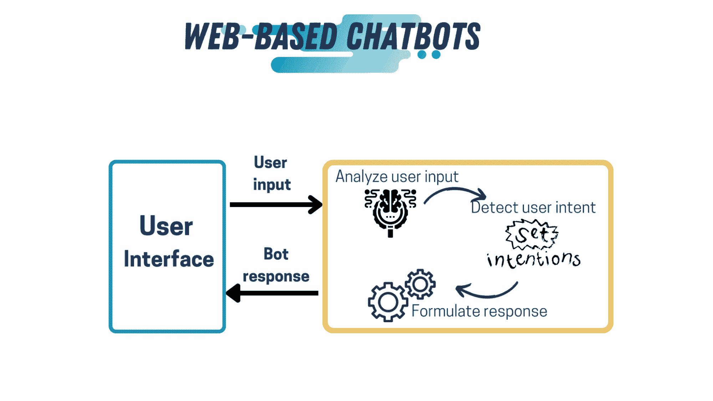

# 使用这些课程构建一个类似 ChatGPT 的聊天机器人

> 原文：[`www.kdnuggets.com/2023/05/build-chatgptlike-chatbot-courses.html`](https://www.kdnuggets.com/2023/05/build-chatgptlike-chatbot-courses.html)

图片由[firmufilms](https://www.freepik.com/author/frimufilms)提供，来自[Freepik](https://www.freepik.com/)

新的技术进步总是引人注目。数据科学及其应用多年来一直是关注的焦点。2023 年开始时，随着[OpenAI](https://openai.com/blog/chatgpt)发布基于 AI 的聊天机器人 ChatGPT，开局强劲。ChatGPT 的发布引起了轰动，每个人以不同的方式使用它，挑战 AI 和聊天机器人的极限。它甚至促使其他公司，如 Notion，构建更好的聊天机器人，以挑战和超越 ChatGPT。

不仅仅是公司，许多数据科学家，无论是新手还是专家，也尝试构建自己的 ChatGPT 版本，以获得更多关于构建基于 AI 的聊天机器人的知识和经验，或挑战并提升他们的技能。你阅读这篇文章意味着你也考虑过制作一个类似 ChatGPT 的聊天机器人，或者只是对构建这样的工具所需的条件感到好奇。

本文将回顾构建你自己版本的 ChatGPT 所需的知识。但在我们深入讨论开发聊天机器人所需的技术知识之前，让我们简单谈谈构建聊天机器人所需的条件。

由于我们考虑构建一个类似 ChatGPT 的聊天机器人，即一个基于网页的聊天机器人，我们在设计和构建聊天机器人时需要考虑两个部分。前端（聊天机器人的外观），即用户将与之互动的部分，以及聊天机器人的核心（后端），即我们所称的聊天机器人的“大脑”。

让我们深入探讨一些能够提供构建外观良好且功能强大的 AI 聊天机器人所需知识的课程。然后，我们为每个元素建议一个课程，以便为你构建 ChatGPT 提供所有必要的工具。

# 外观

首先，我们将从构建聊天机器人外观所需的内容开始；你的聊天机器人外观越具有创意，用户体验就会越好。那么，你需要知道什么才能为聊天机器人设计一个好的界面呢？

## UI 设计

一个网页的外观有两个方面：总体美学和设计的直观性。在我们的案例中，网页（聊天机器人）的感觉就是 UI（用户界面）设计。

当你构建聊天机器人时，了解用户界面设计的基本原理是至关重要的。[这门课程](https://www.coursera.org/learn/visual-elements-user-interface-design?specialization=ui-ux-design)由加州艺术学院提供，将帮助你理解 UI 设计的基础。

## UX 设计

美观的设计和色彩很好，但如果导航困难，那么外观就显得无关紧要。这时候了解用户体验（UX）的基础知识就显得非常重要。UX 是设计易于导航和使用的应用程序的艺术，从而为使用该应用程序的任何人提供更好的体验。例如，如果我们想构建一个好的聊天机器人，它必须既美观又易于使用且直观。CalArts 还提供了一个[课程](https://www.coursera.org/learn/ux-design-fundamentals?specialization=ui-ux-design)，帮助你获得制作具有良好 UX 的聊天机器人所需的知识。

## HTML & CSS

由于我们尝试构建一个基于网络的聊天机器人，我们需要了解如何构建网页应用程序。这意味着我们需要知道一些 HTML 和 CSS。当然，如今，我们可以使用许多服务来帮助开发网页，而无需编写 HTML 或 CSS。

但了解这些知识将让你对你构建的内容和细节有更多的控制。这个来自[CodeAcademy](https://www.codecademy.com/catalog/language/html-css)的课程将帮助你学习 HTML 和 CSS 的基础知识。或者你可以查看这个来自 Coursera 的[指导项目](https://www.coursera.org/projects/creating-a-multi-page-app-using-html-and-css)，你可以在 2 小时内完成。

作者提供的图像

# 大脑

既然我们设计好了聊天机器人的外观，接下来就让我们来构建它的“大脑”。我们想要建立一个基于人工智能的聊天机器人，因此必须掌握数据科学、编程和人工智能的基础知识。我们可以将 ChatGPT 的“大脑”分为两个部分：数据科学基础和聊天机器人的核心。现在让我们详细了解一下这两个部分。

## 数据科学基础

### 编程与数学

数据科学及其所有应用基于一些数学知识（概率论和线性代数）和编程。然而，如果你已经知道数据科学的基础知识，你可以跳过这一步，直接进入聊天机器人的核心部分。

如果 ChatGPT 让你对开始数据科学应用之旅感到好奇，[这门](https://pll.harvard.edu/course/introduction-data-science-python?delta=0)由哈佛大学提供的课程将帮助你通过提供所需的数学和编程知识，帮助你入门构建聊天机器人！

### 机器学习

一旦你对编写代码感到舒适，并且掌握了一些数学知识，我们就可以进入任何数据科学应用程序的基础构建模块之一：机器学习。机器学习是一系列算法和技术，用于使计算机更智能。你可以使用[这门](https://www.coursera.org/learn/machine-learning?specialization=machine-learning-introduction)来自斯坦福大学的课程来学习机器学习的基础知识。

## 聊天机器人的核心

聊天机器人是一类数据科学，特别是自然语言处理，旨在创建一个供用户对话的系统。我们可以根据其主要功能将聊天机器人分类为三类：

1.  简单的 NLP 聊天机器人。

1.  基于影响的聊天机器人

1.  基于智能的聊天机器人

第一种类型是与用户进行简单对话的基础聊天机器人；第二种类型通常用于处理用户的问题，这些通常是大多数网站上的支持机器人。最后，第三种类型则模拟和预测用户可能如何与用户界面互动。仔细观察 ChatGPT，我们会发现它是这三种类型的混合体。要构建一个基于 AI 的聊天机器人，我们需要了解自然语言处理（NLP）、AI 的基础知识以及构建聊天机器人的基本原理。

图片由 [macrovector](https://www.freepik.com/author/macrovector) 提供，来源于 [Freepik](https://www.freepik.com/)

### 自然语言处理

这门 Udemy 的[课程](https://www.udemy.com/course/natural-language-processing-nlp-for-beginners-using-nltk-in-python/)将帮助你掌握 NLP，它的含义、基本原理及其各种应用，包括聊天机器人。

### 聊天机器人基础

掌握 NLP 的基础知识是构建聊天机器人的第一步。一旦你了解了基础知识，我们就可以深入探讨如何设计和构建聊天机器人，主要使用这门[课程](https://www.codecademy.com/learn/paths/build-chatbots-with-python)。

### 人工智能

为了让你的聊天机器人显得真实并与用户进行引人入胜的对话，聊天机器人需要具备智能或类似人类智能。为此，我们将使用 AI。因此，我们需要学习如何将 AI 技术应用于我们的聊天机器人。这门来自 DeepLearning.AI 的[课程](https://www.coursera.org/learn/ai-for-everyone)涵盖了 AI 的基础知识以及如何利用它来构建聊天机器人。

# 结论

ChatGPT 最近成为了媒体关注的焦点，原因非常充分。它清楚地证明了技术的强大潜力。它证明了我们可以设计出优秀的工具，使我们的生活更轻松，同时也激励我们变得更好。

ChatGPT 激发了许多人，无论是技术领域还是其他领域的好奇心，想要了解这样的工具是如何构建的。虽然有些人可能觉得开发这样的工具很复杂，但构建聊天机器人的核心要素比看起来更简单。

本文讨论了构建类似 ChatGPT 的聊天机器人所需了解的内容。因此，下次你有一个空闲的周末时，可以尝试构建一个聊天机器人；也许你的聊天机器人将成为与 ChatGPT 竞争的成果！

**[Sara Metwalli](https://www.linkedin.com/in/sara-a-metwalli/)** 是庆应大学的博士候选人，研究测试和调试量子电路的方法。我是 IBM 的研究实习生和 Qiskit 促进者，致力于构建更具量子前景的未来。我还在 Medium、Built-in、She Can Code 和 KDN 撰写有关编程、数据科学和技术话题的文章。我也是 Woman Who Code Python 国际章节的负责人，一个铁路迷、旅行者和摄影爱好者。

### 更多相关话题

+   [用 Hugging Face 和 Gradio 在 5 分钟内构建 AI 聊天机器人](https://www.kdnuggets.com/2023/06/build-ai-chatbot-5-minutes-hugging-face-gradio.html)

+   [聊天机器人变革：从失败到未来](https://www.kdnuggets.com/2021/12/chatbot-transformation-failure-future.html)

+   [开放助手：探索开放和协作的可能性…](https://www.kdnuggets.com/2023/04/open-assistant-explore-possibilities-open-collaborative-chatbot-development.html)

+   [聊天机器人竞技场：LLM 基准平台](https://www.kdnuggets.com/2023/05/chatbot-arena-llm-benchmark-platform.html)

+   [通过这 5 门免费课程开启你的 NLP 旅程](https://www.kdnuggets.com/kickstart-your-nlp-journey-with-these-5-free-courses)

+   [通过这 3 个热门证书提升你的技术职业生涯](https://www.kdnuggets.com/advance-your-tech-career-with-these-3-popular-certificates)
